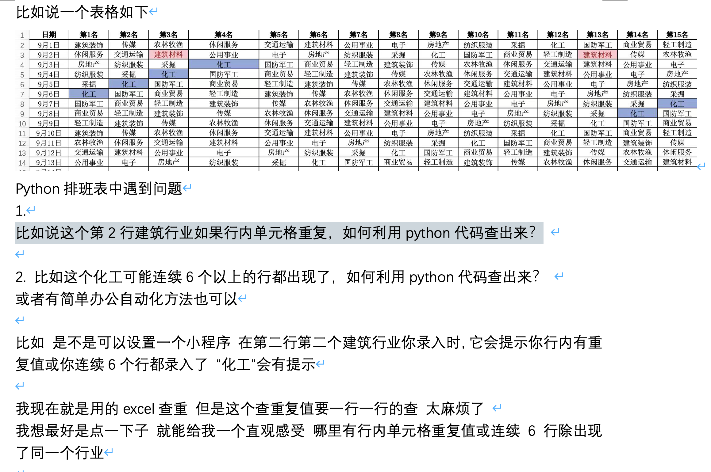

## 0. 缘起

::: tabs

@tab 1


@tab 2


@tab 3


@tab 4


@tab 5



:::

## 1. 需求确认

**表格数据如下：**

| 日期    | 第1名    | 第2名    | 第3名    | 第4名    | 第5名    | 第6名    | 第7名    | 第8名    | 第9名    | 第10名   | 第11名   | 第12名   | 第13名   | 第14名   | 第15名   |
| ------- | -------- | -------- | -------- | -------- | -------- | -------- | -------- | -------- | -------- | -------- | -------- | -------- | -------- | -------- | -------- |
| 9月1日  | 建筑装饰 | 传媒     | 农林牧渔 |          | 交通运输 | 建筑材料 | 公用事业 | 电子     | 房地产   | 服装     | 采掘     | 化工     | 国防军工 | 商业贸易 | 轻工制造 |
| 9月2日  | 休闲服务 | 交通运输 | 建筑材料 | 公用事业 | 电子     | 房地产   | 纺织     | 采掘     | 化工     | 国防军工 | 商业贸易 | 轻工制造 | 建筑材料 | 传媒     | 农林牧渔 |
| 9月3日  | 房地产   | 服装     | 采掘     | 化工     | 军工     |          | 制造     | 建筑装饰 | 传媒     | 农林牧渔 | 休闲服务 | 交通运输 | 建筑材料 | 公用事业 | 电子     |
| 9月4日  | 纺织服装 | 采掘     | 化工     | 国防     | 商业     | 轻工     | 建筑装饰 | 传媒     | 农林牧渔 | 休闲服务 | 交通运输 | 建筑材料 | 公用事业 | 电子     | 房地产   |
| 9月5日  | 采掘     | 化工     | 国防军工 | 商业贸易 | 轻工制造 | 建筑装饰 | 传媒     | 农林牧渔 | 休闲服务 | 交通运输 | 建筑材料 | 公用事业 | 电子     | 房地产   | 纺织服装 |
| 9月6日  | 语文     | 数学     | 物理     | 化学     | 英语     | 日语     | 德语     | 机械     | 医疗     | 卫生     | 教育     | 基金     | 经济     | 服装     | 游戏     |
| 9月7日  | 化工     | 国防军工 | 商业贸易 | 轻工制造 |          | 传媒     | 农林牧渔 | 休闲服务 | 交通运输 | 建筑材料 | 公用事业 | 电子     | 房地产   | 纺织服装 | 采掘     |
| 9月8日  | 国防军工 | 商业贸易 | 轻工制造 | 建筑装饰 | 传媒     | 农林牧渔 | 休闲服务 | 交通运输 | 建筑材料 | 公用事业 | 电子     | 房地产   | 纺织服装 | 采掘     | 化工     |
| 9月9日  | 商业贸易 | 轻工制造 | 建筑装饰 | 传媒     | 农林牧渔 | 休闲服务 | 交通运输 | 建筑材料 |          | 电子     | 房地产   | 纺织服装 | 采掘     | 化工     | 国防军工 |
| 9月10日 | 轻工制造 | 建筑装饰 | 传媒     | 语文     | 休闲服务 | 交通运输 | 建筑材料 | 公用事业 | 电子     | 房地产   | 纺织服装 | 采掘     | 化工     | 国防军工 | 商业贸易 |
| 9月11日 | 语文     | 数学     | 物理     | 化学     | 英语     | 日语     | 德语     | 机械     | 医疗     | 卫生     | 教育     | 基金     | 经济     | 服装     | 游戏     |
| 9月12日 | 建筑装饰 | 传媒     | 农林牧渔 |          | 交通运输 | 建筑材料 | 公用事业 | 电子     | 房地产   | 纺织服装 | 采掘     | 化工     | 国防军工 | 商业贸易 | 公用事业 |
| 9月13日 | 农林牧渔 | 休闲服务 | 交通运输 |          | 公用事业 | 电子     | 房地产   | 纺织服装 | 采掘     | 化工     | 国防军工 |          | 轻工制造 | 建筑装饰 | 传媒     |
| 9月14日 | 交通运输 | 建筑材料 | 公用事业 | 电子     | 房地产   | 纺织服装 |          | 化工     | 国防军工 | 商业贸易 | 轻工制造 |          | 传媒     | 农林牧渔 | 休闲服务 |
| 9月15日 | 公用事业 | 电子     | 房地产   | 纺织服装 | 采掘     | 化工     | 国防军工 | 商业贸易 | 轻工制造 | 建筑装饰 | 传媒     | 农林牧渔 | 休闲服务 | 交通运输 | 建筑材料 |

Excel 中，值出现重复的问题。我将描述多种情况，我来一一个分析汇总。

::: tabs

@tab Q1

**比如说这个第 2 行建筑行业如果行内单元格重复，如何利用 python 代码查出来？**


@tab Q2

比如这个化工可能连续6个以上的行都出现了，如何利用 python 代码查出来？ 或者有简单办公自动化方法也可以


@tab Q3

**比如 是不是可以设置一个小程序 在第二行第二个建筑行业你录入时，它会提示你行内有重复值或你连续6个行都录入了 “化工”会有提示**

> 这个需求无法实现，除非你让微软为你添加这个功能

@tab Q4

我现在就是用的 excel 查重 但是这个查重复值要一行一行的查 太麻烦了 

我想最好是点一下子 就能给我一个直观感受 哪里有行内单元格重复值或连续6行除出现了同一个行业

:::


 


::: details

```markdown
Python排班表中遇到问题
1.
比如说这个第2行建筑行业如果行内单元格重复，如何利用python代码查出来？ 

2. 比如这个化工可能连续6个以上的行都出现了，如何利用python代码查出来？ 
或者有简单办公自动化方法也可以

比如 是不是可以设置一个小程序 在第二行第二个建筑行业你录入时，它会提示你行内有重复值或你连续6个行都录入了 “化工”会有提示

我现在就是用的excel查重 但是这个查重复值要一行一行的查 太麻烦了 
我想最好是点一下子 就能给我一个直观感受 哪里有行内单元格重复值或连续6行除出现了同一个行业
| 日期    | 第1名    | 第2名    | 第3名    | 第4名    | 第5名    | 第6名    | 第7名    | 第8名    | 第9名    | 第10名   | 第11名   | 第12名   | 第13名   | 第14名   | 第15名   |
| ------- | -------- | -------- | -------- | -------- | -------- | -------- | -------- | -------- | -------- | -------- | -------- | -------- | -------- | -------- | -------- |
| 9月1日  | 建筑装饰 | 传媒     | 农林牧渔 |          | 交通运输 | 建筑材料 | 公用事业 | 电子     | 房地产   | 服装     | 采掘     | 化工     | 国防军工 | 商业贸易 | 轻工制造 |
| 9月2日  | 休闲服务 | 交通运输 | 建筑材料 | 公用事业 | 电子     | 房地产   | 纺织     | 采掘     | 化工     | 国防军工 | 商业贸易 | 轻工制造 | 建筑材料 | 传媒     | 农林牧渔 |
| 9月3日  | 房地产   | 服装     | 采掘     | 化工     | 军工     |          | 制造     | 建筑装饰 | 传媒     | 农林牧渔 | 休闲服务 | 交通运输 | 建筑材料 | 公用事业 | 电子     |
| 9月4日  | 纺织服装 | 采掘     | 化工     | 国防     | 商业     | 轻工     | 建筑装饰 | 传媒     | 农林牧渔 | 休闲服务 | 交通运输 | 建筑材料 | 公用事业 | 电子     | 房地产   |
| 9月5日  | 采掘     | 化工     | 国防军工 | 商业贸易 | 轻工制造 | 建筑装饰 | 传媒     | 农林牧渔 | 休闲服务 | 交通运输 | 建筑材料 | 公用事业 | 电子     | 房地产   | 纺织服装 |
| 9月6日  | 语文     | 数学     | 物理     | 化学     | 英语     | 日语     | 德语     | 机械     | 医疗     | 卫生     | 教育     | 基金     | 经济     | 服装     | 游戏     |
| 9月7日  | 化工     | 国防军工 | 商业贸易 | 轻工制造 |          | 传媒     | 农林牧渔 | 休闲服务 | 交通运输 | 建筑材料 | 公用事业 | 电子     | 房地产   | 纺织服装 | 采掘     |
| 9月8日  | 国防军工 | 商业贸易 | 轻工制造 | 建筑装饰 | 传媒     | 农林牧渔 | 休闲服务 | 交通运输 | 建筑材料 | 公用事业 | 电子     | 房地产   | 纺织服装 | 采掘     | 化工     |
| 9月9日  | 商业贸易 | 轻工制造 | 建筑装饰 | 传媒     | 农林牧渔 | 休闲服务 | 交通运输 | 建筑材料 |          | 电子     | 房地产   | 纺织服装 | 采掘     | 化工     | 国防军工 |
| 9月10日 | 轻工制造 | 建筑装饰 | 传媒     | 语文     | 休闲服务 | 交通运输 | 建筑材料 | 公用事业 | 电子     | 房地产   | 纺织服装 | 采掘     | 化工     | 国防军工 | 商业贸易 |
| 9月11日 | 语文     | 数学     | 物理     | 化学     | 英语     | 日语     | 德语     | 机械     | 医疗     | 卫生     | 教育     | 基金     | 经济     | 服装     | 游戏     |
| 9月12日 | 建筑装饰 | 传媒     | 农林牧渔 |          | 交通运输 | 建筑材料 | 公用事业 | 电子     | 房地产   | 纺织服装 | 采掘     | 化工     | 国防军工 | 商业贸易 | 公用事业 |
| 9月13日 | 农林牧渔 | 休闲服务 | 交通运输 |          | 公用事业 | 电子     | 房地产   | 纺织服装 | 采掘     | 化工     | 国防军工 |          | 轻工制造 | 建筑装饰 | 传媒     |
| 9月14日 | 交通运输 | 建筑材料 | 公用事业 | 电子     | 房地产   | 纺织服装 |          | 化工     | 国防军工 | 商业贸易 | 轻工制造 |          | 传媒     | 农林牧渔 | 休闲服务 |
| 9月15日 | 公用事业 | 电子     | 房地产   | 纺织服装 | 采掘     | 化工     | 国防军工 | 商业贸易 | 轻工制造 | 建筑装饰 | 传媒     | 农林牧渔 | 休闲服务 | 交通运输 | 建筑材料 |
```


:::


::: details 公众号：AI悦创【二维码】


:::

::: info AI悦创·编程一对一

AI悦创·推出辅导班啦，包括「Python 语言辅导班、C++ 辅导班、java 辅导班、算法/数据结构辅导班、少儿编程、pygame 游戏开发、Web、Linux」，全部都是一对一教学：一对一辅导 + 一对一答疑 + 布置作业 + 项目实践等。当然，还有线下线上摄影课程、Photoshop、Premiere 一对一教学、QQ、微信在线，随时响应！微信：Jiabcdefh

C++ 信息奥赛题解，长期更新！长期招收一对一中小学信息奥赛集训，莆田、厦门地区有机会线下上门，其他地区线上。微信：Jiabcdefh

方法一：[QQ](http://wpa.qq.com/msgrd?v=3&uin=1432803776&site=qq&menu=yes)

方法二：微信：Jiabcdefh

:::


