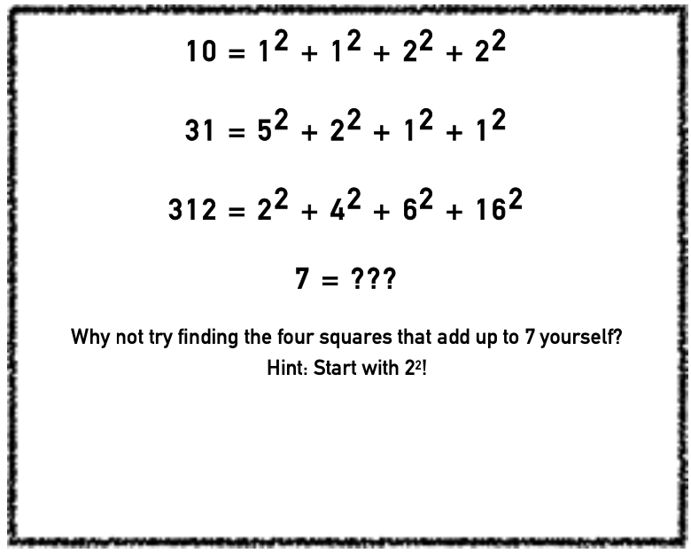

## EN

Ever wondered how to make really big numbers, like 89,180,625, into small ones that actually make sense? There is one method that helps us do exactly that, and it’s called Lagrange’s Four-Square Theorem. It states that every positive integer - that’s a whole number larger than zero, e.g. the numbers 3, 80, and 1789 are integers, but the numbers 2.5, 8.37, and -4 are not - can be written as the sum of the squares of four integers.

Here’s an example: $3 = 1^2 + 1^2 + 1^2 + 0^2$. Simple, right? But what about a bigger number, like the one in the top line: 89,180,625? Lagrange’s Four-Square Theorem allows this ugly number to become $8000^2 + 4575^2 + 2000^2 + 500^2$. Much easier to understand!

Try it yourself. Think of a number, and then see if you can find four smaller numbers that, all squared, equal the first number you thought of. It’s a little hard at first, but remember that Google has an app that does it all for you! Just type in your large, crazy number and out will appear four neat numbers that, squared, equal your crazy thought!

This idea of using sums of squares to represent large numbers first appeared centuries ago in the middle of the $3^{rd}$ Century, when Diophantus of  Alexandria, a Greek mathematician, was concentrating on solutions to algebra and the ‘theory of numbers’. It vanished from public thinking after Diophantus’ death, but was brought back to the forefront of mathematics when the Frenchman Claude Bachet de Méziriac translated Diophantus’ work into Latin in 1621. In the $17^{th}$ Century Pierre de Fermat, a French amateur mathematician, finally produced a proof for this conjecture, but he never published it; it was ‘suppressed’ for reasons unknown. Thus it remained ‘unproven’ until decades later when finally, in 1770, another French mathematician named Joseph Lagrange actually published his proof of the theorem. Since his proof was the first to be officially published, the theorem was named Lagrange’s Four-Square Theorem.

But how did Lagrange actually prove it? We all know there’s an infinite amount of numbers in the world, and it’s hard to imagine Lagrange spending his life going through every number one by one, finding four squares for each! Surprisingly there are numerous methods to prove this simple idea, but Lagrange initially used Euler’s Four Square Identity and the fact that the theorem is true for the numbers one and two. Euler’s Four Square Identity states that the product of two numbers, each of which is a sum of four squares, is itself a sum of four squares. In simple terms, this means that from this knowledge, Lagrange only had to prove his Four-Square Theorem for every prime number, that is, all the odd numbers that can only be divided by itself and one. Ironically, Euler himself could not prove this theorem, even though it was his identity which helped Lagrange to prove it!

Yet you may now be wondering what’s really useful about Lagrange’s Four-Square Theorem. Well, aside from making mean numbers into smaller, nicer ones, it links to a lot of other theorems in mathematics that are used throughout the world. Most notably it was generalised by the English mathematician Edward Waring, who posed “Waring’s problem” in his published works. Waring’s problem talks about writing numbers not only as sums of squares (which is what Lagrange’s Four- Square Theorem talks about), but also as sums of cubes, of fourth powers, of fifth powers, and so on. So Lagrange’s proof of a 3rd Century idea has become a very important tool in the theory of numbers!

If you want to read more on how each number can be made up by lots of little ones, feel free to research Waring and how he moved from looking at Lagrange’s Four-Square Theorem to looking at higher powers. However, if your aim is just to understand how big numbers can be turned into four simple ones, then you’re ready to go! Remember, four sums of squares are all you need to add up every positive integer in the world.

## ZH

::: tip 提问 & 介绍

:::

曾经好奇如何将非常大的数字，例如89,180,625，转换成实际有意义的小数字吗？有一种方法可以帮助我们做到这一点，它被称为拉格朗日的四平方定理。它的内容是每一个正整数（即大于零的整数，例如3、80和1789都是整数，但2.5、8.37和-4不是）都可以表示为四个整数的平方和。

::: tip 例子

:::

这是一个例子：$3 = 1^2 + 1^2 + 1^2 + 0^2$。很简单，对吧？但对于更大的数字，例如上文中提到的89,180,625呢？拉格朗日的四平方定理使这个复杂的数字变得简单，可以表示为$8000^2 + 4575^2 + 2000^2 + 500^2$。这样理解起来容易多了！

::: tip 互动&提供帮助

:::

你可以自己试试。想一个数字，然后看是否可以找到四个较小的数字，这四个数字的平方和等于你最初想到的那个数字。刚开始可能有些困难，但记住，Google有一个应用程序可以帮助你完成所有这些！只需输入你的大数字，输出结果将是四个整数，这四个整数的平方和等于你输入的数字。

::: tip 数学公式背后的故事

:::

使用平方和来表示大数字的这个概念在几个世纪前首次出现，大约在公元3世纪中叶，当时亚历山大的希腊数学家狄奥凡图斯专注于代数解和“数论”。狄奥凡图斯死后，这个概念从公众的思考中消失了，但当法国人Claude Bachet de Méziriac于1621年将狄奥凡图斯的作品翻译成拉丁文时，它又重新回到了数学的前沿。在17世纪，法国业余数学家皮埃尔·德·费马为这个猜想提供了一个证明，但他从未公开发表过；由于某种未知的原因，它被“压制”了。因此，直到几十年后的1770年，另一位法国数学家约瑟夫·拉格朗日才真正公开发表了他对此定理的证明。由于他的证明是首次正式公开的，所以这个定理被命名为拉格朗日的四平方定理。

::: tip 提问

:::

但拉格朗日是如何证明它的呢？我们都知道世界上有无数的数字，很难想象拉格朗日会一一检查每个数字，为每个数字找到四个平方！令人惊讶的是，有很多方法可以证明这个简单的观念，但拉格朗日最初使用的是欧拉的四平方恒等式和该定理对于数字一和两是成立的这个事实。欧拉的四平方恒等式指出，两个数字的乘积，每个数字都是四个平方的和，本身也是四个平方的和。简单地说，这意味着有了这个知识，拉格朗日只需要为每个质数证明他的四平方定理，也就是所有只能被它自己和一整除的奇数。具有讽刺意味的是，尽管是欧拉的恒等式帮助拉格朗日证明了这一点，但欧拉自己却不能证明这个定理。

::: details 公众号：AI悦创【二维码】

:::

::: info AI悦创·编程一对一

AI悦创·推出辅导班啦，包括「Python 语言辅导班、C++ 辅导班、java 辅导班、算法/数据结构辅导班、少儿编程、pygame 游戏开发、Web、Linux」，全部都是一对一教学：一对一辅导 + 一对一答疑 + 布置作业 + 项目实践等。当然，还有线下线上摄影课程、Photoshop、Premiere 一对一教学、QQ、微信在线，随时响应！微信：Jiabcdefh

C++ 信息奥赛题解，长期更新！长期招收一对一中小学信息奥赛集训，莆田、厦门地区有机会线下上门，其他地区线上。微信：Jiabcdefh

方法一：[QQ](http://wpa.qq.com/msgrd?v=3&uin=1432803776&site=qq&menu=yes)

方法二：微信：Jiabcdefh

:::

