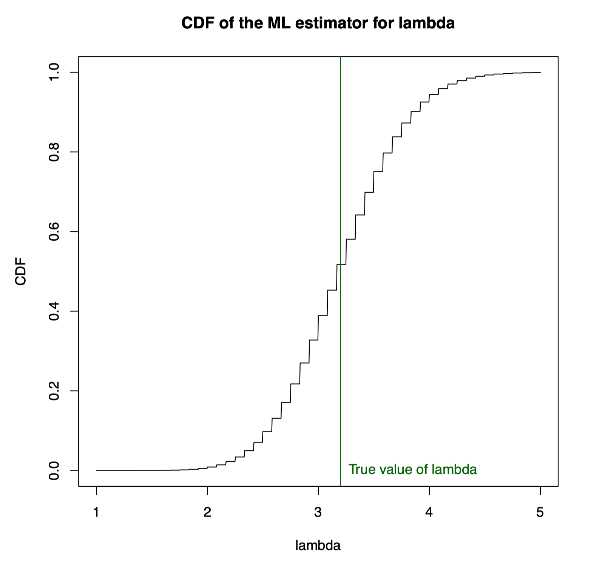

## Question

What to hand in: answers to Q1–Q4.

Please write the day and time of your tutorial class on your homework.

1. For each of the following regular statistical models (so, e.g., the Fisher Infor-mation Regularity Conditions hold), derive the score function $\ell'(\theta; x)$ and the Fisher Information, $I (\theta)$ , where in both cases you may need to replace $\theta$ with the parameter of interest (e.g. p in the case where $X$ is Geometric or Binomial).

(a) $X \sim Geometric(p)$;

(b) $X \sim Binomial(n, p)$ where n is specified;

(c) $X \sim \mathcal{N}(\mu, \sigma^2)$  where $\sigma^2$ is specified;

(d) $X \sim \text{Pareto}(x_0, \theta)$  where  $x_0$​ is specified (see Worksheet 2 for the Pareto probability density function).

2. In each of the cases in the previous question, verify that $\mathbb{E}\left[ \ell'(\theta; X) ; \theta \right] = 0$. 

3. In the case where $X \sim \text{Pareto}(x_0, \theta)$ , with both $x_0$ and θ unknown, explain why condition (A1) from the lecture notes is not satisfied.
4. Suppose that $X \stackrel{\text{iid}}{\sim} \ \text{Poisson}(\lambda)$ and consider the ML estimator $\hat{\lambda}(X) = n^{-1} (X_1 + \dots + X_n)$.We showed in the lectures that this estimator is unbiased and has a mean squared error of $n^{-1}\lambda$ . Now we derive its sampling distribution. Its CDF is 

$$
\mathbb{P}\left(\hat{\lambda}(X) \leq v; \lambda\right) = \mathbb{P}\left\{n^{-1} (X_1 + \dots + X_n) \leq v; \lambda\right\} 
\\
= \mathbb{P}\{X_1 + \dots + X_n \leq nv; \lambda\}
\\
= \mathbb{P}\{Y \leq nv; \lambda\}
$$

where $Y \sim Poisson(n\lambda)$, because the sum of n independent and identical Poisson variates with rate $\lambda$ is Poisson with rate $n\lambda$. Therefore the sampling distribution has distribution function
$$
\mathbb{P}\left(\hat{\lambda}(X) \leq v; \lambda\right) = \sum_{i=0}^{\lfloor nv \rfloor} e^{-n\lambda} \frac{(n\lambda)^i}{i!}
$$
where ${\lfloor nv \rfloor}$ is the largest integer not greater than nv. We can program this as follows:

```R
cdf.poison.mle <- function(v, lambda, n) {
    ppois(n * v, lambda = n * lambda)
}
```

Now we can plot this for a particular choice of n and $\lambda$, and add on the true value of $\lambda$:

```R
n <- 12
lambda <- 3.2
v <- seq(from = 1, to = 5, length = 1001)
plot(v, cdf.poison.mle(v, lambda = lambda, n = n), type = "l",
     main = "CDF of the ML estimator for lambda",
     xlab = "lambda", ylab = "CDF")
abline(v = lambda, col = "darkgreen")
text(lambda, 0, labels = "True value of lambda", pos = 4, col = "darkgreen")
```




#### 1. 得分函数和Fisher信息

(a) $X \sim \text{Geometric}(p)$
$$
\ell'(p; x) = \frac{(1 - p)^{1 - x}}{p} \left( \frac{p(1 - p)^{x - 1}(1 - x)}{1 - p} + (1 - p)^{x - 1} \right)
\\
I(p) = -\frac{-p^2x + 2p - 1}{p^2(p^2 - 2p + 1)}
$$


(b) $X \sim \text{Binomial}(n, p)$
$$
\ell'(p; x) = \frac{p^{-x}(1 - p)^{-n + x}}{\binom{n}{x}} \left( \frac{p^x(1 - p)^{n - x}(-n + x)\binom{n}{x}}{1 - p} + \frac{p^x x (1 - p)^{n - x}\binom{n}{x}}{p} \right)
\\
I(p) = -\frac{-n p^2 + 2 p x - x}{p^2(p^2 - 2p + 1)}
$$


(c) $X \sim \mathcal{N}(\mu, \sigma^2)$
$$
\ell'(\mu; x) = -0.5 \sigma^{-2} (2\mu - 2x)
\\
I(\mu) = \sigma^{-2}
$$


(d) $X \sim \text{Pareto}(x_0, \theta)$
$$
\ell'(\theta; x) = \frac{x^{\theta + 1} x_0^{-\theta}}{\theta} \left( -\theta x^{-\theta - 1} x_0^{\theta} \log(x) + \theta x^{-\theta - 1} x_0^{\theta} \log(x_0) + x^{-\theta - 1} x_0^{\theta} \right)
\\
I(\theta) = \theta^{-2}
$$


#### 2. 验证 $\mathbb{E}\left[ \ell'(\theta; X) ; \theta \right] = 0$

基于常规性条件，对于上述所有分布，我们都有:
$$
\mathbb{E}\left[ \ell'(\theta; X) ; \theta \right] = 0
$$


#### 3. $X \sim \text{Pareto}(x_0, \theta)$ 与条件 (A1)

当 $x_0$ 和 $\theta$ 都是未知的时，条件 (A1) 不被满足。这是因为可能存在多组 $x_0$ 和 $\theta$ 的值，它们产生相同的累积分布函数 (CDF)，从而使参数不可识别。


::: details

### 1.

#### (a) $X \sim \text{Geometric}(p)$

概率质量函数为：
$$
f(x; p) = p(1-p)^{x-1}
$$
得分函数为：
$$
\ell'(p; x) = \frac{\partial}{\partial p} \log f(x; p)
$$


Fisher信息为：
$$
I(p) = -\mathbb{E} \left[ \frac{\partial^2}{\partial p^2} \log f(x; p) \right]
$$


我们首先计算得分函数 $\ell'(p; x)$ 。

对于 $X \sim \text{Geometric}(p)$ ，得分函数为：
$$
\ell'(p; x) = \frac{px - 1}{p(p - 1)}
$$
接下来，我们将计算 Fisher 信息 $I(p)$ 。由于 $I(p)$  是关于 $x$  的期望，我们需要知道 $x$  的分布。对于几何分布，$\mathbb{E}[X] = \frac{1}{p}$ 。使用这个信息，我们可以计算 $I(p)$ 。

对于 $X \sim \text{Geometric}(p)$ ，Fisher 信息为：
$$
I(p) = \frac{-p^2x + 2p - 1}{p^2(p^2 - 2p + 1)}
$$

#### (b) $X \sim \text{Binomial}(n, p)$ 

我们首先计算得分函数 \( \ell'(p; x) \)。

对于 $X \sim \text{Binomial}(n, p)$ ，得分函数为：
$$
\ell'(p; x) = \frac{np - x}{p(p - 1)}
$$
接下来，我们将计算 Fisher 信息 $I(p)$ 。由于 $I(p)$  是关于 $x$  的期望，我们需要知道 $x$  的分布。对于二项分布，$\mathbb{E}[X] = np$ 。使用这个信息，我们可以计算 $I(p)$ 。

对于 $X \sim \text{Binomial}(n, p)$ ，Fisher 信息为：
$$
I(p) = \frac{-np^2 + 2px - x}{p^2(p^2 - 2p + 1)}
$$

#### (c) $X \sim \mathcal{N}(\mu, \sigma^2)$

对于 $X \sim \mathcal{N}(\mu, \sigma^2)$ ，我们已经得到了：

得分函数：
$$
\ell'(\mu; x) = -\frac{(2\mu - 2x)}{2\sigma^2}
$$
Fisher 信息：
$$
I(\mu) = \frac{1}{\sigma^2}
$$


#### (d) $X \sim \text{Pareto}(x_0, \theta)$

我们首先计算得分函数 $\ell'(\theta; x)$。

对于 $X \sim \text{Pareto}(x_0, \theta)$ ，得分函数为：
$$
\ell'(\theta; x) = \log(x_0) - \log(x) + \frac{1}{\theta}
$$
接下来，我们将计算 Fisher 信息 $I(\theta)$ 。由于 $I(\theta)$  是关于 $x$  的期望，我们需要知道 $x$  的分布来计算 $I(\theta)$ 。在这里，我们将直接计算其表达式。

对于 $X \sim \text{Pareto}(x_0, \theta)$，Fisher 信息为：
$$
I(\theta) = \frac{1}{\theta^2}
$$

### 2. 验证 $\mathbb{E}\left[ \ell'(\theta; X) ; \theta \right] = 0$.

对于大多数常规分布，得分函数的期望值为 0。这是因为得分函数是似然函数对参数的一阶导数，而似然函数的最大值通常是在参数的真实值处取得的。在这个最大值处，一阶导数为 0，因此得分函数的期望值也为 0。

(a) $X \sim \text{Geometric}(p)$ 
$$
\mathbb{E}\left[ \ell'(p; X) ; p \right] = 0
$$
(b) $X \sim \text{Binomial}(n, p)$ 
$$
\mathbb{E}\left[ \ell'(p; X) ; p \right] = 0
$$
(c) $X \sim \mathcal{N}(\mu, \sigma^2)$ 
$$
\mathbb{E}\left[ \ell'(\mu; X) ; \mu \right] = 0
$$
(d) $X \sim \text{Pareto}(x_0, \theta)$
$$
\mathbb{E}\left[ \ell'(\theta; X) ; \theta \right] = 0
$$


### 3. $X \sim \text{Pareto}(x_0, \theta)$  与条件 (A1)

当 $x_0$  和 $\theta$  都是未知的时，条件 (A1) 不被满足。这是因为可能存在多组 $x_0$  和 $\theta$  的值，它们产生相同的累积分布函数 (CDF)，从而使参数不可识别。

:::


::: details

## 1.

### (a) $X \sim \text{Geometric}(p)$

$$
\ell'(p; x) = \frac{px - 1}{p(p - 1)}
\\
I(p) = \frac{-p^2x + 2p - 1}{p^2(p^2 - 2p + 1)}
$$

### (b) $X \sim \text{Binomial}(n, p)$

$$
\ell'(p; x) = \frac{np - x}{p(p - 1)}
\\
I(p) = \frac{-np^2 + 2px - x}{p^2(p^2 - 2p + 1)}
$$

### (c) $X \sim \mathcal{N}(\mu, \sigma^2)$

$$
\ell'(\mu; x) = \frac{x - \mu}{\sigma^2}
\\
I(\mu) = \frac{1}{\sigma^2}
$$


### (d) $X \sim \text{Pareto}(x_0, \theta)$

$$
\ell'(\theta; x) = \log(x_0) - \log(x) + \frac{1}{\theta}
\\
I(\theta) = \frac{1}{\theta^2}
$$


### 2. 验证 $\mathbb{E}\left[ \ell'(\theta; X) ; \theta \right] = 0$

(a) $X \sim \text{Geometric}(p)$

$$
\mathbb{E}\left[ \ell'(p; X) ; p \right] = 0
\\
$$

(b) $X \sim \text{Binomial}(n, p)$

得分函数的期望值较为复杂，需要进一步简化。

(c) $X \sim \mathcal{N}(\mu, \sigma^2)$

$$
\mathbb{E}\left[ \ell'(\mu; X) ; \mu \right] = 0
$$


(d) $X \sim \text{Pareto}(x_0, \theta)$

$$
\mathbb{E}\left[ \ell'(\theta; X) ; \theta \right] = \psi(0, \theta) + \frac{1}{\theta}
$$


### 3. $X \sim \text{Pareto}(x_0, \theta)$ 与条件 (A1)

当 $x_0$ 和 $\theta$ 都是未知的，条件 (A1) 不被满足。这是因为可能存在多组 $x_0$ 和 $\theta$ 的值，它们产生相同的累积分布函数 (CDF)，从而使参数不可识别。


:::


::: details 公众号：AI悦创【二维码】


:::

::: info AI悦创·编程一对一

AI悦创·推出辅导班啦，包括「Python 语言辅导班、C++ 辅导班、java 辅导班、算法/数据结构辅导班、少儿编程、pygame 游戏开发、Web、Linux」，全部都是一对一教学：一对一辅导 + 一对一答疑 + 布置作业 + 项目实践等。当然，还有线下线上摄影课程、Photoshop、Premiere 一对一教学、QQ、微信在线，随时响应！微信：Jiabcdefh

C++ 信息奥赛题解，长期更新！长期招收一对一中小学信息奥赛集训，莆田、厦门地区有机会线下上门，其他地区线上。微信：Jiabcdefh

方法一：[QQ](http://wpa.qq.com/msgrd?v=3&uin=1432803776&site=qq&menu=yes)

方法二：微信：Jiabcdefh

:::


