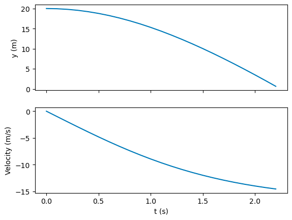
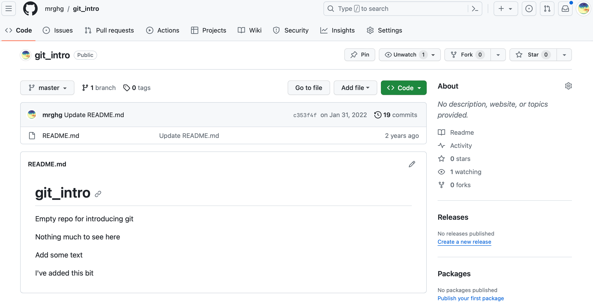

In this test, we're aiming to assess the following:

1. Solving a simple scientific problem, 20%
2. Creating Python modules and packages, 30%
3. Version control, 30 %
4. Public dissemination of code, 20%

We're going to do this by creating a package that simulates the flight of a projectile. You'll need to create a working Python package, demonstrate that you have kept track of your changes using `git`, and publish your code to an online repository.

## Background

Last year, we simulated a falling mass with air resistance. In Week 19, we split this code into functions. These functions are pasted below, with the minor modification that the sign of the velocity and acceleration has been changed.

In this exercise, we're going to extend this example to simulate a projectile travelling in 2D, instead of 1D.

```python
import matplotlib.pyplot as plt
from numpy import sign
```

```python
def calculate_acceleration(v, k=0.0, mass=1.0, gravity=-9.81):
    '''
    Calculate the acceleration based on combined forces from gravity and 
    air resistance.
    Args:
        v (float) : 
            velocity (m/s) for this time step
        k (float) : 
            Combined air resistance coefficient, based on F=-kv^2. 
            Should be positive.
            Default = 0.0  i.e. no air resistance
        mass (float) : 
            Mass of the falling object. Needed if k > 0.
            Default = 1.0
        gravity (float) :
            Value for gravity to use when calculating gravitational force in m/s2.
            Default = -9.81
    Returns:
        float : accelaration calculated for this time step
    '''
    force_gravity = mass*gravity
    force_air = -sign(v)*k*v**2
    total_force = force_gravity + force_air
    a = total_force/mass
    
    return a


def update_state(t, x, v, a, dt=0.1):
    '''
    Update each parameter for the next time step.
    Args:
        t, x, v, a (float) : 
            time (s), position (m) and velocity (m/s) and acceleration (m/s2) value for this time step.
        dt (float) :
            time interval (s) for this small time step
    Returns:
        float, float, float : Updated values for t, h, v after this time step
    '''
    distance_moved = v*dt + (1/2)*a*(dt**2)
    v += a*dt
    t += dt

    x += distance_moved
    
    return t, x, v


def falling_mass(initial_height, k=0.0, mass=1.0, dt=0.1):
    '''
    Model a falling mass from a given height.
    
    Args:
        initial_height (float) : 
            Starting height for the model in metres.
        k (float) :
            Combined air resistance coefficient, based on F=-kv^2. 
            Should be positive.
            Default = 0.0  i.e. no air resistance
        mass (float) :
            Mass of the object. Only needed if k is not 0.
            Default = 1.0  (kg)
        dt (float, optional) : 
            Time interval for each time step in seconds.
            Default = 0.1
    
    Returns:
        list, list, list : Three lists containing the time, height and velocity
    '''
    # Fixed input values
    start_velocity = 0.0 # m/s
    gravity = -9.81 # m/s2

    # Initial values for our parameters
    distance_moved = 0
    h = initial_height
    v = start_velocity
    t = 0.0

    # Create empty lists which we will update
    height = []
    velocity = []
    time = []

    # Keep looping while the object is still falling
    while h > 0:
        # Evaluate the state of the system - start by calculating the total force on the object
        a = calculate_acceleration(v, k=k, mass=mass, gravity=gravity)

        # Append values to list and then update
        height.append(h)
        velocity.append(v)
        time.append(t)

        # Update the state for time, height and velocity
        t, h, v = update_state(t, h, v, a, dt=dt)
    
    return time, height, velocity
```

This simulation can be called as follows, for a mass of 20 kg, and an air resistance coefficient of 0.035:

```python
t, y, vy = falling_mass(20, k=0.035)
```

Let's plot this up now. Note that velocities are negative because the object is moving in the negative direction on the y-axis (i.e., it's falling down)

```python
fig, (ax1, ax2) = plt.subplots(2, 1, sharex=True)

ax1.plot(t, y)
ax1.set_ylabel("y (m)")

ax2.plot(t, vy)
ax2.set_ylabel("Velocity (m/s)")
ax2.set_xlabel("t (s)")

plt.show()
```



## Projectile package exercise

Read these instructions through *to the end BEFORE* you begin.

### Methodology

We can extend the 1D example above to create a simulation of a projectile moving through the air.

To a large extent, we can re-use the above functions. However, compared to our falling mass example, there are a few differences:

1. We need to solve the equations of motion in two dimensions (x and y), instead of one (y)
2. We're going to set the mass off with some initial velocity in the x and y directions
3. In the y-direction, we'll take into account acceleration due to gravity and air resistance. In the x-direction, we will only need air resistance.

### Projectile project

1. Set up a directory called `projectile_project`.
2. Within this directory, create a Python package, called `projectile_package`, consisting of two modules `projectile` and `projectile_plot`.
3. The `projectile` module should contain the following functions, constructed as follows:

- update_state: You can reuse the above 1D function with no modification
- calculate_acceleration_y: This should be the same as calculate_acceleration
- calculate_acceleration_x: Same as calculate_acceleration, but remove the acceleration due to gravity
- flying_mass: Base this on falling_mass, but:
    - add extra variables to account for (and record) the x coordinate, the x velocity, and the x and y acceleration
    - inside the main loop, calculate the x and y acceleration separately, and then update the x and y state (position) separately
    - change the input arguments to be the initial x and y velocity, with mass and air resistance as optional arguments
    - output a tuple of (time, x position, y position, x velocity, y velocity)

1. In the `projectile_plot` module, create a function that plots the x vs y position at each timestep, called `plot_xy`
2. Finally, in the `projectile_project` directory (i.e. the directory that contains `projectile_package`), create a Jupyter notebook called `visualise_projectile.ipynb`, which plots the results, as indicated in the Results section below.

### Initial conditions

At the beginning of the simulation, assume the projectile:

- has a mass of 1 kg
- is moving at 10 m/s in **both** the x and y directions
- starts at x=0, y=0

### Results

If successful, your package should execute in the `visualise_projectile` notebook like this:

```python
from projectile_package.projectile import flying_mass
from projectile_package.projectile_plot import plot_xy
```

```python
t, x, y, vx, vy = flying_mass(10., 10., mass=1., k=0.035)
```

```python
plot_xy(x, y)
```

### Version control

Use git throughout your code development to keep track of changes. The repository should be initialised in the `projectile_project` directory, which contains `projectile_package` and the visualisation notebook.

When you've created your package and the accompanying notebook, sync your projectile_project repository to Github. *Please ensure that the visibility of your github repository is set to private (see Appendix 1).*

To show that your code is successfully on Github, take a screenshot of the repository homepage, and add the screenshot to the top level of your repository (the projectile_project directory), and call it `git_screenshot.png` or `git_screenshot.jpeg`. It should look something like this (although note that the contents and visibility of this repository are different):




## Submitting your project

In summary, your `projectile_project` folder should contain the following elements:

- the `projectile_package` package
- a Jupyter Notebook called `visualise_projectile.ipynb`
- a screenshot called `git_screenshot.png` or `git_screenshot.jpg`
- a hidden folder called `.git` (note, on Linux systems, you can see hidden files and folders using `ls -a`)

Before the deadline, submit this project *as a single archive file* in one of the following ways (the first option is preferred):

1. Create a `git bundle` and upload it to the Blackboard submission point (see Appendix 1)
2. Upload a zipped copy of your code folder, including the `.git` directory (if you've used version control), to Blackboard submission point

## Mark scheme

Student demonstrates that they can:

- Construct a package to solve projectile problem (3 marks)
    - 1 mark for basic, functional code
    - 3 marks for a well written, structured and commented package
- Write notebook or script to visualise outputs, including appropriate axis labels, etc. (2 marks)
- Use basic Linux commands (demonstrated via use of git, 1 mark)
- Add files to a git repository (1 mark)
- Commit changes at appropriate intervals and make useful comments (1 mark)
- Set up a remote repository (1 mark)
- Push to a remote repository (1 mark)

Total possible marks, 10

## Appendix 1: Making your repository private

Because this is an assessed exercise, please make your repository *private*. This means it's only visible to people that you explicitly invite. You can check the "private" option when you initially create the repo, but if you haven't done that you can change it by going to *Settings > Options > Danger zone > Change visibility*. Don't worry about all the warnings, they aren't relevant here.

## Appendix 2: creating a git bundle

In a terminal running Bash, you can create a git bundle from a git repository by doing the following:

1. Navigate into your git repository folder (`projectile_project`)

2. Type:

    ```bash
    git bundle create some/path/Test3_MYNAME.bundle --all
    ```

    where you should change "some/path/Test3_MYNAME.bundle" to the path where you want to create your bundle file (e.g. /home/myusername/Test3_MYNAME.bundle). *Make sure this path is outside of your git repo.*

3. You can test that your bundle has been created properly by navigating to the folder where your bundle file is stored, and typing

    ```bash
    git clone Test3_MYNAME.bundle
    ```

    This should create a new folder called "Test3_MYNAME", which contains your code, data and git history.

## Solution

### 1. 解决步骤

当然，我们可以一步步地实现这个项目。由于我们在这里不能直接创建文件或文件夹，我会提供指导和必要的代码片段，您需要在您的系统上实际操作。首先，我们将设置项目目录并构建Python包的基础结构。

#### 第1步：设置目录和包结构

1. **创建项目目录**：
   - 在您的计算机上创建一个名为 `projectile_project` 的目录。

2. **创建Python包**：
   - 在 `projectile_project` 目录内创建一个名为 `projectile_package` 的子目录。
   - 在 `projectile_package` 内部，您需要创建两个Python文件（即模块）：`projectile.py` 和 `projectile_plot.py`。
   - 为了使其成为一个包，您还需要在 `projectile_package` 目录中创建一个空文件，命名为 `__init__.py`。

3. **初始化Git仓库**：
   - 在 `projectile_project` 目录中打开终端或命令提示符。
   - 运行命令 `git init` 来初始化一个新的git仓库。

#### 第2步：编写模块和函数

开始编写 `projectile` 和 `projectile_plot` 模块中的函数。我们首先从 `projectile` 模块开始。

##### A. `projectile` 模块

1. **`update_state` 函数**：
   - 这个函数可以直接从上面的示例中复制过来，无需更改。

2. **`calculate_acceleration_y` 函数**：
   - 这个函数也是直接复制 `calculate_acceleration` 函数。

3. **`calculate_acceleration_x` 函数**：
   - 类似于 `calculate_acceleration` 函数，但不包含重力加速度的影响。

4. **`flying_mass` 函数**：
   - 这个函数是基于 `falling_mass` 函数修改而来，但需要增加处理 x 坐标、x 速度、x 和 y 加速度的逻辑。

下面是接下来要编写的函数，整体的基本结构。

```python
# projectile.py

def update_state(t, x, v, a, dt=0.1):
    # 这里复制之前的 update_state 函数代码

def calculate_acceleration_y(v, k=0.0, mass=1.0, gravity=-9.81):
    # 这里复制之前的 calculate_acceleration 函数代码

def calculate_acceleration_x(v, k=0.0, mass=1.0):
    # 修改 calculate_acceleration 函数，移除重力部分

def flying_mass(vx_initial, vy_initial, mass=1.0, k=0.0, dt=0.1):
    # 基于 falling_mass 函数，增加x方向的处理逻辑
```

##### B. `projectile_plot` 模块

在 `projectile_plot.py` 文件中，需要创建一个函数 `plot_xy`，用于绘制 x 和 y 位置的图表。

```python
# projectile_plot.py

import matplotlib.pyplot as plt

def plot_xy(x, y):
    # 在这里编写代码来绘制 x 对 y 的图表
```

#### 第3步：创建 Jupyter 笔记本

在 `projectile_project` 目录中，使用 Jupyter 创建一个新的笔记本，命名为 `visualise_projectile.ipynb`。我们将在这个笔记本中导入 `projectile_package` 并展示结果。

#### 第4步：使用 Git 进行版本控制

在开发过程中，不要忘记使用 Git 进行版本控制。这包括：

- 使用 `git add` 添加文件。
- 使用 `git commit -m "your message"` 提交更改。
- 创建 GitHub 仓库并将本地仓库推送到 GitHub。

#### 第5步：完成和提交项目

一旦所有的代码都写好并且测试无误，就可以根据指示完成和提交项目了。

### 2. 具体实现

#### 1. `projectile` 模块

在 `projectile.py` 文件中，我们将定义四个函数：`update_state`, `calculate_acceleration_y`, `calculate_acceleration_x`, 和 `flying_mass`。

##### A. `update_state` 函数

这个函数负责更新物体的状态（位置和速度），并计算下一个时间步长的位置和速度。

```python
def update_state(t, x, v, a, dt=0.1):
    '''
    更新每个参数到下一个时间步长。
    Args:
        t (float): 当前时间 (秒)
        x (float): 当前位置 (米)
        v (float): 当前速度 (米/秒)
        a (float): 当前加速度 (米/秒²)
        dt (float): 时间间隔 (秒)
    Returns:
        tuple: 更新后的时间，位置，速度
    '''
    # 根据当前速度和加速度计算移动的距离
    distance_moved = v * dt + 0.5 * a * (dt ** 2)
    # 更新速度
    v += a * dt
    # 更新时间
    t += dt
    # 更新位置
    x += distance_moved

    return t, x, v
```

##### B. `calculate_acceleration_y` 函数

此函数计算物体在 y 方向上的加速度，考虑重力和空气阻力。

```python
def calculate_acceleration_y(v, k=0.0, mass=1.0, gravity=-9.81):
    '''
    基于重力和空气阻力计算加速度。
    Args:
        v (float): 速度 (米/秒)
        k (float): 空气阻力系数
        mass (float): 质量 (千克)
        gravity (float): 重力加速度 (米/秒²)
    Returns:
        float: 计算得到的加速度
    '''
    # 计算重力力量
    force_gravity = mass * gravity
    # 计算空气阻力
    force_air = -sign(v) * k * v ** 2
    # 总力量
    total_force = force_gravity + force_air
    # 计算加速度
    a = total_force / mass

    return a
```

##### C. `calculate_acceleration_x` 函数

此函数计算物体在 x 方向上的加速度，只考虑空气阻力。

```python
def calculate_acceleration_x(v, k=0.0, mass=1.0):
    '''
    仅基于空气阻力计算x方向上的加速度。
    Args:
        v (float): 速度 (米/秒)
        k (float): 空气阻力系数
        mass (float): 质量 (千克)
    Returns:
        float: 计算得到的加速度
    '''
    # 计算空气阻力
    force_air = -sign(v) * k * v ** 2
    # 计算加速度
    a = force_air / mass

    return a
```

##### D. `flying_mass` 函数

此函数模拟一个物体的飞行轨迹，考虑到 x 和 y 方向上的动力学。

```python
def flying_mass(vx_initial, vy_initial, mass=1.0, k=0.0, dt=0.1):
    '''
    模拟一个物体的飞行轨迹。
    Args:
        vx_initial (float): 初始x方向速度 (米/秒)
        vy_initial (float): 初始y方向速度 (米/秒)
        mass (float): 质量 (千克)
        k (float): 空气阻力系数
        dt (float): 时间间隔 (秒)
    Returns:
        tuple: 时间，x位置，y位置，x速度，y速度

的列表
    '''
    # 初始条件
    t = 0.0
    x = 0.0
    y = 0.0
    vx = vx_initial
    vy = vy_initial

    # 用于记录轨迹的列表
    times = []
    positions_x = []
    positions_y = []
    velocities_x = []
    velocities_y = []

    # 循环直到物体落地
    while y >= 0:
        # 分别计算x和y方向的加速度
        ax = calculate_acceleration_x(vx, k=k, mass=mass)
        ay = calculate_acceleration_y(vy, k=k, mass=mass, gravity=-9.81)

        # 记录当前状态
        times.append(t)
        positions_x.append(x)
        positions_y.append(y)
        velocities_x.append(vx)
        velocities_y.append(vy)

        # 更新状态
        t, x, vx = update_state(t, x, vx, ax, dt=dt)
        t, y, vy = update_state(t, y, vy, ay, dt=dt)

    return times, positions_x, positions_y, velocities_x, velocities_y
```

接下来，我们将编写 `projectile_plot` 模块中的 `plot_xy` 函数，用于绘制物体飞行轨迹的图表。

#### 2. `projectile_plot` 模块

在 `projectile_plot.py` 文件中，我们将定义 `plot_xy` 函数，该函数接受x和y坐标的列表，并绘制它们的图表。

##### A. `plot_xy` 函数

此函数将绘制物体的飞行轨迹，即x位置对y位置。

```python
# projectile_plot.py

import matplotlib.pyplot as plt

def plot_xy(x, y):
    '''
    绘制x位置对y位置的图表。
    Args:
        x (list): x位置的列表
        y (list): y位置的列表
    '''
    plt.figure(figsize=(8, 6))
    plt.plot(x, y)
    plt.title("Projectile Motion")
    plt.xlabel("X Position (m)")
    plt.ylabel("Y Position (m)")
    plt.grid(True)
    plt.show()
```

#### 3. Jupyter笔记本：`visualise_projectile.ipynb`

在 Jupyter 笔记本 `visualise_projectile.ipynb` 中，需要导入 `flying_mass` 函数和 `plot_xy` 函数，然后使用它们来可视化投射物的轨迹。

```python
# 在 Jupyter 笔记本中使用以下代码

# 导入需要的函数
from projectile_package.projectile import flying_mass
from projectile_package.projectile_plot import plot_xy

# 设定初始条件
t, x, y, vx, vy = flying_mass(10.0, 10.0, mass=1.0, k=0.035)

# 绘制轨迹
plot_xy(x, y)
```

完成以上步骤后，Python 包可以正常运行，并能在 Jupyter 笔记本中展示投射物的轨迹图表。

#### 4. Git 版本控制和 GitHub

不要忘记在开发过程中使用 Git 进行版本控制。当完成每个重要步骤或功能时，记得提交更改。

### 3. 测试

要测试代码，可以使用提供的 `flying_mass` 函数生成投射体的运动数据，并使用 `plot_xy` 函数，来绘制投射体的轨迹。测试的目的是验证代码能够正确模拟一个在二维空间中移动的投射体，即考虑了重力和空气阻力的影响。

首先，需要编写 `plot_xy` 函数。这个函数将接受 x 和 y 坐标的列表，并绘制它们。

```python
import matplotlib.pyplot as plt

def plot_xy(x, y):
    plt.plot(x, y)
    plt.xlabel('X Position (m)')
    plt.ylabel('Y Position (m)')
    plt.title('Projectile Motion')
    plt.grid(True)
    plt.show()
```

接着，可以使用 `flying_mass` 函数来生成数据，并用 `plot_xy` 函数来绘制轨迹。在测试时，可以设置初始速度和其他参数（如题目所述）。

```python
# 假设函数已经定义在此或者正确地导入

# 测试数据
t, x, y, vx, vy = flying_mass(10.0, 10.0, mass=1.0, k=0.035)

# 绘制轨迹
plot_xy(x, y)
```

这段代码会生成一个图表，显示出投射体的轨迹。在符合题目要求的情况下，我们会看到一个典型的抛物线轨迹，其中投射体从原点 (0,0) 开始，首先向上和向前移动，然后逐渐下降，直到落地（即 y 坐标变为 0 或负值）。


::: details 公众号：AI悦创【二维码】


:::

::: info AI悦创·编程一对一

AI悦创·推出辅导班啦，包括「Python 语言辅导班、C++ 辅导班、java 辅导班、算法/数据结构辅导班、少儿编程、pygame 游戏开发、Web、Linux」，全部都是一对一教学：一对一辅导 + 一对一答疑 + 布置作业 + 项目实践等。当然，还有线下线上摄影课程、Photoshop、Premiere 一对一教学、QQ、微信在线，随时响应！微信：Jiabcdefh

C++ 信息奥赛题解，长期更新！长期招收一对一中小学信息奥赛集训，莆田、厦门地区有机会线下上门，其他地区线上。微信：Jiabcdefh

方法一：[QQ](http://wpa.qq.com/msgrd?v=3&uin=1432803776&site=qq&menu=yes)

方法二：微信：Jiabcdefh

:::


