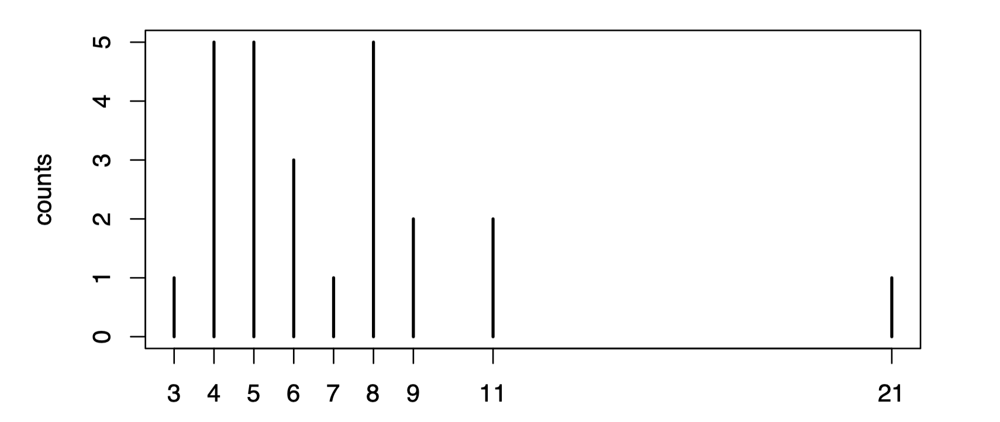
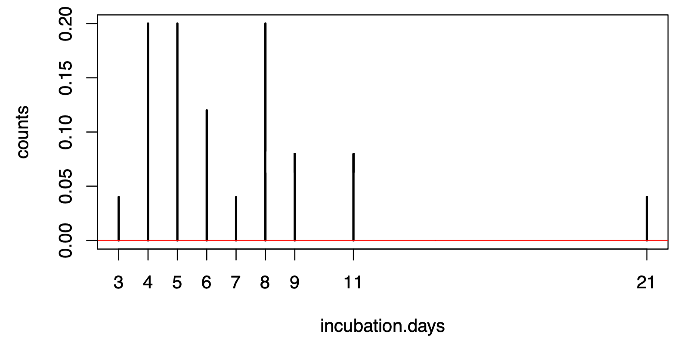
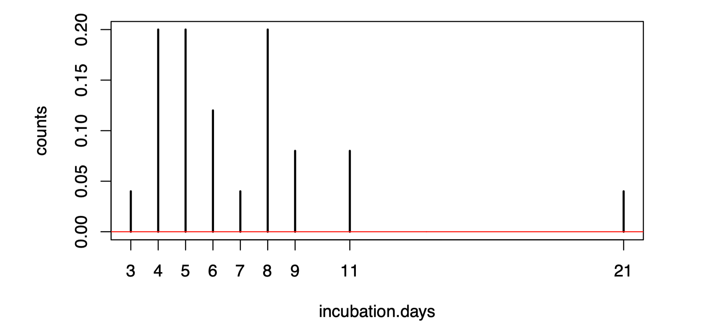

## 1. Covid-19 incubation period

Statistics is often used in situations where a complicated phenomenon is not understood from first principles, but there is a need to identify some key characteristics. For example, substantial portions of our understanding of the social sciences and medicine is based on statistical experiments and analysis.

We consider here an attempt in January 2020 to approximate the distribution of the [incubation period](https://en.wikipedia.org/wiki/Incubation_period) for COVID-19, i.e. the time between infection and when symptoms appear. Since [COVID-19](https://en.wikipedia.org/wiki/COVID-19) was not yet endemic but quite infectious, this was of great public health interest because understanding the incubation period would assist in defining isolation periods after exposure that effectively manage the competing interests of allowing a return to normal life and reducing the probability of further infections.

This is a reasonable example of the point made above: although an “initial genome” was published by researchers in early January, there is no way to “read off” from this important macroscopic quantities such as the incubation period or epidemiological quantities such as the rate of reproduction (which is also heavily influenced by social behaviour and environmental characteristics).

The modified data contains 25 observations of incubation times (in days).

## 2.Data

The data we analyze here is a modified version of the data used in the article

Backer, Jantien A., Don Klinkenberg, and Jacco Wallinga. [Incubation period of 2019 novel coronavirus (2019-nCoV) infections among travellers from Wuhan, China, 20–28 January 2020. Eurosurveillance 25, no. 5 (2020)](https://dx.doi.org/10.2807%2F1560-7917.ES.2020.25.5.2000062)

which was accepted for publication on February 6, 2020. The actual data used would require a more sophisticated model to fit than we can use for Statistics 2 (see the Epilogue below).

We can read in the data as follows (make sure it is in the same directory as your Rmd file).

```r
covid.incubation <- read.csv("covid-incubation.csv")
```

You can inspect the data by clicking on the data frame in the Environment pane in RStudio. You can see that it contains some demographic information and a description of each patient, with 25 patients in total. For us, the only important data is the incubation.days column, the incubation period in days for each patient. We can extract this data and plot the counts of each number of incubation days to visualize the data.

```r
incubation.days <- covid.incubation$incubation.days 
plot(table(incubation.days), ylab="counts")
```



## 3. Log-normal incubation period model

One possible model for the incubation period is that it follows a log-normal distribution, i.e.
$$
Y = e^X,\space X \sim N(\mu, \sigma^2)
$$


where $\theta = (\mu, \sigma^2)$ is the statistical parameter.[Sartwell (1950)](https://doi.org/10.1093/oxfordjournals.aje.a119397) proposed this model after assessing fit for several infectious diseases.

You should just ignore the fact that the incubation period as measured takes discrete values. There is an art to statistical modelling!

## 4. Questions

**Question 1**. [2 marks] Derive the maximum likelihood estimators of $\mu$ and $\sigma^2$, and report the estimate for this dataset.

I suggest that you write a function ml.estimate that takes as input some data and returns a vector containing the estimated values of $\mu$ and $\sigma^2$. For example, something like this:

```r
ml.estimate <- function(ys) {
    ## your code here
    mu.hat <- 0 # change this line
    sigmaSq.hat <- 0 # change this line
    c(mu.hat, sigmaSq.hat)
}
```

— **Solution** —

Write your solution here.

— **End of Solution** —

If you have written your code correctly, you can visualize the fitted distribution’s PDF alongside the normalized counts of the data.

```r
theta.ml <- ml.estimate(incubation.days)
plot(table(incubation.days)/length(incubation.days), ylab="counts")
vs <- seq(0,30,0.1)
lines(vs,dlnorm(vs,meanlog=theta.ml[1],sdlog=sqrt(theta.ml[2])),col="red")
```



---

**Question 2**. [2 marks] Derive the method of moments estimators of $\mu$ and $\sigma^2$, and report the estimate for this dataset.

I suggest that you write a function mom.estimate that takes as input some data and returns a vector containing the estimated values of $\mu$ and $\sigma^2$. For example, something like this:

```r
mom.estimate <- function(ys) {
    ## your code here
    mu.hat <- 0 # change this line
    sigmaSq.hat <- 0 # change this line
    c(mu.hat, sigmaSq.hat)
}
```

— **Solution** —

Write your solution here.

— **End of Solution** —

Again, you can visualize the fit.

```r
theta.mom <- mom.estimate(incubation.days)
plot(table(incubation.days)/length(incubation.days), ylab="counts")
vs <- seq(0,30,0.1)
lines(vs,dlnorm(vs,meanlog=theta.mom[1],sdlog=sqrt(theta.mom[2])),col="red")
```



**Question 3**. [2 marks] Using simulations, compare empirically the mean-squared errors of the maximum likelihood estimators and the method of moments estimators when $\theta = (1.8, 0.2)$ and $n = 25$.

— **Solution** —

Write your solution here.

— **End of Solution** —

**Question 4**. [1 mark] In light of Q3, comment on the model obtained by observing $X = log(Y )$ rather than Y.

— **Solution** —

Write your solution here. 

— **End of Solution** —

**Question 5**. [2 marks] It is of interest to determine the probability that the incubation period exceeds 7, 10 and 14 days, since asking people to isolate for this number of days could be a simple public health message. What are the maximum likelihood estimates of these probabilities?

— **Solution** —
 Write your solution here.

— **End of Solution** —

**Question 6**. [1 mark] Assume that you did not know how to derive the maximum likelihood estimator for this model. Use the optim function to find and report the maximizer of the log-likelihood. 

— **Solution** —

Write your solution here. 

— **End of Solution** —

## 5. Epilogue

### 5.1 Public health consequences

Question 5 and its solution are the most relevant from a public health perspective. In particular, the probability of incubation period exceeding a particular number of days allows one to test the hypothesis that a person has indeed been infected. It should not come as a surprise, therefore, that NHS guidelines after exposure to Covid-19 were to self-isolate for 14 days (unless symptoms appear, in which case one was told to self-isolate for longer).

One should be careful not to make logical errors in interpreting the probabilities above. In particular, the probability that the incubation exceeds 10 days is the probability that someone who is infected has no symptoms at the 10 day mark. But it is **not** the probability that they are infected if they have no symptoms at the 10 day mark: whether someone is infected is not a random variable in this model.

Finally, one should also bear in mind that there are asymptomatic cases of Covid-19, and this is not necessarily reflected in the model used here.

### 5.2 Actual data

This is a simple analysis of (modified) data that was used early on in the Covid-19 pandemic to infer the incubation period of the virus. Although the data was modified, the ML estimates are not too different to the estimates produced by the original study.

The specific modification of the data is that we pretend that we have observations of the true incubation period for each of the patients. Such observations are, however, not possible to record. In the original dataset the date of symptom onset is recorded but the date of infection is not, since it is not known when a particular patient was infected. Instead, an exposure window of dates was recorded. Part of the more sophisticated statistical analysis involves modelling the date of infection of each patient as an unobserved random variable. Using such a model for this computer practical would not have been appropriate.

The dataset used for this practical is also smaller, as the method used to “impute” the date of infection data involved taking the midpoint of the exposure window, and several of the exposure windows were open-ended (e.g. people who were in Wuhan long before the outbreak began or whose dates of travel were not known).To simplify the analysis, patients with open-ended exposure windows were ignored.

Obviously, this means that the data used here are to some extent “fake”. But hopefully you can see the potential impact of being able to infer a distribution for the incubation period based on a small amount of high-quality data.


::: details 公众号：AI悦创【二维码】


:::

::: info AI悦创·编程一对一

AI悦创·推出辅导班啦，包括「Python 语言辅导班、C++ 辅导班、java 辅导班、算法/数据结构辅导班、少儿编程、pygame 游戏开发、Web、Linux」，全部都是一对一教学：一对一辅导 + 一对一答疑 + 布置作业 + 项目实践等。当然，还有线下线上摄影课程、Photoshop、Premiere 一对一教学、QQ、微信在线，随时响应！微信：Jiabcdefh

C++ 信息奥赛题解，长期更新！长期招收一对一中小学信息奥赛集训，莆田、厦门地区有机会线下上门，其他地区线上。微信：Jiabcdefh

方法一：[QQ](http://wpa.qq.com/msgrd?v=3&uin=1432803776&site=qq&menu=yes)

方法二：微信：Jiabcdefh

:::


