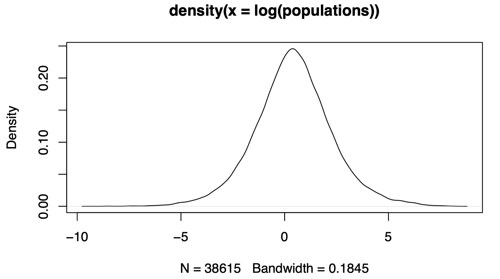
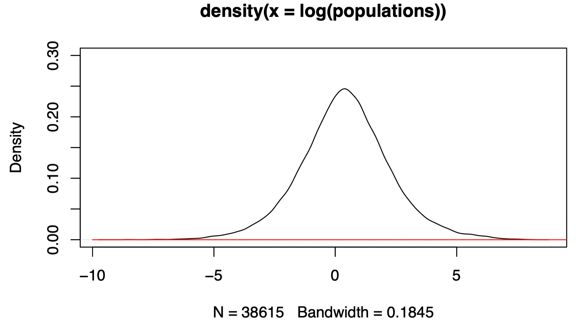
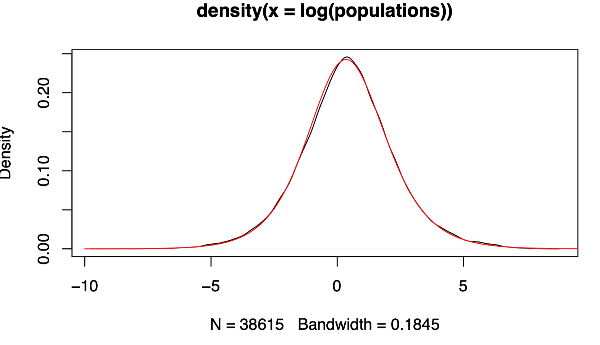

## 1. Instructions

1. Reports should be handed in **as a single PDF file** using Blackboard, by noon on the due date. RMarkdown, image, word, zip files, for example, will **not** be marked.
2. You can work alone or in a group with up to two other people.
3. One person per group should hand in a report. The names and student numbers of all group members must be on the first page.
4. Your answers should combine text and code snippets in R. It is recommended that you use RMarkdown to prepare your reports, since this is typically easier for students, but this is not mandatory.
5. You must explain what you are doing clearly to obtain full marks on each question. You can use comments (which start with #) to annotate your code. Mathematical derivations can be written using LaTeX commands in RMarkdown or on paper, with a photo then appended to the end of the PDF being submitted.
6. This practical counts for 10% of your assessment for Statistics 2.

## 2. Populations of world cities

The data is population sizes of the world's cities and towns, according to the [World Cities Database](https://simplemaps.com/data/world-cities).

To load the raw data and remove missing (NA) entries, we run the following commands.

```r
raw.data <- read.csv("worldcities.csv")
raw.populations <- raw.data$population
populations <- raw.populations[!is.na(raw.populations)]
sum(populations)
## [1] 5076372338
```

There are around 5.076 billion people counted, which is off by about 3 billion since there are about 8 billion people in the world. In any case we can try to understand the distribution of population sizes for the data we do have. Now we remove populations under 10000.

```r
populations <- populations[populations>=10000]
length(populations)
## [1] 38615
```

```r
sum(populations)
## [1] 5030436026
```

We can see that removing the smaller towns still leaves us considering around 5.03 billion people, and we have observations of population sizes from 38615 cities.

To finish cleaning the data, we now divide `populations` by 10000 and subtract 1 so that the values start from 0 and we essentially counting population sizes in units of 10000.

```r
populations <- populations/10000-1
```

## 3. Visualizing the data

The data have a large range, and so visualizing a density estimate on the original scale is not very informative. Instead, and purely for the purpose of visualization, we can plot the density of the logarithms of the observations.

```r
plot(density(log(populations)))
```



## 4. Model

We will model populations as realizations of independent and identically distributed random variables from a member of the family of distributions with density
$$
\begin{equation}
f(x;\theta) = \frac{a b^a}{(x+b)^{a+1}}\mathbb{I}(x \geq 0),
\end{equation}
$$
with two-dimensional statistical parameter $\theta=(a,b) \in (0,\infty)^2$ . This is a regular statistical model.

This PDF is non-negative and integrates to $1$ because for any $b>0$ and$t \in \mathbb{R}$, we have
$$
\begin{equation}
\int_{0}^{\infty}\frac{1}{(x+b)^{t}}{\rm d}x=
\begin{cases}
\frac{1}{(t-1)b^{t-1}} & t>1 \\
\infty & t\leq 1.
\end{cases}
\end{equation}
$$
We shall write $X \sim {\rm Dist}(a,b)$ to mean that $X$ is a random variable with density (1). To simulate a vector of realizations of independent ${\rm Dist}(a,b)$ random variables, we canuse the following code. If you are interested, this is an application of [inverse transform sampling](https://en.wikipedia.org/wiki/Inverse_transform_sampling).

```r
rdist <- function(n, a, b) {
  u <- runif(n)
  (u^(-1/a)-1)*b
}
```

To evaluate the PDF at each point in a vector, we can use the following code. If the `log` argument is true then the log density is returned rather than the density, as is usual in `R` code.

```r
ddist <- function(xs,a,b,log=FALSE) {
  if (log) {
    log(a) + a*log(b) - (a+1)*log(xs+b)
  } else {
    a*b^a/(xs+b)^(a+1)
  }
}
```

## 5. Estimation

Using (2) it is quite easy to show that the first and second moments of $X \sim {\rm Dist}(\cdot ;\theta)$ are 
$$
\begin{align*}
\mathbb{E}(X;\theta) =
\begin{cases}
\frac{b}{a-1} \qquad & a>1, \\
\infty  & a \leq 1.
\end{cases}
\end{align*}
$$
and
$$
\begin{align*}
\mathbb{E}(X^2;\theta) =
\begin{cases}
\frac{2b^2}{(a-1)(a-2)} \qquad & a>2, \\
\infty  & a \leq 2.
\end{cases}
\end{align*}
$$
**Question 1**. [2 marks] Derive the method of moments estimators of $a$and $b$. Report the estimates for this dataset.

I suggest that you write a function `mom.estimate` that takes as input some data and returns a vector containing the estimated values of $a$and $b$. For example, something like this:

```r
mom.estimate <- function(xs) {
  ## your code here
  a.hat <- 0 # obviously wrong
  b.hat <- 0 # obviously wrong
  c(a.hat, b.hat)
}
```

--- **Solution** ---

Your solution here.

--- **End of Solution** ---

You can check if your estimate makes sense by considering a large dataset with known parameters.

```r
fake.data <- rdist(100000, 10, 20)
fake.theta.hat <- mom.estimate(fake.data)
fake.theta.hat
## [1] 0 0
```

Having computed the method of moments estimate for the `populations` data, we can visualize the fitted density on the log scale. Even if you have computed the estimates properly, the fit should not look great. As you go through the rest of the practical, you may be able to guess why this is.

On the logarithmic scale, we can plot the fitted density by using the transformed PDF suggested by Exercise 2.1 of the lecture notes, i.e. if $Y=\log(X)$ and $f_X$ is the PDF for $X$ then the PDF for $Y$ is
$$
f_Y(y) = f_X(\exp(y)) \exp(y).
$$

```r
theta.mom <- mom.estimate(populations)
plot(density(log(populations)),ylim=c(0,0.3))
zs <- seq(-10,10,0.01)
lines(zs,ddist(exp(zs),theta.mom[1],theta.mom[2])*exp(zs),col="red")
```



**Question 2**. [2 marks] Show that for fixed $b$, the log-likelihood is maximized by taking
$$
\begin{equation}
a=\frac{n}{\sum_{i=1}^n \{ \log (x_i + b) - \log(b) \} }
\end{equation}
$$
--- **Solution** ---

Your solution here.

--- **End of Solution** ---

The log-likelihood cannot be maximized analytically, so we will use a numerical optimization procedure. In particular, we will make use of thefact that we can maximize a function of $b$ only since we know that for any $b$ the maximizing $a$ is given by $a=\frac{n}{\sum_{i=1}^n \{ \log (x_i + b) - \log(b) \} }$.

```r
ml.estimate <- function(xs) {
  n <- length(xs)
  get.a <- function(b) {
    n/(sum(log(xs+b))-n*log(b))
  }
  ell <- function(b) {
    lb <- log(b)
    a <- get.a(b)
    la <- log(a)
    n*la+a*n*lb-(a+1)*sum(log(xs+b))
  }
  out <- optim(1, ell, control = list(fnscale=-1), method="Brent", lower=0, upper=100)
  c(get.a(out$par),out$par)
}
```

Now we can visualize the fitted density using the ML estimate. It looks pretty good!

```r
theta.ml <- ml.estimate(populations)
plot(density(log(populations)))
zs <- seq(-10,10,0.01)
lines(zs,ddist(exp(zs),theta.ml[1],theta.ml[2])*exp(zs),col="red")
```



## 6. Confidence Intervals

In lectures we have seen that for regular statistical models with a one-dimensional parameter $\theta$, the ML estimator $\hat{\theta}_n$ is *asymptotically normal* with
$$
\sqrt{nI(\theta)}(\hat{\theta}_n - \theta) \to_{\mathcal{D}(\cdot;\theta)} Z \sim N(0,1).
$$
This convergence in distribution justifies the construction of Wald confidence intervals for $\theta$.

In this computer practical, the statistical model has a $2$-dimensional parameter. Under appropriate regularity assumptions, the ML estimator $\hat{\theta}_n$ is *asymptotically (multivariate) normal* in the sense that
$$
\sqrt{n}(\hat{\theta}_{n}-\theta) \to_{\mathcal{D}(\cdot;\theta)} W \sim N(0,I(\theta)^{-1}),
$$
where $I(\theta)$ is the Fisher information *matrix* 
$$
I(\theta) = - \mathbb{E}[\nabla^2 \ell(\theta; X_1) ; \theta],
$$
and the expectation is taken element-wise. That is, the $ij$ th entry of $I(\theta)$ is the negative expectation of the corresponding $ij$ th second order partial derivative of the log-likelihood associated with 1 observation. Notice that $W$ is a two-dimensional normal random vector with mean $0$ and variance-covariance matrix $I(\theta)^{-1}$.

One can deduce from this multivariate asymptotic normality that for $j \in \{1,\ldots,2\}$,
$$
\sqrt{n}(\hat{\theta}_{n,j}-\theta_{j}) \to_{\mathcal{D}(\cdot;\theta)} W_1 \sim N(0,(I(\theta)^{-1})_{jj}),
$$
which we can rewrite as
$$
\sqrt{\frac{n}{(I(\theta)^{-1})_{jj}}} (\hat{\theta}_{n,j}-\theta_{j}) \to_{\mathcal{D}(\cdot;\theta)} Z \sim N(0,1),
$$
where $\hat{\theta}_{n,j}$ denotes the $j$ th component of $\hat{\theta}_n$ and $\theta_j$ denotes the $j$ th component of $\theta$.

Notice that $(I(\theta)^{-1})_{jj}$ is the $j$ th diagonal entry of the inverse of the Fisher information matrix, and is **not** in general equal to $(I(\theta)_{jj})^{-1}$, the inverse of the $j$ th diagonal entry of the Fisher information $matrix^1$.In `R` you can compute numerically the inverse of a matrix using the `solve` command.

As in the one-dimensional parameter case, one can replace $I(\theta)$ with $I(\hat{\theta}_n)$ if $\hat{\theta}_n$ is a consistent sequence of estimators of $\theta$ to obtain 
$$
\sqrt{\frac{n}{(I(\hat{\theta}_n)^{-1})_{jj}}} (\hat{\theta}_{n,j}-\theta_{j}) \to_{\mathcal{D}(\cdot;\theta)} Z \sim N(0,1),
$$
**Question 3**. [2 marks] Show that the Fisher information for one observation is
$$
I(\theta)=\left(\begin{array}{cc}
\frac{1}{a^{2}} & -\frac{1}{b(a+1)}\\
-\frac{1}{b(a+1)} & \frac{a}{b^{2}(a+2)}
\end{array}\right),
$$
and compute the Fisher information for $\theta = \hat{\theta}_{\rm ML}$.

 I recommend that you write a function to compute the Fisher information for any value of $\theta$, structured like this:

```r
info <- function(theta) {
  a <- theta[1]
  b <- theta[2]
  # your code
  i11 <- 1 # obviously wrong
  i12 <- 0 # obviously wrong
  i21 <- 0 # obviously wrong
  i22 <- 1 # obviously wrong
  mtx <- matrix(c(i11,i21,i12,i22),2,2)
  return(mtx)
}
```

--- **Solution** ---

Your solution here.

--- **End of Solution** ---

**Question 4**. [2 marks] Compute and report the endpoints of the observed 98% Wald confidence intervals for $a$ and $b$ individually.

I recommend that you write a function that computes the observed confidence intervals' end points, which should call the `info` function.

```r
compute.CI.endpoints <- function(xs,alpha) {
  # your code
  L.a <- 0 # obviously wrong
  U.a <- 1 # obviously wrong
  L.b <- 0 # obviously wrong
  U.b <- 1 # obviously wrong
  list(a=c(L.a,U.a),b=c(L.b,U.b))
}
```

You may find it helpful to know that you can use the `solve` function to compute the inverse of a matrix.

--- **Solution** ---

Your solution here.

--- **End of Solution** ---

**Question 5**. [2 marks] Using **many** simulations, approximate the coverage of the asymptotically exact $1-\alpha$ confidence intervals corresponding to your answer to Question 3, when $(a,b) = (0.9,1.28)$ and $\alpha=0.02$, for $n \in \{10,100,1000\}$. Comment on the coverageof the confidence intervals and explain in words why the approximate coverage you report is approximate.

I recommend that you write a function

```r
approximate.coverage <- function(n,a,b,alpha,trials) {
  # your code
  coverage.a <- 0 # hopefully wrong
  coverage.b <- 0 # hopefully wrong
  c(coverage.a,coverage.b)
}
```

--- **Solution** ---

Your solution here.

--- **End of Solution** ---

## 7. Epilogue

This computer practical involves a slightly more complicated distribution for the data than the standard distributions withone-dimensional statistical parameters typically used for communicating the basic ideas. The use of more sophisticated models is important when applying statistical ideas to real world data. As in this case, it is not uncommon that the ML estimate has to be computed numerically.Similarly, most real-world models have several statistical parameters,and the use of two parameters here is therefore a gentle introduction to what you would do in more realistic statistical analyses.


::: code-tabs

@tab demo1

```r
# 最大似然估计函数
# 此函数通过优化过程估计参数a和b的值
ml.estimate <- function(xs) {
  n <- length(xs)  # 获取样本大小
  get.a <- function(b) n / (sum(log(xs + b)) - n * log(b))  # 用于计算a的内部函数，根据公式(3)
  ell <- function(b) {  # 计算给定b时的对数似然函数
    lb <- log(b)
    a <- get.a(b)  # 计算a的值
    la <- log(a)
    n * la + a * n * lb - (a + 1) * sum(log(xs + b))  # 返回对数似然值
  }
  # 优化函数，寻找最大化对数似然的b值
  out <- optim(1, ell, control = list(fnscale = -1), method = "Brent", lower = 0, upper = 100)
  c(get.a(out$par), out$par)  # 返回a和b的估计值
}

# Fisher信息矩阵函数
# 此函数计算并返回Fisher信息矩阵，用于后续的置信区间计算
info <- function(theta) {
  a <- theta[1]  # 参数a
  b <- theta[2]  # 参数b
  # 根据提供的公式计算Fisher信息矩阵的元素
  i11 <- 1 / a^2
  i12 <- -1 / (b * (a + 1))
  i21 <- i12  # 对称性质，i12和i21相同
  i22 <- a / (b^2 * (a + 2))
  # 构建并返回Fisher信息矩阵
  matrix(c(i11, i12, i21, i22), 2, 2)
}

# 计算置信区间端点的函数
# 此函数用于计算参数a和b的置信区间端点
compute.CI.endpoints <- function(xs, alpha) {
  theta.hat <- ml.estimate(xs)  # 调用ML估计函数获取参数估计值
  info.mat <- info(theta.hat)  # 计算Fisher信息矩阵
  info.mat.inv <- solve(info.mat)  # 求Fisher信息矩阵的逆
  n <- length(xs)  # 样本大小
  z <- qnorm(1 - alpha / 2)  # 计算正态分布的分位数，用于置信区间的计算
  # 计算标准误差
  se.a <- sqrt(info.mat.inv[1, 1] / n)
  se.b <- sqrt(info.mat.inv[2, 2] / n)
  # 计算置信区间的端点
  L.a <- theta.hat[1] - z * se.a
  U.a <- theta.hat[1] + z * se.a
  L.b <- theta.hat[2] - z * se.b
  U.b <- theta.hat[2] + z * se.b
  # 返回置信区间的端点
  list(a = c(L.a, U.a), b = c(L.b, U.b))
}

# 模拟数据生成函数
# 此函数用于根据指定的参数a和b生成模拟数据
rdist <- function(n, a, b) {
  u <- runif(n)  # 生成均匀分布的随机数
  (u^(-1 / a) - 1) * b  # 应用反变换采样方法生成数据
}

# 置信区间覆盖率的模拟估计函数
# 此函数用于估计置信区间的覆盖率
approximate.coverage <- function(n, a, b, alpha, trials) {
  coverage.a <- 0  # 记录参数a的置信区间覆盖次数
  coverage.b <- 0  # 记录参数b的置信区间覆盖次数
  for (i in 1:trials) {
    simulated.data <- rdist(n, a, b)  # 生成模拟数据
    CI.endpoints <- compute.CI.endpoints(simulated.data, alpha)  # 计算置信区间的端点
    # 检查真实参数值是否在置信区间内
    if (CI.endpoints$a[1] <= a && a <= CI.endpoints$a[2]) coverage.a <- coverage.a + 1
    if (CI.endpoints$b[1] <= b && b <= CI.endpoints$b[2]) coverage.b <- coverage.b + 1
  }
  # 计算并返回覆盖率
  c(coverage.a / trials, coverage.b / trials)
}

# 使用示例
n <- 100 # 设置样本大小
a.true <- 0.9 # 设置真实参数a的值
b.true <- 1.28 # 设置真实参数b的值
alpha <- 0.02 # 设置显著性水平
trials <- 1000 # 设置模拟次数

# 计算置信区间覆盖率
coverage <- approximate.coverage(n, a.true, b.true, alpha, trials)
print(coverage)  # 输出覆盖率结果

```

:::


要进行 Fisher 信息矩阵的详细数学证明，我们需要从分布的定义开始，即：

对于给定的密度函数 $f(x;\theta) = \frac{a b^a}{(x+b)^{a+1}}\mathbb{I}(x \geq 0)$ ，我们需要找到对数似然函数，然后计算其关于参数 $a$  和 $b$  的一阶和二阶导数。接着，计算这些导数的期望值，以得到 Fisher 信息矩阵的各个元素。

以下是详细的步骤：

### 步骤 1: 对数似然函数
对数似然函数为单个观察值的 $f(x;\theta)$  对数：

$$
\ell(\theta; x) = \log(f(x;\theta)) = \log(a) + a\log(b) - (a+1)\log(x+b)
$$

### 步骤 2: 一阶导数（偏导数）

对 $a$ 的偏导数为：

$$
\frac{\partial \ell(\theta; x)}{\partial a} = \frac{1}{a} + \log(b) - \log(x+b)
$$

对 $b$ 的偏导数为：

$$
\frac{\partial \ell(\theta; x)}{\partial b} = \frac{a}{b} - \frac{(a+1)}{x+b}
$$

### 步骤 3: 二阶导数

对 $a$ 的二阶导数为：

$$
\frac{\partial^2 \ell(\theta; x)}{\partial a^2} = -\frac{1}{a^2}
$$

对 \( b \) 的二阶导数为：

$$
\frac{\partial^2 \ell(\theta; x)}{\partial b^2} = -\frac{a}{b^2} + \frac{(a+1)}{(x+b)^2}
$$

对 $a$  和 $b$  的交叉二阶导数为：

$$
\frac{\partial^2 \ell(\theta; x)}{\partial a \partial b} = \frac{\partial^2 \ell(\theta; x)}{\partial b \partial a} = -\frac{1}{b} + \frac{1}{x+b}
$$


### 步骤 4: 二阶导数的期望值

我们需要找到上述二阶导数的期望值。对于 Fisher 信息矩阵，我们需要负的期望值。

对 $a$ 的期望二阶导数：

$$
\mathbb{E}\left[-\frac{\partial^2 \ell(\theta; X)}{\partial a^2}\right] = \frac{1}{a^2}
$$

对 $b$ 的期望二阶导数（因为第二项中的 $(X+b)^2$ 在 $X$ 上的期望并不容易计算，我们只能使用 $b$ 的积分来近似）：

$$
\mathbb{E}\left[-\frac{\partial^2 \ell(\theta; X)}{\partial b^2}\right] \approx \frac{a}{b^2}
$$

对 $a$ 和 $b$ 的期望交叉二阶导数：

$$
\mathbb{E}\left[-\frac{\partial^2 \ell(\theta; X)}{\partial a \partial b}\right] = \frac{1}{b(a+1)}
$$

由于 $X$ 的分布是未知的，上述期望值的精确计算可能需要更复杂的积分和概率计算。

### 步骤 5: 构造Fisher信息矩阵

最后，Fisher 信息矩阵 $I(\theta)$ 可以表示为：

$$
I(\theta)=\left(\begin{array}{cc}
\frac{1}{a^2} & -\frac{1}{b(a+1)}\\
-\frac{1}{b(a+1)} & \frac{a}{b^2}
\end{array}\right)
$$


::: details 公众号：AI悦创【二维码】


:::

::: info AI悦创·编程一对一

AI悦创·推出辅导班啦，包括「Python 语言辅导班、C++ 辅导班、java 辅导班、算法/数据结构辅导班、少儿编程、pygame 游戏开发、Web、Linux」，全部都是一对一教学：一对一辅导 + 一对一答疑 + 布置作业 + 项目实践等。当然，还有线下线上摄影课程、Photoshop、Premiere 一对一教学、QQ、微信在线，随时响应！微信：Jiabcdefh

C++ 信息奥赛题解，长期更新！长期招收一对一中小学信息奥赛集训，莆田、厦门地区有机会线下上门，其他地区线上。微信：Jiabcdefh

方法一：[QQ](http://wpa.qq.com/msgrd?v=3&uin=1432803776&site=qq&menu=yes)

方法二：微信：Jiabcdefh

:::


