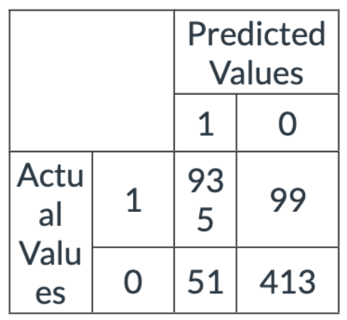

## Part 1

1. A company with 4,842 shares in the markets is trading at 40.58 today. The company goes through a 4 and 1 stock split today and has not paid any dividends recently. What would be the number of shares available after the stock split? Round your answer to 2 decimal places.

    Note: 10.444 would round to 10.44 while 10.445 would round to 10.45

Solution：拆分后的股份数量为1,210.50股。

2. Consider the equation 6.05 log(Y) = 2.19 + 53.4 log(X). What is elasticity?

    Note: Round to two decimals. 10.444 would round to 10.44 while 10.445 would round to 10.45

Solution: 53.4

3. Which of the following does not change as a result of a stock split?

    A. Stock price

    B. Market value of the firm✅

    C. The number of shares of stock in market

    D. None of the above

4. True or False? Historically, riskier investments have a lower average annual return, but also a higher standard deviation

    A. True

    B. False✅

5. Assume you have concluded to use a log transformation on your data to model a relationship. Upon investigating the dataset, you found negative and zero values. Which of the following is the best way to proceed?

    A. Use log(x+ 1) where x is the variable you want to transform.

    B. Use log(x + c + 1) where x is the variable you wish to transform and c is the absolute value of the most negative number.✅

    C. Remove the data points which are negative or zero.

    D. Use log(10 * x) where x is the variable you want to transform.

    E. Use log(x) without changes to the variable.

6. While calculating a difference in difference, we run a regression which is as follows:

    A. lm(y~ d1 +d2 + d3) where d1 and d2 are dummy variables and d3 is their interaction term.

    B. We thus get its coefficients according to the equation: $Y = a + b*d1 + c*d2 + d*d3$. What is the difference in difference estimator?

    A. a 

    B. (d-c)-(b-a)

    C. a+b+c+d

    D. d✅

7. Using the following confusion matrix, what is the precision of the model to three decimal places?

    Note: For the confusion matrix below 1 = True and 0 = False




Note: Round to three decimal places. Example XX.xxx

solution：0.948

8. A company with 4,890 shares in the markets is trading at 16.25 today. The company goes through a 4 and 1 stock split today and has not paid any dividends recently. What would be the adjusted stock price after the stock split? Round your answer to 2 decimal places.

    Note: 10.444 would round to 10.44 while 10.445 would round to 10.45

solution：$4.06

9. Fill in the blanks with the proper error type:

    A. When a false null hypothesis is retained, it is a `choose your answer...` error. `Type II`

    B. When a true null hypothesis is rejected, it is a `choose your answer…..` error.  `Type I`

10. From the following regression model: $Gold\_Price\_Per\_oz = \beta_0 + \beta_1 \times M2 + \beta_2 \times VIX + \beta_3 \times War$  Where M2 is a continuous variable of the M2 money supply, VIX is a continuous variable of the VIX index, and War is a categorical variable (0 is Time period at peace, 1 is Time period at war).Which of the following would be a part of the base case conditions?

    A. Time period at peace✅

    B. A high VIX index

    C. Time period at war

    D. Period of inflation

11. Consider the following table of known data of Plastics, Inc:

| Date      | Company       | Stock Split | Price |
| --------- | ------------- | ----------- | ----- |
| 3/31/2010 | Plastics, Inc |             | 82.47 |
| 4/30/2010 | Plastics, Inc |             | 93.24 |
| 5/31/2010 | Plastics, Inc | 4 for 2     | 49.74 |
| 6/30/2010 | Plastics, Inc |             | 41.91 |
| 7/31/2010 | Plastics, Inc |             | 48.88 |
| 8/31/2010 | Plastics, Inc |             | 42.08 |

What is the return for the month of April?

Hint: Remember to account for stock splits.

Note: Enter as a percentage without the % sign to two decimal places. For example, if you calculate it to be -0.2015 (aka -20.15%) enter it as -20.15 in the answer box.

13.06%

12. An interaction term is used to model how the synergies between multiple variables impact which type of variable?

    A. Response✅

    B. Categorical

    C. Independent

    D. None of the above

13. Consider the following table of known data of Loggers, Inc:

| Date      | Company      | Stock Split | Price |
| --------- | ------------ | ----------- | ----- |
| 3/31/2010 | Loggers, Inc |             | 96.75 |
| 4/30/2010 | Loggers, Inc |             | 92.10 |
| 5/31/2010 | Loggers, Inc | 5 for 2     | 31.60 |
| 6/30/2010 | Loggers, Inc |             | 37.14 |
| 7/31/2010 | Loggers, Inc |             | 31.90 |
| 8/31/2010 | Loggers, Inc |             | 47.41 |

What is the compound return for Loggers, Inc from March to August 2010?

Hint: Remember to account for stock splits.

Note: Enter as a percentage without the % sign to two decimal places. For example, if you calculate it to be -0.2015 (aka -20.15%)enter it as -20.15 in the answer box.

14. Consider a multiple linear regression model: $Y = 0.55 + 0.93x_1 + 1.88x_2$. Which one of the following interpretation of the coefficients is correct?

A. A 0.93 increase in $x_1$ , is associated with a 1.88 increase in $x_2$.

B. A unit increase in $x_2$ is associated with a 1.88 increase in Y, keeping all else constant.

C. Y is predicted to be equal to 0.55 when both $x_1$ and $x_2$ take the value of 1.

D. A unit increase in $x_1$ is associated with an 0.93 increase in Y.

15. In a linear regression model with one qualitative (categorical) predicting variable with 9 values; how many dummy variables should be created?

8

16. A company with 2,536 shares in the markets is trading at 15.73 today. The company goes through a 5 and 2 stock split today and has not paid any dividends recently. What would be the market value of all stocks after the stock split? Round your answer to 2 decimal places.

    **Note:**  
    - 10.444 would round to 10.44  
    - 10.445 would round to 10.45

$39,891.28

17. A stock is measured to have a beta of 0.96 and has a corresponding R-squared of 0.42. Based on this information, which of the following statements are correct?

    A. The stock is slightly negatively correlated with the market.

    B. According to beta, the stock is more risky than the market portfolio

    C. 42% of the stock's returns are driven/explained by the market according to R-squared✅

    D. The stock is more sensitive to market changes than the average stock.

    E. The stock is less sensitive to market changes than the average stock.✅

18. Which of the following are NOT a reason for log transformation? (Select all that apply)

A. To achieve heteroskedasticity✅

B. To make a distribution more normal

C. to increase R-Squared✅

D. To achieve a more linear relationship

19. Based on the following regression model summary, what is the Amount Spent by a Middle-aged customer if his/her salary is $38,381?

Note: The base case is Age = Young

Note: Round to the nearest cent or two decimal places. XXxx

|           | Estimate | S.E.  | t Value | Pr> \|t\| |
| --------- | -------- | ----- | ------- | --------- |
| Intercept | 7.96     | 5.540 | 1       | 0.280     |
| Salary    | 0.467    | 8.113 | 3       | 0.460     |
| AgeMid    | -7.18    | 1.294 | 2       | 0.150     |
| AgeOld    | -1.99    | 8.145 | 2       | 0.457     |

20. Consider a linear regression model estimating the fuel efficiency of a car in terms of miles per gallon of gas (mpg) based on its origin (region A, B or C) and number of cylinders with the following formula:

$$
mpg = b_0 + b_1 * RegionB + b_2 * RegionC + b_3 * Cylinders
$$

The estimated values of the regression coefficients are provided below:
$$
b_o = 46.60
\\
b_1=-5.00
\\
b_2 = 1.66
\\
b_3=-1.00
$$
Based on this model, if X is the mpg of a car with 8 cylinders originating from region B, and Z is the mpg of a car with 8 cylinders originating from region A, what is the value of X - Z rounded to two decimals?

Note: Round to two decimal places. Example XXxx

21. The following formula is which of the following:

$$
\sum_i ( \hat{y_i} - \bar{y} )^2
$$


A. Sum of Squared Errors

B. Sum of Squared Total

C. Sum of Squared Regression✅

D. Total Sum of Squares

22. Match the model approximations that best match the given model types.

Reminder:
$$
\text{Linear - Linear:}
Y = b_0 + b_1 \cdot X
\\

\text{Log - Linear:}
\log(Y) = b_0 + b_1 \cdot X
\\
\text{Linear - Log:}
Y = b_0 + b_1 \cdot \log(X)
\\
\text{Log - Log:}
\log(Y) = b_0 + b_1 \cdot \log(X)
$$
Alright, let's match the model types with their approximations:

1. **Linear - Linear**: $Y = b_0 + b_1 \cdot X$
   - **Approximation**: For a one-unit increase in \( X \), \( Y \) changes by a constant amount.

2. **Log - Linear**: $\log(Y) = b_0 + b_1 \cdot X$
   - **Approximation**: For a one-unit increase in \( X \), the percentage change in \( Y \) is constant.

3. **Linear - Log**: $Y = b_0 + b_1 \cdot \log(X)$
   - **Approximation**: For a constant percentage increase in \( X \), \( Y \) changes by a constant amount.

4. **Log - Log**: $\log(Y) = b_0 + b_1 \cdot \log(X)$
   - **Approximation**: For a constant percentage increase in \( X \), the percentage change in \( Y \) is constant.

23. The logit function is the log of the ratio of the probability of success (belonging to a group) to the probability of failure (note belonging to a group). It is also known as the log odds function.

A. True✅

B. False

24. Which of the following are examples of natural experiments?

A. A hurricane that hits all the stores countrywide

B. A law that changed the tax rate for some subjects, but not others

C. A mobile carrier implements an unlimited data plan in some cities but not others

D. Minimum wage is changed in one state but not another

25. Consider the following linear regression model in R: Im(response ~ pred1 + pred2 + pred3, data = dataset)

Now, consider we would like to evaluate if this model's underlying predictor variables exhibit multi-collinearity. When testing our predictive variables for multicollinearity, we create a new model in R using just the independent variables of the previous model so that we have: Im(pred1 ~ pred2 + pred3, data = dataset). After running this new model, we get an R-Squared of 0.77. Based on this result,what is the VIF for pred 1 using three decimal places?

Note: Round to three decimal places. Example XX.xxx


**Midterm** **Part 2** covers the topics in **Modules 1 to 6** and is worth **10% of your overall grade**. You may work on it for as long as you like within the given window. Please note that your answers will automatically save as you key them. As long as you do not click submit, you can enter and exit the assignment as many times as necessary during the time period that it is available. Again, please note, **you should only click "submit" when you are completely finished with the assignment and ready to submit it for grading**. 

Also, please remember that you are to complete this exam on your own. Any help given or received constitutes cheating. **Any violations of the Georgia Tech Honor Code will be reported and penalized.** If you have any general questions about the exam, please post to the Piazza board marking it private. 

Good luck!

## Instructions for Questions 1 – 6

Georgia Tech Bank (GT Bank) just hired you as a consultant, to help them better understand their business. On your first day, you decide to use the “Credit” dataset from the ISLR package, as a proxy, to answer questions about their customer base. Download the “Credit” dataset from the ISLR package, drop the ID column, and model the data such that Balance is your dependent variable and the rest of the features (Income, Limit, Rating, Cards, Age, Education, Gender, Student, Married, and Ethnicity) are your independent variables. Use your model to answer questions Q1 through Q6.

**Data Dictionary for the “Credit” Dataset:**

1. **Balance:** This is the average credit card balance in dollars for each individual.
2. **Income:** The annual income of the individual in thousands of dollars.
3. **Credit Limit:** The credit limit on the individual’s credit card.
4. **Credit Rating:** The individual’s credit rating.
5. **Cards:** The number of credit cards owned by the individual.
6. **Age:** The age of the individual.
7. **Education:** The highest level of education completed by the individual.
8. **Gender:** The gender of the individual (e.g., “Male” or “Female”).
9. **Student:** Indicates whether the individual is a student (e.g., “Yes” or “No”).
10. **Married:** Indicates whether the individual is married (e.g., “Yes” or “No”).
11. **Ethnicity:** The ethnicity of the individual, which can include categories such as “African American,” “Asian,” and “Caucasian.”

---


1. Which features are significant at a 0.001 Confidence Interval?

A. MarriedYes, StudentYes, Cards

B. Rating, Limit, EthnicityAsiam

C. Income, Age, Rating, Education

D. Income, Limit, Cards, StudentYes✅

2. What is the absolute difference in the **coefficients** between a customer of Asian ethnicity and Caucasian ethnicity. Round your answer to two decimal places.

A. 26.90

B. 16.80

C. 10.11

D. 6.70✅

3. Which statement about Rating is correct?

A. Rating is significant at a 0.01 Confidence Interval

B. For one unit increase in rating, the average balance decreases by 1.13653 given all other features are held constant.✅

C. The base case for rating is -479.20787

D. None of the above

4. Which features have a high level of multicollinearity, with a vif over 5?

A. Limit, Cards, Age

B. Gender, Education

C. Limit, Rating✅

D. Age, Cards

5. How many influential points are included in the dataset, with a Cook’s distance over 1?

A. 0✅

B. 1

C. 3

D. 4

6. Which statement correctly describes the residual vs fitted plot for the model

A. The residuals are randomly scattered around 0, suggesting that the model is a good fit✅

B. The residuals show a distinct “V” pattern, suggesting that model has room for improvements

C. The residuals are as high as 300, suggesting that the model is suffering from variance.

D. The residuals are as low as -150, suggesting that the model is suffering from bias.

7. Using the same Credit dataset in the ISLR package with Balance as your dependent variable and Income, Rating, and Age as your independent variable, create a linear-linear, log-linear, linear-log, and log-log model. Based on the R-Squared, which model has the best performance? Note: Balance contains 0’s and a 1 needs to be added to the column before you can perform the log transformation (i.e. log(x + 1))

A. linear-linear✅

B. log-linear

C. linear-log

D. log-log

8. GT Bank wants you to predict the average credit card balance of Amy Henderson, a new customer to the bank. GT Bank knows that she is a student at Georgia Tech and makes 30,000 at her part time job. Use the Credit dataset from the ISLR package to create a model - that uses Balance as the dependent variable; and Income, Student, and the interaction between Income and Student as independent variables. Then use that model to predict the average credit card balance for Amy Henderson. Round your answer to the nearest dollar.

A. 250

B. 321

C. 804✅

D. 973


## Instructions for Questions 9-11

GT Bank wants you to analyze the “Default” dataset from the ISLR package, with the hopes of you uncovering new insights. Download the “Default” dataset from the ISLR package and model the data such that default is your dependent variable and the rest of the features (student, balance, and income) are your independent variables. Use your model to answer questions Q9 through Q11.

**Data Dictionary for the “Default” Dataset:**

1. **default:** Indicates whether or not a credit card holder defaulted on their credit card payment. It is a binary variable with two levels: “No” (indicating no default) and “Yes” (indicating default).
2. **student:** Indicates whether the individual is a student (e.g., “Yes” or “No”).
3. **balance:** The average credit card balance in dollars for each individual.
4. **income:** The annual income of the individual in dollars.

---

9. Which interpretation of income is correct?

    A. The relationship between income and probability of default is inverse

    B. For every 1,000 in income an individual makes the log odds of default increases by 3.033e-06✅

    C. Income is significant at a 0.05 Confidence Interval

    D. None of the above

10. What is the probability that Alex - **who is a student**, has a credit card balance of \$2,000 and makes \$65,000 annually - will default on her credit card payment. Round your answer to the nearest percentage point.

    A. 7%

    B. 15%

    C. 32%

    D. 54%✅

11. What is the AUC for the model?

    A. 0.97

    B. 0.95✅

    C. 0.89

    D. 0.85

12. GT Bank wants to send promotional material to customers that are at risk of defaulting on their credit card balances, in an attempt to encourage customers to payoff their debt. They have identified four customers to focus on - Kim, James, Sam, and Kennedy. Download the “Default” dataset from the ISLR package, and create a model that uses student and income to predict default. Then use the model to identify which customer has the highest probability of defualting on their credit card balance. You can find more information about each customer below.

| Name    | Income | Student |
| ------- | ------ | ------- |
| Kim     | 30000  | Yes     |
| James   | 55000  | Yes     |
| Sam     | 45000  | No      |
| Kennedy | 65000  | No      |

A. Kim

B. James✅

C. Sam

D. Kennedy

## Instructions for Questions 13-19

Create a dataset that has monthly returns for the following stocks: TSLA, JNJ, GOOGL, and GE from January 1, 2018 to December 31, 2022 using their "adjusted" price. Create an equally weighted portfolio consisting of these stocks and calculate the monthly returns of your portfolio. Import the Market Returns and Risk-Free Rate dataset and join with your portfolio to obtain the market return (“market return”) and risk-free rate (“risk-free”). 

 Note:  The code to retrieve the necessary data from the tidyquant package on R is as follows: `'stocks <- c('TSLA', 'JNJ', 'GOOGL', 'GE') %>% tq_get(get = "stock.prices", from = "2018-01-01", to = "2022-12=31")`

Dataset Market and Risk Free Return:Market_and_RiskFree_Returns_2018_to_2022.csv

13. How many months did this portfolio exceed a 25% return rate? 

    A. 1 month✅

    B. 2 months

    C. 3 months

    D. 4 months

14. Utilizing the companies from question 1 above, calculate the following, as a percentage, rounded to four decimal places: 

- Portfolio standard deviation 
- GE standard deviation 
- Portfolio arithmetic average 
- GE arithmetic average 

A. 8.3468%, 12.4647%, 5.2548%, -0.0079% ✅

B. 13.2924%, 12.4647%, 1.7038%, -0.0079%

C. 13.2924%, 12.4647%, 5.2548%, -0.8925%

D. 8.3468%, 15.5614%, 1.7038%, -0.0079%

15. What is the cumulative return of the portfolio rounded to the nearest percent? 

    A. 64%

    B. 89%

    C. 103%

    D. 137%✅

16. Calculate TSLA's average monthly excess return relative to the market. Give your answer as a percentage, rounded to two decimal places.

    A. 3.69%

    B. -.74%✅

    C. -4.24%

    D. 4.24%

17. Estimate Beta and Adjusted R2 using a simple linear model for the portfolio return vs the market return. Which statement has the correct Beta and Adjusted R2 output and corresponding correct interpretation?

    A. Beta = 1.60053 indicating the fund is less risky than average; Adj. $R^2$ is 0.7724 indicating the fund is at best, moderately correlated with the overall market. ✅

    B. Beta = 0.60053 indicating the fund is riskier than average; Adj. $R^2$ is 0.4064 indicating the fund is correlated with the overall market. 

    C. Beta = 0.60053 indicating the fund is less risky than average; Adj. $R^2$ is 0.7724 indicating the fund is correlated with the overall market. 

    D. Beta = 1.60053 indicating the fund is riskier than average; Adj. $R^2$ is 0.4064 indicating the fund is at best, moderately correlated with the overall market. 

18. Create a drawdown chart and table for the portfolio using the Drawdown() functions. Display the top 5 drawdowns to 4 digits. What statement below is correct?

    A. During the second largest drawdown, the portfolio fell 23.12% from its peak. It took 16 months to reach the bottom and 7 months to recover. The total episode lasted 23 months. 

    B. During the largest drawdown, the portfolio fell 23.12% from its peak. It took 23 months to reach the bottom and 3 months to recover. The total episode lasted 2 months. 

    C. During the second largest drawdown, the portfolio fell 57.75% from its peak. It took 23 months to reach the bottom and 1 month to recover. The total episode lasted 23 months. 

    D. During the second largest drawdown, the portfolio fell 16.52% from its peak. It took 14 months to reach the bottom and 1 month to recover. The total episode lasted 3 months. 

19. In which month is the difference between the portfolio return and the market return the highest?

    A. September 2018

    B. August 2020

    C. November 2020

    D. February 2022

20. Suppose an investor is looking to achieve a balance between risk and return. Given the choice between investing in the portfolio of stocks mentioned above and choosing a single stock to invest in, which investment strategy would be preferable?

    A. Investment in the portfolio of stocks 

    B. Investment in an individual stock


$$
\log\left(\frac{p}{1-p}\right) = 3.5877 + (-4.32735) \times 0.5 + (-0.27483) \times 0.5 = 1.28661
\\
\implies \frac{p}{1-p} = 3.620492
\\
\implies p = 0.78357
$$
so, ans = 0.784

首先，我们有一个对数方程：
$$
\log\left(\frac{p}{1-p}\right) = 1.28661
$$
我们的目标是求解 $\frac{p}{1-p}$ 的值。

1. 根据对数的定义，我们知道如果 $\log y = x$ ，那么 $y = 10^x$ 。这是因为"log"通常指的是以 10 为底的对数（在不明确指定其他基数的情况下）。

2. 将1.28661代入上面的方程中，得到：

$$
\frac{p}{1-p} = 10^{1.28661}
$$

3. 要计算 10 的 1.28661 次幂，你可以使用一个科学计算器或者编程语言中的数学函数。具体的数值运算如下：

$$
10^{1.28661} \approx 3.620492
$$

这就是 $\frac{p}{1-p}$ 的值。

因此，我们得到：

$$
\frac{p}{1-p} \approx 3.620492
$$


结合题目的其他部分，可以进一步求解 p 的值。但就这一部分而言，3.620492 就是将 1.28661 作为 10 的指数得到的结果。

---


```markdown
|公司代码|部代码|科室|loginID|UserID|社员番号|基本属性备选1|基本属性备选2|基本属性备选3|使用者区分|权限等级|权限范围|个别权限|状态|最终logon日期|最终更新日|最终登入密码更新日|备考|扩大属性备选1|
```


我想基于上面的汇总，还需要在 `output.csv` 添加下面的几列：

| 公司代码 | 部代码 | 科室    | loginID | UserID | Date | 社员番号 | 基本属性备选1 | 基本属性备选2 | 基本属性备选3 | 使用者区分 | 权限等级 | 权限范围 | 个别权限 | 状态 | 最终logon日期 | 最终更新日 | 最终登入密码更新日 | 备考 | 扩大属性备选1 |
| -------- | ------ | ------- | ------- | ------ | ---- | -------- | ------------- | ------------- | ------------- | ---------- | -------- | -------- | -------- | ---- | ------------- | ---------- | ------------------ | ---- | ------------- |
| "061"    | "061"  | "企划G" |         |        |      | blank    |               |               |               |            |          |          |          |      |               |            |                    |      |               |

- 第一列：公司代码，列值都填：`"061"`
- 第二列：部代码，列值都填：`"061"`
- 第三列：科室，列值都填：`"企划G"`
- 第四列：loginID，列值填写提取到；
- 第五列：UserID，列值填写提取到；
- 第六列：Date，列值填写提取到；
- 第七列：Time，列值填写提取到；
- 第八列：Label，列值填写提取到；
- 第九列：社员番号，blank


---

- 第一列：companycode，列值都填：`"061"`
- 第二列：groupcode，列值都填：`"061"`
- 第三列：科室，列值都填：`planG`
- 第四列：loginID，列值填写提取到；
- 第五列：UserID，列值填写提取到；
- 第六列：Date，列值填写提取到；
- 第七列：Time，列值填写提取到；
- 第八列：Label，列值填写提取到；
- 第九列：社员番号，列值填写：blank
- 第十列：uesrlevel，列值填写：1
- 第十一列：condition，列值填写：有效
- 第十二列：option1，列值填写：空白
- 第十三列：level，填写：1


::: details 公众号：AI悦创【二维码】


:::

::: info AI悦创·编程一对一

AI悦创·推出辅导班啦，包括「Python 语言辅导班、C++ 辅导班、java 辅导班、算法/数据结构辅导班、少儿编程、pygame 游戏开发、Web、Linux」，全部都是一对一教学：一对一辅导 + 一对一答疑 + 布置作业 + 项目实践等。当然，还有线下线上摄影课程、Photoshop、Premiere 一对一教学、QQ、微信在线，随时响应！微信：Jiabcdefh

C++ 信息奥赛题解，长期更新！长期招收一对一中小学信息奥赛集训，莆田、厦门地区有机会线下上门，其他地区线上。微信：Jiabcdefh

方法一：[QQ](http://wpa.qq.com/msgrd?v=3&uin=1432803776&site=qq&menu=yes)

方法二：微信：Jiabcdefh

:::


