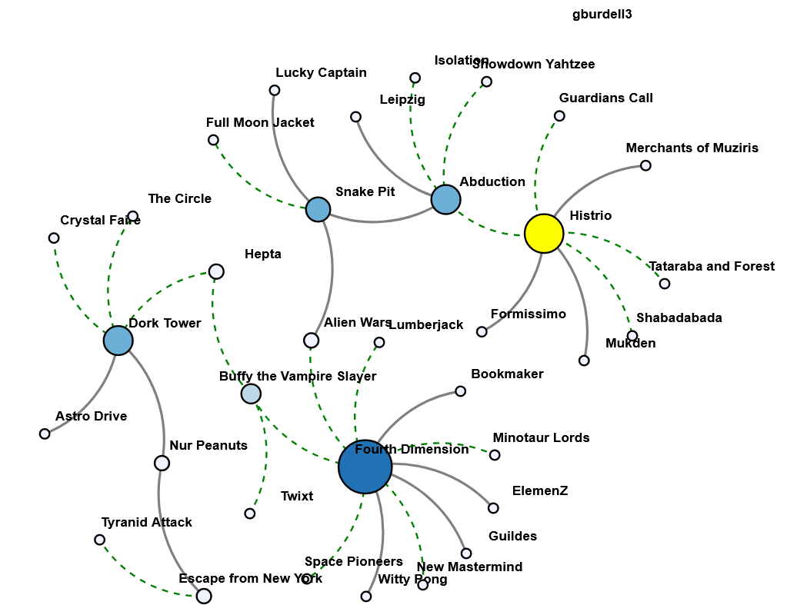

## Important Notes

1. Submit your work by the due date on the course schedule.

    a. Every assignment has a 48-hour grace period. You may use it without asking us.

    b. Before the grace period expires, you may resubmit as many times as you need to.

    c. The grace period is a lenient buffer for resolving last minute issues. We do not recommend starting new work or modifying existing work during the grace period.

    d. TA assistance is not guaranteed during the grace period.

    e. Submissions during the grace period will display as "late" and will not incur a penalty.

    **f. We will not accept any submissions after the grace period.**

2. Always use the **most up-to-date assignment** (version number at the bottom right of this document).

3. You may discuss ideas with other students at the "whiteboard" level (e.g., how cross-validation works, use HashMap instead of array) and review any relevant materials online. However, **each student must write up and submit the student's own answers**.

4. All incidents of suspected dishonesty, plagiarism, or violations of the Georgia Tech Honor Code will be subject to the institute's Academic Integrity procedures, directly handled by the Office of Student Integrity (OSI). Consequences can be severe, e.g., academic probation or dismissal, a 0 grade for assignments concerned, and prohibition from withdrawing from the class**.**

## Submission Instructions

## Q1 [25 points] Designing a good table. Visualizing data with Tableau.

| Goal         | Design a table, a grouped bar chart, and a stacked bar chart with filters in Tableau. |
| ------------ | ------------------------------------------------------------ |
| Technology   | Tableau Desktop                                              |
| Deliverables | **Gradescope:** After selecting HW2 - Q1, click **Submit Images**. You will be taken to a list of questions for your assignment. Click **Select Images** and submit the following four PNG images under the corresponding questions: - **table.png**: Image/screenshot of the table in Q1.a - **grouped_barchart.png**: Image of the chart in Q1.b - **stacked_barchart_1.png**: Image of the chart in Q1.c after filtering data for Max.Players = 2 - **stacked_barchart_2.png**: Image of the chart in Q1.c after filtering data for Max.Players = 4 **Q1 will be manually graded after the grace period.** |

### Setting Up Tableau

Install and activate Tableau Desktop by following “HW2 Instructions” on Canvas. The product activation key is for your use in this course only. **Do not share the key with anyone.** If you already have Tableau Desktop installed on your machine, you may use this key to reactivate it.

If you do not have access to a Mac or Windows machine, use the 14-day trial version of *Tableau Online*:

1. Visit https://www.tableau.com/trial/tableau-online
2. Enter your information (name, email, GT details, etc.)
3. You will then receive an email to access your Tableau Online site
4. Go to your site and create a workbook

If neither of the above methods work, use Tableau for Students**.** Follow the link and select "Get Tableau For Free". You should be able to receive an activation key which offers you a one-year use of Tableau Desktop at no cost by providing a valid Georgia Tech email.

### Connecting to Data

1. It is optional to use Tableau for Q1a. Otherwise, complete all parts using **a single Tableau workbook**.

2. Q1 will require connecting Tableau to two different data sources. You can connect to multiple data sources within one workbook by following the directions here.

3. For Q1a and Q1b:

    a. Open Tableau and connect to a data source. Choose To a File – **Text file**. Select the **popular_board_game.csv** file from the skeleton.

    b. Click on the graph area at the bottom section next to "Data Source" to create worksheets.

4. For Q1c:

    a. You will need a *data.world* account to access the data for Q1c. Add a new data source by clicking on Data – **New Data Source**.

    b. When connecting to a data source, choose To a Server – **Web Data Connector**.

    c. Enter this URL to connect to the data.world data set on board games. You may be prompted to log in to *data-world* and authorize Tableau. If you haven’t used data.world before, you will be required to create an account by clicking “Join Now”. Do not edit the provided SQL query.

    **NOTE:** If you cannot connect to *data-world*, you can use the provided csv files for Q1 in the skeleton. The provided csv files are identical to those hosted online and can be loaded directly into Tableau.

    d. Click the graph area at the bottom section to create another worksheet, and Tableau will automatically create a data extract.

### Table and Chart Design

a.  **[5 points] Good table design.** Visualize the data contained in *popular_board_game.csv a*s a data table (known as a text table in Tableau). In this part (Q1a), you can use any tool (e.g., Excel, HTML, Pandas, Tableau) to create the table.

We are interested in grouping popular games into "support solo" (min player = 1) and "not support solo" (min player > 1). Your table should clearly communicate information about these two groups simultaneously. For each group (Solo Supported, Solo Not Supported), show:

1. Total number of games in each category (fighting, economic, ...)
2. In each category, the game with the highest number of ratings. If more than one game has the same (highest) number of ratings, pick the game you prefer. **NOTE:** Level of Detail expressions may be useful if you use Tableau.

3. Average rating of games in each category (use simple average), rounded to 2 decimal places.
4. Average playtime of games in each category, rounded to 2 decimal places.
5. In the bottom left corner below your table, include your GT username (In Tableau, this can be done by including a caption when exporting an image of a worksheet or by adding a text box to a dashboard. If you use Tableau, refer to the tutorial here).
6. Save the table as **table.png**. (If you use Tableau, go to Worksheet/Dashboard -> Export -> Image). **NOTE**: Do not take screenshots in Tableau since your image must have high resolution. You can take a screenshot If you use HTML, Pandas, etc.

Your learning goal here is to practice good table design, which is not strongly dependent on the tool that you use. Thus, we do not require that you use Tableau in this part. You may decide the most meaningful column names, the number of columns, and the column order. You are not limited to only the techniques described in the lecture. For OMS students, the lecture video on this topic is *Week 4 - Fixing Common Visualization Issues - Fixing Bar Charts, Line Charts*. For campus students, review lecture slides 43 and 44.

b. **[10 points] Grouped bar chart.** Visualize *popular_board_game.csv* as a grouped bar chart in Tableau. Your chart should display game category (e.g., fighting, economic,...) along the horizontal axis and game count along the vertical axis. Show game playtime (e.g., <=30, (30, 60]) for each category. **NOTE:** Do not differentiate between “support solo” and “non-support solo” for this question.

1. Design a vertically grouped bar chart. For each category, show the game count for each playtime.
2. Include clearly labeled axes, a clear chart title, and a legend.
3. In the bottom left corner of your image, include your GT username. **NOTE:** In Tableau, this can be done by including a caption when exporting an image of a worksheet or by adding a text box to a dashboard. Refer to the tutorial here.
4. **Save the chart as grouped_barchart.png (**go to Worksheet/Dashboard -> Export -> Image. **NOTE**: Do not take screenshots in Tableau since your image must have high resolution.

The main goal here is for you to get familiarized with Tableau. Thus, we kept this open-ended, so you can practice making design decisions. **We will accept most designs.** We show one possible design in Figure 1b, based on the tutorial from Tableau.

## Q2 [15 points] Force-directed graph layout

| Goal              | Create a network graph shows relationships between games in D3. Use interactive features like pinning nodes to give the viewer some control over the visualization. |
| ----------------- | ------------------------------------------------------------ |
| Technology        | D3 Version 5 (included in the lib folder)  Chrome v92.0 (or higher): the browser for grading your code Python http server (for local testing) |
| Allowed Libraries | D3 library is provided to you in the **lib** folder. You must **NOT** use any D3 libraries (d3*.js) other than the ones provided. On Gradescope, these libraries are provided for you in the auto-grading environment. |
| Deliverables      | [Gradescope] Q2**.(html/js/css)**: The HTML, JavaScript, CSS to render the graph. Do not include the D3 libraries or board_games.csv dataset. |

You will experiment with many aspects of D3 for graph visualization. To help you get started, we have provided the Q2.html file (in the Q2 folder) and an undirected graph dataset of boardgames, board_games.csv file (in the Q2 folder). The dataset for this question was inspired by a reddit post about visualizing boardgames as a network, where the author calculates the similarity between board games based on categories and game mechanics where the edge value between each board game (node) is the total weighted similarity index. This dataset has been modified and simplified for this question and does not fully represent actual data found from the post. The provided Q2.html file will display a graph (network) in a web browser. The goal of this question is for you to experiment with the visual styling of this graph to make a more meaningful representation of the data. Here is a helpful resource (about graph layout) for this question.

**Note:** You can submit a single Q2.html that contains all the css and js components; or you can split Q2.html into Q2.html, Q2.css, and Q2.js.

a. **[2 points] Adding node labels**: Modify Q2.html to show the node label (the node name, e.g., the source) at the **top right** of each node in **bold**. If a node is dragged, its label must move with it.

b. **[3 points] Styling edges**: Style the edges based on the "value" field in the links array:

- If the value of the edge is equal to 0 (similar), the edge should be gray, thick, and **solid** (The dashed line with zero gap is not considered as solid).
- If the value of the edge is equal to 1 (not similar), the edge should be green, thin, and **dashed**.

c. **[3 points] Scaling nodes:**

1. **[1.5 points]** Scale the radius of each node in the graph based on the degree of the node (you may try linear or squared scale, but you are not limited to these choices).

    **Note:** Regardless of which scale you decide to use, you should avoid extreme node sizes, which will likely lead to low-quality visualization (e.g., nodes that are mere points, barely visible, or of huge sizes with overlaps).

    **Note:** D3 v5 does not support d.weight (which was the typical approach to obtain node degree in D3 v3). You may need to calculate node degrees yourself. Example relevant approach is here.

2. **[1.5 points]** The degree of each node should be represented by varying colors. Pick a meaningful color scheme (hint: color gradients). There should be at least 3 color gradations and it must be visually evident that the nodes with a higher degree use darker/deeper colors and the nodes with lower degrees use lighter colors. You can find example color gradients at Color Brewer.

d. **[6 points] Pinning nodes**:

1. **[2 points]** Modify the code so that dragging a node will fix (i.e., "pin") the node's position such that it

    will not be modified by the graph layout algorithm (Note: pinned nodes can be further dragged around by the user. Additionally, pinning a node should not affect the free movement of the other nodes). Node pinning is an effective interaction technique to help users spatially organize nodes during graph exploration. The D3 API for pinning nodes has evolved over time. We recommend reading this post when you work on this sub-question.

2. **[1 points]** Mark pinned nodes to visually distinguish them from unpinned nodes, i.e., show pinned nodes in a different color.

3. **[3 points]** Double clicking a pinned node should unpin (unfreeze) its position and unmark it. When a node is no longer pinned, it should move freely again.

**IMPORTANT:**

1. For part 1 to consistently pass the autograder (which tests that a dragged node becomes pinned and retains its position), you may need to increase the radius of the highly-weighted nodes and reduce their label sizes, so that the nodes can be more easily detected by the autograder's webdriver mouse cursor.
2. To avoid timeout errors on Gradescope, complete the double click function in part 3 before submitting.
3. If you receive timeout messages for all parts and your code works locally on your computer, verify that you are indeed using the appropriate ids provided in the "add the nodes" section in the skeleton code.
4. D3 v5 does not support the d.fixed method (it was deprecated after D3 v3). For our purposes, it is used as a Boolean value to indicate whether a node has been pinned or not.

e. **[1 points] Add GT username:** Add your Georgia Tech username (usually includes a mix of letters and numbers, e.g., gburdell3) to the top right corner of the force-directed graph (see example image). The GT username must be a `<text>` element having the id: "credit"

**Figure 2a:** Example of Visualization with pinned node (yellow). Your chart may appear different, and can earn full credit if it meets all the stated requirements.

## Q3 [15 points] Line Charts

## Question 1

There are 6 random people in a room. What is the probability that none of them share the same birthday?(Assume 365 days are equally likely.)

## Question 2

Consider a family that has 4 children. Assume that Pr(kid is a boy)= Pr(kid is a girl)= 1/2, and that the genders of the 4 kids are independent. What is the probability that all 4 kids are boys given that we know at least 3 of them are boys?

## Question 3

TRUE or FALSE? Randomly select one card from a standard deck of 52 cards. Suppose we define the event A to be that the selected card is a Diamond, and the event B is that the selected card is a Spade. Then A and B are independent.Note: A standard deck of playing cards contains a total of 52 cards of 4 types: 13 each of Spades, Clubs, Hearts, and Diamonds.

## Question 4

TRUE or FALSE? The function $F(x) = 1 - (1/5)e^{x/5}$ for $x \geq 0$ is a valid c.d.f.

## Question 5

If the random variable X has p.d.f. $f(x) = 2(1-x)$, for $0 \leq x \leq 1$,what is the distribution of the slightly nasty random variable $2X - X^2$?

A. Triangular

B. Gamma

C. Exponential

D. Normal

E. Uniform

## Question 6

Consider the discrete random variable X such that 
$$
P(X = x) = 
\begin{cases} 
0.5, & \text{if } x = -2 \\
0.2, & \text{if } x = 0.2 \\
0.3, & \text{if } x = 7 \\
0, & \text{otherwise}
\end{cases}
$$
Use the discrete version of the Inverse Transform method from class and the Unif(0, 1) pseudo-random number U = 0.99 to generate one observation X coming from this p.m.f

A. x=-2

B. X=0.2

C. x=3

D. x=7

## Question 7

Suppose that U and V are i.l.d. Unif(0, 1) random variables. How would you simulate the sum of two 6-sided dice tosses?

(a) 12U 

(b) ⌈12U⌉ 

(c) ⌈12V⌉ 

(d) ⌈6U⌉ + ⌈6V⌉

(e） Both (b) and (c)

(f) None of the above

## Question 8

Suppose that  $X \sim \text{Bern}(0.2)$. What is  $\text{Var}[X^{3.5}]$?

- [ ] 0.2
- [ ] $(0.2)^{3.5}$
- [ ] 5
- [ ] $5^{3.5}$
- [ ] $(0.2)(0.8)$

## Question 9

TRUE or FALSE? Let X denote the number of tails from two fair coin tosses. Then the probability mass function for $Y = X^2 - 1$ is 
$$
P(Y = y) = 
\begin{cases} 
1/4, & \text{if } y = -1 \\
1/2, & \text{if } y = 0 \\
1/4, & \text{if } y = 3
\end{cases}
$$
A. True

B. False

## Question 10

YES or NO? Suppose X and Y are random variables that have joint p.d.f.
$$
f(x, y) = c x^2 \ln(1 + y) \text{ for } 0 \leq x \leq 1 \text{ and } 0 \leq y \leq 1,
$$
where c is the constant that makes this integrate to 1. Are X and Y independent?

A. YES

B. NO

## Question 11

Suppose X and Y are two random variables for which the joint probability density function is given by 
$$
f(x, y) = 6e^{-x -2y} \text{ for } 0 < x < y < \infty
$$

What is the probability that $2Y > X$?

## Question 12

Suppose that X is a random variable with a mean of 6 and variance of 8; Y is a random variable with a mean of -10 and variance of 18; and $Cov(X, Y) = -8$ . Find $Corr(X,Y).$​

## Question 13

Given an exponential random variable $X~Exp(\lambda=1/180)$, what is the conditional probability $P(X > 100|X > 40)$?

- [ ] $e^{-1/3}$
- [ ] $e^{-2/9}$
- [ ] $e^{-1/9}$
- [ ] $e^{-1/18}$
- [ ] $1 - e^{-2/9}$

## Question 14

On a particular river, floods occur once every year on average. If the number of floods follows a Poisson distribution, calculate the probability of exactly 3 floods during a particular two-year period.

## Question 15

If $X_1, X_2, \ldots, X_{100}$ are i.i.d. \(Nor(300, 500)\), then what is the distribution of the sample mean $\bar{X}$?

A. Nor (3,0.05)

B. Nor(3,5)

C. Nor (3, 500)

D. Nor(300, 0.05)

E. Nor(300, 0.05)

F. Nor(300, 5)

## Question 16

Suppose $X_1, \ldots, X_{100}$ are i.i.d. from an $\text{Exp}(1)$ distribution. If we use the Central Limit Theorem approximation, what is  $P\left(\sum_{i=1}^{100} X_i < 97\right)$?

## Question 17

Suppose you approximating the solution of a simple differential equation involving the function f(x), and you appeal to the relation 
$$
f(x + h) \approx f(x) + h f'(x)
$$
，where h is some "small" number.

What is this method called?

A. Inverse Transform

B. LOTUS

C. Newton's Method

D. Bisection Method

E. Euler's Method

## Question 18

Consider a circle inscribed in a unit square (so that the circle has area $\pi/4$). We toss 1000 darts randomly into the square,and it turns out that 784 of those darts land in the circle.

Using the method described in class, estimate $\pi$​.

## Question 19

Suppose we use Monte Carlo integration to approximate

$I = \int_2^5 \ln(2x - 4) \, dx.$ If $U_1, U_2, \ldots, U_n$ are i.i.d. $\text{Unif}(0, 1)$ random numbers, which of the following is a good approximation $\hat{I}_n$ for $I$?

A. $\frac{1}{n} \sum_{i=1}^{n} \ln(6U_i)$

B. $\frac{3}{n} \sum_{i=1}^{n} \ln(6U_i)$

C. $\frac{1}{n} \sum_{i=1}^{n} \ln(6U_i - 4)$

D. $\frac{3}{n} \sum_{i=1}^{n} \ln(6U_i - 4)$

E. $\frac{6}{n} \sum_{i=1}^{n} \ln(6U_i - 2)$​

## Question 23

TRUE or FALSE? As crazy as it sounds, the Unif (0, 1) random numbers generated on a computer are actually deterministic!

A. True

B. False

验算上面的答案

::: details 公众号：AI悦创【二维码】

:::

::: info AI悦创·编程一对一

AI悦创·推出辅导班啦，包括「Python 语言辅导班、C++ 辅导班、java 辅导班、算法/数据结构辅导班、少儿编程、pygame 游戏开发、Web、Linux」，全部都是一对一教学：一对一辅导 + 一对一答疑 + 布置作业 + 项目实践等。当然，还有线下线上摄影课程、Photoshop、Premiere 一对一教学、QQ、微信在线，随时响应！微信：Jiabcdefh

C++ 信息奥赛题解，长期更新！长期招收一对一中小学信息奥赛集训，莆田、厦门地区有机会线下上门，其他地区线上。微信：Jiabcdefh

方法一：[QQ](http://wpa.qq.com/msgrd?v=3&uin=1432803776&site=qq&menu=yes)

方法二：微信：Jiabcdefh

:::

