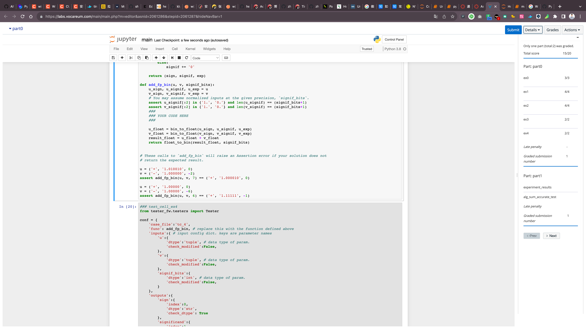
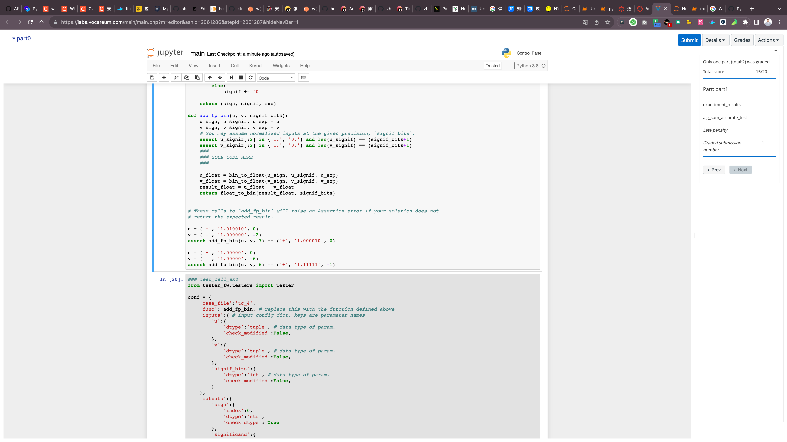

::: center

# Part 0: Representing numbers as strings

### 第0部分：将数字表示为字符串

:::

The following exercises are designed to reinforce your understanding of how we can view the encoding of a number as string of digits in a given base.

> 以下练习旨在加强您对如何在给定的进制中查看数字编码为数字字符串的理解。

> If you are interested in exploring this topic in more depth, see the ["Floating-Point Arithmetic" section](https://docs.python.org/3/tutorial/floatingpoint.html) of the Python documentation.
>
> 如果您对深入探讨此主题感兴趣，请参阅Python文档中的["浮点数运算"部分](https://docs.python.org/3/tutorial/floatingpoint.html)。

## Integers as strings

Consider the string of digits:

```python
    '16180339887'
```

If you are told this string is for a decimal number, meaning the base of its digits is ten (10), then its value is given by

$$
[\![ \mathtt{16180339887} ]\!]_{10} = (1 \times 10^{10}) + (6 \times 10^9) + (1 \times 10^8) + \cdots + (8 \times 10^1) + (7 \times 10^0) = 16,\!180,\!339,\!887.
$$

Similarly, consider the following string of digits:

```python
    '100111010'
```

If you are told this string is for a binary number, meaning its base is two (2), then its value is

$$
    [\![ \mathtt{100111010} ]\!]_2 = (1 \times 2^8) + (1 \times 2^5) + \cdots + (1 \times 2^1).
$$

(What is this value?)

And in general, the value of a string of $d+1$ digits in base $b$ is,

$$
  [\![ s_d s_{d-1} \cdots s_1 s_0 ]\!]_b = \sum_{i=0}^{d} s_i \times b^i.
$$

**Bases greater than ten (10).** Observe that when the base at most ten, the digits are the usual decimal digits, `0`, `1`, `2`, ..., `9`. What happens when the base is greater than ten? For this notebook, suppose we are interested in bases that are at most 36; then, we will adopt the convention of using lowercase Roman letters, `a`, `b`, `c`, ..., `z` for "digits" whose values correspond to 10, 11, 12, ..., 35.

::: details zh

## 字符串表示的整数

考虑以下数字字符串：

```python
    '16180339887'
```

如果你被告知这个字符串表示一个十进制数，也就是说它的基数是十（10），那么其值为

$$
    [\![ \mathtt{16180339887} ]\!]_{10} = (1 \times 10^{10}) + (6 \times 10^9) + (1 \times 10^8) + \cdots + (8 \times 10^1) + (7 \times 10^0) = 16,\!180,\!339,\!887.
$$

同样，考虑以下数字字符串：

```python
    '100111010'
```

如果你被告知这个字符串表示一个二进制数，也就是说它的基数是二（2），那么其值为

$$
    [\![ \mathtt{100111010} ]\!]_2 = (1 \times 2^8) + (1 \times 2^5) + \cdots + (1 \times 2^1).
$$

（这个值是多少？）

总的来说，一个基数为$b$的$d+1$位数字符串的值是：

$$
  [\![ s_d s_{d-1} \cdots s_1 s_0 ]\!]_b = \sum_{i=0}^{d} s_i \times b^i.
$$

**大于十（10）的基数。** 注意当基数最大为十时，其数字是常见的十进制数字，`0`、`1`、`2`、...、`9`。当基数大于十时会怎样呢？在这个笔记本中，假设我们只关心最大为36的基数；那么，我们将采用使用小写罗马字母，`a`、`b`、`c`、...、`z` 来代表其值分别为10、11、12、...、35的"数字"。

:::

## **Exercise 0** (3 points)

Write a function, `eval_strint(s, base)`. It takes a string of digits `s` in the base given by `base`. It returns its value as an integer.

That is, this function implements the mathematical object, $[\![ s ]\!]_b$, which would convert a string $s$ to its numerical value, assuming its digits are given in base $b$. For example:

```python
    eval_strint('100111010', base=2) == 314
```

> Hint: Python makes this exercise very easy. Search Python's online documentation for information about the `int()` constructor to see how you can apply it to solve this problem. (You have encountered this constructor already, in Notebook/Assignment 2.)

::: details zh

翻译如下：

## **练习 0** (3 分)

编写一个函数，`eval_strint(s, base)`。它接受一个以 `base` 为基数的数字字符串 `s`。函数应返回其作为整数的值。

也就是说，此函数实现了数学对象 $[\![ s ]\!]_b$，该对象将字符串 $s$ 转换为其数值，假设其数字是以基数 $b$ 给出的。例如：

```python
    eval_strint('100111010', base=2) == 314
```

> 提示：Python 使这个练习变得非常简单。查阅 Python 的在线文档，了解有关 `int()` 构造函数的信息，看看如何应用它来解决此问题。（你已经在 Notebook/Assignment 2 中遇到过这个构造函数。）

:::
The demo included in the solution cell below should display the following output:

```python
eval_strint('6040', 8) -> 3104
eval_strint('deadbeef', 16) -> 3735928559
eval_strint('4321', 5) -> 586
```
**Note**: This demo calls your function 3 times.

```python
### Exercise 0 solution
def eval_strint(s, base=2):
    assert type(s) is str
    assert 2 <= base <= 36
    ###
    ### YOUR CODE HERE
    ###
    
### demo function call
print(f"eval_strint('6040', 8) -> {eval_strint('6040', 8)}")
print(f"eval_strint('deadbeef', 16) -> {eval_strint('deadbeef', 16)}")
print(f"eval_strint('4321', 5) -> {eval_strint('4321', 5)}")
```

```python
eval_strint('6040', 8) -> None
eval_strint('deadbeef', 16) -> None
eval_strint('4321', 5) -> None
```

The cell below will test your solution for Exercise 0. The testing variables will be available for debugging under the following names in a dictionary format.
- `input_vars` - Input variables for your solution. 
- `original_input_vars` - Copy of input variables from prior to running your solution. These _should_ be the same as `input_vars` - otherwise the inputs were modified by your solution.
- `returned_output_vars` - Outputs returned by your solution.
- `true_output_vars` - The expected output. This _should_ "match" `returned_output_vars` based on the question requirements - otherwise, your solution is not returning the correct output. 

::: details

翻译成中文为：

下面的单元格将测试你为练习0提供的解决方案。测试变量将以字典格式可用于调试，以下是名称：

- `input_vars` - 你的解决方案的输入变量。
- `original_input_vars` - 在运行解决方案之前的输入变量的副本。这些 _应该_ 与 `input_vars` 相同 - 否则意味着你的解决方案修改了输入。
- `returned_output_vars` - 你的解决方案返回的输出。
- `true_output_vars` - 预期的输出。这 _应该_ 基于问题要求与 `returned_output_vars` "匹配" - 否则，你的解决方案没有返回正确的输出。

:::

```python
### test_cell_ex0

from tester_fw.testers import Tester

conf = {
    'case_file':'tc_0', 
    'func': eval_strint, # replace this with the function defined above
    'inputs':{ # input config dict. keys are parameter names
        's':{
            'dtype':'str', # data type of param.
            'check_modified':True,
        },
        'base':{
            'dtype':'int', # data type of param.
            'check_modified':False,
        }
    },
    'outputs':{
        'output_0':{
            'index':0,
            'dtype':'int',
            'check_dtype': True,
        }
    }
}
tester = Tester(conf, key=b'5-YWQCrNnF3Ml5qmSo2ksFUYNZ0P3yFcpeSKtQFaULk=', path='resource/asnlib/publicdata/')
for _ in range(70):
    try:
        tester.run_test()
        (input_vars, original_input_vars, returned_output_vars, true_output_vars) = tester.get_test_vars()
    except:
        (input_vars, original_input_vars, returned_output_vars, true_output_vars) = tester.get_test_vars()
        raise
print('Passed! Please submit.')
```

### Solution 0

::: tabs

@tab 1

根据题目描述，可以使用 Python 的 `int()` 构造函数来实现。这是一个简单的实现：

```python
def eval_strint(s, base):
    return int(s, base)

# 测试示例
print(eval_strint('100111010', base=2))  # 输出 314
```

如上面的代码所示，`int()` 函数可以接受两个参数：要转换的字符串和该字符串的基数。它会返回对应基数的整数值。

@tab 2

根据给定的描述，我们可以构建 `eval_strint(s, base)` 函数。在 Python 中，使用内置的 `int()` 函数可以直接完成这一任务，因为它支持多种进制转换。不过，为了完全展示这一过程，我们也可以手动实现该函数。下面，我将首先使用 `int()` 的简便方法，然后为你提供一个手动实现的版本。

### 使用 `int()` 的方法

```python
def eval_strint(s, base):
    return int(s, base)
```

### 手动实现

手动实现涉及到解析每个字符，然后乘以其对应的权重。

```python
def eval_strint_manual(s, base):
    # 定义一个查找表，用于将字符映射到其对应的值
    char_to_value = {str(i): i for i in range(10)}
    for i, char in enumerate('abcdefghijklmnopqrstuvwxyz'):
        char_to_value[char] = 10 + i
        
    # 计算字符串 s 的值
    value = 0
    for i, char in enumerate(reversed(s)):
        value += char_to_value[char] * (base ** i)
        
    return value
```

以下是一些使用上述函数的例子：

```python
print(eval_strint('100111010', 2))  # 输出：314
print(eval_strint_manual('100111010', 2))  # 输出：314
print(eval_strint('16180339887', 10))  # 输出：16180339887
print(eval_strint_manual('16180339887', 10))  # 输出：16180339887
print(eval_strint('a', 16))  # 输出：10 (十六进制中的 'a' 等于十进制中的 10)
print(eval_strint_manual('a', 16))  # 输出：10
```

你可以使用上述代码验证两个函数的正确性，并查看它们的输出是否匹配预期。

@tab 3

了解你的需求后，我们可以调整 `eval_strint` 函数并提供所需的演示和测试模板。我会采用 Python 内置的 `int()` 函数实现这个转换，因为它非常直接并且符合题目的提示。

```python
### Exercise 0 solution

def eval_strint(s, base=2):
    assert type(s) is str
    assert 2 <= base <= 36
    
    return int(s, base)

### demo function call

print(f"eval_strint('6040', 8) -> {eval_strint('6040', 8)}")
print(f"eval_strint('deadbeef', 16) -> {eval_strint('deadbeef', 16)}")
print(f"eval_strint('4321', 5) -> {eval_strint('4321', 5)}")
```

根据题目的要求，上述代码应该返回以下的输出：

```
eval_strint('6040', 8) -> 3104
eval_strint('deadbeef', 16) -> 3735928559
eval_strint('4321', 5) -> 586
```

为了真正的测试，你可以在一个专用的测试单元中进行，确保输入、输出等都正确地对待。这个测试单元可以设计成对比函数输出和预期输出，以验证你的解决方案是否正确。

@tab 4

了解，不使用 `int()` 函数来实现的话，我们需要手动计算每个字符的权重并累加。

以下是基于此思路的实现：

```python
### Exercise 0 solution

def eval_strint(s, base=2):
    assert type(s) is str
    assert 2 <= base <= 36
    
    # 定义一个查找表，用于将字符映射到其对应的值
    char_to_value = {str(i): i for i in range(10)}
    for i, char in enumerate('abcdefghijklmnopqrstuvwxyz'):
        char_to_value[char] = 10 + i
        
    # 计算字符串 s 的值
    value = 0
    for i, char in enumerate(reversed(s)):
        value += char_to_value[char] * (base ** i)
        
    return value

### demo function call

print(f"eval_strint('6040', 8) -> {eval_strint('6040', 8)}")
print(f"eval_strint('deadbeef', 16) -> {eval_strint('deadbeef', 16)}")
print(f"eval_strint('4321', 5) -> {eval_strint('4321', 5)}")
```

这个实现遍历了字符串 `s` 中的每一个字符，根据给定的基数 `base` 计算了每个字符的权重，然后将所有的权重累加起来，从而得到了整数值。

:::

## Fractional values

Recall that we can extend the basic string representation to include a fractional part by interpreting digits to the right of the "fractional point" (i.e., "the dot") as having negative indices. For instance,

$$
    [\![ \mathtt{3.14} ]\!]_{10} = (3 \times 10^0) + (1 \times 10^{-1}) + (4 \times 10^{-2}).
$$

Or, in general,

$$
  [\![ s_d s_{d-1} \cdots s_1 s_0 \, \underset{\Large\uparrow}{\Huge\mathtt{.}} \, s_{-1} s_{-2} \cdots s_{-r} ]\!]_b = \sum_{i=-r}^{d} s_i \times b^i.
$$

## Exercise 1 (4 points)

Suppose a string of digits `s` in base `base` contains up to one fractional point. Complete the function, `eval_strfrac(s, base)`, so that it returns its corresponding floating-point value.

Your function should *always* return a value of type `float`, even if the input happens to correspond to an exact integer.

Examples:

```python
    eval_strfrac('3.14', base=10) ~= 3.14
    eval_strfrac('100.101', base=2) == 4.625
    eval_strfrac('2c', base=16) ~= 44.0   # Note: Must be a float even with an integer input!
```

> _Comment._ Because of potential floating-point roundoff errors, as explained in the videos, conversions based on the general polynomial formula given previously will not be exact. The testing code will include a built-in tolerance to account for such errors.
>
> _Hint._ You should be able to construct a solution that reuses the function, `eval_strint()`, from Exercise 0.

::: details zh

翻译如下：

## 分数值

回想一下，我们可以通过解释"小数点"（即"点"）右边的数字为负指数来扩展基本的字符串表示以包括一个小数部分。例如，

$$
    [\![ \mathtt{3.14} ]\!]_{10} = (3 \times 10^0) + (1 \times 10^{-1}) + (4 \times 10^{-2}).
$$

或者，更一般地说，

$$
  [\![ s_d s_{d-1} \cdots s_1 s_0 \, \underset{\Large\uparrow}{\Huge\mathtt{.}} \, s_{-1} s_{-2} \cdots s_{-r} ]\!]_b = \sum_{i=-r}^{d} s_i \times b^i.
$$

## **练习 1** (4 分) 
假设一个数字字符串 `s` 在基数 `base` 中包含至多一个小数点。完成函数 `eval_strfrac(s, base)`，使其返回相应的浮点数值。

你的函数应该*始终*返回一个 `float` 类型的值，即使输入恰好对应于一个确切的整数。

示例：

```python
    eval_strfrac('3.14', base=10) ~= 3.14
    eval_strfrac('100.101', base=2) == 4.625
    eval_strfrac('2c', base=16) ~= 44.0   # 注意：即使输入是整数，也必须是浮点数！
```

> _评论_：由于可能的浮点舍入误差，正如视频中解释的那样，基于之前给出的一般多项式公式的转换将不会是精确的。测试代码将包括一个内置的容忍度来考虑这样的错误。
>
> _提示_：你应该能够构建一个解决方案，该解决方案重用了练习 0 中的函数 `eval_strint()`。

:::

The demo included in the solution cell below should display the following output:

```
eval_strfrac('3.14', base=10) -> 3.14
eval_strfrac('100.101', base=2) -> 4.625
eval_strfrac('2c', base=16) -> 44.0
```
**Note**: This demo calls your function 3 times.

```python
### Exercise 1 solution
def eval_strfrac(s, base=2):    
    ###
    ### YOUR CODE HERE
    ###
    
### demo function call
print(f"eval_strfrac('3.14', base=10) -> {eval_strfrac('3.14', base=10)}") 
print(f"eval_strfrac('100.101', base=2) -> {eval_strfrac('100.101', base=2)}")
print(f"eval_strfrac('2c', base=16) -> {eval_strfrac('2c', base=16)}")
```

The cell below will test your solution for Exercise 1. The testing variables will be available for debugging under the following names in a dictionary format.
- `input_vars` - Input variables for your solution. 
- `original_input_vars` - Copy of input variables from prior to running your solution. These _should_ be the same as `input_vars` - otherwise the inputs were modified by your solution.
- `returned_output_vars` - Outputs returned by your solution.
- `true_output_vars` - The expected output. This _should_ "match" `returned_output_vars` based on the question requirements - otherwise, your solution is not returning the correct output. 

```python
### test_cell_ex1
from tester_fw.testers import Tester

conf = {
    'case_file':'tc_1', 
    'func': eval_strfrac, 
    'inputs':{ 
        's':{
            'dtype':'str', 
            'check_modified':True,
        },
        'base':{
            'dtype':'int', 
            'check_modified':False,
        }
    },
    'outputs':{
        'output_0':{
            'index':0,
            'dtype':'float',
            'check_dtype': True,
            'float_tolerance': 10 ** (-7)
        }
    }
}
tester = Tester(conf, key=b'5-YWQCrNnF3Ml5qmSo2ksFUYNZ0P3yFcpeSKtQFaULk=', path='resource/asnlib/publicdata/')
for _ in range(70):
    try:
        tester.run_test()
        (input_vars, original_input_vars, returned_output_vars, true_output_vars) = tester.get_test_vars()
    except:
        (input_vars, original_input_vars, returned_output_vars, true_output_vars) = tester.get_test_vars()
        raise

print('Passed! Please submit.')
```

### Solution 1

::: tabs

@tab 1

要解决这个问题，我们可以先将字符串`s`分成整数部分和小数部分，然后分别使用 `eval_strint` 函数计算每部分的值，并将它们相加。

以下是如何实现的：

```python
def eval_strint(s, base=2):
    assert type(s) is str
    assert 2 <= base <= 36
    
    char_to_value = {str(i): i for i in range(10)}
    for i, char in enumerate('abcdefghijklmnopqrstuvwxyz'):
        char_to_value[char] = 10 + i
        
    value = 0
    for i, char in enumerate(reversed(s)):
        value += char_to_value[char] * (base ** i)
        
    return value

def eval_strfrac(s, base=2):    
    # 检查输入是否包含小数点，并根据小数点分隔整数部分和小数部分
    if '.' in s:
        int_part, frac_part = s.split('.')
    else:
        int_part = s
        frac_part = ''

    # 计算整数部分和小数部分的值
    int_value = eval_strint(int_part, base)
    frac_value = eval_strint(frac_part, base) / (base ** len(frac_part))

    return float(int_value + frac_value)

### demo function call
print(f"eval_strfrac('3.14', base=10) -> {eval_strfrac('3.14', base=10)}") 
print(f"eval_strfrac('100.101', base=2) -> {eval_strfrac('100.101', base=2)}")
print(f"eval_strfrac('2c', base=16) -> {eval_strfrac('2c', base=16)}")
```

上面的代码首先检查输入字符串 `s` 是否包含小数点。如果有，它将字符串分为整数部分和小数部分。接下来，我们使用 `eval_strint` 函数分别计算整数部分和小数部分的值，并最终将它们相加以得到最终的浮点数值。

@tab 2

当然可以。你提到的 `char_to_value` 字典映射的构建是一个典型的用例，我们有多种方法可以实现这个映射。以下是几种不同的方法：

1. **使用字典合并**:
    ```python
    digits = {str(i): i for i in range(10)}
    letters = {char: 10 + i for i, char in enumerate('abcdefghijklmnopqrstuvwxyz')}
    char_to_value = {**digits, **letters}
    ```

2. **使用 `dict.update()` 方法**:
    ```python
    char_to_value = {str(i): i for i in range(10)}
    letters = {char: 10 + i for i, char in enumerate('abcdefghijklmnopqrstuvwxyz')}
    char_to_value.update(letters)
    ```

3. **使用链式的 `itertools.chain()`**:
    ```python
    from itertools import chain
    
    digits = ((str(i), i) for i in range(10))
    letters = ((char, 10 + i) for i, char in enumerate('abcdefghijklmnopqrstuvwxyz'))
    char_to_value = dict(chain(digits, letters))
    ```

4. **使用一个循环**:
    ```python
    char_to_value = {}
    for i in range(10):
        char_to_value[str(i)] = i
    for i, char in enumerate('abcdefghijklmnopqrstuvwxyz'):
        char_to_value[char] = 10 + i
    ```

以上给出了几种不同的方法，根据你的喜好和特定的应用场景，你可以选择其中最合适的一种。

:::

## Floating-point encodings

Recall that a floating-point encoding or format is a normalized scientific notation consisting of a _base_, a _sign_, a fractional _significand_ or _mantissa_, and a signed integer _exponent_. Conceptually, think of it as a tuple of the form, $(\pm, [\![s]\!]_b, x)$, where $b$ is the digit base (e.g., decimal, binary); $\pm$ is the sign bit; $s$ is the significand encoded as a base $b$ string; and $x$ is the exponent. For simplicity, let's assume that only the significand $s$ is encoded in base $b$ and treat $x$ as an integer value. Mathematically, the value of this tuple is $\pm \, [\![s]\!]_b \times b^x$.

::: details zh

## 浮点数编码

回想一下，浮点数编码或格式是一个标准的科学记数法，它由一个 _基数_、一个 _符号_、一个小数 _有效数字_ 或 _尾数_，以及一个有符号的整数 _指数_ 组成。从概念上讲，把它看作是一个形式为 $(\pm, [\![s]\!]_b, x)$ 的元组，其中 $b$ 是数字基数（例如，十进制、二进制）；$\pm$ 是符号位；$s$ 是以基数 $b$ 编码的尾数；而 $x$ 是指数。为了简单起见，我们假设只有尾数 $s$ 是以基数 $b$ 编码的，并将 $x$ 视为一个整数值。数学上，这个元组的值为 $\pm \, [\![s]\!]_b \times b^x$。

:::

**IEEE double-precision.** For instance, Python, R, and MATLAB, by default, store their floating-point values in a standard tuple representation known as _IEEE double-precision format_. It's a 64-bit binary encoding having the following components:

- The most significant bit indicates the sign of the value.
- The significand is a 53-bit string with an _implicit_ leading one. That is, if the bit string representation of $s$ is $s_0 . s_1 s_2 \cdots s_d$, then $s_0=1$ always and is never stored explicitly. That also means $d=52$.
- The exponent is an 11-bit string and is treated as a signed integer in the range $[-1022, 1023]$.

Thus, the smallest positive value in this format $2^{-1022} \approx 2.23 \times 10^{-308}$, and the smallest positive value greater than 1 is $1 + \epsilon$, where $\epsilon=2^{-52} \approx 2.22 \times 10^{-16}$ is known as _machine epsilon_ (in this case, for double-precision).

::: details zh

**IEEE 双精度**。例如，Python、R 和 MATLAB 默认将其浮点值存储在一个称为 _IEEE 双精度格式_ 的标准元组表示中。它是一个64位二进制编码，具有以下组件：

- 最重要的位表示值的符号。
- 尾数是一个53位的字符串，其前导数字_隐式地_为一。也就是说，如果 $s$ 的位字符串表示为 $s_0 . s_1 s_2 \cdots s_d$，那么 $s_0=1$ 总是成立的，并且从不明确地存储。这也意味着 $d=52$。
- 指数是一个11位的字符串，并被视为范围在 $[-1022, 1023]$ 之间的有符号整数。

因此，这种格式的最小正值为 $2^{-1022} \approx 2.23 \times 10^{-308}$，大于1的最小正值为 $1 + \epsilon$，其中 $\epsilon=2^{-52} \approx 2.22 \times 10^{-16}$ 被称为 _机器 epsilon_（在这种情况下，是双精度）。

:::

**Special values.** You might have noticed that the exponent is slightly asymmetric. Part of the reason is that the IEEE floating-point encoding can also represent several kinds of special values, such as infinities and an odd bird called "not-a-number" or `NaN`. This latter value, which you may have seen if you have used any standard statistical packages, can be used to encode certain kinds of floating-point exceptions that result when, for instance, you try to divide zero by zero.

> If you are familiar with languages like C, C++, or Java, then IEEE double-precision format is the same as the `double` primitive type. The other common format is single-precision, which is `float` in those same languages.

::: details zh

**特殊值。** 你可能已经注意到，指数有些不对称。部分原因是IEEE浮点数编码还可以表示几种特殊值，如无穷大以及一个被称为“非数字”的奇怪值，或者叫做 `NaN`。如果你曾使用过任何标准的统计软件包，你可能已经看到过这个值。当你试图用零除以零时，可能会出现这种浮点异常，此时可以用该值来编码这种异常。

> 如果你熟悉C、C++或Java这样的语言，那么IEEE双精度格式与这些语言中的 `double` 原始类型是相同的。另一种常见格式是单精度，它在这些语言中被称为 `float`。

:::

```python
def print_fp_hex(v):
    assert type(v) is float
    print("v = {} ==> v.hex() == '{}'".format(v, v.hex()))
    
print_fp_hex(0.0)
print_fp_hex(1.0)
print_fp_hex(16.0625)
print_fp_hex(-0.1)
```

**Inspecting a floating-point number in Python.** Python provides support for looking at floating-point values directly! Given any floating-point variable, `v` (that is, `type(v) is float`), the method `v.hex()` returns a string representation of its encoding. It's easiest to see by example, so run the following code cell:

::: details zh

**在Python中检查浮点数。** Python提供了直接查看浮点值的支持！给定任何浮点变量 `v`（即 `type(v) is float`），方法 `v.hex()` 返回其编码的字符串表示。通过示例最容易看出，所以运行以下代码单元：

:::

Observe that the format has these properties:
* If `v` is negative, the first character of the string is `'-'`.
* The next two characters are always `'0x'`.
* Following that, the next characters up to but excluding the character `'p'` is a fractional string of hexadecimal (base-16) digits. In other words, this substring corresponds to the significand encoded in base-16.
* The `'p'` character separates the significand from the exponent. The exponent follows, as a signed integer (`'+'` or `'-'` prefix). Its implied base is two (2)---**not** base-16, even though the significand is.

Thus, to convert this string back into the floating-point value, you could do the following:
* Record the sign as a value, `v_sign`, which is either +1 or -1.
* Convert the significand into a fractional value, `v_signif`, assuming base-16 digits.
* Extract the exponent as a signed integer value, `v_exp`.
* Compute the final value as `v_sign * v_signif * (2.0**v_exp)`.

For example, here is how you can get 16.025 back from its `hex()` representation, `'0x1.0100000000000p+4'`:

::: details zh

观察这种格式具有以下特性：
* 如果 `v` 是负数，字符串的第一个字符是 `'-'`。
* 接下来的两个字符始终是 `'0x'`。
* 之后，直到但不包括字符 `'p'` 的下一个字符都是十六进制（基数为16）的小数字符串。换句话说，这个子字符串对应于以base-16编码的尾数。
* 字符 `'p'` 分隔了尾数和指数。接下来是一个带符号的整数作为指数（前缀为 `'+'` 或 `'-'`）。它隐含的基数是2——**不是**基数16，尽管尾数是。

因此，要将这个字符串转换回浮点值，你可以执行以下操作：
* 记录符号为一个值，`v_sign`，它可以是+1或-1。
* 假设基数为16的数字，将尾数转换为一个小数值，`v_signif`。
* 提取指数作为一个带符号的整数值，`v_exp`。
* 计算最终值为 `v_sign * v_signif * (2.0**v_exp)`。

例如，以下是如何从其 `hex()` 表示，`'0x1.0100000000000p+4'`，恢复16.025的方法：

:::

```python
# Recall: v = 16.0625 ==> v.hex() == '0x1.0100000000000p+4'
print((+1.0) * eval_strfrac('1.0100000000000', base=16) * (2**4))
```


## Exercise 2 - (**4** Points): 
Write a function, `fp_bin(v)`, that determines the IEEE-754 tuple representation of any double-precision floating-point value, `v`. That is, given the variable `v` such that `type(v) is float`, it should return a tuple with three components, `(s_sign, s_signif, v_exp)` such that

* `s_sign` is a string representing the sign bit, encoded as either a `'+'` or `'-'` character;
* `s_signif` is the significand, which should be a string of 54 bits having the form, `x.xxx...x`, where there are (at most) 53 `x` bits (0 or 1 values);
* `v_exp` is the value of the exponent and should be an _integer_.

For example:

```python
    v = -1280.03125
    assert v.hex() == '-0x1.4002000000000p+10'
    assert fp_bin(v) == ('-', '1.0100000000000010000000000000000000000000000000000000', 10)
```

> There are many ways to approach this problem. One we came up exploits the observation that $[\![\mathtt{0}]\!]_{16} == [\![\mathtt{0000}]\!]_2$ and $[\![\mathtt{f}]\!]_{16} = [\![\mathtt{1111}]\!]$ and applies an idea in this Stackoverflow post: https://stackoverflow.com/questions/1425493/convert-hex-to-binary

::: details zh


:::

```python
# Demo of `float.hex()`
v = -1280.03125
print(v.hex())
```

```python
### Exercise 2 solution
def fp_bin(v):
    assert type(v) is float
###
### YOUR CODE HERE
###

fp_bin(v)
```

The cell below will test your solution for Exercise 2. The testing variables will be available for debugging under the following names in a dictionary format.
- `input_vars` - Input variables for your solution. 
- `original_input_vars` - Copy of input variables from prior to running your solution. These _should_ be the same as `input_vars` - otherwise the inputs were modified by your solution.
- `returned_output_vars` - Outputs returned by your solution.
- `true_output_vars` - The expected output. This _should_ "match" `returned_output_vars` based on the question requirements - otherwise, your solution is not returning the correct output. 

```python
### test_cell_ex2
from tester_fw.testers import Tester

conf = {
    'case_file':'tc_2', 
    'func': fp_bin, # replace this with the function defined above
    'inputs':{ # input config dict. keys are parameter names
        'v':{
            'dtype':'float', # data type of param.
            'check_modified':False,
        }
    },
    'outputs':{
        'sign':{
            'index':0,
            'dtype':'',
            'check_dtype': True
        },
        'signif':{
            'index':1,
            'dtype':'',
            'check_dtype': True
        },
        'exponent':{
            'index':2,
            'dtype':'',
            'check_dtype': True
        }
    }
}
tester = Tester(conf, key=b'5-YWQCrNnF3Ml5qmSo2ksFUYNZ0P3yFcpeSKtQFaULk=', path='resource/asnlib/publicdata/')
for _ in range(70):
    try:
        tester.run_test()
        (input_vars, original_input_vars, returned_output_vars, true_output_vars) = tester.get_test_vars()
    except:
        (input_vars, original_input_vars, returned_output_vars, true_output_vars) = tester.get_test_vars()
        raise

print('Passed! Please submit.')
```

### Solution 2

```python
### Exercise 2 solution
def fp_bin(v):
    assert type(v) is float
    v = float(v)
    v = v.hex()
    v = v.split("0x")
    v_sign = "+"
    if v[0] == "-":
        v_sign = v[0]
        
    lst_bin = v[1]
    lst_bin_exp = lst_bin.split("p")
    v_exp = int(lst_bin_exp[1])
    try:
        dot_position = lst_bin_exp[0].index(".")
        secondpart = lst_bin_exp[0][dot_position + 1:]
    except:
        dot_position = len(lst_bin_exp[0])
        secondpart = "0"

    firstpart = lst_bin_exp[0][:dot_position]
    secondpart = bin(int(secondpart, 16))[2:].zfill(52)
    v_signif = str(firstpart) + "." + secondpart

    return (v_sign, v_signif, v_exp)
fp_bin(v)
```


## Exercise 3 - (**2** Points): 
Suppose you are given a floating-point value in a base given by `base` and in the form of the tuple, `(sign, significand, exponent)`, where

* `sign` is either the character '+' if the value is positive and '-' otherwise;
* `significand` is a _string_ representation in base-`base`;
* `exponent` is an _integer_ representing the exponent value.

Complete the function,

```python
def eval_fp(sign, significand, exponent, base):
    ...
```

so that it converts the tuple into a numerical value (of type `float`) and returns it.

For example, `eval_fp('+', '1.25000', -1, base=10)` should return a value that is close to 0.125.

::: details zh

翻译为中文：

## 练习3 - (**2** 分)：
假设你得到了一个基数为 `base` 的浮点值，这个值以元组的形式给出，形式为 `(sign, significand, exponent)`，其中：

* `sign` 是一个字符，如果这个值是正数则为 '+'，否则为 '-'；
* `significand` 是一个在基数-`base` 下的字符串表示；
* `exponent` 是表示指数值的整数。

完成以下函数：

```python
def eval_fp(sign, significand, exponent, base):
    ...
```

使其将元组转换为数值（类型为 `float`）并返回。

例如，`eval_fp('+', '1.25000', -1, base=10)` 应该返回接近 0.125 的值。

:::

```python
### Define demo inputs

demo_inputs_ex3 = [{'sign': '-', 'significand': '2.G0EBPT', 'exponent': -1, 'base': 32},
                   {'sign': '+', 'significand': '1.20100202211020211211', 'exponent': 4, 'base': 3},
                   {'sign': '+', 'significand': '1.10101110101100100101001111000101', 'exponent': -5, 'base': 2}]
```

The demo included in the solution cell below should display the following output:
```python
eval_fp('-', '2.G0EBPT', -1, 32) -> -0.0781387033930514
eval_fp('+', '1.20100202211020211211', 4, 3) -> 138.25708894296503
eval_fp('+', '1.10101110101100100101001111000101', -5, 2) -> 0.05257526742207119
```
**Note** the demo calls your `fp_bin` solution on 3 sets of inputs.

::: details zh

下面的解决方案单元中包含的演示应显示以下输出：

```
eval_fp('-', '2.G0EBPT', -1, 32) -> -0.0781387033930514
eval_fp('+', '1.20100202211020211211', 4, 3) -> 138.25708894296503
eval_fp('+', '1.10101110101100100101001111000101', -5, 2) -> 0.05257526742207119
```
**注意** 演示调用了您的 `fp_bin` 解决方案，输入了3组数据。

:::

```python
### Exercise 3 solution
def eval_fp(sign, significand, exponent, base=2):
    assert sign in ['+', '-'], "Sign bit must be '+' or '-', not '{}'.".format(sign)
    assert type(exponent) is int

    ###
    ### YOUR CODE HERE
    ###
   
for params in demo_inputs_ex3:
    print(f"eval_fp('{params['sign']}', '{params['significand']}', {params['exponent']}, {params['base']}) -> {eval_fp(**params)}")
```

The cell below will test your solution for Exercise 3. The testing variables will be available for debugging under the following names in a dictionary format.
- `input_vars` - Input variables for your solution. 
- `original_input_vars` - Copy of input variables from prior to running your solution. These _should_ be the same as `input_vars` - otherwise the inputs were modified by your solution.
- `returned_output_vars` - Outputs returned by your solution.
- `true_output_vars` - The expected output. This _should_ "match" `returned_output_vars` based on the question requirements - otherwise, your solution is not returning the correct output. 

```python
### test_cell_ex3
from tester_fw.testers import Tester

conf = {
    'case_file':'tc_3', 
    'func': eval_fp, # replace this with the function defined above
    'inputs':{ # input config dict. keys are parameter names
        'sign':{
            'dtype':'str', # data type of param.
            'check_modified':False,
        },
        'significand':{
            'dtype':'str', # data type of param.
            'check_modified':False,
        },
        'exponent':{
            'dtype':'int', # data type of param.
            'check_modified':False,
        },
        'base':{
            'dtype':'int', # data type of param.
            'check_modified':False,
        }
    },
    'outputs':{
        'output_0':{
            'index':0,
            'dtype':'float',
            'check_dtype': True,
            'check_col_dtypes': True, # Ignored if dtype is not df
            'check_col_order': True, # Ignored if dtype is not df
            'check_row_order': True, # Ignored if dtype is not df
            'check_column_type': True, # Ignored if dtype is not df
            'float_tolerance': 10 ** (-6)
        }
    }
}
tester = Tester(conf, key=b'5-YWQCrNnF3Ml5qmSo2ksFUYNZ0P3yFcpeSKtQFaULk=', path='resource/asnlib/publicdata/')
for _ in range(70):
    try:
        tester.run_test()
        (input_vars, original_input_vars, returned_output_vars, true_output_vars) = tester.get_test_vars()
    except:
        (input_vars, original_input_vars, returned_output_vars, true_output_vars) = tester.get_test_vars()
        raise

print('Passed! Please submit.')
```

### Solution 3

::: code-tabs

@tab code

```python
def eval_fp(sign, significand, exponent, base=2):
    assert sign in ['+', '-'], "Sign bit must be '+' or '-', not '{}'.".format(sign)
    assert type(exponent) is int

    # Convert each character to its numerical value in base-10
    def char_to_value(char):
        if '0' <= char <= '9':
            return int(char)
        elif 'A' <= char <= 'Z':
            return ord(char) - ord('A') + 10
        elif 'a' <= char <= 'z':
            return ord(char) - ord('a') + 10
        else:
            raise ValueError(f"Invalid character for base: {char}")

    # Convert the significand to a float value in base-10
    int_part, _, frac_part = significand.partition('.')
    value = sum(char_to_value(c) * (base ** i) for i, c in enumerate(reversed(int_part)))
    value += sum(char_to_value(c) * (base ** (-i)) for i, c in enumerate(frac_part, start=1))

    # Adjust for the exponent
    value *= base ** exponent

    # Adjust for the sign
    value = -value if sign == '-' else value

    return value

# Demo
demo_inputs_ex3 = [{'sign': '-', 'significand': '2.G0EBPT', 'exponent': -1, 'base': 32},
                   {'sign': '+', 'significand': '1.20100202211020211211', 'exponent': 4, 'base': 3},
                   {'sign': '+', 'significand': '1.10101110101100100101001111000101', 'exponent': -5, 'base': 2}]

for params in demo_inputs_ex3:
    print(f"eval_fp('{params['sign']}', '{params['significand']}', {params['exponent']}, {params['base']}) -> {eval_fp(**params)}")

```

@tab 注释

```python
def eval_fp(sign, significand, exponent, base=2):
    # 确保符号是 '+' 或 '-' 
    assert sign in ['+', '-'], "Sign bit must be '+' or '-', not '{}'.".format(sign)
    # 确保指数是整数
    assert type(exponent) is int

    # 定义一个函数，将字符转换为其在 base-10 中的数值表示
    def char_to_value(char):
        if '0' <= char <= '9':  # 如果字符是数字
            return int(char)
        elif 'A' <= char <= 'Z':  # 如果字符是大写字母
            return ord(char) - ord('A') + 10
        elif 'a' <= char <= 'z':  # 如果字符是小写字母
            return ord(char) - ord('a') + 10
        else:
            raise ValueError(f"Invalid character for base: {char}")

    # 将 significand 转换为 base-10 的浮点值表示
    # 首先，将 significand 分为整数部分和小数部分
    int_part, _, frac_part = significand.partition('.')
    
    # 计算整数部分的值
    value = sum(char_to_value(c) * (base ** i) for i, c in enumerate(reversed(int_part)))
    
    # 加上小数部分的值
    value += sum(char_to_value(c) * (base ** (-i)) for i, c in enumerate(frac_part, start=1))

    # 根据指数调整值
    value *= base ** exponent

    # 根据符号调整值
    value = -value if sign == '-' else value

    return value

# 演示
demo_inputs_ex3 = [{'sign': '-', 'significand': '2.G0EBPT', 'exponent': -1, 'base': 32},
                   {'sign': '+', 'significand': '1.20100202211020211211', 'exponent': 4, 'base': 3},
                   {'sign': '+', 'significand': '1.10101110101100100101001111000101', 'exponent': -5, 'base': 2}]

for params in demo_inputs_ex3:
    print(f"eval_fp('{params['sign']}', '{params['significand']}', {params['exponent']}, {params['base']}) -> {eval_fp(**params)}")

```


:::


## Exercise 4 - (**2** Points): 
Suppose you are given two binary floating-point values, `u` and `v`, in the tuple form given above. That is,
```python
    u == (u_sign, u_signif, u_exp)
    v == (v_sign, v_signif, v_exp)
```
where the base for both `u` and `v` is two (2). Complete the function `add_fp_bin(u, v, signif_bits)`, so that it returns the sum of these two values with the resulting significand _truncated_ to `signif_bits` digits.

For example:
```python
u = ('+', '1.010010', 0)
v = ('-', '1.000000', -2)
assert add_fp_bin(u, v, 7) == ('+', '1.000010', 0)  # Caller asks for a significand with 7 digits
```
and:
```python
u = ('+', '1.00000', 0)
v = ('-', '1.00000', -6)
assert add_fp_bin(u, v, 6) == ('+', '1.11111', -1)  # Caller asks for a significand with 6 digits
```
(Check these examples by hand to make sure you understand the intended output.)

> _Note 0_: Assume that `signif_bits` _includes_ the leading 1. For instance, suppose `signif_bits == 4`. Then the significand will have the form, `1.xxx`.
>
> _Note 1_: You may assume that `u_signif` and `v_signif` use `signif_bits` bits (including the leading `1`). Furthermore, you may assume each uses far fewer bits than the underlying native floating-point type (`float`) does, so that you can use native floating-point to compute intermediate values.
>
> _Hint_: An earlier exercise defines a function, `fp_bin(v)`, which you can use to convert a Python native floating-point value (i.e., `type(v) is float`) into a binary tuple representation.


The cell below will test your solution for Exercise 4. The testing variables will be available for debugging under the following names in a dictionary format.

- `input_vars` - Input variables for your solution. 
- `original_input_vars` - Copy of input variables from prior to running your solution. These _should_ be the same as `input_vars` - otherwise the inputs were modified by your solution.
- `returned_output_vars` - Outputs returned by your solution.
- `true_output_vars` - The expected output. This _should_ "match" `returned_output_vars` based on the question requirements - otherwise, your solution is not returning the correct output. 

```python
### Exercise 4 solution
def add_fp_bin(u, v, signif_bits):
    u_sign, u_signif, u_exp = u
    v_sign, v_signif, v_exp = v
    # You may assume normalized inputs at the given precision, `signif_bits`.
    assert u_signif[:2] in {'1.', '0.'} and len(u_signif) == (signif_bits+1)
    assert v_signif[:2] in {'1.', '0.'} and len(v_signif) == (signif_bits+1)
    
    ###
    ### YOUR CODE HERE
    ###

# These calls to `add_fp_bin` will raise an Assertion error if your solution does not
# return the expected result.

u = ('+', '1.010010', 0)
v = ('-', '1.000000', -2)
assert add_fp_bin(u, v, 7) == ('+', '1.000010', 0)

u = ('+', '1.00000', 0)
v = ('-', '1.00000', -6)
assert add_fp_bin(u, v, 6) == ('+', '1.11111', -1)
```

```python
### test_cell_ex4
from tester_fw.testers import Tester

conf = {
    'case_file':'tc_4', 
    'func': add_fp_bin, # replace this with the function defined above
    'inputs':{ # input config dict. keys are parameter names
        'u':{
            'dtype':'tuple', # data type of param.
            'check_modified':False,
        },
        'v':{
            'dtype':'tuple', # data type of param.
            'check_modified':False,
        },
        'signif_bits':{
            'dtype':'int', # data type of param.
            'check_modified':False,
        }
    },
    'outputs':{
        'sign':{
            'index':0,
            'dtype':'str',
            'check_dtype': True
        },
        'significand':{
            'index':1,
            'dtype':'str',
            'check_dtype': True
        },
        'exponent':{
            'index':2,
            'dtype':'int',
            'check_dtype': True
        }
    }
}
tester = Tester(conf, key=b'5-YWQCrNnF3Ml5qmSo2ksFUYNZ0P3yFcpeSKtQFaULk=', path='resource/asnlib/publicdata/')
for _ in range(70):
    try:
        tester.run_test()
        (input_vars, original_input_vars, returned_output_vars, true_output_vars) = tester.get_test_vars()
    except:
        (input_vars, original_input_vars, returned_output_vars, true_output_vars) = tester.get_test_vars()
        raise

print('Passed! Please submit.')
```

### Solution 4

::: code-tabs

@tab code

```python
### Exercise 4 solution
def bin_to_float(sign, signif, exp):
    if signif[0] == '1':
        base = 1.0
    else:
        base = 0.0
    for i, b in enumerate(signif[2:]):
        if b == '1':
            base += 2**(-i-1)
    float_value = (-1 if sign == '-' else 1) * base * 2**exp
    return float_value

def float_to_bin(f, signif_bits):
    if f < 0:
        sign = '-'
        f = -f
    else:
        sign = '+'
        
    exp = 0
    while f >= 2.0:
        f /= 2.0
        exp += 1
    while f < 1.0:
        f *= 2.0
        exp -= 1
        
    signif = '1.'
    f -= 1.0  # subtract leading 1
    for i in range(signif_bits-1):
        f *= 2
        if f >= 1.0:
            signif += '1'
            f -= 1.0
        else:
            signif += '0'
            
    return (sign, signif, exp)

def add_fp_bin(u, v, signif_bits):
    u_sign, u_signif, u_exp = u
    v_sign, v_signif, v_exp = v
    # You may assume normalized inputs at the given precision, `signif_bits`.
    assert u_signif[:2] in {'1.', '0.'} and len(u_signif) == (signif_bits+1)
    assert v_signif[:2] in {'1.', '0.'} and len(v_signif) == (signif_bits+1)
    ###
    ### YOUR CODE HERE
    ###
    
    u_float = bin_to_float(u_sign, u_signif, u_exp)
    v_float = bin_to_float(v_sign, v_signif, v_exp)
    result_float = u_float + v_float
    return float_to_bin(result_float, signif_bits)


# These calls to `add_fp_bin` will raise an Assertion error if your solution does not
# return the expected result.

u = ('+', '1.010010', 0)
v = ('-', '1.000000', -2)
assert add_fp_bin(u, v, 7) == ('+', '1.000010', 0)

u = ('+', '1.00000', 0)
v = ('-', '1.00000', -6)
assert add_fp_bin(u, v, 6) == ('+', '1.11111', -1)
```

@tab 注释

```python
# 将二进制浮点数转换为十进制浮点数
def bin_to_float(sign, signif, exp):
    """将二进制浮点数转换为十进制"""
    # 首先处理整数部分，即有效数的第一位
    if signif[0] == '1':
        base = 1.0
    else:
        base = 0.0
    
    # 处理小数部分
    for i, b in enumerate(signif[2:]):  # 从第三位开始，因为前两位是'1.' 
        if b == '1':
            base += 2**(-i-1)  # 将二进制小数转换为十进制
    
    # 使用符号、有效数和指数计算浮点数的值
    float_value = (-1 if sign == '-' else 1) * base * 2**exp
    return float_value

# 将十进制浮点数转换为二进制，并截断为指定的有效位数
def float_to_bin(f, signif_bits):
    """将十进制浮点数转换为二进制，并截断为指定的有效位数"""
    # 确定结果的符号
    if f < 0:
        sign = '-'
        f = -f
    else:
        sign = '+'
        
    # 通过除以或乘以2，调整f的值，使其处于[1.0, 2.0)的范围内
    exp = 0
    while f >= 2.0:
        f /= 2.0
        exp += 1
    while f < 1.0:
        f *= 2.0
        exp -= 1
        
    # 将f的小数部分转换为二进制形式，并截断为指定的有效位数
    signif = '1.'  # 初始化有效数
    f -= 1.0  # 去掉整数部分
    for i in range(signif_bits-1):  # -1 是因为已经有一个'1.'了
        f *= 2
        if f >= 1.0:
            signif += '1'
            f -= 1.0
        else:
            signif += '0'
            
    return (sign, signif, exp)

# 加法函数：接受两个二进制浮点数和一个指定的有效位数
def add_fp_bin(u, v, signif_bits):
    u_sign, u_signif, u_exp = u
    v_sign, v_signif, v_exp = v
    # 检查输入是否满足预期的格式和长度
    assert u_signif[:2] in {'1.', '0.'} and len(u_signif) == (signif_bits+1)
    assert v_signif[:2] in {'1.', '0.'} and len(v_signif) == (signif_bits+1)
    
    # 将二进制浮点数转换为十进制浮点数
    u_float = bin_to_float(u_sign, u_signif, u_exp)
    v_float = bin_to_float(v_sign, v_signif, v_exp)
    
    # 在十进制下执行加法操作
    result_float = u_float + v_float
    
    # 将结果转回二进制，并截断为指定的有效位数
    return float_to_bin(result_float, signif_bits)

```


:::





::: details 公众号：AI悦创【二维码】


:::

::: info AI悦创·编程一对一

AI悦创·推出辅导班啦，包括「Python 语言辅导班、C++ 辅导班、java 辅导班、算法/数据结构辅导班、少儿编程、pygame 游戏开发、Web、Linux」，全部都是一对一教学：一对一辅导 + 一对一答疑 + 布置作业 + 项目实践等。当然，还有线下线上摄影课程、Photoshop、Premiere 一对一教学、QQ、微信在线，随时响应！微信：Jiabcdefh

C++ 信息奥赛题解，长期更新！长期招收一对一中小学信息奥赛集训，莆田、厦门地区有机会线下上门，其他地区线上。微信：Jiabcdefh

方法一：[QQ](http://wpa.qq.com/msgrd?v=3&uin=1432803776&site=qq&menu=yes)

方法二：微信：Jiabcdefh

:::


