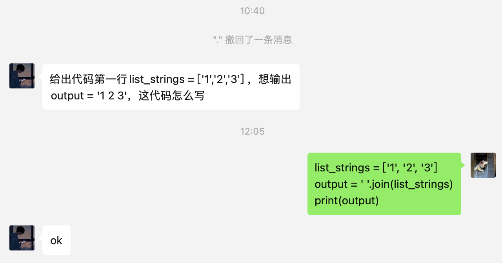

## Problem 1 (Tuple)

Given a list of integers, create a tuple of those integers. Then compute and print the result of hash of the tuple.

Note: hash() (https://docs.python.org/2/library/functions.html#hash) is one of the functions in the **builtins** module, so it need not be imported.

Here is the tutorial on why hash function is important in computer science. (https://www.hackerearth.com/practice/data-structures/hash-tables/basics-of-hash-tables/tutorial/)

Example:

```txt
input: int_list = [1, 2, 3]
output: 2528502973977326415
```

Example: Or you can see this kind of results as well based on your computer.

```txt
input: int_list = [1, 2, 3]
output: 2528502973977326415 or 529344067295497451
```

```python
#Note: Based on your computer, your hash result could be different.
def problem1(l): 
    hash_result = 0
    # YOUR CODE HERE
```

```python
def problem1(l):
    # Convert the list to a tuple
    t = tuple(l)
    
    # Compute the hash of the tuple
    hash_result = hash(t)
    
    # Print the hash result
    return hash_result

# Test with the given example
int_list = [1, 2, 3]
problem1(int_list)
```

## Problem 2 (Dictionary and String Methods):

You have a list of strings which contain student record. Each string contains the student's name, and their grades in Maths, Physics and Chemistry. The grades can be **floating values**. These values (names and grades) are separated by comma. You are required to save the record in a dictionary data type. The user then enters a student's name. Output the average percentage marks obtained by that student, correct to two decimal places.

Example:

```python
input:
    grades = ["Jake, 99, 70, 50", "Dennis, 100, 100, 98"]
    name = "Dennis"
output: "The average grade of Dennis is 99.33"
```

```python
def problem2(grades, name): 
    output = ""
    # YOUR CODE HERE
    #raise NotImplementedError()
    return(output)
```

```python
grades = ["Jake, 99, 70, 54", "Dennis, 100, 100, 98"]
name = "Dennis"
assert problem2(grades, "Dennis") == "The average grade of Dennis is 99.33"
```

```python
grades = ["Jake, 99, 70, 55", "Dennis, 100, 100, 98"]
name = "Jake"
assert problem2(grades, "Jake") == "The average grade of Jake is 74.67"
```

## Problem 3 (List Methods):

You are given N positive numbers. Store them in a list and find the second largest number. (If there are two largest numbers, the second largest number must be smaller than both of them)

```python
Example:
    input: int_list = [1,3,1,4,4,2]
    ouput: 3
```

```python
#Write your code here:
def problem3(int_list): second_largest = 0
    # YOUR CODE HERE
    #raise NotImplementedError()
    return(second_largest)
```

```python
assert problem3([1,3,1,4,4,2]) == 3
```

```python
assert problem3([1,2,3]) == 2
```

```python
def problem3(int_list): 
    # 将列表去重
    unique_numbers = list(set(int_list))
    # 对去重后的列表排序
    unique_numbers.sort()
    # 取倒数第二的数字作为第二大的数字
    second_largest = unique_numbers[-2]
    return second_largest
```

## Problem 4 (All-in-one: list + string + file read):

We downloaded several stock's daily level data for you in ./data/hw2_data/stock_data/. You will write code that takes stock tickers as inputs and output one dictinoary. The dictionary uses the stock tickers as keys and the values are these stocks' average open prices in 2017 (until the end of the file).

Exmaple:

```python
input: tickers = ["AAPL"]
output: {'AAPL': 143.465799260355}
```

```python
def problem4(tickers):
    file_location = "./data/stock_data/"
    return_dict = {}
    
    # YOUR CODE HERE
    #raise NotImplementedError()
    
    return(return_dict)

assert problem4(["AAPL"]) == {'AAPL': 143.465799260355}
assert problem4(["AAPL", "GOOG"]) == {'AAPL': 143.465799260355, 'GOOG': 884.3826611893493}
```


## Problem 5 (Power Set Problem)

For a given list L, generate a list of lists which contain all subsets of L. You are not allowed to use Python helper packages to do this.

```python
Example:
Input:
    L = [1, 2]
Output:
    power_set = [[], [1], [2], [1,2]]
```

```python
def problem5(original_set): power_set = [[]]
    # YOUR CODE HERE
    #raise NotImplementedError()
    return(power_set)
```

```python
assert sorted(problem5([1])) == sorted([[], [1]])
```

```python
assert sorted(problem5([1, 2])) == sorted([[], [1], [2], [1,2]])
```


## Problem 6



## Problem 7

For a given string s, return the first reoccuring character in the string.  Try to get an approach that is $O(n)$, where $n$ is the number of characters in the string. If there is no such character, return None. 
```python
-- Input:"ABCA"
-- Output:"A"
```

```python
def problem1(s):
    occurent_letter = None
    
    # YOUR CODE HERE
    #raise NotImplementedError()
    occurent_letter = None
    
    char_count = {}

    for char in s:
        # 如果字符已经存在于字典中，则设置occurent_letter为这个字符，并退出循环
        if char in char_count:
            occurent_letter = char
            break
        # 否则，将这个字符加入字典，并设置它的计数为1
        else:
            char_count[char] = 1

    # 返回occurent_letter
    return(occurent_letter)
```

## Problem 8

We have learnt that strings are immutable objects. In the following, you are asked to write a code to "mutate" a string. In particular, you are given a string, a position number and a character. You should return a different string such that this string is the same as the input string except the character in the position is changed to the given character. 

Example:

```python
input: 
    original_string = "Hello world!"
    position=6
    character="W"
ouput: "Hello World!"
```

## Problem 9

Write a function that checks whether two words are anagrams. Two words are anagrams if they contain the same letters. For example, silent and listen are anagrams, dog and god are anagrams.

Your code must be able to deal with follwoing three cases:

Input: "silent", "listen"

output: silent and listen are anagrams

```python
    1
```

Input: "dog", "good"

output: The two strings do not have the same lenght

```python
    -1
```

Input: "cat", "tag"

output: cat and tag are not anagrams

```python
    0
```


::: details 公众号：AI悦创【二维码】


:::

::: info AI悦创·编程一对一

AI悦创·推出辅导班啦，包括「Python 语言辅导班、C++ 辅导班、java 辅导班、算法/数据结构辅导班、少儿编程、pygame 游戏开发、Web、Linux」，全部都是一对一教学：一对一辅导 + 一对一答疑 + 布置作业 + 项目实践等。当然，还有线下线上摄影课程、Photoshop、Premiere 一对一教学、QQ、微信在线，随时响应！微信：Jiabcdefh

C++ 信息奥赛题解，长期更新！长期招收一对一中小学信息奥赛集训，莆田、厦门地区有机会线下上门，其他地区线上。微信：Jiabcdefh

方法一：[QQ](http://wpa.qq.com/msgrd?v=3&uin=1432803776&site=qq&menu=yes)

方法二：微信：Jiabcdefh

:::


