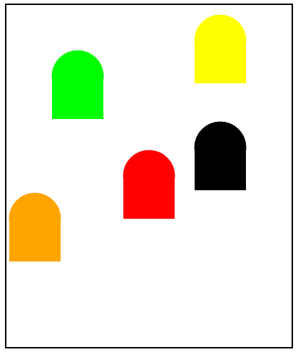

## Question 1

Write a function that takes one parameter - a float which represents a temperature in Celsius - and returns a float which represents that temperature in Fahrenheit.

Then, write a function that does the opposite conversion.

Here are the formulas for temperature conversion:

$^\circ F = (1.8\space \times \space^\circ C) + 32$

$^\circ C = (^\circ F - 32) \div 1.8$

Finally, write some code below your functions that uses them to convert 0 degrees Celsius and 100 degrees Celsius to Fahrenheit, and to convert 40 degrees Fahrenheit and 80 degrees Fahrenheit to Celsius. Make sure to print your results to the console.

::: tabs

@tab zh

编写一个函数，该函数接受一个参数——一个代表摄氏温度的浮点数——并返回表示该温度的华氏值的浮点数。

然后，编写一个执行相反转换的函数。

以下是温度转换的公式：

$^\circ F = (1.8 \times ^\circ C) + 32$

$^\circ C = (^\circ F - 32) \div 1.8$

最后，在你的函数下方编写一些代码，使用它们将 0 摄氏度和 100 摄氏度转换为华氏温度，以及将 40 华氏度和80华氏度转换为摄氏温度。确保将你的结果打印到控制台。

@tab Answer

```python
def celsius_to_fahrenheit(celsius):
    return 1.8 * celsius + 32

def fahrenheit_to_celsius(fahrenheit):
    return (fahrenheit - 32) / 1.8

# 使用这两个函数来进行温度转换
celsius_temps = [0, 100]
fahrenheit_temps = [40, 80]

print("摄氏度到华氏度转换：")
for temp in celsius_temps:
    print(f"{temp}摄氏度 = {celsius_to_fahrenheit(temp)}华氏度")

print("\n华氏度到摄氏度转换：")
for temp in fahrenheit_temps:
    print(f"{temp}华氏度 = {fahrenheit_to_celsius(temp)}摄氏度")
```

:::

## Question 2

Change your code for Temperature Converter so that it retrieves a float from the user and converts it from Celsius to Fahrenheit, and then retrieves another float from the user and converts it from Fahrenheit to Celsius. Your program should still have the two functions you wrote. In both cases, if the user enters something that can’t be converted to a float, print an error message.

As a reminder, here are the formulas for temperature conversion:

$^\circ F = (1.8 \times ^\circ C) + 32$

$^\circ C = (^\circ F - 32) \div 1.8$

::: tabs

@tab ZH

修改你的“温度转换器”代码，使其从用户处获取一个浮点数，并将其从摄氏度转换为华氏度，然后再从用户处获取另一个浮点数，并将其从华氏度转换为摄氏度。你的程序仍然应该有你写的那两个函数。在这两种情况下，如果用户输入的东西不能被转换为浮点数，就打印一个错误消息。

作为提醒，以下是温度转换的公式：

$^\circ F = (1.8 \times ^\circ C) + 32$

$^\circ C = (^\circ F - 32) \div 1.8$

@tab Answer

```python
def celsius_to_fahrenheit(celsius):
    return 1.8 * celsius + 32

def fahrenheit_to_celsius(fahrenheit):
    return (fahrenheit - 32) / 1.8

def main():
    # 从用户那里获取摄氏度，并转换为华氏度
    try:
        celsius_input = float(input("请输入摄氏度温度："))
        print(f"{celsius_input}摄氏度 = {celsius_to_fahrenheit(celsius_input)}华氏度")
    except ValueError:
        print("输入错误，请输入一个有效的数字。")
    
    # 从用户那里获取华氏度，并转换为摄氏度
    try:
        fahrenheit_input = float(input("请输入华氏度温度："))
        print(f"{fahrenheit_input}华氏度 = {fahrenheit_to_celsius(fahrenheit_input)}摄氏度")
    except ValueError:
        print("输入错误，请输入一个有效的数字。")

if __name__ == "__main__":
    main()
```

:::

## Question 3

Write a program to draw ghosts on the screen. You must do this by writing a function called `draw_ghost`, which takes three parameters, the x location of the ghost, the y location of the ghost and the color of the ghost. x and y for the ghost define where the center of the head should go.

**Note: Be sure to include comments for all functions that you use or create.**

```python
def draw_ghost(center_x, center_y, color):
```

### Final Product

Here is a screenshot of a sample run of the ghosts program with these function calls.

```python
center_x = get_width()/2
center_y = get_height()/2
draw_ghost(center_x, center_y, Color.red)
draw_ghost(100, 100, Color.green)
draw_ghost(370, 150, Color.black)
draw_ghost(40, 200, Color.orange)
draw_ghost(300, 50, Color.yellow)
```

Why not try adding more calls and more ghosts?


### Hints

- The constants for all of the ghost dimensions are given.
- Start off with something simpler. Try just drawing the general ghost shape, which is a circle and then a rectangle on top. The top edge of the rectangle should be in the middle of the circle.



### Result


```python
# Constants for body
HEAD_RADIUS = 35
BODY_WIDTH = HEAD_RADIUS * 2
BODY_HEIGHT = 60
NUM_FEET = 3
FOOT_RADIUS = (BODY_WIDTH) / (NUM_FEET * 2)

# Constants for eyes
PUPIL_RADIUS = 4
PUPIL_LEFT_OFFSET = 8
PUPIL_RIGHT_OFFSET = 20
EYE_RADIUS = 10
EYE_OFFSET = 14
```

## Question 4

### Overview

The computer picks a number between 1 and 100, and you have to guess it.
The computer will tell you whether your guess was too high, too low, or correct.
Your assignment is to generate a random number and let the user guess numbers until they guess the correct number.

### Hints

You’re going to want to use some kind of loop. Make sure to exit the loop when the user guesses correctly or hits cancel.

Use constants, maybe MIN and MAX to represent the range of numbers the computer can choose.

You will need to use the random function to generate a number.

### Final Product

Here is a screenshot of a sample run of the guessing game.

```txt
Guess? 53
High
Guess? 20
Low.
Guess? 40
High
Guess? 35
High
Guess? 31
High
Guess? 33
Correct!
```

```python
import random  # 导入random模块，用于生成随机数

MIN = 1  # 定义数字的最小值为1
MAX = 100  # 定义数字的最大值为100

def main():  # 定义主函数
    number = random.randint(MIN, MAX)  # 在MIN和MAX之间生成一个随机数
    guess = None  # 初始化猜测值为None
    
    print(f"Guess a number between {MIN} and {MAX}!")  # 提示用户猜测范围
    
    while guess != number:  # 当猜测值不等于随机数时继续循环
        try:
            guess = int(input("Guess? "))  # 获取用户输入的猜测值
            
            if guess > number:  # 如果猜测值大于随机数
                print("High")  # 打印"High"
            elif guess < number:  # 如果猜测值小于随机数
                print("Low")  # 打印"Low"
            else:  # 否则猜测值等于随机数
                print("Correct!")  # 打印"Correct!"
                break  # 退出循环
        
        except ValueError:  # 当用户输入的不是整数时捕获异常
            print("Please enter a valid number.")  # 提醒用户输入有效数字
        except KeyboardInterrupt:  # 当用户按Ctrl+C时捕获异常
            print("\nExiting the game. Goodbye!")  # 打印退出信息
            break  # 退出循环

if __name__ == "__main__":  # 如果当前脚本是主程序
    main()  # 调用main函数执行游戏
```

## Question 5

Slope and Distance App

Write code that calculates the distance and slope between two points and displays a graph with the two points and a line between them. Make sure that the points are measured from the origin (center of the graph) and that the code only accepts numbers.   It should give an exception error if letters are input.  Print the distance and slope.  Indicate if the slope is undefined.  Bonus if you can also print the equation of the line in y = mx + b format.

Examples:


Rubric

10 pts - Comment your code with Title, Description, Date, and Author

10 pts - Draw an x-axis and a y-axis

10 pts - Use the center of the canvas as the origin (0,0) point

10 pts - User should input point (x,y) measured from the origin

10 pts - Define a function with parameters and call with arguments

10 pts - Use try and except to only accept integers

10 pts - Calculate and print distance between points

10 pts - Calculate and print the slope of line including undefined and zero slopes

10 pts - Use descriptive variable names and no hard numbers

10 pts - Code must work and be eloquent

 5 pts - Bonus: calculate and print the equation of the line


::: details 公众号：AI悦创【二维码】


:::

::: info AI悦创·编程一对一

AI悦创·推出辅导班啦，包括「Python 语言辅导班、C++ 辅导班、java 辅导班、算法/数据结构辅导班、少儿编程、pygame 游戏开发、Web、Linux」，全部都是一对一教学：一对一辅导 + 一对一答疑 + 布置作业 + 项目实践等。当然，还有线下线上摄影课程、Photoshop、Premiere 一对一教学、QQ、微信在线，随时响应！微信：Jiabcdefh

C++ 信息奥赛题解，长期更新！长期招收一对一中小学信息奥赛集训，莆田、厦门地区有机会线下上门，其他地区线上。微信：Jiabcdefh

方法一：[QQ](http://wpa.qq.com/msgrd?v=3&uin=1432803776&site=qq&menu=yes)

方法二：微信：Jiabcdefh

:::


