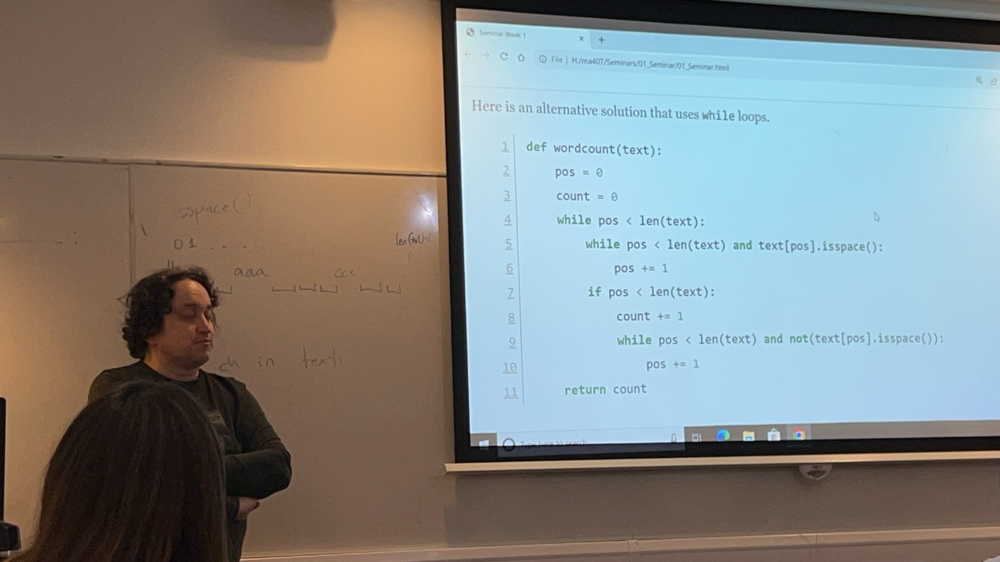

In this exercise, you are asked to write a simple Python function to count the number of words in a text. To complete this task, it would be useful to identify which characters in a string are whitescape that separates words (that is, consecutive non-whitespace characters).

You can use the following function, which helps you **detecting whitespace**, that is a space or tab or similar character in a string. For a **String** or a character variable **text**, you can find out whether the **String** or the character is a whitespace by using

```python
text.isspace()
```

This expression returns **true** or **false**.

Exercise 0.1. Write a Python function `wordCount(text)` in a file named `Wordcount.py` that counts the words of a text given as an argument to the function. For simplicity, we count everything as a word which does not contain whitespaces but is preceded and followed by one or several whitespaces (exceptions are the first and the last word of the text, which may only have one surrounding whitespace). For example,

```python
wordcount(" How many words\ \ \ \ does this text have? ")
```

should output 7, but

```python
wordcount("How many words does this text have ?")
```

should output 8.

(Do not use any Python library function other than isspace(), but rather find an algo- rithm yourself.)

**Hint**: This task may come challenging (if you are new to Python). So, first, ignore the possibility that several whitespaces can occur consecutively in the text, and assume that two words are always separated by only one whitespace. If this works correctly, then change your program so that it can also deal with consecutive whitespaces.

Do not forget to test your program with some small and some large examples of strings to cover different cases that need to handled, to see whether it works correctly.

You may find that using while loops instead of for loops is more intuitive. If you have not come accross while loops before, you can read about them here:

- [https://docs.python.org/3/tutorial/introduction.html#first-steps-towards-programming](https://docs.python.org/3/tutorial/introduction.html#first-steps-towards-programming)
- [https://docs.python.org/3/reference/compound_stmts.html#while](https://docs.python.org/3/reference/compound_stmts.html#while)

This homework also gives you a chance to practise writing your code and running it in an environment other than the online tutorial environment at Dataquest. The first (of four) tutorial documents and the section “Python Resources” on MA407 Moodle site give some instructions on to set up and use Python on your and LSE computers.

Solving Task 0.1 is, in fact, also your first piece of formative assessment for MA407. In MA407, you are required to submit solutions to problem sets on a platform called Gradescope. Further instructions on how to submit your program will be provided during the first week of the term. For now, you can concentrate on completing the task.

You should be submitting a single file called Wordcount.py that should include the definition of the function wordcount(text). The accurate naming of the Python functions and files are crucial for the automatic submission and marking processes on Gradescope.

Submit your solutions before 2pm (London time) on 29 September 2023.

Include your name, student number in each file. Good luck!





::: details

数据科学、可视化「SQL、Python 数据清洗」、Tab、Python 程序、NLP、机器学习、

Python 掌握熟练、一边工作一边读书、10 月中下旬。Base case、Homework

10 月在中旬：Python 2h 15 、记笔记。办公自动化「就业、NLP、人工智能」

:::


### 1. 修改列表但不返回

当你在函数内部直接修改传入的列表，并且没有返回任何东西时，由于列表是可变对象，所做的修改将影响原始列表。

```python
def append_value(lst, value):
    lst.append(value)

my_list = [1, 2, 3]
append_value(my_list, 4)
print(my_list)  # 输出 [1, 2, 3, 4]
```

即使 `append_value` 函数没有 `return` 语句，它仍然修改了 `my_list` 的内容。

### 2. 修改列表并返回

在某些情况下，你可能希望在函数内部创建一个新的列表，进行修改，并返回这个新列表，而不影响原始列表。

```python
def add_lists(lst1, lst2):
    return lst1 + lst2

list1 = [1, 2, 3]
list2 = [4, 5, 6]
new_list = add_lists(list1, list2)
print(list1)     # 输出 [1, 2, 3]
print(new_list)  # 输出 [1, 2, 3, 4, 5, 6]
```

在这个例子中，`add_lists` 函数返回了一个新的列表，原始的 `list1` 并没有被修改。


::: details 公众号：AI悦创【二维码】


:::

::: info AI悦创·编程一对一

AI悦创·推出辅导班啦，包括「Python 语言辅导班、C++ 辅导班、java 辅导班、算法/数据结构辅导班、少儿编程、pygame 游戏开发、Web、Linux」，全部都是一对一教学：一对一辅导 + 一对一答疑 + 布置作业 + 项目实践等。当然，还有线下线上摄影课程、Photoshop、Premiere 一对一教学、QQ、微信在线，随时响应！微信：Jiabcdefh

C++ 信息奥赛题解，长期更新！长期招收一对一中小学信息奥赛集训，莆田、厦门地区有机会线下上门，其他地区线上。微信：Jiabcdefh

方法一：[QQ](http://wpa.qq.com/msgrd?v=3&uin=1432803776&site=qq&menu=yes)

方法二：微信：Jiabcdefh

:::


