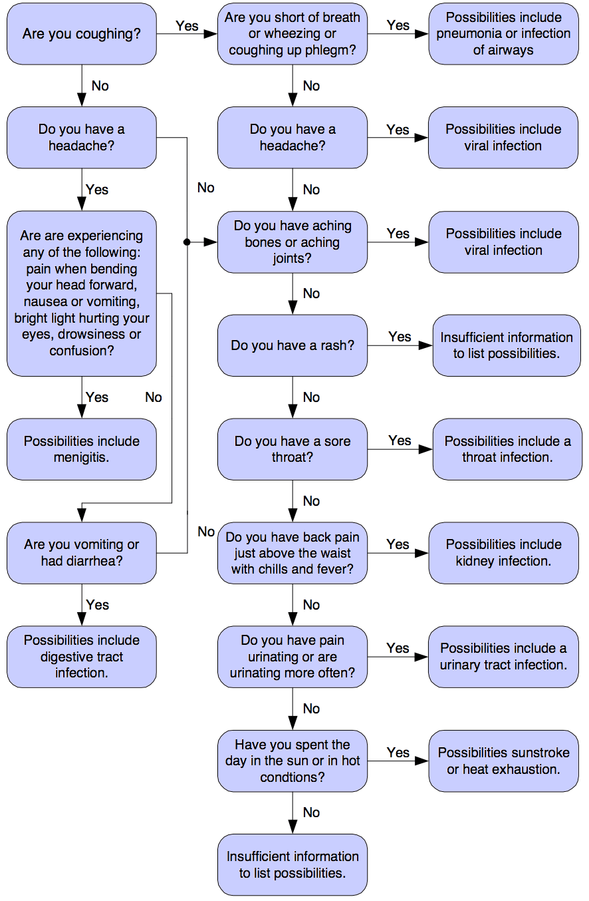
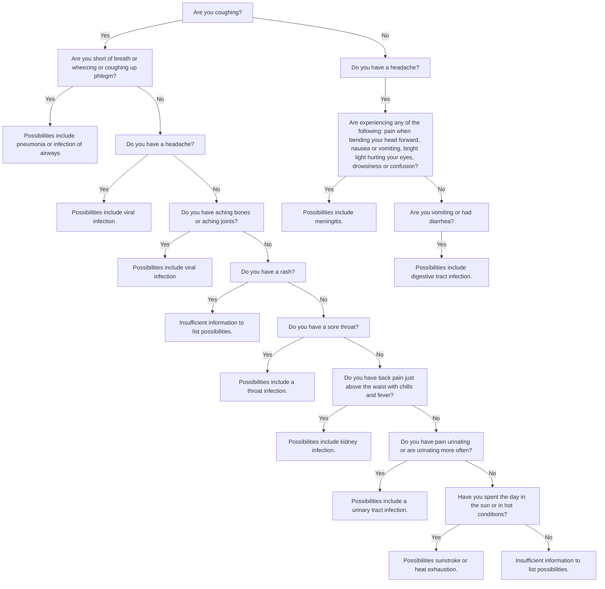

## Part 1: Book exercises

Create a text file called `hw3_book_exercises.txt`. Answer 4.14 Exercises questions 1-7 from the book.

> 创建一个名为 `hw3_book_exercises.txt` 的文本文件。从书中回答4.14练习的问题1-7。

### 1. Exercises

1. What possible values can a Boolean expression have?

2. Where does the term Boolean originate?

3. What is an integer equivalent to True in Python?

4. What is the integer equivalent to False in Python?

5. Is the value -16 interpreted as True or False?

6. Given the following definitions:

    x, y, z = 3, 5, 7

    evaluate the following Boolean expressions:

    (a) x == 3

    (b) x < y 

    (c) x >= y

    (d) x <= y

    (e) x != y - 2

    (f) x < 10

    (g) x >= 0 and x < 10

    (h) x < 0 and x < 10

    (i) x >= 0 and x < 2

    (j) x < 0 or x < 10 

    (k) x > 0 or x < 10 

    (l) x < 0 or x > 10

7. Given the following definitions:

```python
x, y = 3, 5
b1, b2, b3, b4 = True, False, x == 3, y < 3
```

evaluate the following Boolean expressions:

(a) b3

(b) b4

(c) not b1 

(d) not b2 

(e) not b3

(f) not b4

(g) b1 and b2 

(h) b1 or b2

(i) b1 and b3

(j) b1 or b3 

(k) b1 and b4 

(l) b1 or b4

(m) b2 and b3

(n) b2 or b3

(o) b1 and b2 or b3

(p) b1 or b2 and b3 

(q) b1 and b2 and b3

(r) b1 or b2 or b3

(s) not b1 and b2 and b3

(t) not b1 or b2 or b3

(u) not (b1 and b2 and b3) 

(v) not (b1 or b2 or b3)

(w) not b1 and not b2 and not b3

(x) not b1 or not b2 or not b3

(y) not (not b1 and not b2 and not b3)

(z) not (not b1 or not b2 or not b3)

### 2. Solution 1

::: details Answer

1. True, False

2. George Boole

3. 1

4. 0

5. True

6. (a) True

    (b) True

    (c) False

    (d) True

    (e) False

    (f) True

    (g) True

    (h) False

    (i) False

    (j) True

    (k) True

    (l) False

7. (a) True

  (b) False

  (c) False 

  (d) True 

  (e) False

  (f) True

  (g) False 

  (h) True

  (i) True

  (j) True 

  (k) False 

  (l) True

  (m) False

  (n) True

  (o) False

  (p) True 

  (q) False

  (r) True

  (s) False

  (t) True

  (u) True 

  (v) False

  (w) False

  (x) True

  (y) True

  (z) False

:::

## Part 2: Expert system

One of the earliest forms of artificial intelligence (AI) were *expert systems*. An expert system is a system designed to make decisions or arrive at diagnoses based on information it is given. The decisions it makes are based on a sequence of conditionals.

::: center

### A fever diagnosis system

:::

For this exercise, you will create an expert system to diagnose the cause of a fever. You will use the `input` function to interview a patient about their symptoms.

Look at the image below to see how the symptoms are associated with various possible causes. Your program should ask the pertinent questions and direct the diagnosis as indicated by the chart.

Note that there are many cases of nested conditionals and there are some cases where more than one condition can lead to the same diagnosis. Try to write your program to be as concise as possible, and avoid duplicating code as much as you can.



## Functions

Portions of this exercise may help to further understand the motivation to define functions. Are there places where you would be forced to type the same code more than once? Use functions to minimize repeated code. Call the function in the place where the code needs to execute.

## Submission

Submit the files `hw3_book_exercises.txt`. and `expert_system.py` to Canvas.

## Style Guide

Please familiarize yourself with the [PEP 8 Python Style guideLinks to an external site.](https://www.python.org/dev/peps/pep-0008/#a-foolish-consistency-is-the-hobgoblin-of-little-minds). These are excellent tips for writing clear Python code and you should follow this style.

Before you submit your assignment, go through the checklist below and make sure your code conforms to the style guide.

- No unused variables or commented-out code is left in the class
- Your code is appropriately commented
- All numbers have been replaced with constants (i.e. no "magic numbers").
- Proper capitalization of any names used: snake_case for ordinary variables and functions, CapWords for class names, and ALL_CAPS for constants
- Use white space to separate different sections of your code (follow the Pycodestyle linter's guidance)

### Using the Pycodestyle linter

In addition to the checklist above, use the Pycodestyle linter in your editor to make sure you're catching small style issues of spacing and consistency. The graders will use the Pycodestyle linter as a guide for enforcing PEP8 style, which should simplify the process for them and you. It's easy to track down issues with the linter and you should make sure that the linter report is completely error and warning free before submitting.

## Solution 2





::: details 公众号：AI悦创【二维码】


:::

::: info AI悦创·编程一对一

AI悦创·推出辅导班啦，包括「Python 语言辅导班、C++ 辅导班、java 辅导班、算法/数据结构辅导班、少儿编程、pygame 游戏开发、Web、Linux」，全部都是一对一教学：一对一辅导 + 一对一答疑 + 布置作业 + 项目实践等。当然，还有线下线上摄影课程、Photoshop、Premiere 一对一教学、QQ、微信在线，随时响应！微信：Jiabcdefh

C++ 信息奥赛题解，长期更新！长期招收一对一中小学信息奥赛集训，莆田、厦门地区有机会线下上门，其他地区线上。微信：Jiabcdefh

方法一：[QQ](http://wpa.qq.com/msgrd?v=3&uin=1432803776&site=qq&menu=yes)

方法二：微信：Jiabcdefh

:::


