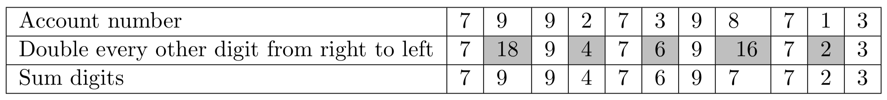
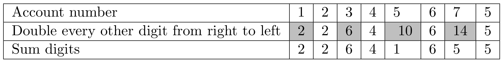

### Homework 7

## Exercise 1: Luhn's algorithm

Luhn’s algorithm, also known as the modulus 10 or mod 10 algorithm, is a checksum formula used to validate a variety of identification numbers, such as credit card numbers and ID numbers. You will write a program called `luhn.py` that asks for an account number and determines whether or not the number is valid using Luhn’s algorithm. The steps of the algorithm are given below.

1. Beginning with the second to right-most digit, modify every other digit moving from right to left as follows:
    - Double the digit's value.
    - If the resulting number is a two digit number, add the first digit of that value to the second digit, yielding a single digit number.
2. Add the sum of the modified digits to the sum of the digits from the original sequence which were skipped over in step 1.
3. If the resulting sum is evenly divisible by 10, the sequence is valid. If the resulting sum is not divisible by 10, the sequence is not valued.

#### Example

In the case of the number 79927398713, we begin with the second to right-most value (the 1), and double every other digit's value from right to left, with the results as indicated in the shaded squares below:



The double digit values (16 and 18) are in turned converted to values 7 and 9 respectively by adding their two digits together, resulting in the sequence in the third row above. The sum of 7 + 9 + 9 + 4 + 7 + 6 + 9 + 7 + 7 + 2 + 3 is 70, which is evenly divisible by 10, so this number is valid.

#### Example

In the case of the number 12345675, we begin with the second to right-most value (7), and double every other digit's value from right to left, with the results as indicated in the shaded squares below:



Adding the digits of 10 and 15 give us 1 and 5 respectively, yielding the sequence in the third row. 2 + 2 + 6 + 4 + 1 + 6 + 5 + 5 = 31, which is not a multiple of 10, so this account number is not valid.

### Expected results

Your program should positively validate the numbers 79927398713, 49927398716, and 1234567812345670. Your program should mark as not valid the numbers 12345675, 49927398717, and 1234567812345678.

**As with most well-known algorithms, it's easy to find readymade Python code solutions to this online. Be careful to avoid them until after you've written your own code for the solution.**

## Exercise 2: A dodgeball team management system

For this exercise, you're going to write a coaching and management system for a dodgeball team, based on [starter codeLinks to an external site.](https://course.ccs.neu.edu/cs5001f20-sea/secure/team_manager_starter.zip) I have provided. The system is intended for use by a manager/coach of the team. The system enables the user to set the name of the team, check on the status of the team, and to manage the players on the team in various ways.

In this exercise you'll get practice working with objects and methods. You'll also get the opportunity to implement a queue to represent the sideline bench where players will take a break from the action.

### Behavior

Your program should provide interaction as follows, looping until the user inputs the word `done`. The following interactive lines should be regarded as part of a single session with the program.

The program introduces itself and asks you what you want to do. The options are `set team name`, `show roster`, `add player`, `cut player`, `check position is filled`, `send player to bench`, `get player from bench`, `show bench`, and `done`. At the beginning of the session the team has no name and no players:

```bash
Welcome to the team manager.
What do you want to do?
show roster
The lineup for Anonymous Team is:
The team currently has no players
```

Any other command or mis-typed command will get the `I didn't understand that command` response.

```bash
What do you want to do?
show rooster
I didn't understand that command
```

When you ask to add a player, you should be prompted to input the player's name, then the player's number, then the player's position. Dodgeball positions include `catcher`, `corner`, `sniper`, and `thrower`.

In the following lines, the user adds three players and gives the team a name. Note the output of the roster at the end of the exchange:

```bash
What do you want to do?
add player
What's the player's name?
Garcia
What's Garcia's number?
15
What's Garcia's position?
catcher
Added Garcia to Anonymous Team
What do you want to do?
set team name
What do you want to name the team?
Seattle Scorpions
What do you want to do?
add player
What's the player's name?
Wiggins
What's Wiggins's number?
55
What's Wiggins's position?
corner
Added Wiggins to Seattle Scorpions
What do you want to do?
add player
What's the player's name?
McCann
What's McCann's number?
99
What's McCann's position?
sniper
Added McCann to Seattle Scorpions
What do you want to do?
show roster
The lineup for Seattle Scorpions is:
15       Garcia          catcher
55       Wiggins         corner
99       McCann          sniper
```

The user can check to see if we have at least one person playing at a given position, with the `check position is filled` command.

```bash
What do you want to do?
check position is filled
What position are you checking for?
thrower
No, the thrower position is not filled
```

The user can send an existing player to the sideline bench. The user can get a player from the bench. Whoever has been resting longest on the bench (i.e., whoever was sent to the bench earliest) will always be the first player returned from the bench. **This is an example of a data structure called a queue. Queues operate on a first in/first out (FIFO) basis.** When a player is benched, that player should still remain on the team roster, even while they are on the bench.

```bash
What do you want to do?
send player to bench
Who do you want to send to the bench?
McCann
What do you want to do?
send player to bench
Who do you want to send to the bench?
Garcia
What do you want to do?
show bench
The bench currently includes:
Garcia
McCann
What do you want to do?
get player from bench
Got McCann from bench
What do you want to do?
get player from bench
Got Garcia from bench
What do you want to do?
get player from bench
The bench is empty.
```

It is also possible for the user to cut a player from the team.

```bash
What do you want to do?
cut player
Who do you want to cut?
McCann
What do you want to do?
show roster
The lineup for Seattle Scorpions is:
15       Garcia          catcher
55       Wiggins         corner
```

**The behavior of the program if a player is cut while on the bench is unspecified**, so you should design your program to handle this situation in a sensible way. For example, you might forbid cutting a benched player (and give a message saying that the player hasn't been cut for this reason) or you might allow the cut and make sure that the player is removed from the bench also. Your code **should not** behave in an unexpected way or incorrect way, for example by giving a runtime error or allowing a benched player to pop back onto the team after having been cut.

The interactive session ends when the user inputs `done`.

```bash
What do you want to do?
done
Shutting down team manager
```

### Starter code

Download the starter code [hereLinks to an external site.](https://course.ccs.neu.edu/cs5001f20-sea/secure/team_manager_starter.zip). Read the code carefully. Some of the functionality has been implemented already, some of it has been partially implemented, and some of it is entirely up to you. The parts that have been implemented are relevant to the work you will need to do, so pay close attention to how the existing code is working.

In the starter directory you'll find four files. Three of these files, `team.py`, `bench.py`, and `player.py` are modules that define the classes `Team`, `Bench`, and `Player`, respectively. Calling `python team_manager.py` on the command line from within the `team_manager_starter` directory should run the program without problems. If you run into trouble running the starter code, get some help.

### Implementation

The team's roster of players is currently implemented as a list. There are other valid (and even arguablly better) ways to represent a team's collection of players, but this implementation uses a list and your methods should deal with the list data structure.

The bench's data structure for holding the names of players who are "on the bench" is not yet implemented. You will need a sequential data structure to which items can be added to on one end ("queued") and removed from the other end ("dequeued"). Both are possible with Python lists. Read the documentation on `insert` and `pop` operations for lists here: ([https://docs.python.org/3/tutorial/datastructures.htmlLinks to an external site.](https://docs.python.org/3/tutorial/datastructures.html)).

### Checking input

No user input should cause your program to crash. For example, trying to retrieve a player from the bench should not crash your application if the bench is empty.

Aside from preventing crashes, you may assume that the input is well formed for full credit. Writing effective and complete safety checks to enforce well-formed input (for example, to ensure that the player's `number` value is an actual numerical value, or that the team's `name` is made up of alphanumeric characters and spaces) is worth up to 15% extra credit.

## Style Guide

Please familiarize yourself with the [PEP 8 Python Style guideLinks to an external site.](https://www.python.org/dev/peps/pep-0008/#a-foolish-consistency-is-the-hobgoblin-of-little-minds). These are excellent tips for writing clear Python code and you should follow this style.

Before you submit your assignment, go through the checklist below and make sure your code conforms to the style guide.

- No unused variables or commented-out code is left in the class
- Your code is appropriately commented
- All numbers have been replaced with constants (i.e. no "magic numbers").
- Proper capitalization of any names used: snake_case for ordinary variables and functions, CapWords for class names, and ALL_CAPS for constants
- Use white space to separate different sections of your code (follow the PEP8 linter's guidance)

### Using the PEP8 linter

In addition to the checklist above, use the PEP8 linter in your editor to make sure you're catching small style issues of spacing and consistency. The graders will use the PEP8 linter as a guide for enforcing PEP8 style, which should simplify the process for them and you. It's easy to track down issues with the linter and you should make sure that the linter report is completely error and warning free before submitting.

## Submitting

Upload `luhn.py` directly to Canvas. Rename the `team_manager_starter` directory to `team_manager` and zip the directory into a single file. Upload `team_manager.zip` to Canvas.


::: details 公众号：AI悦创【二维码】


:::

::: info AI悦创·编程一对一

AI悦创·推出辅导班啦，包括「Python 语言辅导班、C++ 辅导班、java 辅导班、算法/数据结构辅导班、少儿编程、pygame 游戏开发、Web、Linux」，全部都是一对一教学：一对一辅导 + 一对一答疑 + 布置作业 + 项目实践等。当然，还有线下线上摄影课程、Photoshop、Premiere 一对一教学、QQ、微信在线，随时响应！微信：Jiabcdefh

C++ 信息奥赛题解，长期更新！长期招收一对一中小学信息奥赛集训，莆田、厦门地区有机会线下上门，其他地区线上。微信：Jiabcdefh

方法一：[QQ](http://wpa.qq.com/msgrd?v=3&uin=1432803776&site=qq&menu=yes)

方法二：微信：Jiabcdefh

:::


