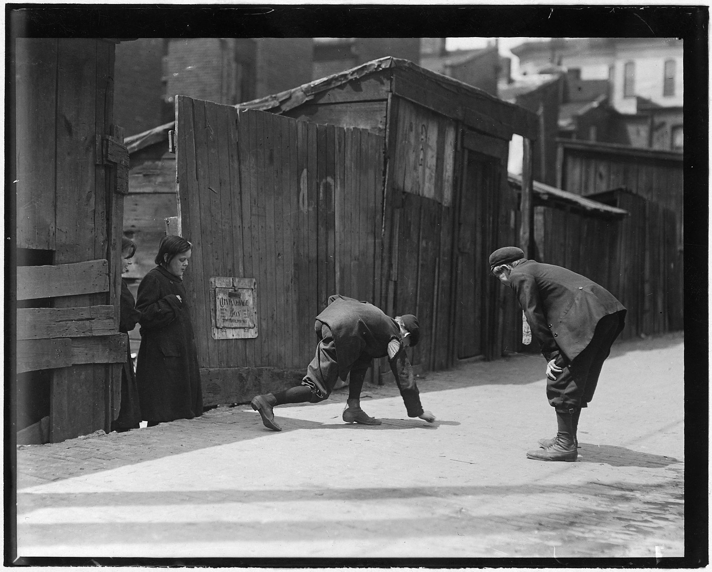

## Street craps



In class we looked at a simple card game implemented using object-oriented programming. For this lab, you'll adapt that structure to create a simple dice game based on the classic signifier of misspent youth: street craps.

The rules of street craps are as follows. The shooter rolls two dice. If the first roll is 2, 3, or 12 the shooter loses. If the first roll is 7 or 11, the shooter wins. If the first roll is anything else, that value becomes the shooter's "point". The shooter continues to roll the dice until either the "point" comes up again, in which case the shooter wins, or until a 7 comes up, in which case the shooter loses.

You'll implement this game in four files:

- A module called `die.py` which defines the `Die` class representing a single die. The die should have a `current_value` attribute that represents its current face-up value (i.e. the last value it was rolled). The die should also have a method called `roll()` that sets its current value to a random integer between 1 and 6.
- A module called `pair_of_dice.py` which defines the class `PairOfDice` which has two `Die` class attributes. It should have a `roll_dice()` method and a `current_value()` method that returns the sum of its `Die` objects' current values.
- A module called `game_controller.py`, which defines the `GameController` class to manage the rolling, scoring, and user interaction. This will be the file that contains the most code.
- A main application called `dice_game.py`, with a `main()` method that prints out the rules and then calls a method on the game controller to initiate the game.

### Running the game

A few examples of the game in action are shown below:

```bash
    $ python dice_game.py
    --------------------------------
    Welcome to street craps!

    Rules:
    If you roll 7 or 11 on your first roll, you win.
    If you roll 2, 3, or 12 on your first role, you lose.
    If you roll anything else, that's your 'point', and
    you keep rolling until you either roll your point
    again (win) or roll a 7 (lose)

    Press enter to roll the dice...

    Your point is 4
    Press enter to roll the dice...

    You rolled 7. You lose.


    $ python dice_game.py
    --------------------------------
    Welcome to street craps!

    Rules:
    If you roll 7 or 11 on your first roll, you win.
    If you roll 2, 3, or 12 on your first role, you lose.
    If you roll anything else, that's your 'point', and
    you keep rolling until you either roll your point
    again (win) or roll a 7 (lose)

    Press enter to roll the dice...

    You rolled 11. You win!


    $ python dice_game.py
    --------------------------------
    Welcome to street craps!

    Rules:
    If you roll 7 or 11 on your first roll, you win.
    If you roll 2, 3, or 12 on your first role, you lose.
    If you roll anything else, that's your 'point', and
    you keep rolling until you either roll your point
    again (win) or roll a 7 (lose)

    Press enter to roll the dice...

    Your point is 8
    Press enter to roll the dice...

    You rolled 4.
    Press enter to roll the dice...

    You rolled 7. You lose.


    $ python dice_game.py
    --------------------------------
    Welcome to street craps!

    Rules:
    If you roll 7 or 11 on your first roll, you win.
    If you roll 2, 3, or 12 on your first role, you lose.
    If you roll anything else, that's your 'point', and
    you keep rolling until you either roll your point
    again (win) or roll a 7 (lose)

    Press enter to roll the dice...

    Your point is 10
    Press enter to roll the dice...

    You rolled 8.
    Press enter to roll the dice...

    You rolled 4.
    Press enter to roll the dice...

    You rolled 10. You win!
```

### Implementation

As mentioned above, use the Blackjack code from the lectures as a reference to get started.

Avoid duplicating code, and make sure any piece of information has a single canonical source, to which other objects refer if they need that information. For example, the `PairOfDice` object's `current_value()` value should depend directly on (and refer to) the `current_value`s of its `Die` objects. Likewise, the `PairOfDice` object should not be responsible for generating any random numbers; this is the responsibility of the `Die` objects. Every object should have its own distinct responsibilities, and should refer to other objects when it needs data that they are responsible for.

You can trigger the action of rolling a die when the user presses enter by simply using an `input()` statement to wait for the user's input and then discarding the value (i.e., not passing it to a variable).

### Submission

Place all module files together in a directory called `dice_game` and zip the directory. Submit `dice_game.zip` to Canvas.


::: details 公众号：AI悦创【二维码】


:::

::: info AI悦创·编程一对一

AI悦创·推出辅导班啦，包括「Python 语言辅导班、C++ 辅导班、java 辅导班、算法/数据结构辅导班、少儿编程、pygame 游戏开发、Web、Linux」，全部都是一对一教学：一对一辅导 + 一对一答疑 + 布置作业 + 项目实践等。当然，还有线下线上摄影课程、Photoshop、Premiere 一对一教学、QQ、微信在线，随时响应！微信：Jiabcdefh

C++ 信息奥赛题解，长期更新！长期招收一对一中小学信息奥赛集训，莆田、厦门地区有机会线下上门，其他地区线上。微信：Jiabcdefh

方法一：[QQ](http://wpa.qq.com/msgrd?v=3&uin=1432803776&site=qq&menu=yes)

方法二：微信：Jiabcdefh

:::


