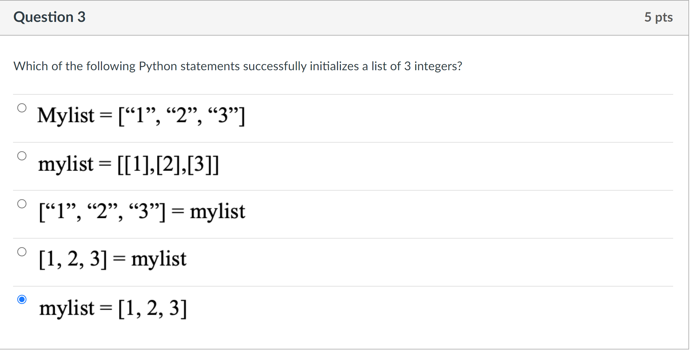
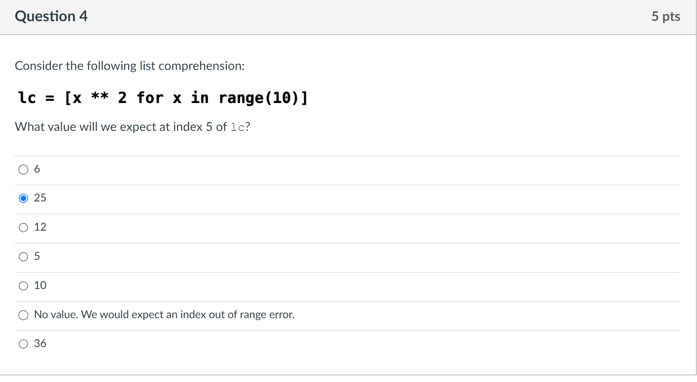
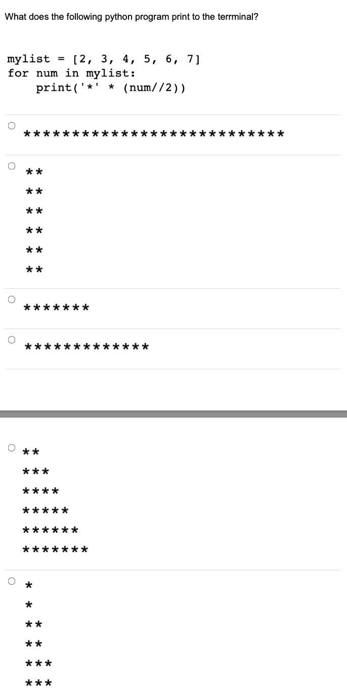

## Question 1

Which of the following Python statements will result in the value 3 stored in the variable x?

A. `x = 16.0% 3.5`

B. `x=16%4`

C. `X=16 /2`

D. `x=16 // 5`

E. `x=16 // 3`

## Question 2

What does the following piece of Python code print to the terminal?

```python
x = 2
y = 4
if x < 10:
    x = x * y
elif x < 10:
    x = x - 4
    if x == y:
        y = y - x
print(x, "and", y)
```

## Question 3

Which of the following Python statements successfully initializes a list of 3 integers?



## Question 4



## Question 5



## Question 6


## Question 7


## Question 8

Breaking a sentence into word elements is called *tokenization*. We would like to write a simple program that prompts the user for a sentence, breaks the sentence into individual words, and then prints out 2-tuples (pairs) for each word whose first element is the word’s index in the sentence and whose second element is itself a 2-tuple (pair) containing the word in all lowercase letters and an integer representing the word’s length. For example, if the user inputs the sentence "The bird sat on the branch" at the prompt, as shown below, the resulting output will be displayed as shown:


Read the code below **carefully**, then select the best description of what will be printed to the console when this script is run with 100 as a command-line argument.


::: details 公众号：AI悦创【二维码】


:::

::: info AI悦创·编程一对一

AI悦创·推出辅导班啦，包括「Python 语言辅导班、C++ 辅导班、java 辅导班、算法/数据结构辅导班、少儿编程、pygame 游戏开发、Web、Linux」，全部都是一对一教学：一对一辅导 + 一对一答疑 + 布置作业 + 项目实践等。当然，还有线下线上摄影课程、Photoshop、Premiere 一对一教学、QQ、微信在线，随时响应！微信：Jiabcdefh

C++ 信息奥赛题解，长期更新！长期招收一对一中小学信息奥赛集训，莆田、厦门地区有机会线下上门，其他地区线上。微信：Jiabcdefh

方法一：[QQ](http://wpa.qq.com/msgrd?v=3&uin=1432803776&site=qq&menu=yes)

方法二：微信：Jiabcdefh

:::


