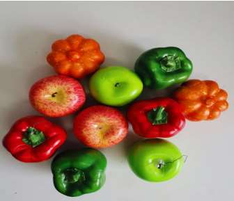
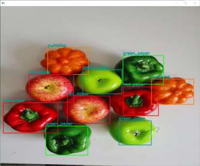

## 1. 项目分析🧐

### 1.1 任务





- 利用 OpenCV 完成对给定图像的操作
- 要求：
    - 能够打开一幅图片，并显示；
    - 实现图像中特定目标的提取；
    - 利用鼠标在图片指定位置画圆或方框；
    - \*\*感兴趣的同学可以利用 OpenCV 实现更多功能，如打开摄像头并实时截屏、视频的读取等

### 1.2 程序说明

我们提供了一个基于 python 的代码框架 `main.py`，其中：

1. display 用于打开一幅图片，并显示；

2. detect 用于实现图像中特定目标的提取；
3. draw 用于实现利用鼠标在图片指定位置画圆或方框。

main.py 代码如下：

```python
import cv2
import numpy as np


# 打开一幅图片并显示
def display():
    pass


# 提取特定目标
def detect():
    pass


# 利用鼠标在图片指定位置画圆或方框
def draw():
    pass


if __name__ == "__main__":
    image_path = 'your_image.png'  # 替换为你的图像文件路径

    # 打开并显示图像
    display()

    # 提取特定目标
    detect()

    # 利用鼠标画圆或方框
    draw()

    while True:
        key = cv2.waitKey(20)
        if key == 27:  # 按Esc键退出
            break

    cv2.destroyAllWindows()
```


你需要编写上述三个函数，实现相应的功能，测试时只需要运行 `main.py` 即可测试你的算法。提交评测时，提交 `main.py` 文件即可。

::: code-tabs

@tab V0.1

```python
import cv2
import numpy as np

drawing = False  # True if the mouse is pressed
mode = True  # True for drawing rectangles, False for drawing circles


# Mouse callback function
def draw_shape(event, x, y, flags, param):
    global ix, iy, drawing, mode

    if event == cv2.EVENT_LBUTTONDOWN:
        drawing = True
        ix, iy = x, y
    elif event == cv2.EVENT_LBUTTONUP:
        drawing = False
        if mode:
            cv2.rectangle(param, (ix, iy), (x, y), (0, 255, 0), 1)
        else:
            cv2.circle(param, (x, y), 5, (0, 0, 255), -1)


# Display the image
def display(img_path):
    img = cv2.imread(img_path)
    cv2.imshow("Image", img)
    return img


# Extract specific targets from the image
def detect(img):
    # Convert image to grayscale
    gray = cv2.cvtColor(img, cv2.COLOR_BGR2GRAY)

    # Use Canny edge detection
    edges = cv2.Canny(gray, 50, 150)

    # Find contours
    contours, _ = cv2.findContours(edges, cv2.RETR_EXTERNAL, cv2.CHAIN_APPROX_SIMPLE)

    for contour in contours:
        if (
            cv2.contourArea(contour) > 200
        ):  # You can adjust this threshold based on your image
            x, y, w, h = cv2.boundingRect(contour)
            cv2.rectangle(img, (x, y), (x + w, y + h), (0, 255, 0), 2)

    cv2.imshow("Detected Targets", img)
    return img


# Draw circle or rectangle using mouse
def draw(img):
    cv2.namedWindow("Drawing")
    cv2.setMouseCallback("Drawing", draw_shape, img)
    while True:
        cv2.imshow("Drawing", img)
        k = cv2.waitKey(1) & 0xFF
        if k == ord("m"):
            mode = not mode
        elif k == 27:
            break


if __name__ == "__main__":
    image_path = "fruit.png"  # Replace with your image file path

    # Open and display image
    image = display(image_path)

    # Extract specific targets
    image = detect(image)

    # Draw circle or rectangle using mouse
    draw(image)
```


:::


::: details 公众号：AI悦创【二维码】


:::

::: info AI悦创·编程一对一

AI悦创·推出辅导班啦，包括「Python 语言辅导班、C++ 辅导班、java 辅导班、算法/数据结构辅导班、少儿编程、pygame 游戏开发、Web、Linux」，全部都是一对一教学：一对一辅导 + 一对一答疑 + 布置作业 + 项目实践等。当然，还有线下线上摄影课程、Photoshop、Premiere 一对一教学、QQ、微信在线，随时响应！微信：Jiabcdefh

C++ 信息奥赛题解，长期更新！长期招收一对一中小学信息奥赛集训，莆田、厦门地区有机会线下上门，其他地区线上。微信：Jiabcdefh

方法一：[QQ](http://wpa.qq.com/msgrd?v=3&uin=1432803776&site=qq&menu=yes)

方法二：微信：Jiabcdefh

:::


