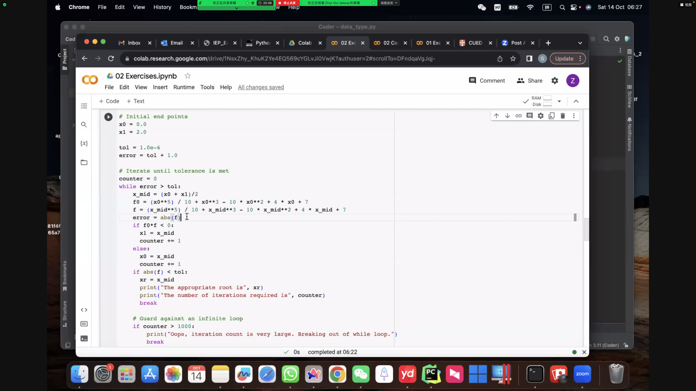

## Exercise 02.1 (if-else)

::: tabs

@tab EN

Consider the following assessment criteria which map a score out of 100 to an 
assessment grade:

| Grade            | Raw score  (/100)     |
| ---------------- | --------------------- |
| Excellent        | $\ge 85$              |
| Very good        | $\ge 76.5$ and $< 85$ |
| Good             | $\ge 64$ and $< 76.5$ |
| Need improvement | $\ge 40$ and $< 64$   |
| Did you try?     | $< 40$                |

Write a program that, given an a score, prints the appropriate grade. Print an error message if the input score is greater than 100 or less than zero.

```python
# Score from user
score = 72

...
```

@tab ZH

考虑以下的评分标准，它将一个满分为100的分数映射到一个评估等级：

| 等级        | 原始分数  (/100)     |
| ----------- | -------------------- |
| 优秀        | $\ge 85$             |
| 非常好      | $\ge 76.5$ 且 $< 85$ |
| 良好        | $\ge 64$ 且 $< 76.5$ |
| 需要改进    | $\ge 40$ 且 $< 64$   |
| 你有尝试吗? | $< 40$               |

编写一个程序，给定一个分数，输出相应的等级。如果输入的分数大于100或小于0，打印一个错误信息。

@tab Answer

```python
score = float(input("请输入你的分数（0到100之间）："))

if score > 100 or score < 0:
    print("错误：分数应在0到100之间")
elif score >= 85:
    print("等级：优秀")
elif score >= 76.5:
    print("等级：非常好")
elif score >= 64:
    print("等级：良好")
elif score >= 40:
    print("等级：需要改进")
else:
    print("等级：你有尝试吗?")
```

```python
score = float(input("Enter your score (between 0 to 100): "))

if score > 100 or score < 0:
    print("Error: The score should be between 0 and 100.")
elif score >= 85:
    print("Grade: Excellent")
elif score >= 76.5:
    print("Grade: Very good")
elif score >= 64:
    print("Grade: Good")
elif score >= 40:
    print("Grade: Need improvement")
else:
    print("Grade: Did you try?")
```

:::

## Exercise 02.2 (bisection)

::: tabs

@tab EN

Bisection is an iterative method for finding approximate roots of a function. Say we know that the function $f(x)$ has one root between $x_{0}$ and $x_{1}$ ($x_{0} < x_{1}$). We then:

- Evaluate $f$ at the midpoint $x_{\rm mid} = (x_0 + x_1)/2$, i.e. compute
   $f_{\rm mid} = f(x_{\rm mid})$
- Evaluate $f(x_0) \cdot f(x_{\rm mid})$

  - if $f(x_0) \cdot f(x_{\rm mid}) < 0$: 

    $f$ must change sign somewhere between $x_0$ and $x_{\rm mid}$, hence the root must lie between 
    $x_0$ and $x_{\rm mid}$, so set $x_1 = x_{\rm mid}$.
  
  - else:

    $f$ must change sign somewhere between $x_{\rm mid}$ and $x_1$, so set
    $x_0 = x_{\rm mid}$.

The above steps can be repeated a specified number of times, or until $|f_{\rm mid}|$
is below a tolerance, with $x_{\rm mid}$ being the approximate root.


### Task

The function

$$
f(x) = - \frac{x^{5}}{10} + x^3 - 10x^2 + 4x + 7
$$


has one root in the range $0 < x < 2$.

1. Use the bisection method to find an approximate root $x_{r}$ using 20 iterations 
   (use a `for` loop).
2. Use the bisection method to find an approximate root $x_{r}$ such that 
   $\left| f(x_{r}) \right| < 1 \times 10^{-6}$ and report the number of iterations 
   required (use a `while` loop).

Store the approximate root using the variable `x_mid`, and store $f(x_{\rm mid})$ using the variable `f`.

*Hint:* Use  `abs` to compute the absolute value of a number, e.g. `y = abs(x)` assigns the absolute value of `x` to `y`. 


@tab ZH

二分法是一种迭代方法，用于查找函数的近似根。假设我们知道函数 $f(x)$ 在 $x_{0}$ 和 $x_{1}$ 之间有一个根 ($x_{0} < x_{1}$)。我们可以：

- 在中点 $x_{\rm mid} = (x_0 + x_1)/2$ 处评估 $f$，即计算 $f_{\rm mid} = f(x_{\rm mid})$
- 计算 $f(x_0) \cdot f(x_{\rm mid})$

  - 如果 $f(x_0) \cdot f(x_{\rm mid}) < 0$： 

    $f$ 必须在 $x_0$ 和 $x_{\rm mid}$ 之间某处改变符号，因此根必须位于 $x_0$ 和 $x_{\rm mid}$ 之间，所以设置 $x_1 = x_{\rm mid}$。
  
  - 否则：

    $f$ 必须在 $x_{\rm mid}$ 和 $x_1$ 之间某处改变符号，所以设置 $x_0 = x_{\rm mid}$。

以上步骤可以重复指定的次数，或者直到 $|f_{\rm mid}|$ 低于某个容忍度，此时 $x_{\rm mid}$ 为近似根。

### 任务

函数

$$
f(x) = - \frac{x^{5}}{10} + x^3 - 10x^2 + 4x + 7
$$

在范围 $0 < x < 2$ 内有一个根。

1. 使用二分法在 20 次迭代中找到一个近似根 $x_{r}$ （使用 `for` 循环）。
2. 使用二分法找到一个近似根 $x_{r}$，使得 $\left| f(x_{r}) \right| < 1 \times 10^{-6}$，并报告所需的迭代次数（使用 `while` 循环）。

使用变量 `x_mid` 存储近似根，并使用变量 `f` 存储 $f(x_{\rm mid})$。

*提示:* 使用 `abs` 计算数字的绝对值，例如 `y = abs(x)` 将 `x` 的绝对值赋给 `y`。

@tab Answer

```python
# 初始端点值
x0 = 0.0  # 初始的x0值
x1 = 2.0  # 初始的x1值

# 进行20次迭代
for n in range(20):
    # 计算中点值
    x_mid = (x0 + x1) / 2  # 根据二分法计算中间值

    # 计算在(i)左端点以及(ii)中点处的函数值
    # 注意：在这里我们使用了函数f(x)的定义来计算f0和f
    f0 = (-x0**5) / 10 + x0**3 - 10 * x0**2 + 4 * x0 + 7  # 在x0处的函数值
    f = (-x_mid**5) / 10 + x_mid**3 - 10 * x_mid**2 + 4 * x_mid + 7  # 在中点x_mid处的函数值

    # 根据f0和f的乘积来确定新的区间界限
    # 1. 如果f0和f的乘积小于0，那么根必定存在于[x0, x_mid]之间，所以我们更新x1为x_mid
    # 2. 如果f0和f的乘积大于或等于0，那么根必定存在于[x_mid, x1]之间，所以我们更新x0为x_mid
    if f0 * f < 0:
        x1 = x_mid
    else:
        x0 = x_mid

    # 输出当前迭代的结果
    print(n, x_mid, f)
```

```python
# Initial end points
x0 = 0.0
x1 = 2.0

tol = 1.0e-6
error = tol + 1.0

# Iterate until tolerance is met
counter = 0
while error > tol:
    # 计算中点
    x_mid = (x0 + x1) / 2

    # 在(i)左端点和(ii)中点处评估函数
    f0 = (x0**5) / 10 + x0**3 - 10 * x0**2 + 4 * x0 + 7
    f = (x_mid**5) / 10 + x_mid**3 - 10 * x_mid**2 + 4 * x_mid + 7
    
    # 更新error
    error = abs(f)

    # 判断根的位置
    if f0 * f < 0:
        x1 = x_mid
    else:
        x0 = x_mid

    counter += 1

    # Guard against an infinite loop
    if counter > 1000:
        print("Oops, iteration count is very large. Breaking out of while loop.")
        break
    
    print(counter, x_mid, error)
```



:::


## Exercise 02.3 (series expansion)

::: tabs

@tab EN

For $|x| < 1$ the series: 
$$
(1 + x)^{-1/2} = \sum_{n = 0}^{\infty} \frac{(-1)^n (2n)!}{4^n (n!)^2} x^n
$$

converges.

1. Using a `for` statement, approximate $1/\sqrt{0.16}$ using 30 terms in the series expansion and report the absolute error.

1. Using a `while` statement, compute how many terms in the series are required to approximate $1/\sqrt{0.16}$ to within $1 \times 10^{-5}$. 

Store the absolute value of the error in the variable `error`.

### Hints

To compute the factorial, use the Python `math` module:
```python
import math
nfact = math.factorial(10)
```
You only need `import math` once at the top of your program. Standard modules, like `math`, will be explained in a later

<!-- The power series expansion for the sine function is: 

$$
\sin(x) = \sum_{n = 0}^{\infty} (-1)^n \frac{x^{2n +1}}{(2n+1)!}
$$

(See mathematics data book for a less compact version; this compact version is preferred here as it is simpler to program.)

1. Using a `for` statement, approximate $\sin(3\pi/2)$ using 15 terms in the series expansion and report the absolute error.

1. Using a `while` statement, compute how many terms in the series are required to approximate $\sin(3\pi/2)$ to within $1 \times 10^{-8}$. 

Store the absolute value of the error in the variable `error`.

*Note:* Calculators and computers use iterative or series expansions to compute trigonometric functions, similar to the one above (although they use more efficient formulations than the above series).

### Hints

To compute the factorial and to get a good approximation of $\pi$, use the Python `math` module:
```python
import math
nfact = math.factorial(10)
pi = math.pi
```
You only need '`import math`' once at the top of your program. Standard modules, like `math`, will be explained in a later. If you want to test for angles for which sine is not simple, you can use 
```python
a = 1.3
s = math.sin(a)
```
to get an accurate computation of sine to check the error. -->

```python
# Import the math module to access math.factorial
import math

# Value of x (such that (1 - x) = 0.16  
x = -0.84

# Initialise approximation of the function
approx_f = 0.0

...
    
print("The error is:")
print(error)
```

```python
## test ##
assert error < 1.0e-2
```

```python
# Import the math module to access math.sin and math.factorial
import math

# Value of x (such that (1 - x) = 0.16)
x = -0.84

# Tolerance and initial error (this just needs to be larger than tol)
tol = 1.0e-5
error = tol + 1.0

# Initialise approximation of function
approx_f = 0.0

# Initialise counter
n = 0

# Loop until error satisfies tolerance, with a check to avoid 
# an infinite loop
while error > tol and n < 1000:
    
    ...
    
    # Increment counter
    n += 1    
    
    
print("\nThe error is:", error)
print("Number of terms in series:", n)
```

```python
## test ##
assert error <= 1.0e-5
```

@tab ZH

对于 $|x| < 1$ 的序列：

$$
(1 + x)^{-1/2} = \sum_{n = 0}^{\infty} \frac{(-1)^n (2n)!}{4^n (n!)^2} x^n
$$

该级数收敛。

1. 使用 `for` 语句，用该级数展开的前30项近似计算 $1/\sqrt{0.16}$ ，并报告绝对误差。

2. 使用 `while` 语句，计算需要多少级数的项才能将 $1/\sqrt{0.16}$ 近似到 $1 \times 10^{-5}$ 内。

将误差的绝对值存储在变量 `error` 中。

### 提示

要计算阶乘，请使用Python的 `math` 模块：
```python
import math
nfact = math.factorial(10)
```
你只需要在程序的开头使用一次 `import math`。标准模块，例如 `math`，将在后面进行解释。

@tab Answer

我们可以使用上述伪代码来实现对给定函数的数列展开。首先，我们用 `for` 循环来近似计算 $1/\sqrt{0.16}$ 的值，然后用 `while` 循环来找出满足误差小于 $1 \times 10^{-5}$ 的数列项数。

#### (1) 使用 `for` 循环:

```python
# 导入math模块以使用math.factorial
import math

# x的值 (这样 (1 + x) = 1.84)
x = 0.84

# 初始化函数的近似值
approx_f = 0.0

# 使用30个数列项
for n in range(30):
    term = ((-1)**n * math.factorial(2*n)) / (4**n * (math.factorial(n))**2) * x**n
    approx_f += term

# 计算真实值和误差
true_value = 1 / (0.16)**0.5
error = abs(true_value - approx_f)

print("使用30个数列项的近似值为:", approx_f)
print("真实值为:", true_value)
print("误差为:", error)

## 测试 ##
assert error < 1.0e-2
```

#### (2) 使用 `while` 循环:

```python
# x的值 (这样 (1 + x) = 1.84)
x = 0.84

# 容差和初始误差 (只需要确保比容差大)
tol = 1.0e-5
error = tol + 1.0

# 初始化函数的近似值
approx_f = 0.0

# 初始化计数器
n = 0

# 循环直到误差满足容差，同时检查以避免无限循环
while error > tol and n < 1000:
    term = ((-1)**n * math.factorial(2*n)) / (4**n * (math.factorial(n))**2) * x**n
    approx_f += term
    error = abs(true_value - approx_f)
    
    # 增加计数器
    n += 1

print("\n误差为:", error)
print("数列项数:", n)

## 测试 ##
assert error <= 1.0e-5
```

:::


::: details 公众号：AI悦创【二维码】


:::

::: info AI悦创·编程一对一

AI悦创·推出辅导班啦，包括「Python 语言辅导班、C++ 辅导班、java 辅导班、算法/数据结构辅导班、少儿编程、pygame 游戏开发、Web、Linux」，全部都是一对一教学：一对一辅导 + 一对一答疑 + 布置作业 + 项目实践等。当然，还有线下线上摄影课程、Photoshop、Premiere 一对一教学、QQ、微信在线，随时响应！微信：Jiabcdefh

C++ 信息奥赛题解，长期更新！长期招收一对一中小学信息奥赛集训，莆田、厦门地区有机会线下上门，其他地区线上。微信：Jiabcdefh

方法一：[QQ](http://wpa.qq.com/msgrd?v=3&uin=1432803776&site=qq&menu=yes)

方法二：微信：Jiabcdefh

:::


