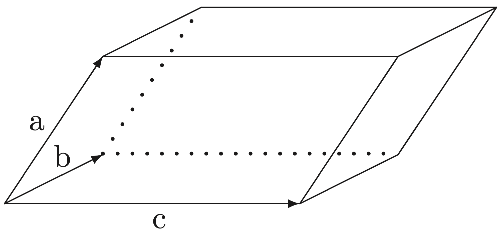

**Aufgabe 13:** **Oberfläche und Volumen eines Parallelflachs**

Es sollen die Oberfläche und das Volumen eines Parallelflachs (auch Parallelepiped oder Spat genannt) berechnet werden. Dabei werden folgende Begriffe verwendet:

- Es bedeuten $a = \begin{pmatrix} a_1 \\ a_2 \\ a_3 \end{pmatrix}$ , $b = \begin{pmatrix} b_1 \\ b_2 \\ b_3 \end{pmatrix}$  und $c = \begin{pmatrix} c_1 \\ c_2 \\ c_3 \end{pmatrix}$ sowohl Ortsvektoren als auch Punkte im 3-dimensionalen Raum.

- Das Skalarprodukt a · b (Punktprodukt, inneres Produkt) zweier Vektoren a und b:$a·b=a_1 ∗b_1 +a_2 ∗b_2 +a_3 ∗b_3.$
- Die Länge eines Vektors a ist $L(a) := \sqrt{a · a}$.
- Das Vektorprodukt a × b (Kreuzprodukt) zweier Vektoren ergibt wieder einen Vektor,der definiert ist durch

$$
\mathbf{a} \times \mathbf{b} := \begin{pmatrix}
a_2 \cdot b_3 - a_3 \cdot b_2 \\
a_3 \cdot b_1 - a_1 \cdot b_3 \\
a_1 \cdot b_2 - a_2 \cdot b_1
\end{pmatrix}
$$

- Der Flächeninhalt eines durch die Vektoren a und b aufgespannten Parallelogramms: $F(a,b):=L(a \times b)$.
- Die Oberfläche eines durch die Vektoren a, b, c aufgespannten Parallelflachs:$OB(a, b, c) := 2 ∗ (F (a, b) + F (b, c) + F (c, a))$.
- Das Volumen eines durch die Vektoren a, b, c aufgespannten Parallelflachs – als Betrag des Skalarprodukts des Kreuzprodukts $a \times b$ und dem Vektor c:$V(a, b, c) := |(a × b)· c|$.

Schreiben Sie ein Fortran 95–Modul, in dem Sie für jede der oben aufgeführten mathemati- schen Definitionen eine Funktion implementieren.

Überlegen Sie sich, für welche Funktionen man mit Hilfe selbstdefinierter Operatoren die Notation mathematik-ähnlicher machen kann und verwenden Sie hierfür Interface-Blöcke.

Schreiben Sie ein Fortran 95–Hauptprogramm, das unter Benutzung dieses Moduls in einer Schleife wiederholt jeweils 3 dreidimensionale Vektoren einliest, überprüft, ob einer der ein- gegebenen Vektoren der Nullvektor ist (was zum Verlassen der Schleife führen soll) und wenn nicht die Oberfläche und das Volumen des durch diese Vektoren aufgespannten Parallelflachs berechnet und kommentiert ausgibt.

**Bemerkung zu Arrays:**

In den meisten Anwendungen mit Feldern/Arrays werden wir Felder benötigen, deren Größe zum Zeitpunkt des Programmierens und Compilierens nicht festgelegt werden soll oder kann (sogenannte *dynamic* arrays, z.B. mit ALLOCATABLE-Attribut). In der vorliegenden Auf- gabenstellung können die Indexgrenzen der eindimensionalen Felder *statisch* im Programm festgelegt werden, da es sich um Vektoren im 3-dimensionalen Raum handelt.

**Aufgabe 14:** **Magische Quadrate**

Eine $n \times n$ Matrix A heißt „magisches Quadrat“, wenn jede der Zahlen $1, 2, \dots , n^2$ genau einmal auftritt und es eine Zahl $S \in \mathbb{N}$ gibt mit den Eigenschaften:

- Die Summe der Zahlen in jeder Spalte ist S.
- Die Summe der Zahlen in jeder Zeile ist S.
-  Die Summe der Zahlen in jeder der beiden Diagonalen (mit n Elementen) ist S.

Da sich die Summe der Zahlen $1,2,\dots,n^2$ zu $n^2(n^2+1)/2$ ergibt, muss $S = n(n^2 +1)/2$ sein.

**Beispiel:**
$$
A = \begin{pmatrix}
6 & 1 & 8 \\
7 & 5 & 3 \\
2 & 9 & 4
\end{pmatrix}
\quad (n = 3, S = 15)
$$
Ein magisches Quadrat *ungerader Ordnung* $n = 2m − 1$ mit $m \in \mathbb{N}^+$ kann wie folgt gebildet werden:

Sei anfangs die Matrix A mit Nullen besetzt; trage 1 in a1m ein; trage $2, 3, \dots , n^2$ jeweils diagonal nach links oben laufend ein. Bei Erreichen des Randes der Matrix oder eines bereits besetzten Feldelements ist wie folgt fortzufahren:

Sei $a_{ij}$ das zuletzt besetzte Feld der Matrix:

(1) i=1,j=1: Schreibeweiterin $a_{21}$ 

(2) i=1,$j \neq 1$: Schreibe weiter in $a_n,j−1$

(3)  $i \neq 1$,j = 1 :Schreibe weiter in $a_{i−1},n$

(4)  $i \neq 1$,$j  \neq  1$ :Schreibe weiter in $a_{i+1},j$

Schreiben Sie ein Fortran 95-Programm, das magische Quadrate *ungerader Ordnung* n nach diesem Algorithmus generiert und sodann testet.

Hierzu ist in einer Schleife die Dimension n von der Tastatur einzulesen (falls n gerade ist, soll erneut zur Eingabe einer *ungeraden* Dimension n aufgefordert werden), das dynamische Feld A im Speicher als $n \times n$ Matrix anzulegen und mit Null zu initialisieren, das magische Quadrat wie oben beschrieben zu generieren und übersichtlich auszugeben und sodann auf seine magische Eigenschaft zu testen, indem alle Zeilen-, Spalten- und Diagonalsummen be-rechnet und verglichen werden sowie die gefundene Summe S und (zum Vergleich) der Wert $n(n^2 + 1)/2$ kommentiert ausgegeben werden. Die Schleife soll so lange wiederholt werden,bis ein $n \leq 0$ eingegeben wird.

**Aufgabe 15:** **Boothroyd/Dekker-Matrizen**

Die Elemente einer $n \times n$ Boothroyd/Dekker-Matrix $B = (b_{ij} )$ sind ganze Zahlen, die durch 
$$
b_{ij} = \left( \binom{n + i - 1}{i - 1} \right) \cdot \left( \binom{n - 1}{n - j} \right) \cdot \left( \frac{n}{i + j - 1} \right), \quad 1 \leq i, j \leq n
$$

gegeben sind. Dabei bezeichnet $\binom{n}{k}$ den Binomialkoeffizienten „n über k“ mit 
$$
\binom{n}{k} := \frac{n \cdot (n - 1) \cdot \ldots \cdot (n - k + 1)}{1 \cdot 2 \cdot \ldots \cdot k}
$$
Schreiben Sie ein Fortran 95–Modul, in dem Sie 

a)  einen binären Operator .ueber. definieren, der mittels einer ganzzahligen Funktion den Binomialkoeffizienten $\binom{n}{k}$ gemäß folgender Vorschrift berechnet: 
$$
c_0 := 1, \quad c_i := c_{i-1} \cdot \frac{n - i + 1}{i}, \quad \text{für } i = 1, \ldots, \min\{k, n - k\}
$$
(Es gilt dann $\binom{n}{k} = \binom{n}{n-k} = c_{\min\{k, n-k\}}$).

b) eine Funktion mit einem ganzzahligen Argument n und einem optionalen, logischen Argument inv bereitstellen, die, falls inv nicht angegeben oder falsch ist, unter Be-nutzung des Operators .ueber. die $n \times n$ Boothroyd/Dekker-Matrix B und sonst ihre Inverse D liefert. Die *Inverse* $D = (d_{ij})$ einer Boothroyd/Dekker-Matrix hat diesel-be Gestalt wie diese, und ihre Elemente ergeben sich, indem man die Elemente der Boothroyd/Dekker-Matrix schachbrettartig mit einem negativen Vorzeichen versieht:
$$
d_{ij} := (-1)^{i+j} b_{ij}, \quad i, j = 1, \ldots, n.
$$
Schreiben Sie ein Fortran 95–Hauptprogramm, das in einer Schleife die Dimension (d.h.die Zeilenzahl) n einer Boothroyd/Dekker-Matrix einliest und, falls $n > 0$, Speicherplatz für die benötigten dynamischen Felder reserviert (und später wieder freigibt), die jeweili-ge Boothroyd/Dekker-Matrix sowie ihre Inverse generiert, die beiden generierten Matrizen mittels MATMUL multipliziert und sodann die Boothroyd/Dekker-Matrix und die berechnete Produktmatrix *zeilenweise* auf dem Bildschirm ausgibt.

Ergibt sich als Produkt tatsächlich die *Einheitsmatrix*? Im Fall $n \leq 0$ soll die Schleife verlas-sen und das Programm beendet werden.

**Hinweis:** Wenn bei der Berechnung der Binomialkoeffizienten und der Matrixelemente $b_{ij}$ bzw. $d_{ij}$ in der angegebenen Reihenfolge jeweils zuerst multipliziert und dann dividiert wird, bleiben alle Zwischenergebnisse ganzzahlig und möglichst klein! Verwenden Sie für die Matrixelemente und alle Berechnungen 64-bit INTEGER, um die mit $n$ schnell wachsenden Elemente für größere n berechnen zu können.

**Aufgabe F4:** **Rekursive Funktion**

Gesucht ist die **Anzahl** aller nichtnegativer, ganzer, M-stelliger Dezimalzahlen mit der Quer- summe Q. Wie üblich wird die Quersumme als Summe der Ziffern in der Dezimaldarstellung der Zahl berechnet. Die Zahlen dürfen durchaus führende Nullen haben.

a)  Konzipieren Sie zunächst eine Rekursionsbeziehung für die gesuchte Anzahl, indem Sie den Fall M-stelliger Dezimalzahlen auf den Fall (M-1)-stelliger Dezimalzahlen zu- rückführen und geeignete Abbruchbedingungen festlegen. Betrachten Sie hierbei alle Möglichkeiten, die führende Ziffer zu wählen, und berechnen Sie jeweils die Anzahl (M-1)-stelliger Dezimalzahlen mit einer entsprechend verringerten Quersumme.

b)  Schreiben Sie in einem Fortran 95–Modul eine rekursive Funktion ANZ(M,Q), die für eine positive ganze Zahl M und eine nichtnegative ganze Zahl Q die Anzahl aller nichtnega-tiver, ganzer, M-stelliger Dezimalzahlen mit der Quersumme Q berechnet. Beachten Sie,dass die Quersumme Q einer M-stelligen Dezimalzahl stets die Bedingung $0 \leq Q \leq 9M$ erfüllt, weshalb, sobald in der rekursiven Aufruffolge eine Quersumme $Q < 0$ oder $Q > 9M$ verlangt wird, keine weiteren rekursiven Aufrufe stattfinden dürfen und der aktuelle Funktionsaufruf null liefern muss.

c)  Schreiben Sie zum Testen ein Fortran 95–Hauptprogramm, in dem in einer Schleife wiederholt zur Eingabe von Zahlen M und Q aufgefordert wird, diese von der Tastatur eingelesen werden und der mittels ANZ(M,Q) berechnete Wert kommentiert auf dem Bildschirm ausgegeben wird. Die Schleife soll durch eine Eingabe, die eine der Bedin-gungen $M \geq 1$ oder $Q \geq 0$ verletzt, beendet werden.

d)  **Freiwillige Zusatzaufgabe:** Verallgemeinern Sie das Problem für Zahldarstellungen in einer beliebig wählbaren ganzzahligen Basis $B \geq 2$.

**Aufgabe F5:** **Zahlentheoretisches Computerexperiment**

Eine Folge $x_0, x_1, x_2, \dots$ natürlicher Zahlen sei, ausgehend von einem Startwert $x_0 \in \mathbb{N}$, für $i = 1, 2, \dots$ durch die folgende Vorschrift definiert:

$x_i$ ist die Summe der dritten Potenzen der Dezimalziffern von $x_i−1$.

**Beispiel:** $x_0 =3, x_1 =3^3 =27, x_2 =2^3+7^3 =351, x_3 =3^3+5^3+1^3 =153=x_4 =x_5 =\dots$

Diese Folgen werden für jeden beliebigen Startwert $x_0 \in \mathbb{N}$ zyklisch (warum?). In Abhängig-keit von $x_0$ können verschiedene Zyklen entstehen (Fixpunkte sind Zyklen der Länge 1).

Schreiben Sie zunächst ein Fortran 95-Programm, das für alle „sinnvollen“ Startwerte (be-stimmen Sie *theoretisch* eine möglichst kleine Oberschranke!) den erzeugten Zyklus/Fixpunkt liefert. Versuchen Sie, auf der Basis dieses ersten Experiments Regelmäßigkeiten zu erkennen,und modifizieren Sie das Programm so, dass es die beobachtete Einteilung der Startwerte in Klassen entsprechend der Zyklen/Fixpunkte, die sie erzeugen, möglichst effizient berücksich-tigt. Geben Sie insbesondere die Menge aller möglichen Zyklen/Fixpunkte an, die überhaupt auftreten können. Inwieweit können Sie für einen gegebenen Startwert den erzeugten Zy-klus/Fixpunkt ohne Berechnung der Folgenglieder vorhersagen? 

Welcher Startwert oder welche Startwerte kleiner 10000 erzeugt bzw. erzeugen die längste Folge von Zahlen, bevor ein Zyklus erreicht wird?

**Hinweise:**Weil die Folgenglieder bei großen Startwerten zunächst rapide kleiner werden,genügt es sicher, nur Startwerte kleiner 10000 zu untersuchen, man kann aber eine wesentlich kleinere obere Schranke für „sinnvolle“ Startwerte finden.Man darf davon ausgehen, dass kein Zyklus mehr als 20 Glieder enthält.

::: details 公众号：AI悦创【二维码】

:::

::: info AI悦创·编程一对一

AI悦创·推出辅导班啦，包括「Python 语言辅导班、C++ 辅导班、java 辅导班、算法/数据结构辅导班、少儿编程、pygame 游戏开发、Web、Linux」，全部都是一对一教学：一对一辅导 + 一对一答疑 + 布置作业 + 项目实践等。当然，还有线下线上摄影课程、Photoshop、Premiere 一对一教学、QQ、微信在线，随时响应！微信：Jiabcdefh

C++ 信息奥赛题解，长期更新！长期招收一对一中小学信息奥赛集训，莆田、厦门地区有机会线下上门，其他地区线上。微信：Jiabcdefh

方法一：[QQ](http://wpa.qq.com/msgrd?v=3&uin=1432803776&site=qq&menu=yes)

方法二：微信：Jiabcdefh

:::

