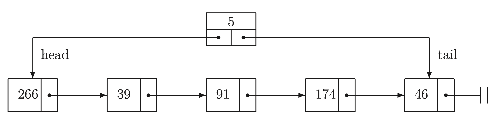

## 0. 题目

**Aufgabe 20:** **Simulation eines Supermarkts, Warteschlangen**

Mit Hilfe von Warteschlangen (Queues), die nach dem FIFO–Prinzip (first in – first out) funk- tionieren, soll der zeitliche Ablauf an den Kassen eines Supermarkts (vereinfacht) simuliert werden.

Schreiben Sie zur Verwaltung einer Warteschlange ein Fortran 95–Modul queuemod (das in der Vorlesung vorgestellte Stack-Modul kann hilfreich sein) mit folgenden Bestandteilen (wenn nichts angegeben ist, sind diese PUBLIC):

a)  Die Definition eines *privaten* Datentyps element, der ein Listenelement mit einer ganz- zahligen Inhaltskomponente (Wageninhaltsmenge = Kassierzeit in Sekunden) und ei- nem Zeiger auf das nachfolgende Element darstellt.

b)  Die Definition eines Datentyps queue (unten beispielhaft abgebildet), der aus 3 *priva- ten* Komponenten besteht: einer ganzen Zahl für die Länge der Warteschlange sowie je einem Zeiger auf das Anfangselement (head) und das Endelement (tail) der War- teschlange. (**Alternative Implementierung: zyklische Liste mit Zugriff (nur) über tail-Pointer.**) Die *Initialisierung* der Datenstruktur (als leere Liste) *muss* in der Typdefinition erfolgen, da es keine Initialisierungsprozedur gibt.



c)  Eine über den generischen Prozedurnamen EMPTY aufrufbare logische Funktion, die testet, ob eine als Argument übergebene Warteschlange vom Typ queue leer ist.

d)  Eine über den generischen Prozedurnamen LENGTH aufrufbare ganzzahlige Funktion, die die Länge einer als Argument übergebenen Warteschlange vom Typ queue liefert.

e)  Eine über den generischen Prozedurnamen GET aufrufbare Funktion, die den Wert der Inhaltskomponente des Kopfelements einer als Argument übergebenen Warteschlange vom Typ queue liefert.

f)  Eine über den generischen Prozedurnamen SET aufrufbare Subroutine, die den Wert der Inhaltskomponente des Kopfelements einer als Argument übergebenen Warteschlange vom Typ queue auf den als zweites Argument übergebenen Wert setzt.

g)  Eine Subroutine ENQUEUE, die am Ende (tail) einer als Argument übergebenen Warte- schlange ein Element vom Typ element einfügt und dessen Inhaltskomponente auf den ebenfalls übergebenen ganzzahligen Wert setzt.

h)  Eine Subroutine DEQUEUE, die am Kopf (head) einer als Argument übergebenen War- teschlange ein Element vom Typ element entfernt, falls dies möglich ist. Ist die Liste leer, ist nichts zu tun.

i)  Eine über den generischen Prozedurnamen PUT aufrufbare Subroutine, die *in einer Zeile* die Inhaltskomponenten (maximal dreistellige natürliche Zahlen) aller Elemente einer übergebenen Warteschlange, bei Übergabe eines *optionalen* Arguments für die *Nummer* der Warteschlange inklusive entsprechenden Texts, auf dem Bildschirm ausgibt. Ist die Warteschlange leer, so ist diese Tatsache auszugeben.

Schreiben Sie ein Fortran 95–Hauptprogramm, das unter Benutzung des Moduls queuemod die Warteschlangen an den Kassen eines Supermarkts über einen einzulesenden *Zeitraum* t > 0 (in Stunden) simuliert. Hierzu werden zunächst die *Anzahl der geöffneten Kassen* k > 0 sowie die *Ankunftswahrscheinlichkeit* w ∈ (0, 1) eines neuen Kunden im Kassenbereich innerhalb eines Zeitschritts (1 Sekunde) eingelesen. Einem Feld von k Warteschlangen (vom Typ queue) ist dynamisch Speicherplatz zuzuweisen.

Die Simulation erfolgt in einer Zeitschleife, wobei jede Iteration einem Zeitschritt von 1 Se- kunde entsprechen soll. In jeder Iteration werden folgende Aktionen ausgeführt:

1. Die Inhaltskomponenten der Anfangselemente aller (nichtleeren) Warteschlangen wer- den um 1 heruntergezählt (Kassiervorgang). Das Anfangselement wird aus einer Warte- schlange genau dann entfernt, wenn durch das Dekrementieren seine Inhaltskomponente null geworden ist (Kassiervorgang beendet).
2. Falls eine (in jedem Zeitschritt neu zu generierende) reelle (Pseudo-)Zufallszahl kleiner als die Ankunftswahrscheinlichkeit w ist, so wird eine *ganze* (Pseudo-)Zufallszahl im Intervall [10, 300] erzeugt. Diese zweite Zufallszahl repräsentiert die Wageninhaltsmen- ge des gerade im Kassenbereich angekommenen Kunden und bestimmt die für seinen Einkaufswagen nötige Kassierzeit in Sekunden. Dieser Wagen wird als neues Element an das Ende (tail) einer der *kürzesten* Warteschlangen angehängt.
3. Immer wenn sich innerhalb eines Zeitschritts der strukturelle Zustand mindestens einer Warteschlange ändert (ein Kunde hat bezahlt oder kommt dazu), ist diese Tatsache mit der aktuellen Zeit (in Sekunden seit Beginn der Simulation) sowie der momentane Zustand aller Warteschlangen auszugeben. Für letzteres empfiehlt sich die Definition einer Subroutine im Hauptprogramm.

**Fakultativ** können Sie verschiedene *Verfeinerungen* vornehmen: eine sinnvolle Ankunfts- wahrscheinlichkeit automatisch berechnen oder die Anzahl der geöffneten Kassen dem je- weils aktuellen Bedarf dynamisch anpassen, den Kassenauswahlalgorithmus verbessern, z.B. indem jede Warteschlange die Summe der zu erwartenden Kassierzeiten mitführt (Effizienz!), personalabhängige (oder zeitvariable) Kassiergeschwindigkeiten einführen, . . .

**Hinweis:** Durch Aufrufe der intrinsischen Subroutine RANDOM_NUMBER(r) erhalten Sie in der reellen Variable r im Intervall [0, 1) gleichverteilte Pseudozufallszahlen. Durch einen Aufruf der intrinsischen Subroutine RANDOM_SEED() zu Beginn der Ausfüh- rung des Programms wird bei jedem Programmlauf eine neue Folge von Pseudo- zufallszahlen generiert, ohne diesen Aufruf immer dieselbe.

## 1. 代码

:::: details Code

::: code-tabs

@tab queuemod

```fortran-fixed-form
module queuemod
    implicit none

    private
    public :: queue, enqueue, dequeue, create_queue, queue_empty, queue_length, put_queue

    type :: element
        integer :: content
        type(element), pointer :: next => null()
    end type element

    type :: queue
        private
        integer :: length = 0
        type(element), pointer :: head => null()
        type(element), pointer :: tail => null()
    end type queue

contains

    function queue_empty(q) result(is_empty)
        type(queue), intent(in) :: q
        logical :: is_empty

        is_empty = .not. associated(q%head)
    end function queue_empty

    function queue_length(q) result(len)
        type(queue), intent(in) :: q
        integer :: len

        len = q%length
    end function queue_length

    subroutine enqueue(q, value)
        type(queue), intent(inout) :: q
        integer, intent(in) :: value
        type(element), pointer :: new_elem

        allocate(new_elem)
        new_elem%content = value
        new_elem%next => null()

        if (queue_empty(q)) then
            q%head => new_elem
            q%tail => new_elem
        else
            q%tail%next => new_elem
            q%tail => new_elem
        end if
        q%length = q%length + 1
    end subroutine enqueue

    subroutine dequeue(q)
        type(queue), intent(inout) :: q
        type(element), pointer :: temp

        if (.not. queue_empty(q)) then
            temp => q%head
            q%head => q%head%next
            if (.not. associated(q%head)) q%tail => null()
            deallocate(temp)
            q%length = q%length - 1
        end if
    end subroutine dequeue

    subroutine put_queue(q)
        type(queue), intent(in) :: q
        type(element), pointer :: current

        if (queue_empty(q)) then
            print*, "Queue is empty"
        else
            current => q%head
            do while(associated(current))
                print*, current%content,
                current => current%next
            end do
            print*
        end if
    end subroutine put_queue

end module queuemod
```

@tab 主程序

```fortran-fixed-form
program supermarket_simulation
    use queuemod
    implicit none

    type(queue), allocatable :: registers(:)
    integer :: num_registers, sim_time, i, j, new_customer_time
    real :: arrival_probability, rand_num
    integer :: seconds

    ! 初始化随机种子
    call random_seed()

    ! 输入参数：模拟时间（小时），收银台数量，顾客到达概率
    print*, "Enter simulation time in hours, number of registers, and arrival probability:"
    read*, sim_time, num_registers, arrival_probability
    sim_time = sim_time * 3600  ! 将小时转换为秒

    ! 分配收银台队列
    allocate(registers(num_registers))

    ! 模拟每秒钟的情况
    do i = 1, sim_time
        ! 处理每个收银台
        do j = 1, num_registers
            if (.not. queue_empty(registers(j))) then
                ! 处理正在结账的顾客
                registers(j)%head%content = registers(j)%head%content - 1
                if (registers(j)%head%content == 0) then
                    call dequeue(registers(j))
                end if
            end if
        end do

        ! 检查是否有新顾客到达
        call random_number(rand_num)
        if (rand_num < arrival_probability) then
            ! 生成新顾客的结账时间
            call random_number(rand_num)
            new_customer_time = int(rand_num * 290 + 10)  ! 10至300秒
            ! 将新顾客添加到最短的队列
            j = minloc([(queue_length(registers(k)), k = 1, num_registers)])
            call enqueue(registers(j), new_customer_time)
        end if

        ! 输出当前状态
        print*, "Time:", i
        do j = 1, num_registers
            print*, "Register", j, ":",
            call put_queue(registers(j))
        end do
    end do

end program supermarket_simulation

```


:::

::::

## 2. 注释代码

:::: details Code

::: code-tabs

@tab `queuemod` 模块的注释版

```fortran-fixed-form
module queuemod
    implicit none

    private
    public :: queue, enqueue, dequeue, create_queue, queue_empty, queue_length, put_queue

    ! 定义element类型，代表队列中的每个元素
    type :: element
        integer :: content  ! 存储整数值，例如顾客的结账时间
        type(element), pointer :: next => null()  ! 指向下一个元素的指针
    end type element

    ! 定义queue类型，代表整个队列
    type :: queue
        private
        integer :: length = 0  ! 队列的长度
        type(element), pointer :: head => null()  ! 指向队列头部的指针
        type(element), pointer :: tail => null()  ! 指向队列尾部的指针
    end type queue

contains

    ! 检查队列是否为空
    function queue_empty(q) result(is_empty)
        type(queue), intent(in) :: q
        logical :: is_empty

        is_empty = .not. associated(q%head)
    end function queue_empty

    ! 获取队列的长度
    function queue_length(q) result(len)
        type(queue), intent(in) :: q
        integer :: len

        len = q%length
    end function queue_length

    ! 在队列尾部添加新元素
    subroutine enqueue(q, value)
        type(queue), intent(inout) :: q
        integer, intent(in) :: value
        type(element), pointer :: new_elem

        allocate(new_elem)
        new_elem%content = value
        new_elem%next => null()

        if (queue_empty(q)) then
            q%head => new_elem
            q%tail => new_elem
        else
            q%tail%next => new_elem
            q%tail => new_elem
        end if
        q%length = q%length + 1
    end subroutine enqueue

    ! 从队列头部移除元素
    subroutine dequeue(q)
        type(queue), intent(inout) :: q
        type(element), pointer :: temp

        if (.not. queue_empty(q)) then
            temp => q%head
            q%head => q%head%next
            if (.not. associated(q%head)) q%tail => null()
            deallocate(temp)
            q%length = q%length - 1
        end if
    end subroutine dequeue

    ! 打印队列中所有元素的值
    subroutine put_queue(q)
        type(queue), intent(in) :: q
        type(element), pointer :: current

        if (queue_empty(q)) then
            print*, "Queue is empty"
        else
            current => q%head
            do while(associated(current))
                print*, current%content,
                current => current%next
            end do
            print*
        end if
    end subroutine put_queue

end module queuemod
```

@tab 主程序的注释版

```fortran-fixed-form
program supermarket_simulation
    use queuemod  ! 使用自定义的队列模块
    implicit none

    type(queue), allocatable :: registers(:)  ! 动态数组，存储每个收银台的队列
    integer :: num_registers, sim_time, i, j, new_customer_time
    real :: arrival_probability, rand_num
    integer :: seconds

    ! 初始化随机种子，以确保每次运行程序时产生不同的随机数
    call random_seed()

    ! 输入模拟时间（小时）、收银台数量和顾客到达概率
    print*, "Enter simulation time in hours, number of registers, and arrival probability:"
    read*, sim_time, num_registers, arrival_probability
    sim_time = sim_time * 3600  ! 将小时转换为秒

    ! 为每个收银台分配队列空间
    allocate(registers(num_registers))

    ! 主循环，每次循环代表一秒钟
    do i = 1, sim_time
        ! 遍历每个收银台的队列
        do j = 1, num_registers
            if (.not. queue_empty(registers(j))) then
                ! 递减正在结账顾客的剩余时间
                registers(j)%head%content = registers(j)%head%content - 1
                if (registers(j)%head%content == 0) then
                    ! 结账完成，移除顾客
                    call dequeue(registers(j))
                end if
            end if
        end do

        ! 检查新顾客是否到达
        call random_number(rand_num)
        if (rand_num < arrival_probability) then
            ! 生成一个新顾客的结账时间
            call random_number(rand_num)
            new_customer_time = int(rand_num * 290 + 10)  ! 时间在10到300秒之间
            ! 将新顾客添加到最短的队列中
            j = minloc([(queue_length(registers(k)), k = 1, num_registers)])
            call enqueue(registers(j), new_customer_time)
        end if

        ! 输出当前时间和每个收银台的状态
        print*, "Time:", i
        do j = 1, num_registers
            print*, "Register", j, ":",
            call put_queue(registers(j))
        end do
    end do

end program supermarket_simulation
```


:::

::::

## 3. 电脑运行

要在 macOS 上编译和运行 Fortran 代码，你需要先安装一个 Fortran 编译器。在 macOS 上，通常推荐使用 `gfortran`，它是 GNU  Fortran 编译器的一部分，兼容 Fortran 95 和更高版本的代码。

### 3.1 步骤 1: 安装 `gfortran`

你可以通过Homebrew来安装 `gfortran`。如果你还没有安装Homebrew，可以先安装它。打开终端（Terminal）并执行以下命令：

```bash
/bin/bash -c "$(curl -fsSL https://raw.githubusercontent.com/Homebrew/install/HEAD/install.sh)"
```

安装完Homebrew后，你可以使用以下命令来安装 `gfortran`：

```bash
brew install gcc
```

### 3.2 步骤 2: 保存你的Fortran代码

假设你已经将上面的模块和主程序保存为两个文件：`queuemod.f95` 和 `supermarket_simulation.f95`。

### 3.3 步骤 3: 编译代码

打开终端，导航到包含这两个文件的目录，然后使用 `gfortran` 来编译这些文件。你可以使用以下命令：

```bash
gfortran -o supermarket_simulation queuemod.f95 supermarket_simulation.f95
```

这将编译这两个文件，并生成一个可执行文件名为 `supermarket_simulation`。

### 3.4 步骤 4: 运行程序

在终端中，你可以通过以下命令来运行这个程序：

```bash
./supermarket_simulation
```

按照程序提示输入所需的数据（模拟时间、收银台数量、顾客到达概率），然后程序将开始模拟并显示输出结果。


