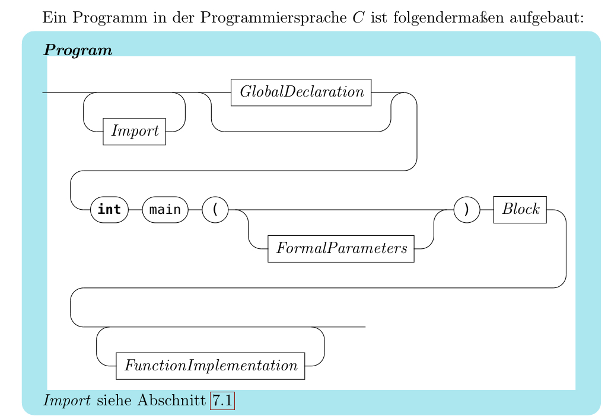
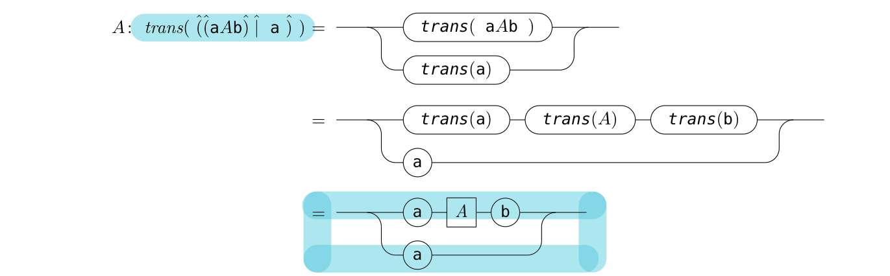

## Question 1

## Solution 1

这个图描述了 C 语言程序的基本结构。

我大概解释一下：

1. **Program**: 代表整个 C 语言程序。

2. **Import**: 这部分代表 C 语言中的导入语句。例如，当我们想要使用标准库函数时，我们会使用 `#include` 语句导入相应的头文件。

3. **GlobalDeclaration**: 这部分代表全局变量和函数的声明。

4. **int main()**: 这是 C 程序的主入口点。每个 C 程序都有一个 `main` 函数。

5. **FormalParameters**: 这部分代表 `main` 函数或其他函数的形式参数。形式参数是在函数声明时定义的变量。（也可以理解为参数）

6. **Block**: 这是一个代码块，通常由花括号`{ }`包围。这里包含了 `main` 函数或其他函数的实际执行代码。

7. **FunctionImplementation**: 这部分代表其他函数的实现，这些函数可以在 `main` 函数或其他函数中被调用。

图中的箭头显示了这些组件之间的关系和流程。

## Question 2

## Solution 2

上面的图，具体作用不是很清楚，但是大概逻辑我给你写一下：

1. **开始**: 一切从左边的公式开始，`A: trans( ((aAb) | a) )`。这表示一个转换操作 `trans` 应用在某种组合上，这个组合是 `((aAb) | a)`。

2. **第一步**: 这个组合被拆分为两部分：`aAb` 和 `a`，这由中间的箭头表示。所以，可以看到有两个并行的转换路径，一个是对 `aAb` 的转换，另一个是对单个元素 `a` 的转换。

3. **第二步**: 对于 `aAb`  这部分，它进一步被拆分为`a`, `A`, 和`b`。这由 `trans(a)`, `trans(A)`, 和 `trans(b)` 这三个方框表示。此外，对于单个元素 `a`，它直接被转换，如 `trans(a)` 所示。

4. **第三步**: 图中的下半部分应该是表示这些元素如何在转换后被重新组合。这个组合由一个较大的框包围，其中包含了两个 `a` 和一个 `A` 与 `b` 的组合。

综上所述，这个图的主要目的是显示如何对表达式 `((aAb) | a)` 进行转换。首先，它将这个表达式拆分为多个子部分，并对每个子部分进行转换。然后，它显示了这些已转换的部分如何被重新组合。

::: details 公众号：AI悦创【二维码】

:::

::: info AI悦创·编程一对一

AI悦创·推出辅导班啦，包括「Python 语言辅导班、C++ 辅导班、java 辅导班、算法/数据结构辅导班、少儿编程、pygame 游戏开发、Web、Linux」，全部都是一对一教学：一对一辅导 + 一对一答疑 + 布置作业 + 项目实践等。当然，还有线下线上摄影课程、Photoshop、Premiere 一对一教学、QQ、微信在线，随时响应！微信：Jiabcdefh

C++ 信息奥赛题解，长期更新！长期招收一对一中小学信息奥赛集训，莆田、厦门地区有机会线下上门，其他地区线上。微信：Jiabcdefh

方法一：[QQ](http://wpa.qq.com/msgrd?v=3&uin=1432803776&site=qq&menu=yes)

方法二：微信：Jiabcdefh

:::

