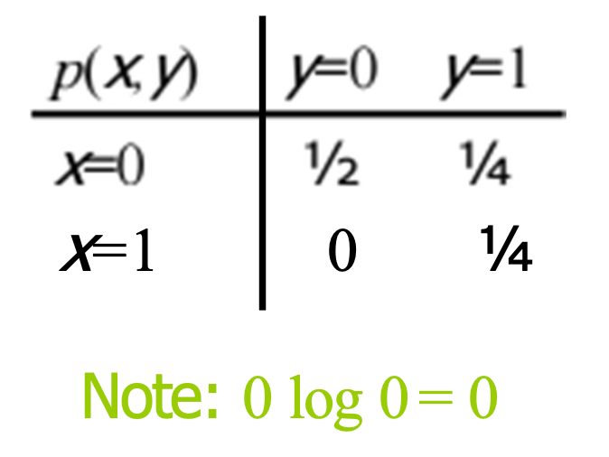
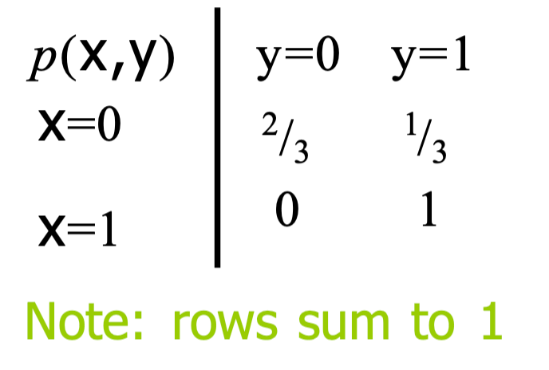
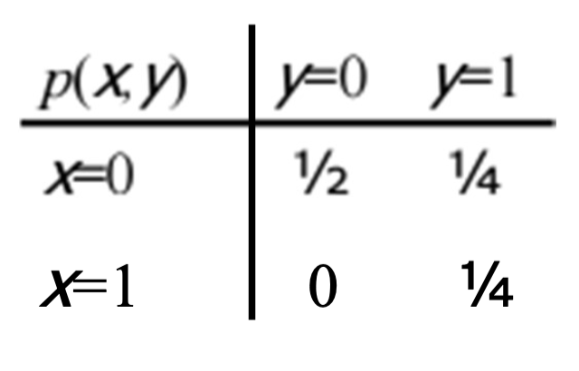

Problem 1. Let $(X,Y)$ have the right joint distributions: Find $H(X, Y)$​.



上面展示了一个二维离散随机变量 $(X, Y)$ 的联合概率分布表。可以用这个表来计算 $(X, Y)$ 的联合熵 $H(X, Y)$。

联合熵 $H(X, Y)$ 的定义是：

$H(X, Y) = -\sum_{x \in \mathcal{X}}\sum_{y \in \mathcal{Y}} p(x, y) \log_2 p(x, y)$

其中 $p(x, y)$ 是 $(X, Y)$ 取特定值的概率，而 $\mathcal{X}$ 和 $\mathcal{Y}$ 分别是 $X$ 和 $Y$​ 的值域。

在这个特定的例子中，有四个概率值：$1/2, 1/4, 0, 1/4$。

注意：在计算熵的时候，如果概率 $p(x, y)$ 为 0，那么相应的项 $p(x, y) \log_2 p(x, y)$ 也为 0（根据图片下方的注释：“Note: $0 \log 0 = 0$”）。

所以我们只需要计算非零概率对应的项：

$H(X, Y) = -(1/2 \log_2 1/2 + 1/4 \log_2 1/4 + 1/4 \log_2 1/4)$

下面我们来计算这个式子。

$(X, Y)$ 的联合熵 $H(X, Y)$​ 是 1.5 比特。

我是用 Python 计算的：

```python
import math

# 概率值
p1 = 1/2
p2 = 1/4
# 因为概率为0的项在熵的计算中贡献为0，所以我们只需要计算非零概率项

# 计算熵
H_XY = -(p1 * math.log2(p1) + 2 * p2 * math.log2(p2))

H_XY
```


Problem 2. Let $(X,Y)$ have the right joint distributions: Find $H(Y|X)$ , $H(X|Y)$​ .




题目给出了另一个二维离散随机变量 $(X, Y)$ 的联合概率分布表。可以用这个表来计算条件熵 $H(Y|X)$ 和 $H(X|Y)$。

条件熵 $H(Y|X)$ 的定义是：

$H(Y|X) = -\sum_{x \in \mathcal{X}} p(x) \sum_{y \in \mathcal{Y}} p(y|x) \log_2 p(y|x)$

其中 $p(x)$ 是 $X$ 取特定值的边际概率，$p(y|x)$ 是给定 $X=x$ 时 $Y$ ​的条件概率。

类似地，$H(X|Y)$ 定义为：

$H(X|Y) = -\sum_{y \in \mathcal{Y}} p(y) \sum_{x \in \mathcal{X}} p(x|y) \log_2 p(x|y)$

在这个表中，给出的是联合概率 $p(x, y)$ ，可以从表中直接读取条件概率：

- 对于$H(Y|X)$：
  - 当 $x=0$ 时，$p(y=0|x=0)=2/3$，$p(y=1|x=0)=1/3$；
  - 当 $x=1$ 时，$p(y=0|x=1)=0$，$p(y=1|x=1)=1$。

- 对于 $H(X|Y)$：
  - 当 $y=0$ 时，$p(x=0|y=0)=1$（因为 $x=1$ 的概率为 0，所以不影响熵）；
  - 当 $y=1$ 时，$p(x=0|y=1)=1/3$，$p(x=1|y=1)=2/3$。

现在可以计算条件熵。

因为当 $x=1$ 时，$Y$ 只能取 1 的值，所以 $H(Y|X=1)=0$。而当 $y=0$ 时，$X$ 只能取 0 的值，所以 $H(X|Y=0)=0$。现在我们只需要计算 $H(Y|X=0)$ 和 $H(X|Y=1)$ 。

$(X, Y)$ 的条件熵 $H(Y|X)$ 是大约 0.6122 比特，$H(X|Y)$​ 是大约 0.3061 比特。

```python
# 给定X时Y的条件概率
p_Y_given_X0 = [2/3, 1/3]
p_Y_given_X1 = [0, 1]  # 这里其实只有一个有效值，因为0*log0=0

# 给定Y时X的条件概率
p_X_given_Y0 = [1, 0]  # 这里其实只有一个有效值，因为0*log0=0
p_X_given_Y1 = [1/3, 2/3]

# 边际概率
p_X = [2/3, 1/3]  # X=0和X=1的边际概率
p_Y = [2/3, 1/3]  # Y=0和Y=1的边际概率

# 计算H(Y|X)
H_Y_given_X0 = -sum(p * math.log2(p) for p in p_Y_given_X0)
H_Y_given_X = p_X[0] * H_Y_given_X0  # 因为H(Y|X=1)=0，所以只计算X=0的情况

# 计算H(X|Y)
H_X_given_Y1 = -sum(p * math.log2(p) for p in p_X_given_Y1)
H_X_given_Y = p_Y[1] * H_X_given_Y1  # 因为H(X|Y=0)=0，所以只计算Y=1的情况

H_Y_given_X, H_X_given_Y
```


Problem 3. Let $(X,Y)$ have the right joint distributions: Find $H(X)$ , $H(Y)$ , $H(Y)-H(X|Y)$​ .




题目提供的是随机变量 $(X, Y)$ 的联合概率分布表。

可以使用这个表来计算 $H(X)$，$H(Y)$ 以及差值 $H(Y) - H(X|Y)$。

首先，边际熵 $H(X)$ 和 $H(Y)$ 的定义分别是：

$H(X) = -\sum_{x \in \mathcal{X}} p(x) \log_2 p(x)$

$H(Y) = -\sum_{y \in \mathcal{Y}} p(y) \log_2 p(y)$

其中 $p(x)$ 和 $p(y)$ 分别是 $X$ 和 $Y$​ 的边际概率。

从表中可以看出：
- $X=0$ 时的概率 $p(X=0)=1/2+1/4=3/4$
- $X=1$ 时的概率 $p(X=1)=1/4$
- $Y=0$ 时的概率 $p(Y=0)=1/2$
- $Y=1$ 时的概率 $p(Y=1)=1/4+1/4=1/2$

接下来，计算 $H(X)$ 和 $H(Y)$。

然后，计算 $H(X|Y)$​，定义为：

$H(X|Y) = -\sum_{y \in \mathcal{Y}} p(y) \sum_{x \in \mathcal{X}} p(x|y) \log_2 p(x|y)$

已知：

- 当 $Y=0$ 时，$p(X=0|Y=0)=1/2 / 1/2 = 1$，$p(X=1|Y=0)=0$
- 当 $Y=1$ 时，$p(X=0|Y=1)=1/4 / 1/2 = 1/2$，$p(X=1|Y=1)=1/4 / 1/2 = 1/2$

最后计算 $H(Y) - H(X|Y)$ 。

$H(X)$ 的值是大约 0.8113 比特，$H(Y)$ 的值是 1 比特，$H(Y) - H(X|Y)$ 的值是 0.5 比特。

```python
# 计算H(X)
p_X = [3/4, 1/4]
H_X = -sum(p * math.log2(p) for p in p_X)

# 计算H(Y)
p_Y = [1/2, 1/2]
H_Y = -sum(p * math.log2(p) for p in p_Y)

# 计算H(X|Y)
# 当Y=0时, p(X=0|Y=0)=1, p(X=1|Y=0)=0, 因此H(X|Y=0)=0
# 当Y=1时, p(X=0|Y=1)=1/2, p(X=1|Y=1)=1/2
p_X_given_Y1 = [1/2, 1/2]
H_X_given_Y1 = -sum(p * math.log2(p) for p in p_X_given_Y1)
# H(X|Y)是Y各值的概率加权的H(X|Y=y)之和
H_X_given_Y = p_Y[1] * H_X_given_Y1  # 因为H(X|Y=0)=0，所以这里只计算Y=1的情况

# 计算H(Y) - H(X|Y)
difference = H_Y - H_X_given_Y

H_X, H_Y, difference
```


::: details 公众号：AI悦创【二维码】


:::

::: info AI悦创·编程一对一

AI悦创·推出辅导班啦，包括「Python 语言辅导班、C++ 辅导班、java 辅导班、算法/数据结构辅导班、少儿编程、pygame 游戏开发、Web、Linux」，全部都是一对一教学：一对一辅导 + 一对一答疑 + 布置作业 + 项目实践等。当然，还有线下线上摄影课程、Photoshop、Premiere 一对一教学、QQ、微信在线，随时响应！微信：Jiabcdefh

C++ 信息奥赛题解，长期更新！长期招收一对一中小学信息奥赛集训，莆田、厦门地区有机会线下上门，其他地区线上。微信：Jiabcdefh

方法一：[QQ](http://wpa.qq.com/msgrd?v=3&uin=1432803776&site=qq&menu=yes)

方法二：微信：Jiabcdefh

:::

