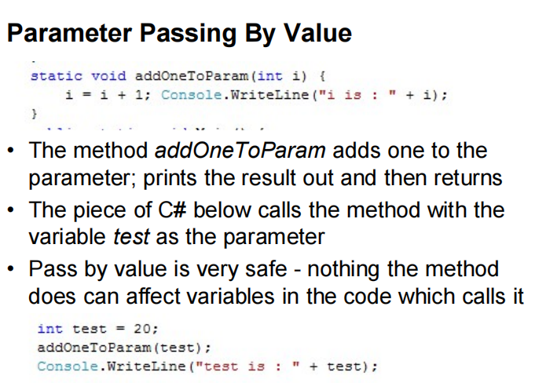
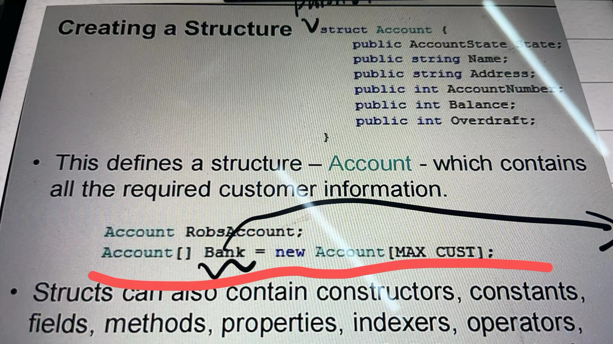
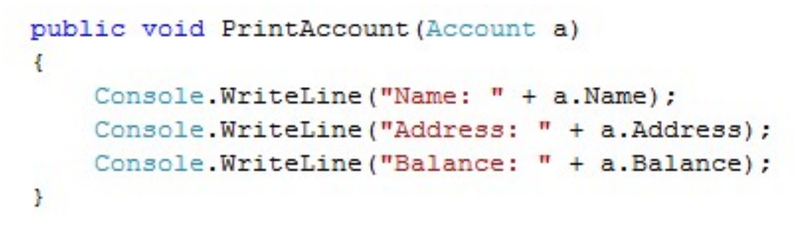
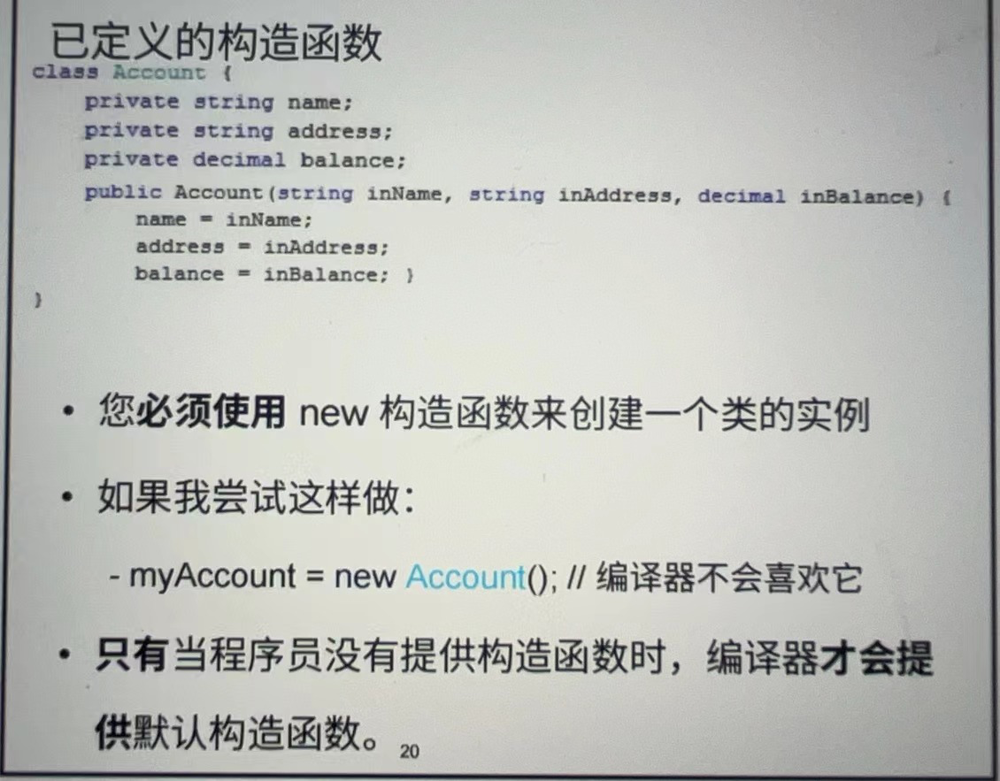
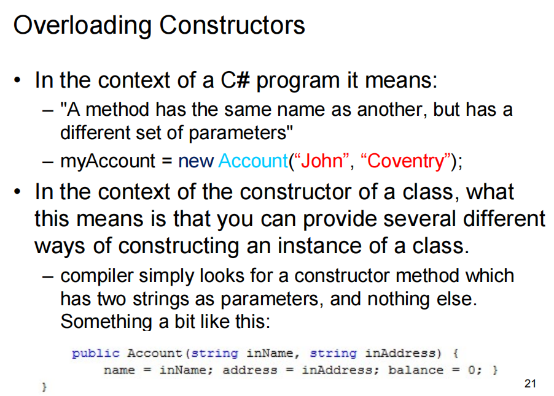

## 题目 1

You are developing an invoicing application that calculates discount percentages based on the quantity of a product purchased. The logic for calculating discounts is listed in the following decision table. You need to write a C# method that uses the same logic to calculate the discount. Code a C# program to test your method.

|          | Quantity |      |      |      |      |
| -------- | -------- | ---- | ---- | ---- | ---- |
| Discount | < 10     | Y    | N    | N    | N    |
| Discount | < 50     | Y    | Y    | N    | N    |
| Discount | < 100    | Y    | Y    | Y    | N    |

```cs
class Program
{
    static void Main(string[] args) 
    {
        // 测试几个不同数量的折扣计算
        Console.WriteLine("购买数量为5，折扣为：" + CalculateDiscount(5) + "%");
        Console.WriteLine("购买数量为25，折扣为：" + CalculateDiscount(25) + "%");
        Console.WriteLine("购买数量为75，折扣为：" + CalculateDiscount(75) + "%");
        Console.WriteLine("购买数量为150，折扣为：" + CalculateDiscount(150) + "%");
    }
    // 根据购买数量计算折扣的方法
    static int CalculateDiscount(int quantity)
    {
        if (quantity < 10)
        {
            return 0;  // 数量小于10，没有折扣
        }
        else if (quantity < 50)
        {
            return 10; // 数量在10到49之间，折扣为10%
        }
        else if (quantity < 100)
        {
            return 20; // 数量在50到99之间，折扣为20%
        }
        else
        {
            return 30; // 数量大于等于100，折扣为30%
        }
    }
}
```


## Question 1

`string[] args` 在 C# 中是一个传递给 `Main` 方法的参数，代表了一个字符串数组。这个数组包含了启动程序时传递给应用程序的命令行参数。每一个命令行参数都是数组中的一个元素。

这里有一个简单的例子来说明如何使用 `string[] args`:

```csharp
class Program
{
    static void Main(string[] args)
    {
        Console.WriteLine("命令行参数的数量: " + args.Length);
        for (int i = 0; i < args.Length; i++)
        {
            Console.WriteLine("参数 " + (i + 1) + ": " + args[i]);
        }
    }
}
```

如果你通过命令行运行这个程序，并且传递一些参数，如下所示：

```bash
dotnet run 参数1 参数2 参数3
```

输出将会是：

```
命令行参数的数量: 3
参数 1: 参数1
参数 2: 参数2
参数 3: 参数3
```

`string[] args` 的使用场景包括但不限于：

- **读取配置**: 程序启动时可能需要某些配置，可以通过命令行参数传入。
- **控制程序行为**: 根据不同的参数，程序可以执行不同的任务或者以不同的模式运行。
- **接收文件路径**: 命令行参数常用于传递文件或目录路径给程序处理。
- **设置日志级别**: 在启动时，通过参数指定日志的详细程度，例如debug或verbose模式。
- **开关特性**: 启用或禁用程序的特定特性。

在图形界面应用程序或其他不经常从命令行启动的应用中，`string[] args` 可能不会那么常用。但在命令行工具、批处理作业或者需要从其他程序中启动并传递数据的情况下，它是非常重要的。

## 题目 2

You are developing a library of mathematical functions. You first develop the following flowchart (see the diagram 1) describing the algorithm for calculating the factorial of a number. You need to code an equivalent C# program for this flowchart. Code and test your C# program.

```cs
// 引入System命名空间，这允许我们使用基础的系统功能，比如Console类
using System;

// 定义一个名为Program的类，它包含我们程序的入口点
class Program
{
    // Main方法是程序的入口点。args数组包含了传递给程序的命令行参数
    static void Main(string[] args)
    {
        // 向用户提示输入一个整数，以便计算其阶乘
        Console.WriteLine("请输入一个整数计算其阶乘：");
        
        // 读取用户输入，并将其从字符串转换为整数
        int n = Convert.ToInt32(Console.ReadLine());
        
        // 调用Factorial方法计算输入数的阶乘，并将结果存储在变量fact中
        int fact = Factorial(n);
        
        // 输出结果，$符号允许我们在字符串中插入变量
        Console.WriteLine($"{n}的阶乘是：{fact}");
    }

    // Factorial方法接受一个整数参数n，并返回其阶乘的计算结果
    static int Factorial(int n)
    {
        // 初始化fact变量为1，它将用来存储阶乘的结果
        int fact = 1;
        
        // 当n大于1时，执行循环体内的代码
        while (n > 1)
        {
            // 将fact的当前值乘以n，并将结果重新赋值给fact
            fact *= n;  // 等同于 fact = fact * n;
            
            // 将n的值减1
            n -= 1;     // 等同于 n = n - 1;
        }
        
        // 返回fact，此时它存储了n的阶乘
        return fact;
    }
}

```


C# 中的结构体（Structs）是一种值类型数据结构，它可以封装多个不同类型的数据项。结构体是通过`struct`关键字定义的，它们通常用于表示轻量级的对象。

与类（Classes）相比，结构体有几个关键的区别：

1. **值类型**：结构体是值类型，这意味着它们在赋值或传递给函数时会被复制。相比之下，类是引用类型，赋值或传递时只是复制引用，而不是对象本身。

2. **堆栈分配**：因为是值类型，结构体通常在栈上分配内存，而类的实例则在堆上分配内存。

3. **不支持继承**：结构体不能继承其他的结构体或类，并且不能作为基础结构体或类。

4. **无需使用`new`关键字**：虽然可以使用`new`来创建结构体的实例，但不使用`new`也可以直接声明。

5. **构造函数**：结构体可以有构造函数，但所有字段必须在构造函数结束前被赋值。

下面是一个C#结构体的简单例子：

```csharp
public struct Point
{
    public int X;
    public int Y;
    
    public Point(int x, int y)
    {
        X = x;
        Y = y;
    }
}

// 使用结构体的例子
Point p = new Point(1, 2);
Point p2 = p; // 这里发生了复制，p2是p的一个新副本
```

这个例子中，`Point`结构体包含了两个整数字段`X`和`Y`，它可以用来表示一个二维平面上的点。这个结构体还有一个构造函数，它允许在创建新的`Point`实例时初始化`X`和`Y`。当`p2`被赋值为`p`时，`p`的内容被复制到了`p2`，它们成为了两个独立的对象。


### 类（Class）
类是一个蓝图，它定义了一组特定类型的对象的结构和行为。它指定了对象应该拥有的数据（属性、字段）以及对象可以执行的操作（方法）。

### 对象（Object）
对象是根据类创建的实体。每个对象都拥有类中定义的属性和方法。在程序运行时，对象是在内存中动态创建的，并可以通过方法调用和属性访问来操作。

### 属性（Properties）
属性是对象的特征，如颜色、大小、形状等。在C#中，属性通常使用字段（私有变量）和公共的get和set访问器来实现。

### 方法（Methods）
方法是对象能够执行的操作。你可以想象方法是对象可以接收的指令。方法可以改变对象的内部状态或执行一些计算。

### 实例化（Instantiation）
实例化是创建类的一个新对象的过程。这通常是使用`new`关键字以及类的构造函数完成的。

### 构造函数（Constructors）
构造函数是一种特殊的方法，当创建类的新实例时自动调用。它通常用于初始化对象的属性或执行其他启动任务。

---

## Practical Task

Practical Task Learn practically about aspects of data protection – the Learn.Microsoft from the Resource 1, (see below for the Resources section).

1. Code an example of a traffic light controller that uses the following enumerator:

```cs
enum TrafficLight { Red, Green, Amber };
```

Tip: you could consider an example given during the lecture

You should provide a test class to demonstrate the functionality

You should provide a test class to demonstrate the functionality

2. Codeanobject-orientedversionofafamous“HelloWorld”program.Yourversion should include a class encapsulating a greeting string and have the following:

- default constructor with greeting “Hello World”
- constructor with a string parameter to specify the greeting
- method SetGreeting() and GetGreeting() that could be used to specify the greeting for an object after it has been constructed and to display the current greeting accordingly

You should provide a test class to demonstrate the functionality Make notes for your own reference.

---

::: code-tabs

@tab Code1

```cs
using System;

// 定义一个枚举，代表交通信号灯的三种状态：红灯、绿灯、黄灯
enum TrafficLight { Red, Green, Amber }

class TrafficLightController
{
    // 定义一个私有变量来存储当前的信号灯状态
    private TrafficLight currentLight;

    // 构造函数，初始化交通信号灯状态为红灯
    public TrafficLightController()
    {
        currentLight = TrafficLight.Red;
    }

    // 方法：改变信号灯的状态
    public void ChangeLight()
    {
        // 使用switch语句来根据当前的信号灯状态切换到下一个状态
        switch (currentLight)
        {
            case TrafficLight.Red:
                currentLight = TrafficLight.Green; // 红灯变绿灯
                break;
            case TrafficLight.Green:
                currentLight = TrafficLight.Amber; // 绿灯变黄灯
                break;
            case TrafficLight.Amber:
                currentLight = TrafficLight.Red; // 黄灯变红灯
                break;
        }

        // 输出当前的信号灯状态
        Console.WriteLine($"当前信号灯状态: {currentLight}");
    }
}

class TestTrafficLightController
{
    static void Main(string[] args)
    {
        // 创建TrafficLightController的实例
        TrafficLightController controller = new TrafficLightController();

        // 模拟信号灯变化
        controller.ChangeLight(); // 切换一次信号灯
        controller.ChangeLight(); // 再切换一次
        controller.ChangeLight(); // 再切换一次
    }
}
```

@tab Code2

```cs
using System;

class HelloWorld
{
    // 定义一个私有变量来存储问候语
    private string greeting;

    // 默认构造函数，设置默认问候语为"Hello World"
    public HelloWorld() : this("Hello World") {}

    // 带有字符串参数的构造函数，允许设置自定义的问候语
    public HelloWorld(string greeting)
    {
        this.greeting = greeting; // 使用this关键字指明当前实例的greeting属性
    }

    // 设置问候语的方法，允许在对象创建后改变问候语
    public void SetGreeting(string greeting)
    {
        this.greeting = greeting; // 更新问候语
    }

    // 获取当前问候语的方法
    public string GetGreeting()
    {
        return greeting; // 返回当前的问候语
    }
}

class TestHelloWorld
{
    static void Main(string[] args)
    {
        // 创建HelloWorld的实例，使用默认问候语
        HelloWorld hello = new HelloWorld();
        Console.WriteLine(hello.GetGreeting()); // 输出默认问候语

        // 改变问候语并输出
        hello.SetGreeting("你好，世界");
        Console.WriteLine(hello.GetGreeting()); // 输出新设置的问候语
        
        // 使用参数化构造函数创建新实例并输出问候语
        HelloWorld customHello = new HelloWorld("早上好");
        Console.WriteLine(customHello.GetGreeting()); // 输出参数化构造函数设置的问候语
    }
}
```


:::


有一个 `Account` 类，可能会在其中声明一个静态成员来跟踪所有账户的总数。由于这个总数是跟踪所有实例的共同属性，因此它被声明为静态的。这样，无论你创建多少个 `Account` 对象，总数只存储一次，并且由所有 `Account` 对象共享。

重载（Overloading）是面向对象编程中的一个概念，它允许你在同一个作用域内创建多个具有相同名称但是参数列表不同的方法或构造函数。当调用一个重载的方法或构造函数时，编译器根据调用时提供的参数类型、数量和顺序来决定使用哪一个具体的方法或构造函数。这就是多态的一种形式，称为编译时多态或静态多态。

重载的规则：

1. **方法名称相同**：重载的方法必须有相同的名称。
2. **参数列表不同**：可以是参数的数量不同、参数类型不同或者参数的顺序不同。
3. **返回类型无关**：重载的方法可以有不同的返回类型，但仅返回类型不同不足以构成重载。
4. **访问修饰符无关**：访问修饰符的不同也不影响方法的重载。

以下是一个简单的C#示例，展示了方法重载的概念：

```cs
class Calculator
{
    // 第一个Add方法，接收两个整数参数
    public int Add(int a, int b)
    {
        return a + b;
    }

    // 重载的Add方法，接收三个整数参数
    public int Add(int a, int b, int c)
    {
        return a + b + c;
    }

    // 另一个重载的Add方法，接收两个双精度浮点数参数
    public double Add(double a, double b)
    {
        return a + b;
    }
}

class Program
{
    static void Main()
    {
        Calculator calc = new Calculator();

        // 调用第一个Add方法
        int sum1 = calc.Add(2, 3);

        // 调用重载的Add方法（三个整数参数）
        int sum2 = calc.Add(1, 2, 3);

        // 调用重载的Add方法（两个双精度浮点数参数）
        double sum3 = calc.Add(2.5, 3.5);
    }
}
```

在这个例子中，`Calculator` 类有三个名为 `Add` 的方法，它们根据参数列表的不同被重载。当在 `Main` 方法中调用 `Add` 方法时，编译器会根据提供的参数类型和数量来决定使用哪一个 `Add` 方法。这样，相同的方法名称可以用于执行类似但参数不同的任务。


## 6. 简述以下算法的功能(队列qu的元素类型力ElemType)。

```c
using System.Reflection.Metadata.Ecma335;

bool fun(SqQueue *&qu,int i)
{
    ElemType e;int j;
    int n = (qu->rear - qu->front + MaxSize) % MaxSize;
    if(i<1 || i>n)return false;
    for (j = 1; j <= n; j++)
    {
        deQueue(qu, e);
        if (j != i)
            enQueue(qu, e);
    }
    return true;
}
```

该算法的功能是从一个循环队列 `qu` 中删除位于特定位置 `i` 的元素。算法步骤如下：

1. **计算队列当前长度**：首先，算法通过 `qu->rear - qu->front + MaxSize) % MaxSize` 计算出队列 `qu` 当前的元素数量 `n`。这里使用的计算方法考虑了循环队列的特性，确保即使在 `rear` 索引小于 `front` 索引的情况下也能正确计算出队列的长度。
2. **检查给定位置的有效性**：接着，算法检查参数 `i`（表示要删除的元素的位置）是否在有效范围内，即是否大于0且不超过队列长度 `n`。如果 `i` 无效（即 `i<1` 或 `i>n`），则函数返回 `false`，表示删除操作失败。
3. **删除指定位置的元素**：算法通过一个循环遍历队列中的元素，使用 `deQueue(qu, e)` 从队列中逐个移除元素，并将不需要删除的元素（即那些位置 `j` 不等于 `i` 的元素）通过 `enQueue(qu, e)` 再次加入到队列中。这个过程中，位于位置 `i` 的元素被移除，而不会被重新加入队列。
4. **返回操作成功的标志**：如果上述步骤成功执行，算法返回 `true`，表示元素成功从队列中删除。

这个算法有效地在不直接访问队列内部数据结构的情况下，通过队列的基本操作（入队和出队）来移除特定位置的元素。不过，这种方法效率不高，尤其是当队列很大且要删除的元素位置靠近队列末尾时，因为它需要移除并重新插入大量的元素。

## 什么是环形队列?采用什么方法实现环形队列?

环形队列是一种使用有限的存储空间实现队列的数据结构，它允许在队列的末端移除元素的同时，在队列的前端添加新的元素，这种结构形成了一个环状的循环。环形队列的一个关键优点是在使用数组实现队列时，能够有效地利用空间，解决了使用普通队列时出现的“假溢出”问题，即数组还有空间但是由于队列头部的空间已经被释放却不能被再次使用的问题。

**实现方法：**

环形队列通常采用固定大小的数组以及两个指针（索引变量）来实现，这两个指针分别指示队列的头部和尾部：

1. **数组**： 用于存储队列中的元素，其大小预先定义并且是固定的。
2. **头指针（Front）**：指向队列中的第一个元素。如果队列为空，则不具体指向任何元素。
3. **尾指针（Rear）**：指向队列中最后一个元素的下一个位置，这个特定的空位置预留用于添加新的元素。这意味着如果队列是满的，尾指针会指向一个空位置，这个位置紧邻头指针之前的位置。

**环形队列的关键操作**

- **入队（Enqueue）**：将一个元素添加到队列尾部。首先检查队列是否已满，然后将新元素插入尾指针指示的位置，之后将尾指针向前移动一位。如果尾指针达到数组的末端，它会被自动重置到数组的开头，形成一个环形。
- **出队（Dequeue）**：从队列头部移除一个元素。首先检查队列是否为空，然后访问头指针指示的元素，并将头指针向前移动一位。同样地，如果头指针达到数组的末端，它会被自动重置到数组的开头。

**环形队列的判断条件**

- **队列为空的条件**：头指针和尾指针相等且指向同一位置。
- **队列为满的条件**：尾指针的下一个位置是头指针的位置，即 `(rear + 1) % MaxSize == front`。

通过这种方式，环形队列可以高效地利用数组空间，避免在队列未满的情况下无法添加新元素的问题。

## 8. 环形队列一定优于非环形队列吗?在什么情况下使用非环形队列?

环形队列并不一定在所有情况下都优于非环形队列（线性队列）。环形队列和非环形队列各有其优缺点，适用于不同的场景。选择使用哪一种队列结构通常取决于特定应用的需求和限制。

**环形队列的优势**

1. **空间利用率高**：环形队列可以有效解决非环形队列可能遇到的“假溢出”问题，即在数组的前端还有空间时，却因为后端没有空间而不能继续添加元素的情况。

2. **适用于缓冲区**：环形队列非常适合作为固定大小的缓冲区，例如在硬件中断管理、网络通信中的数据包缓存等场景。

**非环形队列的优势**

1. **实现简单**：非环形队列的实现通常比环形队列简单，尤其是当使用链表等动态数据结构时，可以无需担心空间利用和溢出问题。

2. **动态扩容**：当使用链表等结构实现非环形队列时，队列可以根据需要动态增长，不受固定数组大小的限制。这使得非环形队列更适合元素数量不确定或可能非常大的情况。

**选择考虑因素**

- **空间限制**：如果操作环境对空间有限制（例如嵌入式系统），环形队列可能更受青睐。

- **队列大小变化**：如果队列的元素数量变化不大，或者可以预先估计其大小范围，环形队列是一个好选择。如果元素数量非常大或不可预测，使用链表实现的非环形队列可能更合适。

- **操作复杂性**：如果应用场景需要频繁地进行入队和出队操作，并且对操作效率有较高要求，环形队列能够提供更高的效率。对于不太关注操作效率，或者元素处理速度不是瓶颈的场景，非环形队列的简单性可能更有优势。

总的来说，没有一种队列结构是在所有情况下都最优的。根据具体应用的需求、空间和时间效率的考虑，以及实现的复杂度，选择最适合的队列类型。

## 答疑

### Q1

> 这个最后输出的test 是被函数修改过的test 还是就是初始的20呀




> 20

::: tabs

@tab Code1

在C#中，如果你想让一个方法能够修改传入参数的值，并且这个改变反映到方法外部，可以使用 `ref` 关键字。这种方式被称为按引用传递（pass by reference）。在这种情况下，你不是传递参数的副本，而是传递对实际数据的引用。

这里是如何使用 `ref` 关键字的一个例子：

```csharp
static void AddOneToParam(ref int i)
{
    i = i + 1;
    Console.WriteLine("i is: " + i);
}

static void Main(string[] args)
{
    int test = 20;
    AddOneToParam(ref test);
    Console.WriteLine("test is: " + test);
}
```

在这个例子中，`AddOneToParam` 方法会实际修改 `test` 变量的值。因此，当 `Console.WriteLine` 在 `Main` 方法中被调用时，它会打印出"test is: 21"，因为 `test` 变量已经被 `AddOneToParam` 方法修改了。

@tab Code2

C# 中的 `out` 关键字也可以用来传递方法外部的参数，让方法内部可以对其进行修改。与 `ref` 不同的是，`out` 参数必须在方法内部被赋予一个新的值，即它需要在方法内被初始化或明确赋值。

`out` 参数通常用在一个方法需要返回多个值的场景。下面是一个使用 `out` 参数的示例：

```csharp
static void InitializeAndAddOne(out int i)
{
    i = 0; // 'out' 参数必须在方法内被初始化
    i = i + 1;
    Console.WriteLine("i is: " + i);
}

static void Main(string[] args)
{
    int test;
    InitializeAndAddOne(out test); // 注意：这里不需要初始化 'test'
    Console.WriteLine("test is: " + test); // 输出将会是 "test is: 1"
}
```

在上面的例子中，即使 `test` 在传递给 `InitializeAndAddOne` 方法前没有被初始化，方法内部给 `i` 赋值的操作也确保了 `test` 在方法外部得到了正确的值。在这种情况下，`out` 参数被用来确保在方法完成执行后返回一个值。

:::

### Q2

```cs
// 定义Program类
class Program
{
    // 主方法，程序的入口点
    static void Main(string[] args)
    {
        int i = 0; // 初始化变量i为0

        // 执行Console.Write方法，打印输出到控制台
        // i++ 使用i的当前值进行操作后，再将i自增，此时i的值为0，自增后变为1
        // Calculate(i)将执行后面定义的方法，此时i已经自增为1
        Console.Write(i++ + Calculate(i));

        // Console.WriteLine方法打印i的当前值（此时i为2，因为Calculate方法中i被自增了），
        // 并在打印完后添加换行符
        Console.WriteLine(i);
    }

    // 定义一个公共静态方法Calculate，接受一个整型参数i，并返回一个整型值
    public static int Calculate(int i)
    {
        // 执行Console.Write方法，打印i的当前值（调用时i的值为1）
        // i++ 再次使用i的当前值进行操作，然后将i自增，自增后i的值变为2
        Console.Write(i++);
        
        // 返回i的当前值（已经自增为2的i）
        return i;
    }
}
```

### Q3



**创建整数数组：**

```cs
int[] myIntArray = new int[10]; // 创建一个长度为10的整数数组
```

**创建字符串数组：**

```cs
string[] myStringArray = new string[5]; // 创建一个长度为5的字符串数组
```

```cs
const int MAX_CUST = 100; // 假设这是在类的成员变量中或者在结构体外部定义的常量
Account[] bankAccounts = new Account[MAX_CUST]; // 使用常量来设置数组大小
```

### Q4

结构是值类型，对象是引用类型，他们在存储数据方面有什么区别呀？

### Q5




### Q6

在C#中，类的数据成员通常是指该类内部声明的变量，这些变量用于存储对象的状态或属性。当我们说一个类的数据成员是私有的（private），这意味着这些成员只能被该类的方法直接访问，而不能被类的外部直接访问。这是一种封装的实现方式，它可以隐藏类的实现细节，保证数据的完整性和安全性。

私有成员在类定义中通常使用 `private` 关键字来声明。例如：

```csharp
class Car
{
    private string model; // 私有数据成员
    private int year;     // 私有数据成员

    public Car(string model, int year) // 构造函数，公有的
    {
        this.model = model;
        this.year = year;
    }

    public void DisplayInfo() // 公有方法
    {
        Console.WriteLine($"Model: {model}, Year: {year}");
    }
}
```

在上面的代码中：`model` 和 `year` 是 `Car` 类的私有数据成员，它们只能在 `Car` 类的内部（如在 `DisplayInfo` 方法中）被访问。外部代码不能直接访问这些私有成员，但可以通过公有方法（如构造函数和 `DisplayInfo`）与这些私有成员交互。

相对的，方法成员是公有的（public），这意味着这些方法可以被类的外部直接调用。这样做的目的是提供一个与对象交互的接口，同时保持内部数据成员的隐私和安全。

### Q7



这块起到一个啥作用啊，他是实例化吗？

但是他实例化，他又没有赋给他真正意义上的值。但是他也不像默认构造函数，因为默认构造函数好像是没参数的，这个好像是有参数的，就他在这里到底起一个什么样的作用啊？

还有为什么倒数第3行那个编译器不会喜欢，他不都是这样构造实例化的吗？

好像是重载构造函数？

但是我当时没太听懂这里。

### Q8




1. 在 C# 程序的上下文中，方法重载意味着一个方法与另一个方法同名，但是有不同的参数集。
2. 对于类的构造函数来说，这意味着你可以提供多种不同的方式来构建类的实例。编译器将寻找一个构造函数方法，该方法有两个字符串类型的参数，并且没有其他内容。

```cs
public class Account
{
    public string name;
    public string address;
    public decimal balance;

    public Account(string inName, string inAddress) 
    {
        name = inName;
        address = inAddress;
        balance = 0; // 初始余额设置为0
    }
}
```


::: details 公众号：AI悦创【二维码】


C:::

::: info AI悦创·编程一对一

AI悦创·推出辅导班啦，包括「Python 语言辅导班、C++ 辅导班、java 辅导班、算法/数据结构辅导班、少儿编程、pygame 游戏开发、Web、Linux」，全部都是一对一教学：一对一辅导 + 一对一答疑 + 布置作业 + 项目实践等。当然，还有线下线上摄影课程、Photoshop、Premiere 一对一教学、QQ、微信在线，随时响应！微信：Jiabcdefh

C++ 信息奥赛题解，长期更新！长期招收一对一中小学信息奥赛集训，莆田、厦门地区有机会线下上门，其他地区线上。微信：Jiabcdefh

方法一：[QQ](http://wpa.qq.com/msgrd?v=3&uin=1432803776&site=qq&menu=yes)

方法二：微信：Jiabcdefh

:::

