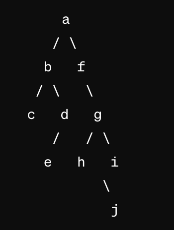

已知一棵 二叉树的中序序列为 cbedahgijf、后序序列为cedbhjigfa，给出该 二叉树的树形表示。

```python
```


给定 6 个字符 a～f ，它们的权值集合 `W = {2, 3, 4, 7, 8, 9}`，试构造关于 W 的 一棵哈夫曼树，求其带权路径长度 WPL 和各个字符的哈夫曼编码。



首先，我们需要理解哈夫曼编码算法的基本原理，即通过构造一棵优化的二叉树，使得树的带权路径长度（WPL，即所有叶子节点的权值与其深度的乘积之和）最小。这里的步骤是：

1. 将给定的字符及其对应权值作为叶子节点，并放入优先队列中。
2. 每次从队列中取出两个权值最小的节点，合成一个新节点，其权值为两个子节点权值之和，然后将新节点重新放入队列。
3. 重复上述过程，直到队列中只剩一个节点，这个节点就是哈夫曼树的根节点。
4. 从根节点到每个叶子节点的路径就是该字符的哈夫曼编码，左分支代表0，右分支代表1。

现在，让我们按照这个算法来操作：

### 初始数据
- 'a': 2
- 'b': 3
- 'c': 4
- 'd': 7
- 'e': 8
- 'f': 9

### 构建哈夫曼树
1. 取出最小的两个节点 'a' (2) 和 'b' (3)，合并为一个新节点（权值 5）。
2. 取出下一个最小的两个节点 'c' (4) 和 新节点 (5)，合并为一个新节点（权值 9）。
3. 取出 'd' (7) 和最小的新节点 (9)，合并为一个新节点（权值 16）。
4. 取出 'e' (8) 和 'f' (9)，合并为一个新节点（权值 17）。
5. 最后合并剩下的两个新节点（权值 16 和 17），合并为根节点（权值 33）。

这样我们构建的哈夫曼树如下所示：

```
        (33)
       /    \
     (16)   (17)
     /  \    /  \
   (9)  d   e    f
  /  \
(5)  c
 / \
a   b
```

### 计算 WPL
- a: 深度 4, WPL = 2 * 4 = 8
- b: 深度 4, WPL = 3 * 4 = 12
- c: 深度 3, WPL = 4 * 3 = 12
- d: 深度 2, WPL = 7 * 2 = 14
- e: 深度 2, WPL = 8 * 2 = 16
- f: 深度 2, WPL = 9 * 2 = 18

总 WPL = 8 + 12 + 12 + 14 + 16 + 18 = 80

### 哈夫曼编码
- a: 0000
- b: 0001
- c: 001
- d: 01
- e: 10
- f: 11

这样，我们得到了每个字符的哈夫曼编码，以及计算了整个树的带权路径长度（WPL）。


::: details 公众号：AI悦创【二维码】


C:::

::: info AI悦创·编程一对一

AI悦创·推出辅导班啦，包括「Python 语言辅导班、C++ 辅导班、java 辅导班、算法/数据结构辅导班、少儿编程、pygame 游戏开发、Web、Linux」，全部都是一对一教学：一对一辅导 + 一对一答疑 + 布置作业 + 项目实践等。当然，还有线下线上摄影课程、Photoshop、Premiere 一对一教学、QQ、微信在线，随时响应！微信：Jiabcdefh

C++ 信息奥赛题解，长期更新！长期招收一对一中小学信息奥赛集训，莆田、厦门地区有机会线下上门，其他地区线上。微信：Jiabcdefh

方法一：[QQ](http://wpa.qq.com/msgrd?v=3&uin=1432803776&site=qq&menu=yes)

方法二：微信：Jiabcdefh

:::

