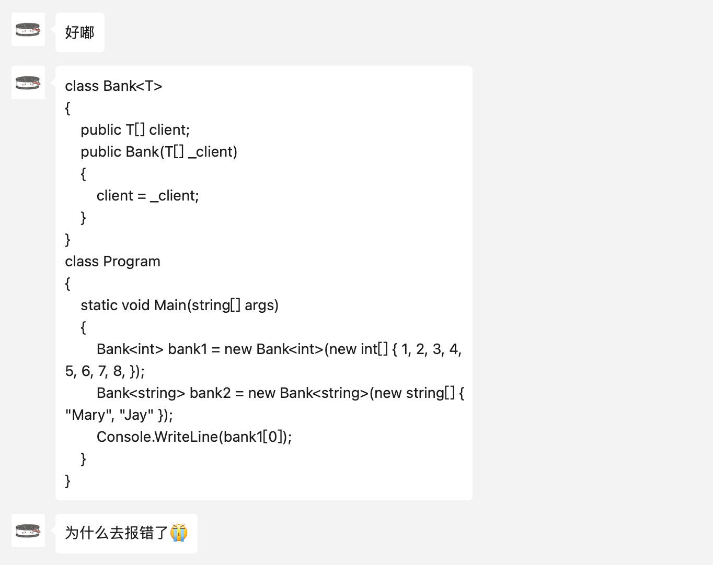

下面的程序为什么报错：

```python
{
    public T[] client;
    public Bank(T[] _client)
    {
        client = _client;
    }
}
class Program
{
    static void Main(string[] args)
    {
        Bank<int> bank1 = new Bank<int>(new int[] { 1, 2, 3, 4, 5, 6, 7, 8, });
        Bank<string> bank2 = new Bank<string>(new string[] { "Mary", "Jay" });
        Console.WriteLine(bank1[0]);
    }
}
```

::: details



:::

上面的程序中的错误出现在尝试访问 `bank1[0]` 这个表达式。这里，`bank1` 是一个 `Bank<int>` 类型的对象，而不是数组。`Bank<T>` 类中并没有定义索引器，所以不能直接使用像数组那样的索引访问方式来访问 `bank1` 的成员。

要修复这个问题，可以在 `Bank<T>` 类中添加一个索引器。索引器允许你的类的对象像数组那样通过索引进行访问。这里是如何在类中添加一个索引器的示例：

```csharp
class Bank<T>
{
    public T[] client;

    public Bank(T[] _client)
    {
        client = _client;
    }

    // 添加索引器
    public T this[int index]
    {
        get { return client[index]; }
        set { client[index] = value; }
    }
}
```

通过这种方式，`Bank<T>` 类的实例现在可以使用索引来访问其内部的 `client` 数组。因此，在 `Main` 方法中的代码现在可以正常工作，不会再报错：

```csharp
class Program
{
    static void Main(string[] args)
    {
        Bank<int> bank1 = new Bank<int>(new int[] { 1, 2, 3, 4, 5, 6, 7, 8 });
        Bank<string> bank2 = new Bank<string>(new string[] { "Mary", "Jay" });

        // 现在可以使用索引访问
        Console.WriteLine(bank1[0]);
    }
}
```

这段代码会输出 `1`，因为这是 `bank1` 数组中索引 `0` 的元素。


::: details 公众号：AI悦创【二维码】


C:::

::: info AI悦创·编程一对一

AI悦创·推出辅导班啦，包括「Python 语言辅导班、C++ 辅导班、java 辅导班、算法/数据结构辅导班、少儿编程、pygame 游戏开发、Web、Linux」，全部都是一对一教学：一对一辅导 + 一对一答疑 + 布置作业 + 项目实践等。当然，还有线下线上摄影课程、Photoshop、Premiere 一对一教学、QQ、微信在线，随时响应！微信：Jiabcdefh

C++ 信息奥赛题解，长期更新！长期招收一对一中小学信息奥赛集训，莆田、厦门地区有机会线下上门，其他地区线上。微信：Jiabcdefh

方法一：[QQ](http://wpa.qq.com/msgrd?v=3&uin=1432803776&site=qq&menu=yes)

方法二：微信：Jiabcdefh

:::

