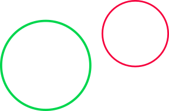
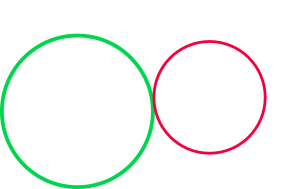
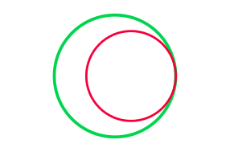
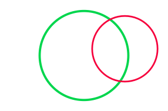
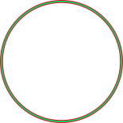

### To start

1. Download and install [Thonny](https://thonny.org/)
2. Create a folder named ‘hw1’
3. Download [hw1.py](https://www.cs.cmu.edu/~112q/homework/01/hw1.py) to that folder
4. Edit `hw1.py` using Thonny and modify the functions as required
5. When you have completed and fully tested hw1, submit `hw1.py` to Gradescope. For this hw, you may submit up to 20 times (which is way more than you should require), but only your last submission counts.

::: details hw1.py

```python
#################################################
# hw1.py
#
# Your name:
# Your andrew id:
#################################################

import math

#################################################
# Functions (for you to write)
#################################################


#### isValidYearOfBirth ####

def isValidYearOfBirth(year):
    return False

#### numberOfPoolBalls ####

def numberOfPoolBalls(rows):
    return 42

#### getTheCents ####

def getTheCents(n):
    return 42

#### isPerfectCube ####

def isPerfectCube(n):
    return False

#### isSymmetricNumber ####

def isSymmetricNumber(n):
    return False

#### circleIntersection ####

def distance(x1, y1, x2, y2):
    return 42.0

def circleIntersection(xa, ya, ra, xb, yb, rb):
    return 0

#### colorBlender ####

def colorBlender(rgb1, rgb2, midpoints, n):
    return 42


#### isValidYearOfBirth ####

def testIsValidYearOfBirth():
    print("Testing isValidYearOfBirth()... ", end="")
    assert(isValidYearOfBirth(2023))
    assert(isValidYearOfBirth(2024))
    assert(isValidYearOfBirth(2025) == False)
    assert(isValidYearOfBirth(-1) == False)
    assert(isValidYearOfBirth("2022") == False)
    assert(isValidYearOfBirth(None) == False)
    assert(isValidYearOfBirth(2022.0) == False)
    assert(isValidYearOfBirth(1900) == False)
    assert(isValidYearOfBirth(1910))
    assert(isValidYearOfBirth(2000))
    print("Passed.")


#### numberOfPoolBalls ####

def testNumberOfPoolBalls():
    print('Testing numberOfPoolBalls()... ', end='')
    assert(numberOfPoolBalls(0) == 0)
    assert(numberOfPoolBalls(1) == 1)
    assert(numberOfPoolBalls(2) == 3)   # 1+2 == 3
    assert(numberOfPoolBalls(3) == 6)   # 1+2+3 == 6
    assert(numberOfPoolBalls(10) == 55)  # 1+2+...+10 == 55
    print('Passed.')


#### getTheCents ####

def testGetTheCents():
    print("Testing getTheCents()... ", end="")
    assert(getTheCents(42) == 0)
    assert(getTheCents(42.5) == 50)
    assert(getTheCents(42.50) == 50)
    assert(getTheCents("2022") == 0)
    assert(getTheCents(None) == 0)
    assert(getTheCents(42.42) == 42)
    print("Passed.")


#### isPerfectCube ####

def testIsPerfectCube():
    print('Testing isPerfectCube()... ', end='')
    assert(isPerfectCube(0) == True)
    assert(isPerfectCube(-1) == True)
    assert(isPerfectCube(1) == True)
    assert(isPerfectCube(16) == False)
    assert(isPerfectCube(8) == True)
    assert(isPerfectCube(1234**3) == True)
    assert(isPerfectCube(15) == False)
    assert(isPerfectCube(17) == False)
    assert(isPerfectCube(-16) == False)
    assert(isPerfectCube(-64) == True)
    assert(isPerfectCube(16.0000001) == False)
    assert(isPerfectCube('Do not crash here!') == False)
    print('Passed.')


#### isSymmetricNumber ####

def testIsSymmetricNumber():
    print("Testing isSymmetricNumber()... ", end="")
    assert(isSymmetricNumber(77) == True)
    assert(isSymmetricNumber(1) == False)
    assert(isSymmetricNumber(2020) == True)
    assert(isSymmetricNumber(987987) == True)
    assert(isSymmetricNumber(987789) == False)
    assert(isSymmetricNumber(111) == False)
    assert(isSymmetricNumber(1111) == True)
    assert(isSymmetricNumber(1111.0) == False)
    assert(isSymmetricNumber(-1111) == False)
    print("Passed.")


#### circleIntersection ####

def testDistance():
    print('Testing distance()... ', end='')
    assert(distance(0,0,0,2) == 2)
    assert(distance(2,0,0,0) == 2)
    assert(distance(0,0,0,0) == 0)
    print('Passed.')


def testCircleIntersection():
    print('Testing circleIntersection()... ', end='')
    assert(circleIntersection(0,0,1,1,1,1)==2)
    assert(circleIntersection(1,1,1,1,1,1)==float('inf'))
    assert(circleIntersection(0,0,3,10,10,2)==0)
    print('Passed.')


#### colorBlender ####

def testColorBlender():
    print('Testing colorBlender()... ', end='')
    # http://meyerweb.com/eric/tools/color-blend/#DC143C:BDFCC9:3:rgbd
    assert(colorBlender(220020060, 189252201, 3, -1) is None)
    assert(colorBlender(220020060, 189252201, 3, 0) == 220020060)
    assert(colorBlender(220020060, 189252201, 3, 1) == 212078095)
    assert(colorBlender(220020060, 189252201, 3, 2) == 205136131)
    assert(colorBlender(220020060, 189252201, 3, 3) == 197194166)
    assert(colorBlender(220020060, 189252201, 3, 4) == 189252201)
    assert(colorBlender(220020060, 189252201, 3, 5) is None)
    # http://meyerweb.com/eric/tools/color-blend/#0100FF:FF0280:2:rgbd
    assert(colorBlender(1000255, 255002128, 2, -1) is None)
    assert(colorBlender(1000255, 255002128, 2, 0) == 1000255)
    assert(colorBlender(1000255, 255002128, 2, 1) == 86001213)
    assert(colorBlender(1000255, 255002128, 2, 2) == 170001170)
    assert(colorBlender(1000255, 255002128, 2, 3) == 255002128)
    print('Passed.')


#################################################
# testAll and main
#################################################

def testAll():
    # comment out the tests you do not wish to run!
    testIsValidYearOfBirth()
    testNumberOfPoolBalls()
    testGetTheCents()
    testIsPerfectCube()
    testIsSymmetricNumber()
    testDistance()
    testCircleIntersection()
    testColorBlender()

def main():
    testAll()

if __name__ == '__main__':
    main()

```


:::

### Some important notes

1. This homework is **solo**. You may not collaborate or discuss it with anyone outside of the course, and your options for discussing with other students currently taking the course are limited. See the [academic honesty policy](https://www.cs.cmu.edu/~112q/syllabus/honesty.html) for more details.
2. After you submit to Gradescope, make sure you check your score. If you aren’t sure how to do this, then ask a CA or Professor.
3. There is no partial credit on Gradescope testcases. Your Gradescope score is your Gradescope score.
4. Read the last bullet point again. Seriously, we won’t go back later and increase your Gradescope score for any reason. Even if you worked really hard and it was only a minor error…
5. Do not hardcode the test cases in your solutions.
6. The starter `hw1.py` file includes test functions to help you test on your own before you submit to Gradescope. When you run your file, problems will be tested in order. If you wish to temporarily bypass specific tests (say, because you have not yet completed some functions), you can comment out individual test function calls at the bottom of your file in `main()`. However, be sure to uncomment and test everything together before you submit! Ask a CA if you need help with this.
7. Remember the course’s academic integrity policy. Solving the homework yourself is your best preparation for exams and quizzes; cheating or short-cutting your learning process in order to improve your homework score will actually hurt your course grade long-term.
8. Do not use string indexing, loops, lists, list indexing, or recursion this week. The autograder will reject your submission entirely if you do.


## Problems

1. **Breaking the ice on Discord** [5 pts]

We will be using Discord this semester as the course discussion board and question and answer forum. You should have received an invite to the course Discord server during the first week of classes.

If you have never used Discord before, consider the following tips:

1. [A Beginner's Guide to Discord](https://support.discord.com/hc/en-us/articles/360045138571-Beginner-s-Guide-to-Discord) can be a helpful resource in understanding the basics of a Discord server.
2. If you are creating a Discord account, it is probably a good idea *not* to use your real name as your username or overall display name.
3. Once you join the class Discord server, there are rules that you will need to agree to. You will also need to change your *Server Nickname* to be your real name. (Don't worry, this server nickname is only visible to other members of the class. Your username and display name on other parts of Discord are unaffected.)
4. You should download and install the Discord app on your computer (or phone or tablet). This will ensure you get notifications whenever there are announcements and notifications about the course.

You should download and install the Discord app on your computer (or phone or tablet). This will ensure you get notifications whenever there are announcements and notifications about the course.

For this task, do the following:

1. Join the Discord server using the link sent to you via email.
2. Follow the instructions on the server in order to agree to the rules and check the box.
3. Using the channel for private questions, ask a private question that just says, "Does it seem like I've setup Discord properly?" One of the staff will respond.
4. Post a reply to the existing public question that was posted by the course staff.

2. **isValidYearOfBirth(year)** [5 pts]

Imagine that you are writing a software that validates personal information entered by the users. Write the function `isValidYearOfBirth(year)` which, given a value `year`, returns `True` if it is an integer value that represents a valid year of birth, `False` otherwise. Keep in mind that, according to Wikipedia, the oldest person was born in 1907.

3. **numberOfPoolBalls(rows)** [5 pts]

Pool balls are arranged in rows where the first row contains 1 pool ball and each row contains 1 more pool ball than the previous row. Thus, for example, 3 rows contain 6 total pool balls (1+2+3). With this in mind, write the function `numberOfPoolBalls(rows)` that takes a non-negative `int` value, the number of rows, and returns another int value, the number of pool balls in that number of full rows. For example, `numberOfPoolBalls(3)` returns 6. We will not limit our analysis to a "rack" of 15 balls. Rather, our pool table can contain an unlimited number of rows. Hint: you may want to briefly read about [Triangular Numbers](https://en.wikipedia.org/wiki/Triangular_number). Also, remember not to use loops!

4. **getTheCents(n)** [10 pts]

Write the function `getTheCents(n)` which takes a value `n` (which represents a payment in US dollars) as input and returns the number of cents in the payment. If `n` is an `int`, the function should return 0, as it has 0 cents; otherwise, if it isn't a float, it should also return 0, because a non-number payment make no cents (ha!). You can assume that `n` will have up to 2 decimal places. For instance,

```python
getTheCents(3) == 0
getTheCents(3.00) == 0
getTheCents(3.96) == 96
getTheCents(3.95) == 95
getTheCents(3.1) == 10
getTheCents(3.11) == 11
```

5. **isPerfectCube(n)** [10 pts]
    Write the function isPerfectCube(n) that takes a possibly-non-int value, and returns True if it is an int that is a perfect cube (that is, if there exists an integer m such that m**3 == n), and False otherwise. Do not crash on non-ints nor on negative ints.

6. **isSymmetricNumber(n)** [20 pts]

We define a number as symmetric if it is an integer, non-negative, and its left and right halves are identical. For example, 99 and 2020 are symmetric numbers, but 4554 and 789987 are not. With this in mind, write the function `isSymmetricNumber(n)`, which takes a value `n` and returns `True` if `n` is a symmetric number and `False` otherwise. Notes: The numbers can be arbitrarily large. For example, 444555666444555666 is a symmetric number.

7. **Circle Intersection** [20 pts]

Two circles in a plane intersect in zero, one, two, or infinitely many points. The latter case occurs only in the case of two identical circles. The first case (zero points of intersection) occurs whenever the distance between the centers of the circles is greater than the sum of the radii or the distance between the center is less than the absolute value of the difference in their radii.

- **distance(x1,y1,x2,y2)** First, you must write a helper function `distance(x1, y1, x2, y2)` to find the distance between two points. This function takes four `int` or `float` values representing two points and returns the distance between those points.
- **circleIntersection(xa,ya,ra,xb,yb,rb)** Your task is to write a function `circleIntersection(xa,ya,ra,xb,yb,rb)` that will take six values as input parameters. These values represent the coordinates `(xa,ya)` of the center of circle **A**, and the radius `ra` of **A**, followed by the coordinates `(xb,yb)` of the center of circle **B**, and the radius `rb` of **B**. Your function should return the number of intersection points (only the number, not the points). There are 4 possible cases:
- The circles do not touch each other. This could be because one is contained in the other circle, or they are too far apart from each other. In these cases your function should return value 0.



The circles intersect at a single point: either they touch internally or externally. In these cases your function should return value 1.





The circles intersect at two points. Your function should return value 2.



The circles intersect at infinitely many points, i.e., they fully overlap. Your function should return infinity. In Python you can represent positive infinity as `float(''inf'')`



**Hint:** You should use the `distance` function that you just wrote in the first part to help you solve this problem. Remember to use `almostEqual` or `math.isclose` (instead of ==) when comparing floats!

8. **colorBlender(rgb1, rgb2, midpoints, n)** [25 pts]

This problem implements a color blender, inspired by [this tool](http://meyerweb.com/eric/tools/color-blend). In particular, we will use it with integer RGB values (it also does hex values and RGB% values, but we will not use those modes). Note that RGB values contain 3 integers, each between 0 and 255, representing the amount of red, green, and blue respectively in the given color, where 255 is "entirely on" and 0 is "entirely off".

For example, consider [this case](http://meyerweb.com/eric/tools/color-blend/#DC143C:BDFCC9:3:rgbd). Here, we are combining crimson (rgb(220, 20, 60)) and mint (rgb(189, 252, 201)), using 3 midpoints, to produce this palette (using our own numbering convention for the colors, starting from 0, as the tool does not number them):

```python
color0: rgb(220,  20,  60)
color1: rgb(212,  78,  95)
color2: rgb(205, 136, 131)
color3: rgb(197, 194, 166)
color4: rgb(189, 252, 201)
```

There are 5 colors in the palette because the first color is crimson, the last color is mint, and the middle 3 colors are equally spaced between them.

So we could ask: if we start with crimson and go to mint, with 3 midpoints, what is color #1? The answer then would be rgb(212, 78, 95).

One last step: we need to represent these RGB values as a single integer. To do that, we'll use the first 3 digits for red, the next 3 for green, the last 3 for blue, all in base 10 (decimal, as you are accustomed to). Hence, we'll represent crimson as the integer 220020060, and mint as the integer 189252201.

With all that in mind, write the function `colorBlender(rgb1, rgb2, midpoints, n)`, which takes two integers representing colors encoded as just described, a non-negative integer number of midpoints, and a non-negative integer n, and returns the nth color in the palette that the tool creates between those two colors with that many midpoints. If n is out of range (too small or too large), return `None`.

For example, following the case above: `colorBlender(220020060, 189252201, 3, 1)` returns 212078095

**Hint:** RGB values must be ints, not floats. When calculating midpoint colors, you can mostly use the built-in round function. However, the built-in round function has one major flaw: it varies in whether it chooses to round .5 up or down (ugh!). You can fix this by doing an extra check for whether a number is `<number>.5` and choosing to always round up in that case.

::: details hw1.py

```python
#################################################
# hw1.py
#
# Your name:
# Your andrew id:
#################################################

import math


#################################################
# Functions (for you to write)
#################################################


#### isValidYearOfBirth ####

def isValidYearOfBirth(year):
    if isinstance(year, int):
        if year >= 1907 and year <= 2024:
            return True
        else:
            return False
    else:
        return False


#### numberOfPoolBalls ####

def numberOfPoolBalls(rows):
    #make sure rows is an positive interger#
    if isinstance (rows,int):
        if rows > 0:
    # n of ball = 1+2+3+..+n = n+ (n-1)+(n-2) +.. +1)#
    # combind the two equal fomular to get below fomular#
            return (rows*(rows+1))/2
        else:
            return False
    else:
        return False


#### getTheCents ####

# def getTheCents(n):
#     if isinstance(n, int) or not isinstance(n, float):
#         return 0
#     cents = int(round((n - int(n)) * 100))
#     return cents
def getTheCents(n):
    #make sure n is an decimal and up to two decimal points#
    if isinstance (n,int):
        return 0
    if isinstance (n, float):
        return round((n - int(n)) * 100, 2)
    else:
        return 0

#### isPerfectCube ####

def isPerfectCube(n):
    # 检查 n 是否为整数
    if not isinstance(n, int):
        return False

    # 对于负数，取其绝对值进行计算
    abs_n = abs(n)

    # 查找可能的立方根
    m = int(abs_n ** (1 / 3))

    # 检查 m 的立方是否等于 n 的绝对值
    # 同时检查 (m + 1) 的立方是否等于 n 的绝对值，以解决精度问题
    return m ** 3 == abs_n or (m + 1) ** 3 == abs_n


#### isSymmetricNumber ####

def isSymmetricNumber(n):
    # 检查n是否为整数和非负数
    if not isinstance(n, int) or n < 0:
        return False

    # 将数字转换成字符串
    str_n = str(n)

    # 获取数字长度
    length = len(str_n)

    # 检查长度是否为偶数
    if length % 2 != 0:
        return False

    # 比较左右两部分
    mid = length // 2
    return str_n[:mid] == str_n[mid:]


#### circleIntersection ####

def distance(x1, y1, x2, y2):
    # 使用欧几里得距离公式计算两点之间的距离
    return math.sqrt((x2 - x1) ** 2 + (y2 - y1) ** 2)

def circleIntersection(xa, ya, ra, xb, yb, rb):
    # 计算两个圆心之间的距离
    dist_centers = distance(xa, ya, xb, yb)

    # 特别处理两个圆完全重合的情况
    if xa == xb and ya == yb and ra == rb:
        return float('inf')

    # 检查两个圆的位置关系并返回交点数
    if dist_centers > ra + rb:  # 两圆相离
        return 0
    elif dist_centers < abs(ra - rb):  # 一个圆在另一个圆内部
        return 0
    elif dist_centers == ra + rb or dist_centers == abs(ra - rb):  # 两圆相切
        return 1
    else:  # 两圆相交
        return 2


#### colorBlender ####

def colorBlender(rgb1, rgb2, midpoints, n):
    # Helper function to extract individual RGB components from the integer
    def extract_rgb(color_int):
        blue = color_int % 1000
        green = (color_int // 1000) % 1000
        red = color_int // 1000000
        return red, green, blue

    # Helper function to combine RGB components into a single integer
    def combine_rgb(red, green, blue):
        return red * 1000000 + green * 1000 + blue

    # Custom round function to handle .5 cases
    def custom_round(value):
        if value - int(value) == 0.5:
            return int(value) + 1
        return round(value)

    # Extract RGB components from the input integers
    r1, g1, b1 = extract_rgb(rgb1)
    r2, g2, b2 = extract_rgb(rgb2)

    # Calculate the step size for each color component
    steps = midpoints + 1
    r_step = (r2 - r1) / steps
    g_step = (g2 - g1) / steps
    b_step = (b2 - b1) / steps

    # Calculate the nth color in the palette
    if 0 <= n <= midpoints + 1:
        r_n = custom_round(r1 + n * r_step)
        g_n = custom_round(g1 + n * g_step)
        b_n = custom_round(b1 + n * b_step)
        return combine_rgb(r_n, g_n, b_n)
    else:
        return None


#### isValidYearOfBirth ####

def testIsValidYearOfBirth():
    print("Testing isValidYearOfBirth()... ", end="")
    assert (isValidYearOfBirth(2023))
    assert (isValidYearOfBirth(2024))
    assert (isValidYearOfBirth(2025) == False)
    assert (isValidYearOfBirth(-1) == False)
    assert (isValidYearOfBirth("2022") == False)
    assert (isValidYearOfBirth(None) == False)
    assert (isValidYearOfBirth(2022.0) == False)
    assert (isValidYearOfBirth(1900) == False)
    assert (isValidYearOfBirth(1910))
    assert (isValidYearOfBirth(2000))
    print("Passed.")


#### numberOfPoolBalls ####

def testNumberOfPoolBalls():
    print('Testing numberOfPoolBalls()... ', end='')
    assert (numberOfPoolBalls(0) == 0)
    assert (numberOfPoolBalls(1) == 1)
    assert (numberOfPoolBalls(2) == 3)  # 1+2 == 3
    assert (numberOfPoolBalls(3) == 6)  # 1+2+3 == 6
    assert (numberOfPoolBalls(10) == 55)  # 1+2+...+10 == 55
    print('Passed.')


#### getTheCents ####

def testGetTheCents():
    print("Testing getTheCents()... ", end="")
    assert (getTheCents(42) == 0)
    assert (getTheCents(42.5) == 50)
    assert (getTheCents(42.50) == 50)
    assert (getTheCents("2022") == 0)
    assert (getTheCents(None) == 0)
    assert (getTheCents(42.42) == 42)
    print("Passed.")


#### isPerfectCube ####

def testIsPerfectCube():
    print('Testing isPerfectCube()... ', end='')
    assert (isPerfectCube(0) == True)
    assert (isPerfectCube(-1) == True)
    assert (isPerfectCube(1) == True)
    assert (isPerfectCube(16) == False)
    assert (isPerfectCube(8) == True)
    assert (isPerfectCube(1234 ** 3) == True)
    assert (isPerfectCube(15) == False)
    assert (isPerfectCube(17) == False)
    assert (isPerfectCube(-16) == False)
    assert (isPerfectCube(-64) == True)
    assert (isPerfectCube(16.0000001) == False)
    assert (isPerfectCube('Do not crash here!') == False)
    print('Passed.')


#### isSymmetricNumber ####

def testIsSymmetricNumber():
    print("Testing isSymmetricNumber()... ", end="")
    assert (isSymmetricNumber(77) == True)
    assert (isSymmetricNumber(1) == False)
    assert (isSymmetricNumber(2020) == True)
    assert (isSymmetricNumber(987987) == True)
    assert (isSymmetricNumber(987789) == False)
    assert (isSymmetricNumber(111) == False)
    assert (isSymmetricNumber(1111) == True)
    assert (isSymmetricNumber(1111.0) == False)
    assert (isSymmetricNumber(-1111) == False)
    print("Passed.")


#### circleIntersection ####

def testDistance():
    print('Testing distance()... ', end='')
    assert (distance(0, 0, 0, 2) == 2)
    assert (distance(2, 0, 0, 0) == 2)
    assert (distance(0, 0, 0, 0) == 0)
    print('Passed.')


def testCircleIntersection():
    print('Testing circleIntersection()... ', end='')
    assert (circleIntersection(0, 0, 1, 1, 1, 1) == 2)
    assert (circleIntersection(1, 1, 1, 1, 1, 1) == float('inf'))
    assert (circleIntersection(0, 0, 3, 10, 10, 2) == 0)
    print('Passed.')


#### colorBlender ####

def testColorBlender():
    print('Testing colorBlender()... ', end='')
    # http://meyerweb.com/eric/tools/color-blend/#DC143C:BDFCC9:3:rgbd
    assert (colorBlender(220020060, 189252201, 3, -1) is None)
    assert (colorBlender(220020060, 189252201, 3, 0) == 220020060)
    assert (colorBlender(220020060, 189252201, 3, 1) == 212078095)
    assert (colorBlender(220020060, 189252201, 3, 2) == 205136131)
    assert (colorBlender(220020060, 189252201, 3, 3) == 197194166)
    assert (colorBlender(220020060, 189252201, 3, 4) == 189252201)
    assert (colorBlender(220020060, 189252201, 3, 5) is None)
    # http://meyerweb.com/eric/tools/color-blend/#0100FF:FF0280:2:rgbd
    assert (colorBlender(1000255, 255002128, 2, -1) is None)
    assert (colorBlender(1000255, 255002128, 2, 0) == 1000255)
    assert (colorBlender(1000255, 255002128, 2, 1) == 86001213)
    assert (colorBlender(1000255, 255002128, 2, 2) == 170001170)
    assert (colorBlender(1000255, 255002128, 2, 3) == 255002128)
    print('Passed.')


#################################################
# testAll and main
#################################################

def testAll():
    # comment out the tests you do not wish to run!
    testIsValidYearOfBirth()
    testNumberOfPoolBalls()
    testGetTheCents()
    testIsPerfectCube()
    testIsSymmetricNumber()
    testDistance()
    testCircleIntersection()
    testColorBlender()


def main():
    testAll()


if __name__ == '__main__':
    main()
```


:::

```python
def colorBlender(rgb1, rgb2, midpoints, n):
    # 辅助函数，用于从整数中提取单独的 RGB 组件
    def extract_rgb(color_int):
        blue = color_int % 1000         # 提取蓝色分量
        green = (color_int // 1000) % 1000  # 提取绿色分量
        red = color_int // 1000000      # 提取红色分量
        return red, green, blue

    # 辅助函数，用于将 RGB 组件组合成单个整数
    def combine_rgb(red, green, blue):
        return red * 1000000 + green * 1000 + blue

    # 自定义四舍五入函数，处理 .5 的情况总是向上取整
    def custom_round(value):
        if value - int(value) == 0.5:
            return int(value) + 1
        return round(value)

    # 从输入的整数中提取 RGB 组件
    r1, g1, b1 = extract_rgb(rgb1)
    r2, g2, b2 = extract_rgb(rgb2)

    # 计算每种颜色组件的步长
    steps = midpoints + 1
    r_step = (r2 - r1) / steps
    g_step = (g2 - g1) / steps
    b_step = (b2 - b1) / steps

    # 计算调色板中的第 n 个颜色
    if 0 <= n <= midpoints + 1:
        r_n = custom_round(r1 + n * r_step)
        g_n = custom_round(g1 + n * g_step)
        b_n = custom_round(b1 + n * b_step)
        return combine_rgb(r_n, g_n, b_n)
    else:
        return None

# 测试函数
assert (colorBlender(220020060, 189252201, 3, -1) is None)
...
```


```python
def isSymmetricNumber(n):
    # 检查n是否为整数和非负数
    if not isinstance(n, int) or n < 0:
        return False
    old_n = n
    if n == 0:
        return 1  # Special case for 0
    length = 0
    while n:
        n //= 10  # Remove the last digit
        length += 1

    # 检查长度是否为偶数
    if length % 2 != 0:
        return False

    half_length = length // 2
    front_part = old_n // (10 ** half_length)
    back_part = old_n % (10 ** half_length)
    # print(front_part, back_part)
    return front_part == back_part
```

```python
def isSymmetricNumber(n):
    # 检查n是否为整数和非负数
    if not isinstance(n, int) or n < 0:
        return False
    old_n = n
    if n == 0:
        return 1  # Special case for 0

    def length_of_number(num):
        # 基本情况：当数字减少到0时，返回0
        if num == 0:
            return 0
        # 递归调用：缩小数字的大小，并增加长度计数
        return 1 + length_of_number(num // 10)
    length = length_of_number(n)

    # 检查长度是否为偶数
    if length % 2 != 0:
        return False

    half_length = length // 2
    front_part = old_n // (10 ** half_length)
    back_part = old_n % (10 ** half_length)
    # print(front_part, back_part)
    return front_part == back_part
```

```python
def isSymmetricNumber(n):
    # 检查n是否为整数和非负数
    if not isinstance(n, int) or n <= 0:
        return False
    old_n = n
    if n == 0:
        return 1  # Special case for 0

    def length_of_number(num):
        # 基本情况：当数字减少到0时，返回0
        if num == 0:
            return 0
        # 递归调用：缩小数字的大小，并增加长度计数
        return 1 + length_of_number(num // 10)
    length = length_of_number(n)

    # 检查长度是否为偶数
    if length % 2 != 0:
        return False

    half_length = length // 2
    front_part = old_n // (10 ** half_length)
    back_part = old_n % (10 ** half_length)
    # print(front_part, back_part)
    return front_part == back_part
```

```python
def isPerfectCube(n):
    # 检查 n 是否为整数
    if not isinstance(n, (int, float)):
        return False

    # 对于负数，取其绝对值进行计算
    abs_n = abs(int(n))
    # print(abs_n)

    # 查找可能的立方根
    # 通过计算 abs_n ** (1 / 3) 来找到 n 的绝对值的立方根的近似值，并将其转换为整数。这里用到了求立方根的数学公式。
    m = int(abs_n ** (1 / 3))

    # 检查 m 的立方是否等于 n 的绝对值
    # 同时检查 (m + 1) 的立方是否等于 n 的绝对值，以解决精度问题

    return m ** 3 == abs_n or (m + 1) ** 3 == abs_n
```


::: details 公众号：AI悦创【二维码】


:::

::: info AI悦创·编程一对一

AI悦创·推出辅导班啦，包括「Python 语言辅导班、C++ 辅导班、java 辅导班、算法/数据结构辅导班、少儿编程、pygame 游戏开发、Web、Linux」，全部都是一对一教学：一对一辅导 + 一对一答疑 + 布置作业 + 项目实践等。当然，还有线下线上摄影课程、Photoshop、Premiere 一对一教学、QQ、微信在线，随时响应！微信：Jiabcdefh

C++ 信息奥赛题解，长期更新！长期招收一对一中小学信息奥赛集训，莆田、厦门地区有机会线下上门，其他地区线上。微信：Jiabcdefh

方法一：[QQ](http://wpa.qq.com/msgrd?v=3&uin=1432803776&site=qq&menu=yes)

方法二：微信：Jiabcdefh

:::


