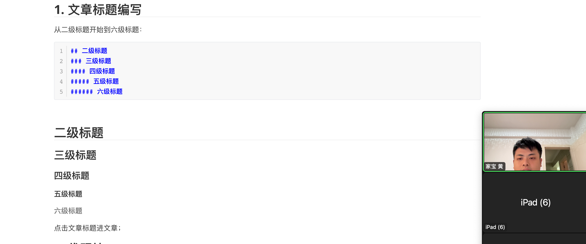

## 1. 本地运行网站

1. 打开你的网站文件夹「所在电脑的网站文件夹」
2. 鼠标右键打开：显示更多选项->ConEmu Here
3. `pnpm run docs:dev`
4. 打开浏览器：Ctrl + 鼠标点击；

网站本地运行的意义：内容还没发布，我们自己能看见最新的修改内容。


## 2. 修改网站的名称

- 文件路径：

## 3. 文章编写

你需要什么文件夹你就自己创建文件夹，用做分门别类；

一个文件夹里面可以编写无数篇文章；

新建文章的时候，需要一开始三个减号，然后回车 Enter。

放入我发的头部内容；「文章标题、分类、标签、日期」


[这是链接](https://bornforthis.cn/python/#/)

第二个方法：

## 1. 文章标题编写

从二级标题开始到六级标题：

```markdown
## 二级标题
### 三级标题
#### 四级标题
##### 五级标题
###### 六级标题
```


## 二级标题

### 三级标题

#### 四级标题
##### 五级标题

###### 六级标题

点击文章标题进文章；

## 2. 代码块

1. 英文输入法；

```python
```python
```


## 3. 图片




`nodejs`

## 4. 表格

| 标题 | 名称 |
| ---- | ---- |
|      |      |

## 5. 链接

[链接](https://bornforthis.cn/)

## 6. 无序标题

- 你好
- 你好
- 你好
- 你好
- 你好

## 7. 有序标题

1. 你好
2. 你好
3. 你好
4. 你好
5. nigao

## 8. 公式

$x^2 + y_1 + \sqrt{10} + \frac{1}{2}$​


::: details 公众号：AI悦创【二维码】


:::

::: info AI悦创·编程一对一

AI悦创·推出辅导班啦，包括「Python 语言辅导班、C++ 辅导班、java 辅导班、算法/数据结构辅导班、少儿编程、pygame 游戏开发、Web、Linux」，全部都是一对一教学：一对一辅导 + 一对一答疑 + 布置作业 + 项目实践等。当然，还有线下线上摄影课程、Photoshop、Premiere 一对一教学、QQ、微信在线，随时响应！微信：Jiabcdefh

C++ 信息奥赛题解，长期更新！长期招收一对一中小学信息奥赛集训，莆田、厦门地区有机会线下上门，其他地区线上。微信：Jiabcdefh

方法一：[QQ](http://wpa.qq.com/msgrd?v=3&uin=1432803776&site=qq&menu=yes)

方法二：微信：Jiabcdefh

:::


