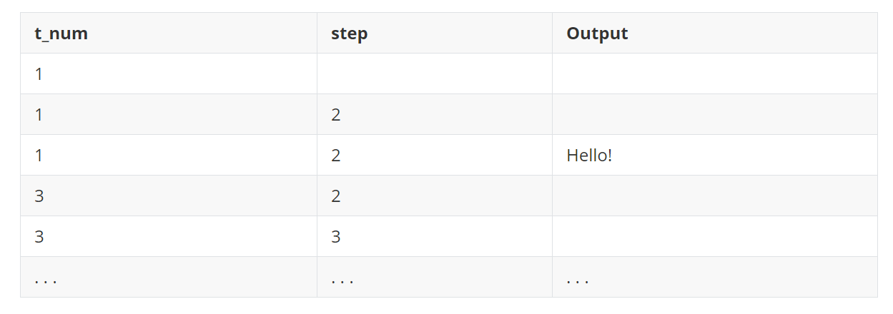

## Sum Sevens Problem

A student has written a program `buggy.py` that reads an integer from the terminal and sums the next five numbers  that are divisible by seven from this integer. The result are then displayed with the message `Sum of [seven1, seven2, seven3, seven4, seven5] is <result>` where `[seven1, seven2, seven3, seven4, seven5]`  is the series of numbers that are divisible by seven from the integer and `<result>` is the placeholder for the result of summing.

```python
num = int(input())
count = 0
total = 0
max_count = 7
str_out = ""
while count < max_count:
    if num / 7 == 0:
        count += 1
        total += count
        str_out = str(num) + ","
    else:
        total += 0
        num = num + 1
        
print("Sum of", str_out.strip(","), "is", total)
```

This is the input/output of the correct program:

```python
5
Sum of 7,14,21,28,35 is 105
20
Sum of 21,28,35,42,49 is 175
```

There are errors in the loop design done by the student. There may be multiple errors in a single line.

**Solution**

在学生的程序中存在几个问题，我们逐一解决：

1. **循环的最大计数设置错误**：程序的目的是找到从某个整数开始的下一个五个能被7整除的数，因此`max_count`应该设置为5而不是7。
2. **判断条件错误**：`if num / 7 == 0:` 这个条件判断是否`num`能被7整除是错误的，正确的应该是使用模运算符 `%` 来判断余数，即 `if num % 7 == 0:`。
3. **累加错误**：在满足条件时，应该将`num`加到`total`上，而不是`count`。
4. **字符串拼接问题**：应该在每次找到一个满足条件的数时，将这个数添加到`str_out`字符串中，而不是仅在条件满足时添加`num`的值。
5. **未正确更新`num`的值**：在循环中，无论条件是否满足，`num`都应该增加1，以便检查下一个数字。

修正后的代码如下：

::: code-tabs

@tab Code1

```python {4,7,9,10,11-14}
num = int(input())
count = 0
total = 0
max_count = 5
str_out = ""
while count < max_count:
    if num % 7 == 0:
        count += 1
        total += num
        str_out += str(num) + ","
    # else:
    #     total += 0
    #     num = num + 1
    num += 1
        
print("Sum of", str_out.strip(","), "is", total)
```

@tab Code2

```python
num = int(input())
count = 0
total = 0
max_count = 5  # 修正为5，因为我们需要找到5个数
str_out = ""
while count < max_count:
    if num % 7 == 0:  # 使用模运算符来判断是否能被7整除
        count += 1
        total += num  # 将num加到total上
        str_out += str(num) + ","  # 将满足条件的num添加到str_out
    num += 1  # 更新num的值
    
print("Sum of", str_out.strip(","), "is", total)
```

:::

这样修改后，程序应该能正确地找到从输入的整数开始的下一个五个能被7整除的数，计算它们的和，并以正确的格式输出。


## Part 2: Program to Flowchart, Debug, Program…

The program below tries to print all [triangular numbers](https://www.mathsisfun.com/algebra/triangular-numbers.html) that are less than 15, and multiples of either 2 or 5.

```python
t_num = 1  # the current triangular number to print out
step = 2   # the quantity added to `t_num`, to get the next triangular number
print('Hello!')

while t_num <= 15:
    if t_num % 2 == 0:
        print(t_num)
    if t_num % 5 == 0:
        print(t_num)

    t_num += step
    step += 1
```

Draw the flowchart for this code. 

Do an informal trace of the above code. It should look something like this:



Make sure that you include every iteration of the while loop!

What are the two logic errors, and how can they be fixed?


## Part 2: Binary to decimal

Write a program that will process a binary encoded string of 0's and 1's to its integer representation. Restriction: Do not use any built-in functions that would trivialize this problem.

- **Hint:** [https://www.mathsisfun.com/binary-number-system.html](https://www.mathsisfun.com/binary-number-system.html)

```python
$ python3 binary.py
#0011
3
$ python3 binary.py
#0110100110101
3381
```

```python
binary_str = '0011'
r_b = binary_str[::-1]
total = 0
for i in range(len(binary_str)):
    # print(i)
    total += int(r_b[i]) * (2 ** i)
print(total)


binary_str = '0011'
r_b = binary_str[::-1]  # 反转字符串
total = 0
i = 0  # 初始化索引

while i < len(r_b):
    total += int(r_b[i]) * (2 ** i)
    i += 1  # 手动递增索引

print(total)
```

## Part 3: Command line args

Command-line args

Print the first, third, and fourth command-line arguments,each to a new line.

You can assume there exists at least 4 command line arguments.

Example:

```python
$ python3 program.py 1 2 3 4
program.py
2
3
```

Example:

```python
$ python3 program.py alice bob carol dan eve
program.py
bob
carol
```

Answer：

```python
import sys

print(sys.argv[0])
print(sys.argv[2])
print(sys.argv[4])
```

## Print list 5

Print list 5 (0.25 marks)

Write a program that will take in a number from command line to create a list of 5 elements. 

Let the 1st element of the list be initialized as the 2nd command line argument as an integer. 

Let the 2nd element of the list be the value of the 1st element of the list plus one. 

Let the 3rd element of the list be the value of the 2nd element of the list plus one.
... etc

Example:

```python
$ python3 print_list5.py 6
[6, 7, 8, 9, 10]
```

```python
$ python3 print_list5.py 0 
[0, 1, 2, 3, 4]
```

```python
import sys

def create_list(start_number):
    return [start_number + i for i in range(5)]

if __name__ == "__main__":
    if len(sys.argv) < 2:
        print("Please provide a number as an argument.")
    else:
        start_number = int(sys.argv[1])
        result_list = create_list(start_number)
        print(result_list)
```

## Guessing game (0.5 marks)

Guessing game (0.5 marks)

Write a two player guessing game. Players must guess a secret number (an integer) which is given as a command line argument.

The program will begin by asking players for their name.

The program will alternate, asking each player in the following style: `<player>`, what is your guess? When the player inputs a guess, 3 possible outcomes are possible.

The secret number is higher than the player's guess. The program will then output Higher and go to the next player.

The secret number is lower than the player's guess. The program will then output Lower and go to the next player.

The secret number is equal to the player's guess. The program will print `<player>` wins! and the program will end.

Assume all inputs are valid.

Example:

```python
$ python game.py 34
Player 1 name: Mary
Player 2 name: Sue
Mary, what is your guess? 23
Higher
Sue, what is your guess? 50
Lower
Mary, what is your guess? 35
Lower
Sue, what is your guess? 34
Sue wins!
```

Example:

```python
$ python game.py 80
Player 1 name: Jacob
Player 2 name: Sarah
Jacob, what is your guess? 4
Higher
Sarah, what is your guess? 8
Higher
Jacob, what is your guess? 100
Lower
Sarah, what is your guess? 90
Lower
Jacob, what is your guess? 50
Higher
Sarah, what is your guess? 80
Sarah wins!
```

Example:

```python
$ python3 game.py 55
Player 1 name: Tom
Player 2 name: John
Tom, what is your guess? 55
Tom wins!
```

::: code-tabs

@tab Code1

```python
import sys

def get_player_names():
    player1 = input("Player 1 name: ")
    player2 = input("Player 2 name: ")
    return player1, player2

def guess_number(secret_number, players):
    current_player = 0  # 从第一个玩家开始
    while True:
        # 提示当前玩家输入猜测
        guess = int(input(f"{players[current_player]}, what is your guess? "))
        if guess < secret_number:
            print("Higher")
        elif guess > secret_number:
            print("Lower")
        else:
            print(f"{players[current_player]} wins!")
            break
        # 切换到另一个玩家
        current_player = 1 - current_player

if __name__ == "__main__":
    if len(sys.argv) != 2:
        print("Usage: python game.py <secret_number>")
        sys.exit(1)

    try:
        secret_number = int(sys.argv[1])
    except ValueError:
        print("Secret number must be an integer.")
        sys.exit(1)

    players = get_player_names()
    guess_number(secret_number, players)
```

@tab Code2

```python
# 导入sys模块，用于读取命令行参数
import sys

# 定义一个函数，用于获取两名玩家的名字
def get_player_names():
    # 提示玩家1输入名字，并读取输入
    player1 = input("Player 1 name: ")
    # 提示玩家2输入名字，并读取输入
    player2 = input("Player 2 name: ")
    # 返回两个名字作为元组
    return player1, player2

# 定义一个函数，用于进行猜数字游戏
def guess_number(secret_number, players):
    # 设置当前玩家的索引为0，表示从第一个玩家开始
    current_player = 0  
    # 使用一个无限循环，直到有玩家猜中数字
    while True:
        # 提示当前玩家猜测数字，并读取输入。使用格式化字符串插入当前玩家的名字
        guess = int(input(f"{players[current_player]}, what is your guess? "))
        # 判断玩家的猜测与秘密数字的关系
        if guess < secret_number:
            # 如果猜测太低，输出"Higher"，提示下一个猜测应该更高
            print("Higher")
        elif guess > secret_number:
            # 如果猜测太高，输出"Lower"，提示下一个猜测应该更低
            print("Lower")
        else:
            # 如果猜测正确，输出获胜信息，并结束循环
            print(f"{players[current_player]} wins!")
            break
        # 切换当前玩家的索引，从0到1或从1到0
        current_player = 1 - current_player

# 确保此脚本被直接执行时，以下代码会运行
if __name__ == "__main__":
    # 检查命令行参数的数量，确保有一个秘密数字被传入
    if len(sys.argv) != 2:
        print("Usage: python game.py <secret_number>")
        sys.exit(1)  # 如果没有正确的参数数量，提醒用户使用方式并退出

    # 尝试将命令行提供的秘密数字参数转换为整数
    try:
        secret_number = int(sys.argv[1])
    except ValueError:
        # 如果转换失败，提示用户秘密数字必须是整数，并退出
        print("Secret number must be an integer.")
        sys.exit(1)

    # 获取玩家名字
    players = get_player_names()
    # 开始猜数字游戏
    guess_number(secret_number, players)
```

@tab Code

```python
import sys


def get_player_names():
    player1 = input("Player 1 name: ")
    player2 = input("Player 2 name: ")
    return player1, player2


def guess_number(secret_number, players):
    current_player = 0  # 从第一个玩家开始
    while True:
        # 提示当前玩家输入猜测
        guess = int(input(f"{players[current_player]}, what is your guess? "))
        if guess < secret_number:
            print("Higher")
        elif guess > secret_number:
            print("Lower")
        else:
            print(f"{players[current_player]} wins!")
            break
        # 切换到另一个玩家
        current_player = 1 - current_player


secret_number = int(sys.argv[1])
players = get_player_names()
guess_number(secret_number, players)
```

:::

## USYD101

Write a program that allows users to create an account for the uni's new and totally safe student page, USYD101. 

The program will first display a welcoming message to the user.

```python
============== |   USYD101  | ============== 
Welcome, new student!  
To use our new student page, you must first create an account. 
Please follow the instructions below.
```

After displaying this message, the program will first ask the user for their username. The program will accept any username, an example is given below.

```python
Enter a username...
> amanda 
Hello amanda.
```

Next, the program will ask for a password. To ensure USYD101 keeps its title of being the safest student page to date, the password must meet the following two requirements:

1. The password must be between 8 and 16 characters.
2. The password must contain at least 1 uppercase letter, 1 lowercase letter, and 1 number.

Only if these requirements are fulfilled will it accept the user's password.

```python
Enter a password...
> Sem1Year2024 
Success! Your account has been created.
```

If the user enters a password that does not meet the requirements, it will print an error message. If the user enters a password with an incorrect length, the program prints `Error: password must be between 8 and 16 characters`. If the length of the password is correct but the second requirement is not satisfied,  the program prints `Error: password must contain at least 1 uppercase letter, 1 lowercase letter, and 1 number`. Checking the first requirement should come before checking the second requirement.

Following the above, users will need to keep inputting passwords until they enter one that satisfies both requirements. An example is below.

```python
Enter a password...
> abcd
Error: password must be between 8 and 16 characters
> dcbe1234
Error: password must contain at least 1 uppercase letter, 1 lowercase letter and 1 number
> Strongpassword
Error: password must contain at least 1uppercase letter, 1 lowercase letter and 1 number
> Sem1Year2024
Success! Your account has been created.
```

> **Hint:** You may find it handy to use the `str.isupper()`, `str.islower()` and `str.isnumeric()`  when checking the requirements of the password. Refer to the pydocs for string methods https://docs.python.org/3/library/stdtypes.html.

Here are some outputs of the program running.

**Example 1**

```python
$ python3 usyd101.py
==============
|   USYD101  |
==============
Welcome, new student!
To use our new student page, you must first create an account.
Please follow the instructions below.

Enter a username...
> matthew
Hello matthew.

Enter a password...
> Sem1Year2024
Success! Your account has been created.
```

**Example 2**

```python
$ python3 usyd101.py
==============
|   USYD101  |
==============
Welcome, new student!
To use our new student page, you must first create an account.
Please follow the instructions below.

Enter a username...
> info1110
Hello info1110.

Enter a password...
> abcd
Error: password must be between 8 and 16 characters
> dcbe1234
Error: password must contain at least 1 uppercase letter, 1 lowercase letter and 1 number
> Strongpassword
Error: password must contain at least 1 uppercase letter, 1 lowercase letter and 1 number
> Sem1Year2024
Success! Your account has been created.
```

**Example 2**

```python
$ python3 usyd101.py
==============
|   USYD101  |
==============
Welcome, new student!
To use our new student page, you must first create an account.
Please follow the instructions below.

Enter a username...
> info1110
Hello info1110.

Enter a password...
> zzzzzzzzz
Error: password must contain at least 1 uppercase letter, 1 lowercase letter and 1 number
> a
Error: password must be between 8 and 16 characters
> Zz1234zZ
Success! Your account has been created.
```


::: code-tabs

@tab Code1

```python
print("============== |   USYD101  | ==============")
print("Welcome, new student!")
print("To use our new student page, you must first create an account.")
print("Please follow the instructions below.\n")
username = input("Enter a username...\n")
print(f"Hello {username}.")


def check_password(password):
    if not 8 <= len(password) <= 16:
        return "Error: password must be between 8 and 16 characters"
    if not any(char.isupper() for char in password) or not any(char.islower() for char in password) or not any(
            char.isdigit() for char in password):
        return "Error: password must contain at least 1 uppercase letter, 1 lowercase letter and 1 number"
    return "Success! Your account has been created."

while True:
    password = input("Enter your password: ...\n> ")
    result = check_password(password)
    print(result)
    if result == "Success! Your account has been created.":
        break
```

@tab Code2

```python
def check_password(password):
    if not 8 <= len(password) <= 16:
        return "Error: password must be between 8 and 16 characters"
    
    # 检查是否至少包含一个大写字母
    if not any(char.isupper() for char in password):
        return "Error: password must contain at least 1 uppercase letter, 1 lowercase letter and 1 number"
    
    # 检查是否至少包含一个小写字母
    if not any(char.islower() for char in password):
        return "Error: password must contain at least 1 uppercase letter, 1 lowercase letter and 1 number"
    
    # 检查是否至少包含一个数字
    if not any(char.isdigit() for char in password):
        return "Error: password must contain at least 1 uppercase letter, 1 lowercase letter and 1 number"
    
    return "Success! Your account has been created."
```


:::


::: details 公众号：AI悦创【二维码】


:::

::: info AI悦创·编程一对一

AI悦创·推出辅导班啦，包括「Python 语言辅导班、C++ 辅导班、java 辅导班、算法/数据结构辅导班、少儿编程、pygame 游戏开发、Web、Linux」，全部都是一对一教学：一对一辅导 + 一对一答疑 + 布置作业 + 项目实践等。当然，还有线下线上摄影课程、Photoshop、Premiere 一对一教学、QQ、微信在线，随时响应！微信：Jiabcdefh

C++ 信息奥赛题解，长期更新！长期招收一对一中小学信息奥赛集训，莆田、厦门地区有机会线下上门，其他地区线上。微信：Jiabcdefh

方法一：[QQ](http://wpa.qq.com/msgrd?v=3&uin=1432803776&site=qq&menu=yes)

方法二：微信：Jiabcdefh

:::


