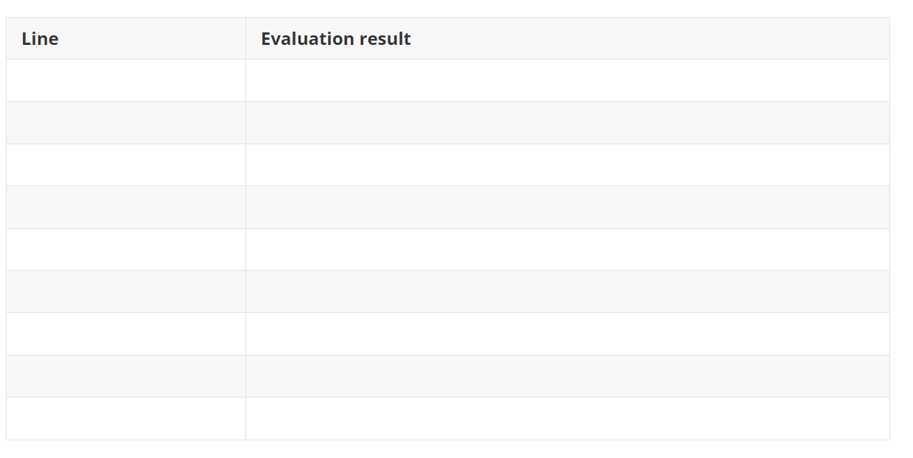

## Instructions

Answer all questions for each checkpoint. Upload an image (in PDF format) of your paper answers to the Ed workspace for this question and press the Submit button to submit your work. The file must be in PDF format! Your tutor can't see the file if you do not press the Submit button after uploading your work.

**IMPORTANT**: You **must** show your answers to the tutor and submit a PDF file of your answer for Checkpoint 1 and Checkpoint 2  to the workspace for marks to be awarded.

Print this handout to write your answers for the following checkpoints:

## The Program

This week's participation targets program comprehension. Review the given program below. **Do not run the program.**

```python
word = "FUN"

def func1(word):
	starts_with = "f"
	
	if type(word) != str:
		return False
	
	if word[0].lower() == starts_with:
		return True
	print(f"{word} doesn't start with \"{starts_with}\"!")
	return False
	
print(func1("INFO1110"))
#Injection for Checkpoint 2 - print(starts_with)
```

## Checkpoint 1 - Function Basics

1. How many parameters does function `func1` have?
2. What is the output of this program? Defend your answer by tracing the lines in the program that were executed. Please complete the table with the following information: 
    -Line : the line number in the program that was executed
    -Evaluation result : The outcome (e.g. value assignment, boolean expression evaluation result) of executing the respective line




## **Checkpoint 2 - Function scope**

Predict the behaviour of the program if the statement  `print(starts_with)` is injected into Line 15 of the program. Why? 


::: details 公众号：AI悦创【二维码】


:::

::: info AI悦创·编程一对一

AI悦创·推出辅导班啦，包括「Python 语言辅导班、C++ 辅导班、java 辅导班、算法/数据结构辅导班、少儿编程、pygame 游戏开发、Web、Linux」，全部都是一对一教学：一对一辅导 + 一对一答疑 + 布置作业 + 项目实践等。当然，还有线下线上摄影课程、Photoshop、Premiere 一对一教学、QQ、微信在线，随时响应！微信：Jiabcdefh

C++ 信息奥赛题解，长期更新！长期招收一对一中小学信息奥赛集训，莆田、厦门地区有机会线下上门，其他地区线上。微信：Jiabcdefh

方法一：[QQ](http://wpa.qq.com/msgrd?v=3&uin=1432803776&site=qq&menu=yes)

方法二：微信：Jiabcdefh

:::


