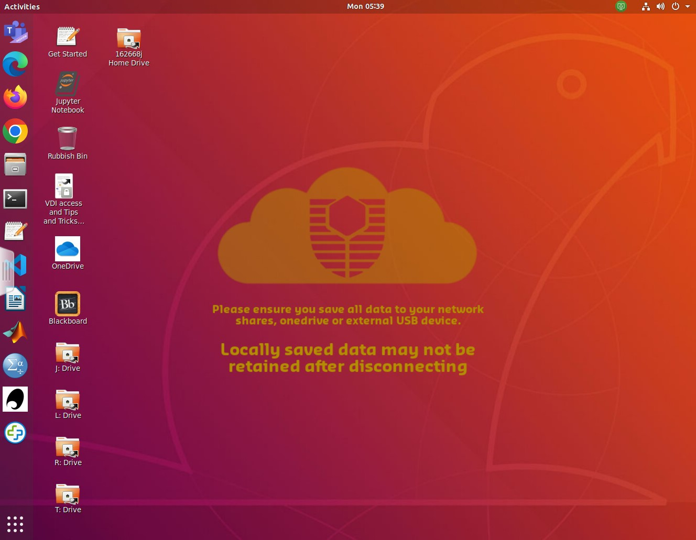

## Introduction

This practical will give a gentle introduction to Linux. It can be done before or after the first lecture - but do not delay as we’ll need everything from this lesson to build on in future weeks.

In class you will be accessing a Linux environment (operating system) through a web browser. We will connect to a Virtual Machine - using servers in the cloud which can run multiple “virtual” machines at once. These, in turn, connect to fileservers where you can store your files and access them from any Curtin computer, or from your home machine(s).

**Note:** If you are working remotely, or are not on Bentley Campus, you may have an alternative setup to access Linux. Your Lecturer will guide you through Activity 0.

That may be too much information for right now… so let’s dive in and find out how to use Linux!

## Activity 1 - Accessing Linux

In the laboratory:

1. login to the machines with your Oasis login.
2. Once you’re connected, open a web browser and go to [mydesktop.curtin.edu.au](https://mydesktop.curtin.edu.au/).
3. You can choose either the install or HTML option, but for the labs we will use **VMware Horizon HTML Access**. You’ll need to login again, making sure to select **STUDENT**.
4. Choose either **Computer Science Linux Lab** or **Curtin Global Linux** - this tells the system which flavour of operating system you want to use. (they are both the same, but can be useful as options when we have technical issues)
5. It will take a few minutes for all the icons to arrive, so this is a good time to get your screens setup - one for the prac sheet/page and the other for working in Linux is recommended.
6. Your screen should look something like this…



## Activity 2 - The Command Line

Now we need to open a **terminal window** to interact with the Linux computer. There is a graphical (GUI) interface, however the command line is more powerful (eventually).

The terminal application is on the left of the screen (a black rectangle). We can make sure it points to the correct area for your files by opening the **I: drive** icon and then right-clicking to get a pop-up menu and select **open in terminal**.

There are a lot of commands you can use in Linux, but you only need a few to get started. A sample of the Unix commands available to you have been provided below. We will learn more commands as we go through the unit.

Try typing the following commands (one at a time) and check what they do…

```bash
ls
ls –l
pwd
mkdir test
ls
cd test
ls
ls –la
```

Here are a few of the most common commands… the < > braces are a convention to indicate text that you replace. Note that in Unix/Linux folders are referred to as directories.

| Command | Description                                                  | Examples                                    |
| ------- | ------------------------------------------------------------ | ------------------------------------------- |
| ls      | Lists all files in the current directory, if an argument is provided lists all files in the specified directory. | ls, ls –l, ls –la                           |
| cp      | Copies the file from source to destination.                  | cp Downloads/test.py ., cp test.py test2.py |
| mv      | Moves the file from source to destination. If the destination ends in a file name it will rename the file. | mv test.py Prac1, mv test.py mytest.py      |
| pwd     | Lists the directory you are currently in (Print Working Directory) | pwd                                         |
| cd      | Moves to                                                     |                                             |
| mkdir   | Creates a new directory                                      | mkdir Prac1                                 |
| rm      | Removes a file                                               | rm fireballs.py                             |
| rmdir   | Removes a directory (must be empty first)                    | rmdir Prac12                                |

Using these commands create the following directory structure within your home directory. A *How to use Unix* and cheatsheet document has been uploaded to Blackboard, it will be helpful if you get stuck. Note you can use the arrow keys to get back to previous commands, and can use to complete long filenames.

- FOP
    - Prac00
    - Prac01
    - Prac02
    - Prac03
    - Prac04
    - Prac05
    - Prac06
    - Prac07
    - Prac08
    - Prac09
    - Prac10
    - Prac11

The current directory is referenced by a single fullstop (.), the parent directory is referenced by two fullstops (..) and all pathways are relative to the current location.

For example…

```bash
cd FOP/Prac01
cd ../Prac00
```

…takes you into FOP/Prac01, then on the second line, back up and into Prac00

### Solution 2

#### 打开终端窗口

首先，需要打开一个终端窗口来与 Linux 电脑进行交互。虽然也有图形界面（GUI），但命令行界面通常更强大。

1. 在屏幕左侧找到终端应用程序，它通常看起来像一个黑色的矩形。
2. 打开**I:驱动器**图标，然后右键点击以弹出菜单，并选择**在终端中打开**。

#### 尝试基本命令

接下来，需要尝试输入并执行一些基本的命令，来熟悉 Linux 的操作。以下是你需要尝试的命令：

```bash
ls      # 列出当前目录下的所有文件
ls -l   # 以长列表形式列出当前目录下的所有文件
pwd     # 显示当前所在目录的完整路径
mkdir test   # 创建一个名为 test 的新目录
ls      # 再次列出当前目录下的所有文件，现在应该可以看到新创建的 test 目录
cd test     # 切换到 test 目录
ls      # 检查 test 目录下的内容（应该是空的）
ls -la  # 以长列表形式列出当前目录下的所有文件，包括隐藏文件
```


## Activity 3 - Introduction to the Text Editor (vim)

We are going to use the vim text editor to create your README file for Prac01. Vim is an enhanced version of vi – a visual, interactive editor. There is an Introduction to Vi document and a “cheat-sheet” on Blackboard, but you should work through this prac before try ing it.

If you’re not already there, change directory into the Prac00 directory and create the README file:

```bash
> cd Prac00
> vim README
```

You will now be in the vim text editor with an empty file. Vim has two modes – command mode (where you can move around the file and use commands) and insert text mode. Type “i” to go into insert mode and type in the following README information for Practical 1.

```bash
## Synopsis
Practical 0 of Fundamentals of Programming COMP1005/5005
 
## Contents
README – readme file for Practical 0
 
## Dependencies
none
 
## Version information
<today’s date> - initial version of Practical 0 programs
```

Press `<esc>` to exit insert mode, then :wq to save the file (w) and exit vim (q). Type

```bash
ls -l
```

(-l for long listing) and you will see that you have created a file called README, and it has a size and a date. We will make README files for all of our practicals to hold information about the files in that directory.

### Solution 3

#### 创建指定的目录结构

接下来，使用你刚学到的命令来创建以下的目录结构。假设你现在位于家目录（home directory）下：

```bash
mkdir FOP
cd FOP
mkdir Prac00 Prac01 Prac02 Prac03 Prac04 Prac05 Prac06 Prac07 Prac08 Prac09 Prac10 Prac11
```

这些命令将创建一个名为 FOP 的目录，并在其中创建 Prac00 到 Prac11 的子目录。

#### 使用 vim 文本编辑器

现在，我们将使用 vim 文本编辑器来创建你的 README 文件。首先，确保你在 Prac00 目录中：

```bash
cd Prac00
```

然后，使用以下命令打开 vim 并创建 README 文件：

```bash
vim README
```

你现在应该在 vim 文本编辑器中，面对一个空文件。按下 `i` 进入插入模式，然后输入以下内容：

```bash
## Synopsis
Practical 0 of Fundamentals of Programming COMP1005/5005
 
## Contents
README – readme file for Practical 0
 
## Dependencies
none
 
## Version information
<today’s date> - initial version of Practical 0 programs
```

完成后，按 `<esc>` 退出插入模式，然后输入`:wq`来保存文件并退出 vim。最后，使用 `ls -l` 命令查看你的 README 文件。

按照这些步骤，你就可以完成上述的活动了。如果在操作过程中遇到任何困难，不要犹豫，随时向我提问。

## Activity 4 - Welcome to Python!

Below is a simple program to get you used to the editor and running python scripts. To create a file for the program, type:

```python
vim hello.py
```

Then type in the following code… It is important to type it yourself and not copy/paste – this is how you will learn and remember!

```python
#
# hello.py: Print out greetings in various languages
#
print('Hello')
print("G'day")
print('Bula')
print("Kia ora")
```

To run the program, type:

```python
python3 hello.py
```

You will probably get an error message as a response (unless you typed it in perfectly). Don’t worry, check through your code for the error and try running it again. Go back into the file and make corrections – use the cursor keys to get to the position (G). Some handy editing commands are:

- to delete a character type “x”
- to delete a line “dd”
- to delete a word “dw”
- to change a word “cw”
- to insert/append after the end of the current line, type “A”
- to undo the last command, type “u”
- to redo the last command, type “.”

Save the file and try to run it again. If you’re having trouble, ask your tutor, or even the person next to you, to see if they can find what’s wrong. Sometimes it takes someone else’s fresh and/or experienced eyes to see an error. This is called “debugging” and the reward comes when the code finally runs!

Try adding some more greetings of your own…

## Activity 5 - Updating the README

You now have a program and a README in the Prac00 directory. Enter the name of each of them along with a description under “Contents” in the README file.

## Activity 6 - Making and submitting a zip file

To bundle up and compress files we can use zip/unzip. Similar programs are tar (Tape Archive) and gzip (GNU zip).

To make a zipped file for Practical 0, go to the Prac00 directory inside your FOP directory. Type pwd to check that you are in the right place.

Create the zip file by typing:

```python
zip Prac00_<your_student_ID> *
 
e.g. zip Prac00_12345678 *
```

This will create a file **Prac00_.zip** which includes everything in your current directory – one program and the README. You can check the contents of the zip file by typing:

```python
unzip –l Prac00_<your_student_ID>.zip
```


::: details 公众号：AI悦创【二维码】


:::

::: info AI悦创·编程一对一

AI悦创·推出辅导班啦，包括「Python 语言辅导班、C++ 辅导班、java 辅导班、算法/数据结构辅导班、少儿编程、pygame 游戏开发、Web、Linux」，全部都是一对一教学：一对一辅导 + 一对一答疑 + 布置作业 + 项目实践等。当然，还有线下线上摄影课程、Photoshop、Premiere 一对一教学、QQ、微信在线，随时响应！微信：Jiabcdefh

C++ 信息奥赛题解，长期更新！长期招收一对一中小学信息奥赛集训，莆田、厦门地区有机会线下上门，其他地区线上。微信：Jiabcdefh

方法一：[QQ](http://wpa.qq.com/msgrd?v=3&uin=1432803776&site=qq&menu=yes)

方法二：微信：Jiabcdefh

:::


