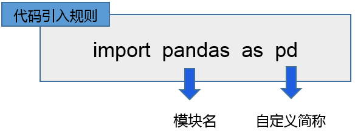
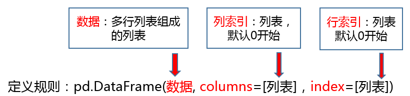
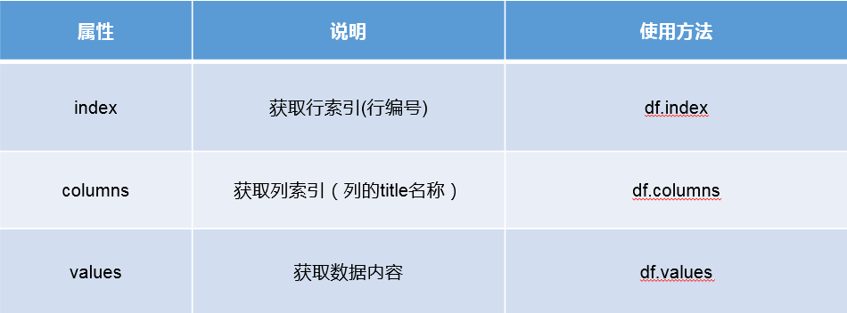
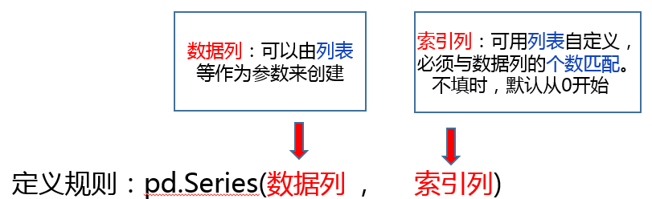

## 0. 前言

你好，我是悦创。

这是小红书正事接单的 P01单，以下是对话记录📝。

:::: details Images

::: tabs

@tab img-1


@tab img-2


@tab img-3


@tab img-4


@tab img-5


:::

::::

## 1. Pandas 基础

### 1.1 Pandas 数据结构

#### 1.1.1 实验要求

（1）熟悉 pandas 的引入规则。

（2）理解 dataFrame 的数据结构，熟悉 dataFrame 中行索引和列索引的概念。

（3）熟悉 DataFrame 的定义规则。

（4）熟悉 DataFrame 常见的三种属性（index，columns，values）。

（5）理解 Series 的数据结构，熟悉索引和数据的概念。

（6）熟悉 Series 的定义规则。

（7）完成右侧的实操内容。

#### 1.1.2 涉及知识点

1. pandas 引入规则



2. DataFrame 的定义规则



3. DataFrame 的属性



4. Series 的定义规则



#### 1.1.3 常见问题

（1）输入符号的时候，必须使用英文输入法下的符号。

（2）pandas 调用 `DataFrame()` 和 `Series()` 时，首字母必须大写。

（3）DataFrame 和 Series 的第一个参数必须是数据。

（4）DataFrame 定义行索引使用 `index=`，列索引使用 `columns=`。

（5）Series 使用列表定义索引时，索引的个数必须与数据的个数匹配。

#### 1.1.4 DataFrame 数据结构

```python
# 基础数据
import pandas as pd
dataList = pd.DataFrame([
            ['wzw001',"张奕成","行政部","管理人员","20","18000.00","0","500.00"],
            ['wzw002',"林海之","行政部","管理人员","22","11000.00","0","200.00"],
            ['wzw004',"张晨",  "财务部","管理人员","22","12000.00","0","200.00"],
            ['wzw005',"李丽琴","财务部","管理人员","18","9000.00","0","200.00"],
            ['wzw006',"林雨",  "采购部","管理人员","20","8500.00","0","200.00"],
            ['wzw008',"曾国华","销售部","销售人员","19","22000.00","500.00","200.00"],
            ['wzw009',"刘成宇","销售部","销售人员","22","8500.00","1000.00","200.00"]
            ],columns=['员工工号','姓名','部门','岗位职级','出勤天数','基本工资','绩效工资','津贴'],index=[1,2,3,4,5,6,7])
print(dataList)
```

1. 不自定义行索引和列索引创建 DataFrame

```python
# 引入pandas第三方库
import pandas as pd
# 创建二维列表，并赋值给一个变量
dataList = [
            ['001','张三','男'],
            ['002','李四','男']
            ]
# 创建不带行索引和列索引的DataFrame
df1 = pd.DataFrame(dataList)
# 展示dataFrame
print(df1)
```

```python
# 引入pandas第三方库

# 创建二维列表，并赋值给一个变量
dataList = [[2021001,"张奕成","男",20,"13860169996",175,66],
           [2021002,"林海之","男",22,"13860165188",180,75]]
# 创建df1 = pd.DataFrame(dataList)
df1 = pd.DataFrame(dataList)
# 展示dataFrame
print(df1)
```

2. 自定义列索引，不自定义行索引 DataFrame

```python
# 引入pandas第三方库
import pandas as pd
# 创建二维列表，并赋值给一个变量
dataList = [
            ['001','张三','男'],
            ['002','李四','男']
            ]
# 创建对应个数的列索引，并赋值给一个变量
columnList = ["序号","姓名","性别"]
# 创建不带行索引，带列索引的DataFrame
df2 = pd.DataFrame(dataList,columns=columnList)
# 展示dataFrame
print(df2)
```

```python
# 引入pandas第三方库

# 创建二维列表，并赋值给一个变量
dataList = [[2021001,"张奕成","男",20,"13860169996",175,66],
           [2021002,"林海之","男",22,"13860165188",180,75]]
# 创建对应个数的列索引，并赋值给一个变量
columnList = ["学号","姓名","性别","年龄","手机号","身高","体重"]
# 创建DataFrame
df2 = pd.DataFrame(dataList,columns=columnList)
# 展示dataFrame
print(df2)
```

3. 自定义列索引和行索引创建 DataFrame

```python
# 引入pandas第三方库
import pandas as pd
# 创建二维列表，并赋值给一个变量
dataList = [
            ['001','张三','男'],
            ['002','李四','男']
            ]
# 创建对应个数的列索引，并赋值给一个变量
columnList = ["学号","姓名","性别"]
# 创建对应个数的行索引，并赋值给一个变量
indexList = [1,2]
# 创建带行索引和列索引的DataFrame
df3 = pd.DataFrame(dataList,columns=columnList,index=indexList)
# 展示dataFrame
print(df3)
```

```python
# 引入pandas第三方库

# 创建一个两行的数据列表，并赋值给一个变量
dataList = [[2021001,"张奕成","男",20,"13860169996",175,66],
           [2021002,"林海之","男",22,"13860165188",180,75]]
# 创建对应个数的列索引，并赋值给一个变量
columnList = ["学号","姓名","性别","年龄","手机号","身高","体重"]
# 创建对应个数的行索引，并赋值给一个变量
indexList = [1,2]
# 创建DataFrame
df3 = pd.DataFrame(dataList,columns=columnList,index=indexList)
# 展示dataFrame
print(df3)
```

#### 1.1.5 DataFrame 的属性

1. 获取 DataFrame 的行索引（行的编号）

```python
print(df3.index)
```

2. 获取 DataFrame 的列索引（列的标题名称）

```python
print(df3.columns)
```

3. 获取 DataFrame 的数据内容

```python
print(df3.values)
```

#### 1.1.6 案例练习

将下图的 excel 表格数据，使用 DataFrame 展示，行索引从 1 开始。

| 序号 | 科目编码 | 会计科目     | 期初余额 | 本期借方发生额 |
| ---- | -------- | ------------ | -------- | -------------- |
| 1    | 1001     | 库存现金     | 5215     | 1010           |
| 2    | 1002     | 银行存款     | 1595236  | 254582         |
| 3    | 1012     | 其他货币资金 | 160000   | 50000          |

```python
# 引入pandas第三方库
import pandas as pd

# 定义变量设置excel内的数据
dataList = [[1001, "库存现金", 5215, 1010],
            [1002, "银行存款", 1595236, 254582],
            [1012, "其他货币资金", 160000, 50000]]
# 每一列的新信息，即（列索引）
columnList = ["科目编码", "会计科日", "期初余额", "本期借方发生额"]
# 每一行的行号（行索引）
indexList = [1, 2, 3]
# 组装成DataFrame格式的
df = pd.DataFrame(dataList, columns=columnList, index=indexList)
# 展示数据
print(df)
```

#### 1.1.7 Series 数据结构

1. 用列表创建 Series，使用默认索引

```python
# 引入pandas第三方库
import pandas as pd
# 定义列表
valList = ["张三","李四"]
# 创建使用默认索引的Series
ser1 = pd.Series(valList)
# 展示Series
print(ser1)
```

```python
# 引入pandas第三方库
import pandas as pd

# 定义数据列
valList = ["张奕成", "林海之", "张晨", "李丽琴", "林雨"]
# 创建使用默认索引的 Series

# 展示 Series
ser1 = pd.Series(valList)
# 展示 Series
print(ser1)
```

2. 用列表创建 Series，使用自定义索引

```python
# 引入pandas第三方库
import pandas as pd
# 定义数据列
valList = ["张三","李四"]
# 定义索引，与数据列个数必须匹配
index = [1,2]
# 创建使用自定义索引的Series
ser2 = pd.Series(valList,index)
# 展示Series
print(ser2)
```

```python
# 引入pandas第三方库
import pandas as pd

# 定义数据列
valList = ["张奕成", "林海之", "张晨", "李丽琴", "林雨"]
# 定义索引，与数据列个数必须匹配
index = [1, 2, 3, 4, 5]
# 创建使用自定义索引的 Series
ser = pd.Series(index=index, data=valList)

# 展示 Series
print(ser)
```

#### 1.1.8 案例练习

根据下列表格创建一个 Series，并将这列数据放入案例练习一中的 DataFrame 中

| 期末余额 |
| -------- |
| 6225     |
| 1849818  |
| 210000   |

```python
import pandas as pd

# 创建初始 DataFrame
data = {
    # "序号": [1, 2, 3],
    "科目编码": [1001, 1002, 1012],
    "会计科目": ["库存现金", "银行存款", "其他货币资金"],
    "期初余额": [5215, 1595236, 160000],
    "本期借方发生额": [1010, 254582, 50000]
}

df = pd.DataFrame(data)
df.index += 1  # 行索引从 1 开始

# 创建新的 Series
ending_balance = pd.Series([6225, 1849818, 210000], name="期末余额")

# 将新的 Series 添加到原 DataFrame 中
df["期末余额"] = ending_balance.values

# 显示 DataFrame
print(df)
```

### 1.2 Pandas 文件操作

功能：在工程中，一些钢筋等材料呈圆柱体通常需要计算它的表面积，侧面积，体积来帮助，施工，有时可以减少损失

代码：

```python      
r = float(input('请输入半径'))
h = float(input('请输入高'))
s = 2 * 3.14 * r * h
print(s)

r = float(input('请输入半径'))
h = float(input('请输入高'))
v = 3.14 * r ** 2 * h
print(v)

r = float(input('请输入半径'))
h = float(input('请输入高'))
area = s + 2 * 3.14 * r ** 2
print(area)
```


