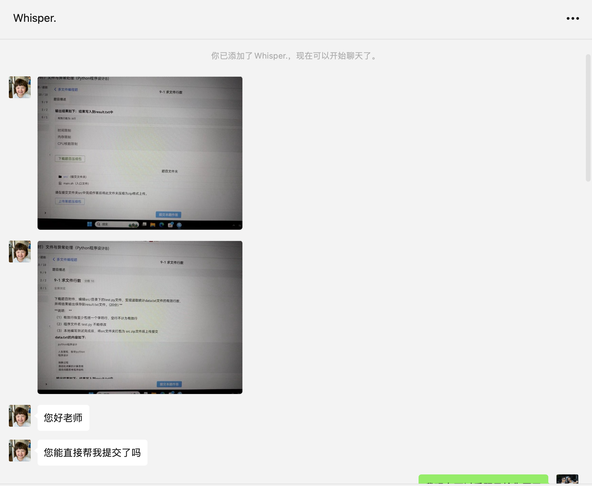
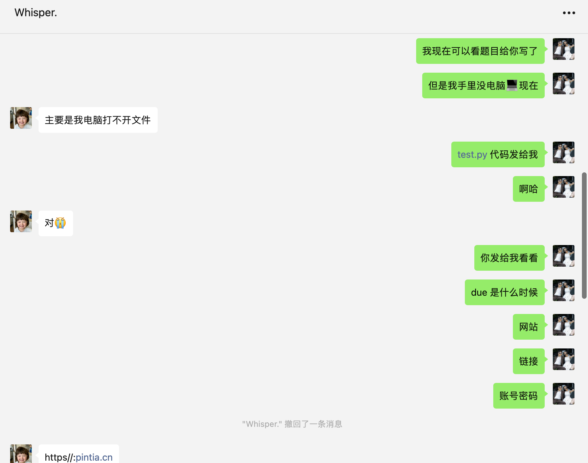

## 0. 前言

你好，我是悦创。

这是小红书正事接单的 P02单，以下是对话记录📝。接着她推荐朋友，所以我这个等于两个人的单子～

:::: details Images

::: tabs

@tab img-1



@tab img-2



@tab img-3


@tab img-4


:::

::::

## 1. 题目「求文件行数」

下载题目附件，编辑 `src/` 目录下的 `test.py` 文件，实现读取统计 `data.txt` 文件的有效行数，并将结果输出保存到 `result.txt` 文件。(20分) 

**说明： **

（1）有效行指至少包括一个字符行，空行不计为有效行

（2）程序文件名 `test.py` 不能修改

（3）本地编写测试完成后，将 src 文件夹打包为 `src.zip` 文件后上传提交

**data.txt 的内容如下:**

```text
python程序设计

人生苦短，我学python
程序设计

抽象过程
自动化求解的计算思维
结合问题思考程序结构
```

**输出结果如下：结果写入到 result.txt 中**

```text
有效行数为:6行
```


