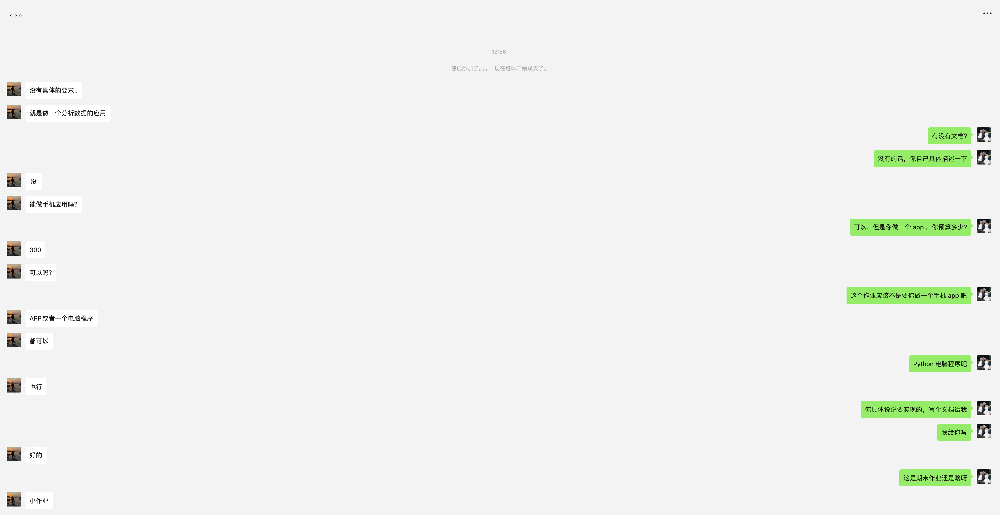
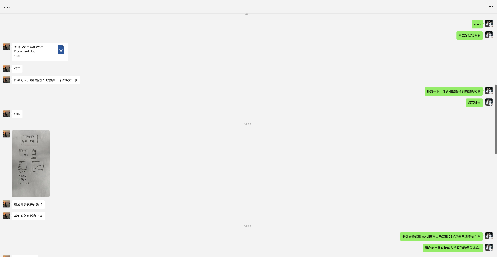
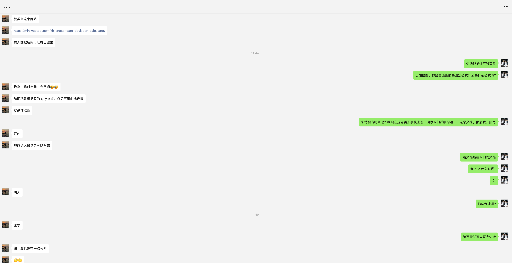
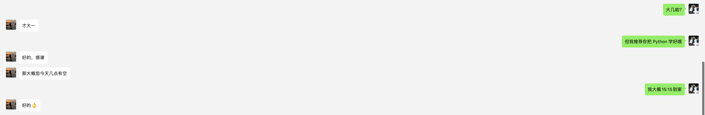

## 0. 前言

你好，我是悦创。

::: tabs

@tab image-1



@tab image-2



@tab image-3



@tab image-4



:::

## 1. 需求描述

### 程序名：实验数据分析

要求：点开以后弹出窗口提供两个选项

1. 计算：
    - 点开计算后，提供一个可输入数据的窗口，输入数据并点确定后，可以计算出平均数、方差、RS、RSD；
    - 示例：
    
    输入格式：
    
    ```python
    26 35 42 36 45 25.3 32.16
    ```
    
    输出：
    
    ```python
    计算结果如下：
    
    - 平均数 (Mean)：34.49
    - 方差 (Variance)：47.34
    - RS (Relative Spread)：0.571
    - RSD (Relative Standard Deviation)：19.95%
    ```
    
2. 绘图：
    - 点开绘图后，提供一个可输入 x 轴，y 轴数据的窗口（x、y数量由用户按“+”定义格数），输入后点确定，可以得到一张点线图，线条需要平滑；

## 2. 代码实现

::: code-tabs

@tab Code V0.1

```python
import tkinter as tk
from tkinter import simpledialog, messagebox
import numpy as np
import matplotlib.pyplot as plt
from scipy.stats import linregress


class DataAnalysisApp:
    def __init__(self, root):
        self.root = root
        self.root.title("实验数据分析")
        self.create_widgets()

    def create_widgets(self):
        self.calc_button = tk.Button(self.root, text="计算", command=self.calculate)
        self.calc_button.pack(pady=10)

        self.plot_button = tk.Button(self.root, text="绘图", command=self.plot)
        self.plot_button.pack(pady=10)

    def calculate(self):
        data_str = simpledialog.askstring("输入数据", "请输入数据（用空格分隔）：")
        if data_str:
            try:
                data = list(map(float, data_str.split()))
                mean = np.mean(data)
                variance = np.var(data)
                rs = (np.max(data) - np.min(data)) / mean
                rsd = (np.std(data) / mean) * 100

                result = f"计算结果如下：\n\n- 平均数 (Mean)：{mean:.2f}\n- 方差 (Variance)：{variance:.2f}\n- RS (Relative Spread)：{rs:.3f}\n- RSD (Relative Standard Deviation)：{rsd:.2f}%"
                messagebox.showinfo("计算结果", result)
            except Exception as e:
                messagebox.showerror("错误", f"数据格式错误：{e}")

    def plot(self):
        num_points = simpledialog.askinteger("输入点数", "请输入数据点的数量：")
        if num_points and num_points > 0:
            x_data = []
            y_data = []
            for i in range(num_points):
                x = simpledialog.askfloat("输入 X 轴数据", f"请输入第 {i + 1} 个 X 轴数据：")
                y = simpledialog.askfloat("输入 Y 轴数据", f"请输入第 {i + 1} 个 Y 轴数据：")
                if x is not None and y is not None:
                    x_data.append(x)
                    y_data.append(y)
                else:
                    messagebox.showerror("错误", "数据输入有误，请重新输入。")
                    return

            plt.figure()
            plt.plot(x_data, y_data, 'bo-', label='Data')
            slope, intercept, r_value, p_value, std_err = linregress(x_data, y_data)
            plt.plot(x_data, intercept + slope * np.array(x_data), 'r',
                     label=f'Fit line (y={slope:.2f}x+{intercept:.2f})')
            plt.xlabel('X 轴')
            plt.ylabel('Y 轴')
            plt.title('点线图及线性拟合')
            plt.legend()
            plt.show()


if __name__ == "__main__":
    root = tk.Tk()
    app = DataAnalysisApp(root)
    root.mainloop()
```

@tab Code V0.2

```python
import tkinter as tk
from tkinter import simpledialog, messagebox
import numpy as np
import matplotlib.pyplot as plt
from scipy.stats import linregress

class DataAnalysisApp:
    def __init__(self, root):
        self.root = root
        self.root.title("实验数据分析")
        self.create_widgets()

    def create_widgets(self):
        self.calc_button = tk.Button(self.root, text="计算", command=self.calculate)
        self.calc_button.pack(pady=10)

        self.plot_button = tk.Button(self.root, text="绘图", command=self.plot)
        self.plot_button.pack(pady=10)

    def calculate(self):
        self.calc_window = tk.Toplevel(self.root)
        self.calc_window.title("输入数据")

        self.input_label = tk.Label(self.calc_window, text="请输入数据（用空格分隔）：")
        self.input_label.pack(pady=5)

        self.data_entry = tk.Entry(self.calc_window, width=50)
        self.data_entry.pack(pady=5)

        self.submit_button = tk.Button(self.calc_window, text="确定", command=self.perform_calculation)
        self.submit_button.pack(pady=10)

        self.result_label = tk.Label(self.calc_window, text="", justify=tk.LEFT)
        self.result_label.pack(pady=10)

    def perform_calculation(self):
        data_str = self.data_entry.get()
        if data_str:
            try:
                data = list(map(float, data_str.split()))
                mean = np.mean(data)
                variance = np.var(data)
                rs = (np.max(data) - np.min(data)) / mean
                rsd = (np.std(data) / mean) * 100

                result = f"计算结果如下：\n\n- 平均数 (Mean)：{mean:.2f}\n- 方差 (Variance)：{variance:.2f}\n- RS (Relative Spread)：{rs:.3f}\n- RSD (Relative Standard Deviation)：{rsd:.2f}%"
                self.result_label.config(text=result)
            except Exception as e:
                self.result_label.config(text=f"数据格式错误：{e}")

    def plot(self):
        num_points = simpledialog.askinteger("输入点数", "请输入数据点的数量：")
        if num_points and num_points > 0:
            x_data = []
            y_data = []
            for i in range(num_points):
                x = simpledialog.askfloat("输入 X 轴数据", f"请输入第 {i + 1} 个 X 轴数据：")
                y = simpledialog.askfloat("输入 Y 轴数据", f"请输入第 {i + 1} 个 Y 轴数据：")
                if x is not None and y is not None:
                    x_data.append(x)
                    y_data.append(y)
                else:
                    messagebox.showerror("错误", "数据输入有误，请重新输入。")
                    return

            plt.figure()
            plt.plot(x_data, y_data, 'bo-', label='Data')
            slope, intercept, r_value, p_value, std_err = linregress(x_data, y_data)
            plt.plot(x_data, intercept + slope * np.array(x_data), 'r', label=f'Fit line (y={slope:.2f}x+{intercept:.2f})')
            plt.xlabel('X 轴')
            plt.ylabel('Y 轴')
            plt.title('点线图及线性拟合')
            plt.legend()
            plt.show()

if __name__ == "__main__":
    root = tk.Tk()
    app = DataAnalysisApp(root)
    root.mainloop()
```

@tab Code V0.3

 ```python
 import tkinter as tk
 from tkinter import simpledialog, messagebox
 import numpy as np
 import matplotlib.pyplot as plt
 from scipy.stats import linregress
 from matplotlib.backends.backend_tkagg import FigureCanvasTkAgg
 
 
 class DataAnalysisApp:
     def __init__(self, root):
         self.root = root
         self.root.title("实验数据分析")
         # 设置窗口的大小 (宽度x高度)
         self.root.geometry("180x100")  # 例如，将窗口设置为800x600像素
         self.create_widgets()
 
     def create_widgets(self):
         self.calc_button = tk.Button(self.root, text="计算", command=self.calculate)
         self.calc_button.pack(pady=10)
 
         self.plot_button = tk.Button(self.root, text="绘图", command=self.plot)
         self.plot_button.pack(pady=10)
 
     def calculate(self):
         self.calc_window = tk.Toplevel(self.root)
         self.calc_window.title("输入数据")
 
         self.input_label = tk.Label(self.calc_window, text="请输入数据（用空格分隔）：")
         self.input_label.pack(pady=5)
 
         self.data_entry = tk.Entry(self.calc_window, width=50)
         self.data_entry.pack(pady=5)
 
         self.submit_button = tk.Button(self.calc_window, text="确定", command=self.perform_calculation)
         self.submit_button.pack(pady=10)
 
         self.result_label = tk.Label(self.calc_window, text="", justify=tk.LEFT)
         self.result_label.pack(pady=10)
 
     def perform_calculation(self):
         data_str = self.data_entry.get()
         if data_str:
             try:
                 data = list(map(float, data_str.split()))
                 mean = np.mean(data)
                 variance = np.var(data)
                 rs = (np.max(data) - np.min(data)) / mean
                 rsd = (np.std(data) / mean) * 100
 
                 result = f"计算结果如下：\n\n- 平均数 (Mean)：{mean:.2f}\n- 方差 (Variance)：{variance:.2f}\n- RS (Relative Spread)：{rs:.3f}\n- RSD (Relative Standard Deviation)：{rsd:.2f}%"
                 self.result_label.config(text=result)
             except Exception as e:
                 self.result_label.config(text=f"数据格式错误：{e}")
 
     def plot(self):
         self.plot_window = tk.Toplevel(self.root)
         self.plot_window.title("输入数据")
 
         self.input_label = tk.Label(self.plot_window, text="请输入数据（格式：[(x1, y1), (x2, y2),... (xn, yn)]）：")
         self.input_label.pack(pady=5)
 
         self.data_entry = tk.Entry(self.plot_window, width=50)
         self.data_entry.pack(pady=5)
 
         self.submit_button = tk.Button(self.plot_window, text="确定", command=self.perform_plot)
         self.submit_button.pack(pady=10)
 
         self.canvas = None
 
     def perform_plot(self):
         data_str = self.data_entry.get()
         if data_str:
             try:
                 data = eval(data_str)
                 x_data, y_data = zip(*data)
 
                 fig, ax = plt.subplots()
                 ax.plot(x_data, y_data, 'bo-', label='Data')
                 slope, intercept, r_value, p_value, std_err = linregress(x_data, y_data)
                 ax.plot(x_data, intercept + slope * np.array(x_data), 'r',
                         label=f'Fit line (y={slope:.2f}x+{intercept:.2f})')
                 ax.set_xlabel('X 轴')
                 ax.set_ylabel('Y 轴')
                 ax.set_title('点线图及线性拟合')
                 ax.legend()
 
                 if self.canvas:
                     self.canvas.get_tk_widget().pack_forget()
 
                 self.canvas = FigureCanvasTkAgg(fig, master=self.plot_window)
                 self.canvas.draw()
                 self.canvas.get_tk_widget().pack()
 
             except Exception as e:
                 messagebox.showerror("错误", f"数据格式错误：{e}")
 
 
 if __name__ == "__main__":
     root = tk.Tk()
     app = DataAnalysisApp(root)
     root.mainloop()
 ```

@tab Code V0.4

```python
import tkinter as tk
from tkinter import simpledialog, messagebox
import numpy as np
import matplotlib.pyplot as plt
from scipy.stats import linregress
from matplotlib.backends.backend_tkagg import FigureCanvasTkAgg

class DataAnalysisApp:
    def __init__(self, root):
        self.root = root
        self.root.title("实验数据分析")
        self.create_widgets()

    def create_widgets(self):
        self.calc_button = tk.Button(self.root, text="计算", command=self.calculate)
        self.calc_button.pack(pady=10)

        self.plot_button = tk.Button(self.root, text="绘图", command=self.plot)
        self.plot_button.pack(pady=10)

    def calculate(self):
        self.calc_window = tk.Toplevel(self.root)
        self.calc_window.title("输入数据")

        self.input_label = tk.Label(self.calc_window, text="请输入数据（用空格分隔）：")
        self.input_label.pack(pady=5)

        self.data_entry = tk.Entry(self.calc_window, width=50)
        self.data_entry.pack(pady=5)

        self.submit_button = tk.Button(self.calc_window, text="确定", command=self.perform_calculation)
        self.submit_button.pack(pady=10)

        self.result_label = tk.Label(self.calc_window, text="", justify=tk.LEFT)
        self.result_label.pack(pady=10)

    def perform_calculation(self):
        data_str = self.data_entry.get()
        if data_str:
            try:
                data = list(map(float, data_str.split()))
                mean = np.mean(data)
                variance = np.var(data)
                rs = (np.max(data) - np.min(data)) / mean
                rsd = (np.std(data) / mean) * 100

                result = f"计算结果如下：\n\n- 平均数 (Mean)：{mean:.2f}\n- 方差 (Variance)：{variance:.2f}\n- RS (Relative Spread)：{rs:.3f}\n- RSD (Relative Standard Deviation)：{rsd:.2f}%"
                self.result_label.config(text=result)
            except Exception as e:
                self.result_label.config(text=f"数据格式错误：{e}")

    def plot(self):
        self.plot_window = tk.Toplevel(self.root)
        self.plot_window.title("输入数据")

        self.input_label = tk.Label(self.plot_window, text="请输入数据（格式：[(x1, y1), (x2, y2),... (xn, yn)]）：")
        self.input_label.pack(pady=5)

        self.data_entry = tk.Entry(self.plot_window, width=50)
        self.data_entry.pack(pady=5)

        self.title_label = tk.Label(self.plot_window, text="绘图标题：")
        self.title_label.pack(pady=5)
        self.title_entry = tk.Entry(self.plot_window, width=50)
        self.title_entry.pack(pady=5)

        self.xlabel_label = tk.Label(self.plot_window, text="X 轴名称：")
        self.xlabel_label.pack(pady=5)
        self.xlabel_entry = tk.Entry(self.plot_window, width=50)
        self.xlabel_entry.pack(pady=5)

        self.ylabel_label = tk.Label(self.plot_window, text="Y 轴名称：")
        self.ylabel_label.pack(pady=5)
        self.ylabel_entry = tk.Entry(self.plot_window, width=50)
        self.ylabel_entry.pack(pady=5)

        self.submit_button = tk.Button(self.plot_window, text="确定", command=self.perform_plot)
        self.submit_button.pack(pady=10)

        self.canvas = None

    def perform_plot(self):
        data_str = self.data_entry.get()
        plot_title = self.title_entry.get()
        x_label = self.xlabel_entry.get()
        y_label = self.ylabel_entry.get()
        if data_str:
            try:
                data = eval(data_str)
                x_data, y_data = zip(*data)

                fig, ax = plt.subplots()
                ax.plot(x_data, y_data, 'bo-', label='Data')
                slope, intercept, r_value, p_value, std_err = linregress(x_data, y_data)
                ax.plot(x_data, intercept + slope * np.array(x_data), 'r', label=f'Fit line (y={slope:.2f}x+{intercept:.2f})')
                ax.set_xlabel(x_label)
                ax.set_ylabel(y_label)
                ax.set_title(plot_title)
                ax.legend()

                if self.canvas:
                    self.canvas.get_tk_widget().pack_forget()

                self.canvas = FigureCanvasTkAgg(fig, master=self.plot_window)
                self.canvas.draw()
                self.canvas.get_tk_widget().pack()

            except Exception as e:
                messagebox.showerror("错误", f"数据格式错误：{e}")

if __name__ == "__main__":
    root = tk.Tk()
    app = DataAnalysisApp(root)
    root.mainloop()
```

@tab 注释

```python
import tkinter as tk
from tkinter import simpledialog, messagebox
import numpy as np
import matplotlib.pyplot as plt
from scipy.stats import linregress
from matplotlib.backends.backend_tkagg import FigureCanvasTkAgg

class DataAnalysisApp:
    def __init__(self, root):
        # 初始化应用程序
        self.root = root
        self.root.title("实验数据分析")  # 设置主窗口标题
        self.create_widgets()  # 创建主界面的按钮

    def create_widgets(self):
        # 创建计算按钮
        self.calc_button = tk.Button(self.root, text="计算", command=self.calculate)
        self.calc_button.pack(pady=10)

        # 创建绘图按钮
        self.plot_button = tk.Button(self.root, text="绘图", command=self.plot)
        self.plot_button.pack(pady=10)

    def calculate(self):
        # 创建计算数据的输入窗口
        self.calc_window = tk.Toplevel(self.root)
        self.calc_window.title("输入数据")

        # 输入数据的标签和输入框
        self.input_label = tk.Label(self.calc_window, text="请输入数据（用空格分隔）：")
        self.input_label.pack(pady=5)

        self.data_entry = tk.Entry(self.calc_window, width=50)
        self.data_entry.pack(pady=5)

        # 提交按钮
        self.submit_button = tk.Button(self.calc_window, text="确定", command=self.perform_calculation)
        self.submit_button.pack(pady=10)

        # 显示计算结果的标签
        self.result_label = tk.Label(self.calc_window, text="", justify=tk.LEFT)
        self.result_label.pack(pady=10)

    def perform_calculation(self):
        # 执行计算操作
        data_str = self.data_entry.get()  # 获取用户输入的数据
        if data_str:
            try:
                # 将输入的字符串转换为浮点数列表
                data = list(map(float, data_str.split()))
                # 计算平均数、方差、相对扩展系数和相对标准偏差
                mean = np.mean(data)
                variance = np.var(data)
                rs = (np.max(data) - np.min(data)) / mean
                rsd = (np.std(data) / mean) * 100

                # 构建结果字符串
                result = f"计算结果如下：\n\n- 平均数 (Mean)：{mean:.2f}\n- 方差 (Variance)：{variance:.2f}\n- RS (Relative Spread)：{rs:.3f}\n- RSD (Relative Standard Deviation)：{rsd:.2f}%"
                self.result_label.config(text=result)  # 显示计算结果
            except Exception as e:
                # 数据格式错误处理
                self.result_label.config(text=f"数据格式错误：{e}")

    def plot(self):
        # 创建绘图数据的输入窗口
        self.plot_window = tk.Toplevel(self.root)
        self.plot_window.title("输入数据")

        # 输入数据格式的标签和输入框
        self.input_label = tk.Label(self.plot_window, text="请输入数据（格式：[(x1, y1), (x2, y2),... (xn, yn)]）：")
        self.input_label.pack(pady=5)

        self.data_entry = tk.Entry(self.plot_window, width=50)
        self.data_entry.pack(pady=5)

        # 输入绘图标题的标签和输入框
        self.title_label = tk.Label(self.plot_window, text="绘图标题：")
        self.title_label.pack(pady=5)
        self.title_entry = tk.Entry(self.plot_window, width=50)
        self.title_entry.pack(pady=5)

        # 输入X轴名称的标签和输入框
        self.xlabel_label = tk.Label(self.plot_window, text="X 轴名称：")
        self.xlabel_label.pack(pady=5)
        self.xlabel_entry = tk.Entry(self.plot_window, width=50)
        self.xlabel_entry.pack(pady=5)

        # 输入Y轴名称的标签和输入框
        self.ylabel_label = tk.Label(self.plot_window, text="Y 轴名称：")
        self.ylabel_label.pack(pady=5)
        self.ylabel_entry = tk.Entry(self.plot_window, width=50)
        self.ylabel_entry.pack(pady=5)

        # 提交按钮
        self.submit_button = tk.Button(self.plot_window, text="确定", command=self.perform_plot)
        self.submit_button.pack(pady=10)

        self.canvas = None  # 初始化画布为空

    def perform_plot(self):
        # 执行绘图操作
        data_str = self.data_entry.get()  # 获取用户输入的数据
        plot_title = self.title_entry.get()  # 获取用户输入的绘图标题
        x_label = self.xlabel_entry.get()  # 获取用户输入的X轴名称
        y_label = self.ylabel_entry.get()  # 获取用户输入的Y轴名称
        if data_str:
            try:
                # 解析输入的数据
                data = eval(data_str)
                x_data, y_data = zip(*data)

                # 创建绘图
                fig, ax = plt.subplots()
                ax.plot(x_data, y_data, 'bo-', label='Data')
                slope, intercept, r_value, p_value, std_err = linregress(x_data, y_data)
                ax.plot(x_data, intercept + slope * np.array(x_data), 'r', label=f'Fit line (y={slope:.2f}x+{intercept:.2f})')
                ax.set_xlabel(x_label)  # 设置X轴名称
                ax.set_ylabel(y_label)  # 设置Y轴名称
                ax.set_title(plot_title)  # 设置绘图标题
                ax.legend()

                # 如果已有画布，移除旧的画布
                if self.canvas:
                    self.canvas.get_tk_widget().pack_forget()

                # 将图形嵌入Tkinter窗口中
                self.canvas = FigureCanvasTkAgg(fig, master=self.plot_window)
                self.canvas.draw()
                self.canvas.get_tk_widget().pack()

            except Exception as e:
                # 数据格式错误处理
                messagebox.showerror("错误", f"数据格式错误：{e}")

if __name__ == "__main__":
    root = tk.Tk()
    app = DataAnalysisApp(root)
    root.mainloop()

```


:::


Python计算：26 35 42 36 45 25.3 32.16，计算出平均数、方差、RS、RSD

::: details

### 实验数据分析程序教程

本教程将逐步带领您编写一个实验数据分析程序，使用 `Tkinter` 创建图形用户界面 (GUI)，进行数据的计算和绘图。我们将从基础功能开始，逐步优化和扩展该程序。

#### 第一步：创建主窗口和按钮

首先，我们创建一个基本的 Tkinter 窗口，并在窗口中添加两个按钮：“计算”和“绘图”。

```python
import tkinter as tk

class DataAnalysisApp:
    def __init__(self, root):
        self.root = root
        self.root.title("实验数据分析")
        self.create_widgets()

    def create_widgets(self):
        self.calc_button = tk.Button(self.root, text="计算", command=self.calculate)
        self.calc_button.pack(pady=10)

        self.plot_button = tk.Button(self.root, text="绘图", command=self.plot)
        self.plot_button.pack(pady=10)

    def calculate(self):
        pass

    def plot(self):
        pass

if __name__ == "__main__":
    root = tk.Tk()
    app = DataAnalysisApp(root)
    root.mainloop()
```

在 `create_widgets` 方法中，我们创建了两个按钮，并将它们添加到主窗口中。

#### 第二步：实现计算功能

接下来，我们实现“计算”按钮的功能。点击按钮后，会弹出一个新窗口，让用户输入数据，并计算平均数、方差、相对分散 (RS) 和相对标准差 (RSD)。

```python
import numpy as np

def calculate(self):
    self.calc_window = tk.Toplevel(self.root)
    self.calc_window.title("输入数据")

    self.input_label = tk.Label(self.calc_window, text="请输入数据（用空格分隔）：")
    self.input_label.pack(pady=5)

    self.data_entry = tk.Entry(self.calc_window, width=50)
    self.data_entry.pack(pady=5)

    self.submit_button = tk.Button(self.calc_window, text="确定", command=self.perform_calculation)
    self.submit_button.pack(pady=10)

    self.result_label = tk.Label(self.calc_window, text="", justify=tk.LEFT)
    self.result_label.pack(pady=10)

def perform_calculation(self):
    data_str = self.data_entry.get()
    if data_str:
        try:
            data = list(map(float, data_str.split()))
            mean = np.mean(data)
            variance = np.var(data)
            rs = (np.max(data) - np.min(data)) / mean
            rsd = (np.std(data) / mean) * 100

            result = f"计算结果如下：\n\n- 平均数 (Mean)：{mean:.2f}\n- 方差 (Variance)：{variance:.2f}\n- RS (Relative Spread)：{rs:.3f}\n- RSD (Relative Standard Deviation)：{rsd:.2f}%"
            self.result_label.config(text=result)
        except Exception as e:
            self.result_label.config(text=f"数据格式错误：{e}")
```

在 `calculate` 方法中，我们创建了一个新窗口，用户可以在其中输入数据。输入完成后，点击“确定”按钮会调用 `perform_calculation` 方法，计算并显示结果。

#### 第三步：实现绘图功能

现在，我们实现“绘图”按钮的功能。点击按钮后，会弹出一个新窗口，用户可以输入数据，绘制图形并显示在窗口中。

```python
import matplotlib.pyplot as plt
from matplotlib.backends.backend_tkagg import FigureCanvasTkAgg
from scipy.stats import linregress

def plot(self):
    self.plot_window = tk.Toplevel(self.root)
    self.plot_window.title("输入数据")

    self.input_label = tk.Label(self.plot_window, text="请输入数据（格式：[(x1, y1), (x2, y2),... (xn, yn)]）：")
    self.input_label.pack(pady=5)

    self.data_entry = tk.Entry(self.plot_window, width=50)
    self.data_entry.pack(pady=5)

    self.title_label = tk.Label(self.plot_window, text="绘图标题：")
    self.title_label.pack(pady=5)
    self.title_entry = tk.Entry(self.plot_window, width=50)
    self.title_entry.pack(pady=5)

    self.xlabel_label = tk.Label(self.plot_window, text="X 轴名称：")
    self.xlabel_label.pack(pady=5)
    self.xlabel_entry = tk.Entry(self.plot_window, width=50)
    self.xlabel_entry.pack(pady=5)

    self.ylabel_label = tk.Label(self.plot_window, text="Y 轴名称：")
    self.ylabel_label.pack(pady=5)
    self.ylabel_entry = tk.Entry(self.plot_window, width=50)
    self.ylabel_entry.pack(pady=5)

    self.submit_button = tk.Button(self.plot_window, text="确定", command=self.perform_plot)
    self.submit_button.pack(pady=10)

    self.canvas = None

def perform_plot(self):
    data_str = self.data_entry.get()
    plot_title = self.title_entry.get()
    x_label = self.xlabel_entry.get()
    y_label = self.ylabel_entry.get()
    if data_str:
        try:
            data = eval(data_str)
            x_data, y_data = zip(*data)

            fig, ax = plt.subplots()
            ax.plot(x_data, y_data, 'bo-', label='Data')
            slope, intercept, r_value, p_value, std_err = linregress(x_data, y_data)
            ax.plot(x_data, intercept + slope * np.array(x_data), 'r', label=f'Fit line (y={slope:.2f}x+{intercept:.2f})')
            ax.set_xlabel(x_label)
            ax.set_ylabel(y_label)
            ax.set_title(plot_title)
            ax.legend()

            if self.canvas:
                self.canvas.get_tk_widget().pack_forget()

            self.canvas = FigureCanvasTkAgg(fig, master=self.plot_window)
            self.canvas.draw()
            self.canvas.get_tk_widget().pack()

        except Exception as e:
            messagebox.showerror("错误", f"数据格式错误：{e}")
```

在 `plot` 方法中，我们创建了一个新窗口，用户可以在其中输入数据、绘图标题和坐标轴名称。点击“确定”按钮会调用 `perform_plot` 方法，绘制图形并显示在窗口下方。

#### 最终完整代码

将以上所有代码整合到一起，形成最终的完整代码：

```python
import tkinter as tk
from tkinter import simpledialog, messagebox
import numpy as np
import matplotlib.pyplot as plt
from scipy.stats import linregress
from matplotlib.backends.backend_tkagg import FigureCanvasTkAgg

class DataAnalysisApp:
    def __init__(self, root):
        self.root = root
        self.root.title("实验数据分析")
        self.create_widgets()

    def create_widgets(self):
        self.calc_button = tk.Button(self.root, text="计算", command=self.calculate)
        self.calc_button.pack(pady=10)

        self.plot_button = tk.Button(self.root, text="绘图", command=self.plot)
        self.plot_button.pack(pady=10)

    def calculate(self):
        self.calc_window = tk.Toplevel(self.root)
        self.calc_window.title("输入数据")

        self.input_label = tk.Label(self.calc_window, text="请输入数据（用空格分隔）：")
        self.input_label.pack(pady=5)

        self.data_entry = tk.Entry(self.calc_window, width=50)
        self.data_entry.pack(pady=5)

        self.submit_button = tk.Button(self.calc_window, text="确定", command=self.perform_calculation)
        self.submit_button.pack(pady=10)

        self.result_label = tk.Label(self.calc_window, text="", justify=tk.LEFT)
        self.result_label.pack(pady=10)

    def perform_calculation(self):
        data_str = self.data_entry.get()
        if data_str:
            try:
                data = list(map(float, data_str.split()))
                mean = np.mean(data)
                variance = np.var(data)
                rs = (np.max(data) - np.min(data)) / mean
                rsd = (np.std(data) / mean) * 100

                result = f"计算结果如下：\n\n- 平均数 (Mean)：{mean:.2f}\n- 方差 (Variance)：{variance:.2f}\n- RS (Relative Spread)：{rs:.3f}\n- RSD (Relative Standard Deviation)：{rsd:.2f}%"
                self.result_label.config(text=result)
            except Exception as e:
                self.result_label.config(text=f"数据格式错误：{e}")

    def plot(self):
        self.plot_window = tk.Toplevel(self.root)
        self.plot_window.title("输入数据")

        self.input_label = tk.Label(self.plot_window, text="请输入数据（格式：[(x1, y1), (x2, y2),... (xn, yn)]）：")
        self.input_label.pack(pady=5)

        self.data_entry = tk.Entry(self.plot_window, width=50)
        self.data_entry.pack(pady=5)

        self.title_label = tk.Label(self.plot_window, text="绘图标题：")
        self.title_label.pack(pady=5)
        self.title_entry = tk.Entry(self.plot_window, width=50)
        self.title_entry.pack(pady=5)

        self.xlabel_label = tk.Label(self.plot_window, text="X 轴名称：")
        self.xlabel_label.pack(pady=5)
        self.xlabel

_entry = tk.Entry(self.plot_window, width=50)
        self.xlabel_entry.pack(pady=5)

        self.ylabel_label = tk.Label(self.plot_window, text="Y 轴名称：")
        self.ylabel_label.pack(pady=5)
        self.ylabel_entry = tk.Entry(self.plot_window, width=50)
        self.ylabel_entry.pack(pady=5)

        self.submit_button = tk.Button(self.plot_window, text="确定", command=self.perform_plot)
        self.submit_button.pack(pady=10)

        self.canvas = None

    def perform_plot(self):
        data_str = self.data_entry.get()
        plot_title = self.title_entry.get()
        x_label = self.xlabel_entry.get()
        y_label = self.ylabel_entry.get()
        if data_str:
            try:
                data = eval(data_str)
                x_data, y_data = zip(*data)

                fig, ax = plt.subplots()
                ax.plot(x_data, y_data, 'bo-', label='Data')
                slope, intercept, r_value, p_value, std_err = linregress(x_data, y_data)
                ax.plot(x_data, intercept + slope * np.array(x_data), 'r', label=f'Fit line (y={slope:.2f}x+{intercept:.2f})')
                ax.set_xlabel(x_label)
                ax.set_ylabel(y_label)
                ax.set_title(plot_title)
                ax.legend()

                if self.canvas:
                    self.canvas.get_tk_widget().pack_forget()

                self.canvas = FigureCanvasTkAgg(fig, master=self.plot_window)
                self.canvas.draw()
                self.canvas.get_tk_widget().pack()

            except Exception as e:
                messagebox.showerror("错误", f"数据格式错误：{e}")

if __name__ == "__main__":
    root = tk.Tk()
    app = DataAnalysisApp(root)
    root.mainloop()
```

通过以上步骤，可以逐步实现一个完整的实验数据分析程序，包括计算和绘图功能，并将绘图结果显示在窗口中。

:::


