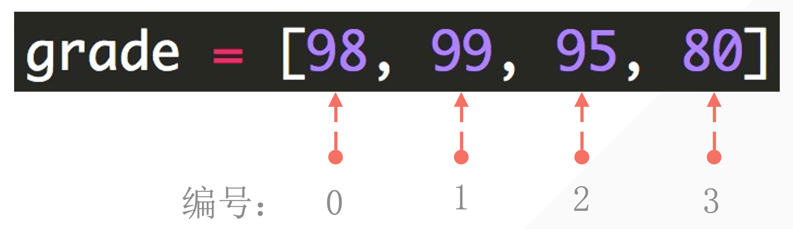
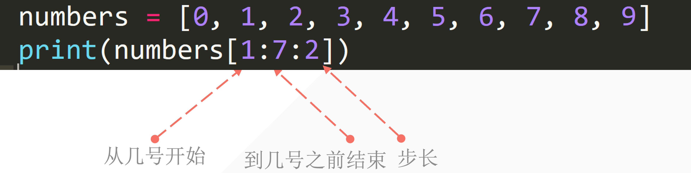
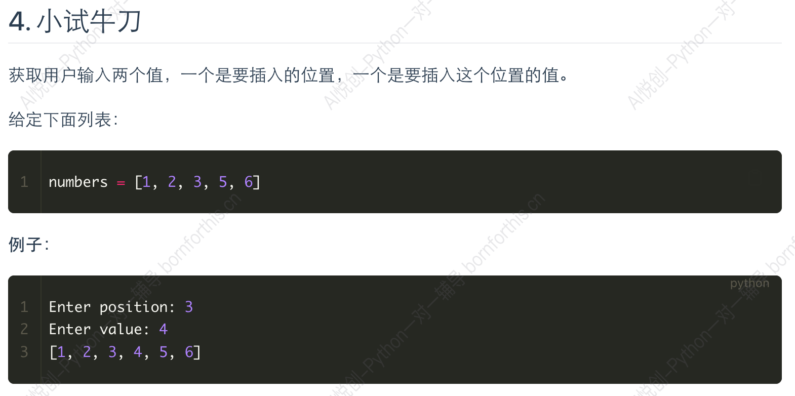
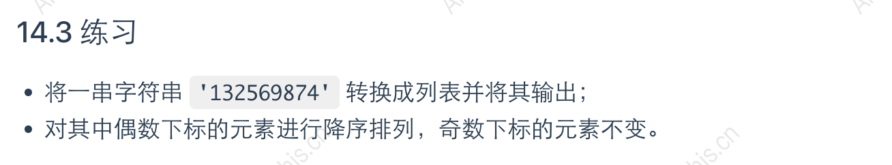
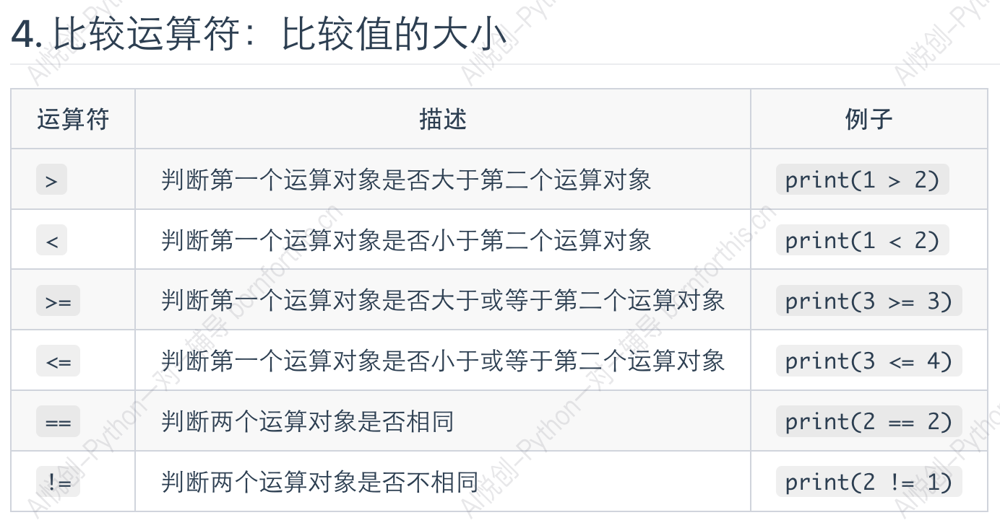

::: tip 主题

Variables, Literals, and Expressions - Core Concepts in Computer Programming

:::

## 1. 变量

### 1.1 变量的创建方法

```python
name = 'hanmeimei'
print(name)  #  在覆盖之前输出

name = "aiyuechuang"
print(name)  # name 被覆盖
```

### 1.2 print 探究

1. 添加提示输出

```python
name = 'hanmeimei'
print("name value is:>>>", name)

name = "aiyuechuang"
print("name 被覆盖:>>>", name)  # name 被覆盖
```

2. 多个变量输出

```python
a = 1
b = 2
c = 3
print(a)
print(b)
print(c)

print(a, b, c)
```

3. end 控制换行

```python
a = 1
b = 2
c = 3
print(a, end="\n\n")  # \n newline
print(b, end="\nlook")
print(c)

print(a, b, c)
```

4. sep 控制多个输出间隔

```python
a = 1
b = 2
c = 3
print(a, b, c, sep="    aiyc")
```

5. 多个变量同时赋予相同的值

```python
a = b = c = 1
print(a, b, c)
```

6. 多个变量同时赋予不同的值

```python
a, b, c = 1, 2, 3
print(a, b, c)
```

7. 变量的命名规则
    1. 大小写英文、数字和 `_` 的结合，且不能用数字开头；
    2. 系统关键词不能做变量名使用「获取关键词列表：`help('keywords')`
    3. Python 中的变量名区分大小写；
    4. 变量名不能包含空格，但是可以使用下划线来分隔其中的单词；
    5. 不要使用 Python 的内置函数名称做变量；

## 2. 运算符

1. `+、-、*、/、**、//、%`

```python
a = 2
b = 3
print(a + b)
print(a - b)
print(a * b)
print(a / b)
a = 9
b = 2
print(a // b)
print(a % b)
print(a ** b)
```

## 3. 数据类型

### 3.1 数字型

```python
num1 = 1
num2 = 1.1
print(num1, num2)
print(type(num1), type(num2))
```

### 3.2 字符串

1. 定义

```python
string = "aiyuechuang"
print(string)
```

````python
string = """### 3.1 数字型

```python
num1 = 1
num2 = 1.1
print(num1, num2)
print(type(num1), type(num2))
```

### 3.2 字符串

```python
string = "aiyuechuang"
print(string)
```

"""
print(string)
````

- 从左到右 0 开始
- 从右到左 -1 

```python
string = "aiyuechuang"
print(string[0])
print(string[-1])
```

```python
string = "aiyuechuang hello"
print(string[0:11])
```

```python
string = "0123456789"
print(string[0:10:2])
print(string[1:10:2])


string = "0123456789"
print(string[0:10:3])  # 等价 print(string[::3])


string = "0123456789"
print(string[::-2])
```

```python
string = "0123456789"
print(string[-3:-6:-1])  # 不写 -1 没有结果
```


2. 长度

```python
string = "aiyuechuang"
print(len(string))  # 从数字 1 开始数
```

::: tip

下标：从 0 开始；

数量：从 1 开始数；

:::

## 4. input

```python
s = input('please enter a string: ')
print(s)
```

Input 得到的都是字符串

## 5. 列表

### 5.1 数据提取

```python
student1 = ['lilei', 18, 'class01', 201901]
student2 = ['hanmeimei', 19, 'class02', 201902]
print(student1)
print(student2)
```






### 5.2 切片赋值

```python
In [1]: name = 'Python'

In [2]: lst = list(name)

In [3]: lst
Out[3]: ['P', 'y', 't', 'h', 'o', 'n']

In [4]: lst[2:]
Out[4]: ['t', 'h', 'o', 'n']

In [5]: list('abc')
Out[5]: ['a', 'b', 'c']

In [6]: lst[2:] = list('abc')

In [7]: lst
Out[7]: ['P', 'y', 'a', 'b', 'c']
```


```python
In [8]: numbers = [1, 5]

In [9]: numbers[1:1]
Out[9]: []

In [10]: numbers[1:1] = [2, 3, 4]

In [11]: numbers
Out[11]: [1, 2, 3, 4, 5]

In [12]: numbers[1:4] = []

In [13]: numbers
Out[13]: [1, 5]
```


### 5.3 小试牛刀



```python
numbers = [1, 2, 3, 5, 6]
position = int(input('Enter position: '))
value = int(input('Enter value: '))
numbers[position: position] = [value]
print(numbers)

numbers = [1, 2, 3, 5, 6]
position = int(input('Enter position: '))
value = int(input('Enter value: '))
result = numbers[:position] + [value] + numbers[position:]
print(result)
```

### 5.4 insert

```python
numbers = [1, 2, 3, 5, 6]
numbers.insert(3, 4)
print(numbers)  # [1, 2, 3, 4, 5, 6]
```

### 5.5 len

```python
student_list = ['李雷', '韩梅梅', '马冬梅']
print(len(student_list))

# ---output---
3
```

### 5.6 列表修改

```python
name = ['lilei', 'hanmeimei']
print('before:', name)

name[0] = 'madongmei'
print('after:', name)


# ---output---
before: ['lilei', 'hanmeimei']
after: ['madongmei', 'hanmeimei']
```

```python
numbers = [0, 1, 2, 3, 4, 5, 6, 7, 8, 9, 10]
print('before:', numbers)

numbers[1:5] = ['one', 'two', 'three', 'four']
print('after:', numbers)

# ---output---
原本: [0, 1, 2, 3, 4, 5, 6, 7, 8, 9, 10]
修改后: [0, 'one', 'two', 'three', 'four', 5, 6, 7, 8, 9, 10]
```

```python
numbers = [0, 1, 2, 3, 4, 5, 6, 7, 8, 9, 10]
print('before:', numbers)

# 元素数量不一样
numbers[1:5] = ['one', 'two']
print('after:', numbers)

# ---output---
before: [0, 1, 2, 3, 4, 5, 6, 7, 8, 9, 10]
after: [0, 'one', 'two', 5, 6, 7, 8, 9, 10]
```

```python
numbers = [0, 1, 2, 3, 4, 5, 6, 7, 8, 9, 10]
print('before:', numbers)

# 元素数量不一样 & 字符串自动拆开成列表
numbers[1:5] = 'bornforthis'
print('after:', numbers)

# ---output---
before: [0, 1, 2, 3, 4, 5, 6, 7, 8, 9, 10]
after: [0, 'b', 'o', 'r', 'n', 'f', 'o', 'r', 't', 'h', 'i', 's', 5, 6, 7, 8, 9, 10]
```

```python
lst = ['钥匙', '毒药']
print('before:', lst)
lst.append('解药')
print('after:', lst)

# ---output---
before: ['钥匙', '毒药']
after: ['钥匙', '毒药', '解药']
```

```python
numbers1 = [0, 1, 2, 3, 4]
numbers2 = [5, 6, 7, 8, 9]
print(numbers1 + numbers2)

# ---output---
[0, 1, 2, 3, 4, 5, 6, 7, 8, 9]
```

```python
inventory = ['钥匙', '毒药', '解药']
print('解药' in inventory)
print('迷药' in inventory)
```

### 5.7 sort

```python
numbers = [2, 1, 4, 3, 7, 6, 5, 0, 9, 8]
numbers.sort(reverse=False)
print(numbers)  # [0, 1, 2, 3, 4, 5, 6, 7, 8, 9]

numbers = [2, 1, 4, 3, 7, 6, 5, 0, 9, 8]
numbers.sort(reverse=True)
print(numbers)  # [9, 8, 7, 6, 5, 4, 3, 2, 1, 0]
# 排序
```



```python
str_to_list = list('132569874')
print(str_to_list)

even_position = str_to_list[::2]
even_position.sort(reverse=True)
str_to_list[::2] = even_position
print(str_to_list)
```


## 6. 比较运算符



## 7. input & print


## Question

### Question 1

**字符串为什么有三种创建方法？**


### Question 2

**数学中的向上向下取整？**


