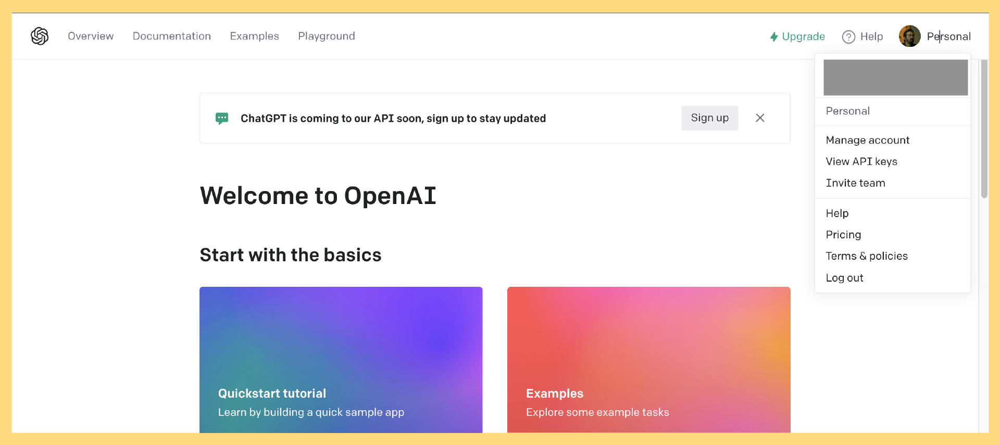
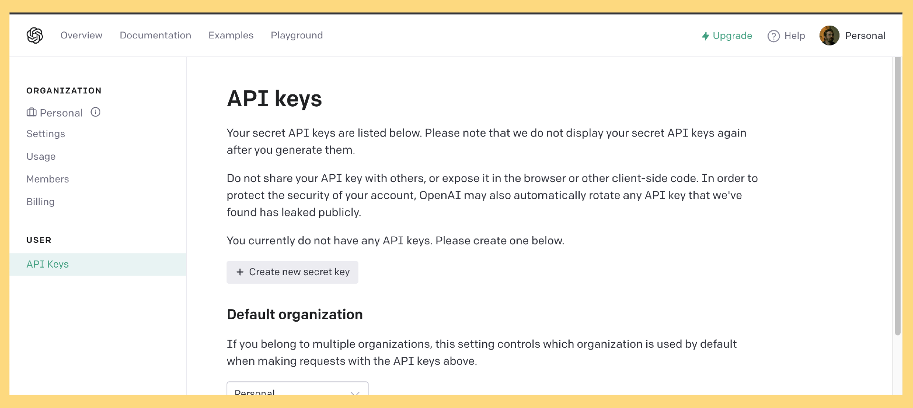
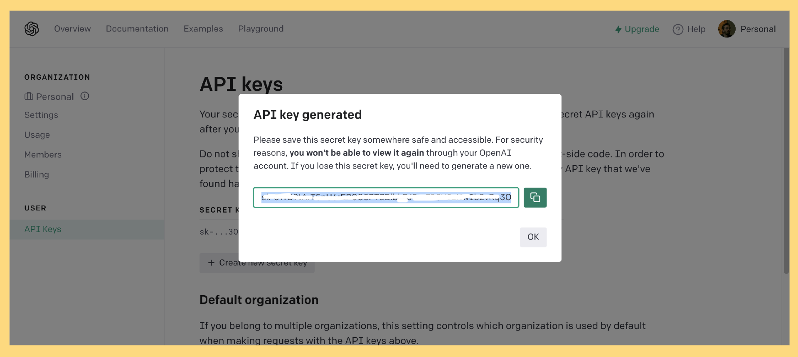
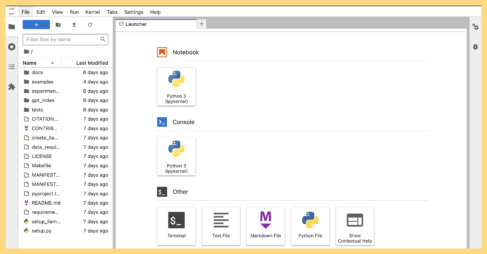
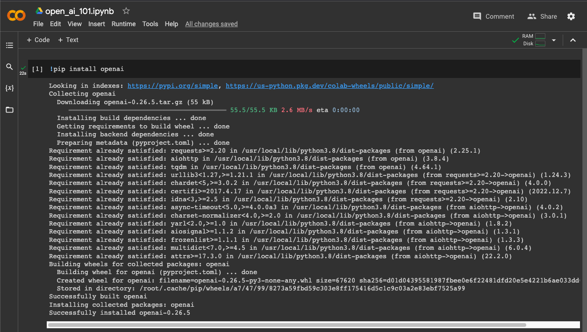
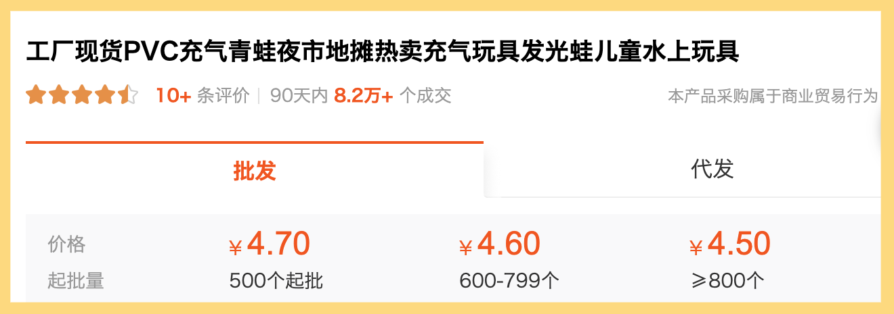
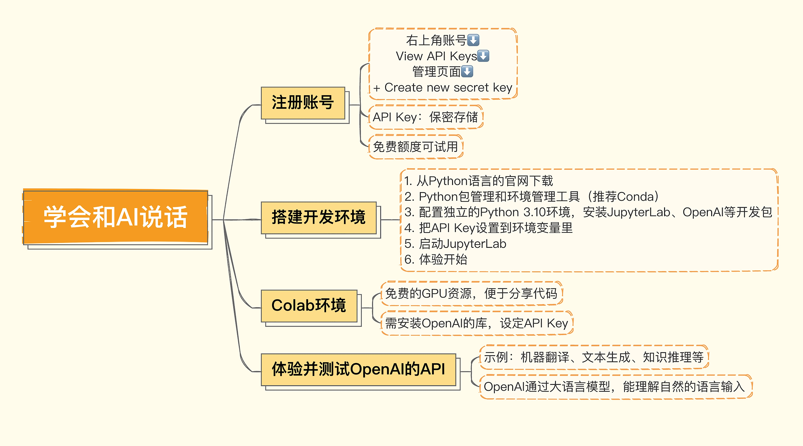

你好，我是悦创。

欢迎你打开 AI 世界的大门。我猜你是被这段时间大火的 ChatGPT 吸引过来的吧？既然你是带着这样的目的打开了这门课程，那么我也一定会给你想要的。我们的课程会先从 ChatGPT 的主题开始，在接下来的几讲里，我会为你介绍如何使用 OpenAI 的 API 来和 AI 应用沟通。这些 API 背后，其实和 ChatGPT 一样，使用的是 OpenAI 的 GPT-3.5 系列的大语言模型。

整个课程，我们都会使用真实的数据、代码来演示如何利用好大语言模型。所以这一讲，我会先带你做好一系列准备工作。不过不用担心，去运行这些程序并不需要你专门去买一块昂贵的显卡。事实上，如果你不是一个程序员，而是一个产品经理，或者只是对 AI 感兴趣的非技术人，那么你可以使用浏览器就能访问的免费开发环境，来试验这些问题。

OpenAI 的 API 能做到哪些神奇的事情？号称离“通用人工智能（AGI）”已经不远的产品长什么样子？GPT-3 这样的模型和之前基于深度学习的自然语言处理解决方案又有什么不同？这些吊人胃口的问题，我会在课程里一一揭晓。

下面我们就先来做一些准备工作，注册账号并搭建开发环境。

## 1. 创建 OpenAI 的 API Key

为了学习这门课程，你需要先去注册一个可以使用 OpenAI 的 API 的账号，这是账号注册的[入口](https://openai.com/product)。目前，OpenAI 还没有向中国大陆和香港地区开放，所以账号的注册需要你自己想想办法了，如果你有好办法，也欢迎你分享在评论区。



> 绝不可能，哈哈哈哈。我早已经为你准备好详细的注册教程：[https://bornforthis.cn/column/ChatGPT-Midjourney/public/01.html](https://bornforthis.cn/column/ChatGPT-Midjourney/public/01.html)

账号注册完成之后，你点击右上角的账号，然后点击 “View API Keys”，就会进入一个管理 API Keys 的页面。



你点击下面的 “+Create new secret key” 可以创建一个新的 API Key。



对应的 API Key 你需要把它存储在一个安全的地方，后面我们调用 OpenAI 的接口都需要使用这个 API Key。

现在 OpenAI 为所有免费注册的用户都提供了 5 美元（最早是 18 美元）的免费使用 API 的额度，这个额度用来体验 API 的功能，以及学习这个课程已经够用了。如果你想要进一步将这个 API 用在实际的产品上，就需要考虑把这个账号升级成付费账号了。

## 2. 搭建本地的 Jupyter Labs 开发环境

::: tip

说真的，如果你有基础或者是我的私教学员，这个环境咱们可以不用看了。当然，想看也没问题。

:::

有了 API Key 之后，我们还需要搭建一个开发环境。这门课，我主要通过 Python 来讲解和演示如何使用好 AI。如果你是一个程序员，你可以自己去 [Python 语言的官网](https://www.python.org/downloads/)下载并安装对应的开发环境。

一般来说，你还需要一个 Python 的包管理和环境管理工具，我自己比较习惯使用 [Conda](https://docs.conda.io/en/latest/miniconda.html)。

最后，还需要通过包管理工具，配置一个独立的 Python 3.10 的环境，并安装好 JupyterLab、OpenAI 以及后面要用到的一系列开发包。我把对应的 Conda 命令也列在了下面，供你参考。

```python
conda create --name py310 python=3.10
conda activate py310
conda install -c conda-forge jupyterlab
conda install -c conda-forge ipywidgets
conda install -c conda-forge openai
```

后续，随着我们课程的进展，你可能还需要通过 Conda 或者 pip 来安装更多 Python 包。

安装完 JupyterLab 之后，你只需要把刚才我们获取到的 API Key 设置到环境变量里，然后启动 JupyterLab。你可以从浏览器里，通过 Jupyter Notebook 交互式地运行这个课程后面的代码，体验 OpenAI 的大语言模型神奇的效果。

```python
export OPENAI_API_KEY=在这里写你获取到的ApiKey
jupyter-lab .
```

你可以选择新建 Python 3 的 Notebook，来体验交互式地运行 Python 代码调用 OpenAI 的 API。



## 3. 通过 Colab 使用 JupyterLab

如果你不是一个程序员，或者你懒得在本地搭建一个开发环境。还有一个选择，就是使用 Google 提供的叫做 [Colab](https://colab.research.google.com/) 的线上 Python Notebook 环境。

即使你已经有了本地的开发环境，我也建议你注册一个账号。因为 Colab 可以让你免费使用一些 GPU 的资源，在你需要使用 GPU 尝试训练一些深度学习模型，而又没有一张比较好的显卡的时候，就可以直接使用它。另一方面，Colab 便于你在网络上把自己撰写的 Python 代码分享给其他人。



Colab 已经是一个 Python Notebook 的环境了。所以我们不需要再去安装 Python 和 JupyterLab 了。不过我们还是需要安装 OpenAI 的库，以及设定我们的 API Key。你只需要在 Notebook 开始的时候，执行下面这样一小段代码就可以做到这一点。

```python
!pip install openai
%env OPENAI_API_KEY=在这里写你获取到的ApiKey
```

不过需要注意，如果你需要将 Notebook 分享出去，记得把其中 OpenAI 的 API key 删除掉，免得别人的调用，花费都算在了你头上。

## 4. 体验并测试 OpenAI 的 API

好了，现在环境已经搭建好了。无论你是使用本地的 JupyterLab 环境，还是使用 Google 免费提供的 Colab 环境，我都迫不及待地想要和你一起来体验一下 OpenAI 了。我在这里放了一段代码，你可以把它贴到你的 Notebook 里面，直接运行一下。

```python
import openai
import os

openai.api_key = os.environ.get("OPENAI_API_KEY")
COMPLETION_MODEL = "text-davinci-003"

prompt = """
Consideration product : 工厂现货PVC充气青蛙夜市地摊热卖充气玩具发光蛙儿童水上玩具

1. Compose human readable product title used on Amazon in english within 20 words.
2. Write 5 selling points for the products in Amazon.
3. Evaluate a price range for this product in U.S.

Output the result in json format with three properties called title, selling_points and price_range
"""

def get_response(prompt):
    completions = openai.Completion.create (
        engine=COMPLETION_MODEL,
        prompt=prompt,
        max_tokens=512,
        n=1,
        stop=None,
        temperature=0.0,        
    )
    message = completions.choices[0].text
    return message

print(get_response(prompt)) 
```

我们来看看返回结果。

```python
{
    "title": "Glow-in-the-Dark Inflatable PVC Frog Night Market Hot Selling Water Toy for Kids",
    "selling_points": [
        "Made of durable PVC material",
        "Glow-in-the-dark design for night play",
        "Inflatable design for easy storage and transport",
        "Perfect for water play and outdoor activities",
        "Great gift for kids"
    ],
    "price_range": "$10 - $20"
}
```

这个商品名称不是我构造的，而是直接找了 1688 里一个真实存在的商品。



这段代码里面，我们调用了 OpenAI 的 Completion 接口，然后向它提了一个需求，也就是为一个我在 1688 上找到的中文商品名称做三件事情。

1. 为这个商品写一个适合在亚马逊上使用的英文标题。
2. 给这个商品写 5 个卖点。
3. 估计一下，这个商品在美国卖多少钱比较合适。

同时，我们告诉 OpenAI，我们希望返回的结果是 JSON 格式的，并且上面的三个事情用 `title`、`selling_points` 和 `price_range` 三个字段返回。

神奇的是，OpenAI 真的理解了我们的需求，返回了一个符合我们要求的 JSON 字符串给我们。在这个过程中，它完成了好几件不同的事情。

第一个是**翻译**，我们给的商品名称是中文的，返回的内容是英文的。

第二个是**理解你的语义去生成文本**，我们这里希望它写一个在亚马逊电商平台上适合人读的标题，所以在返回的英文结果里面，AI 没有保留原文里有的“工厂现货”的含义，因为那个明显不适合在亚马逊这样的平台上作为标题。下面 5 条描述也没有包含“工厂现货”这样的信息。而且，其中的第三条卖点 “`Inflatable design for easy storage and transport`”，也就是作为一个充气的产品易于存放和运输，这一点其实是从“充气”这个信息 AI 推理出来的，原来的中文标题里并没有这样的信息。

第三个是**利用 AI 自己有的知识给商品定价**，这里它为这个商品定的价格是在 10～20 美元之间。而我用 “`Glow-in-the-Dark frog`” 在亚马逊里搜索，搜索结果的第一行里，就有一个 16 美元发光的青蛙。

最后是**根据我们的要求把我们想要的结果，通过一个 JSON 结构化地返回给我们**。而且，尽管我们没有提出要求，但是 AI 还是很贴心地把 5 个卖点放在了一个数组里，方便你后续只选取其中的几个来用。返回的结果是 JSON，这样方便了我们进一步利用返回结果。比如，我们就可以把这个结果解析之后存储到数据库里，然后展现给商品运营人员。


好了，如果看到这个结果你有些激动的话，请你先平复一下，我们马上来看一个新例子。

```python
prompt = """
Man Utd must win trophies, says Ten Hag ahead of League Cup final

请将上面这句话的人名提取出来，并用json的方式展示出来
"""

print(get_response(prompt))
```

输出结果：

```python
{
  "names": ["Ten Hag"]
}
```

我们给了它一个英文的体育新闻的标题，然后让 AI 把其中的人名提取出来。可以看到，返回的结果也准确地把新闻里面唯一出现的人名——曼联队的主教练滕哈格的名字提取了出来。

和之前的例子不同，这个例子里，我们希望 AI 处理的内容是英文，给出的指令则是中文。不过 AI 都处理得很好，而且我们的输入完全是自然的中英文混合在一起，并没有使用特定的标识符或者分隔符。

> 注：第一个例子，我们希望 AI 处理的内容是中文，给出的指令是英文。

我们这里的两个例子，其实对应着很多不同的问题，其中就包括**机器翻译、文本生成、知识推理、命名实体识别**等等。在传统的机器学习领域，对于其中任何一个问题，都可能需要一个独立的机器学习模型。就算把这些模型都免费提供给你，把这些独立的机器学习模型组合到一起实现上面的效果，还需要海量的工程研发工作。没有一个数十人的团队，工作量根本看不到头。

然而，OpenAI 通过一个包含 1750 亿参数的大语言模型，就能理解自然的语言输入，直接完成各种不同的问题。而这个让人惊艳的表现，也是让很多人惊呼“通用人工智能（AGI）要来了”的原因。

## 5. 小结

好了，希望到这里，你对 OpenAI 提供的大语言模型能干什么有了一个最直观的认识。同时，你也应该已经注册好了对应的账号，生成了调用大语言模型的 API Key。无论是在本地搭建了开发环境，还是通过 Colab 这样免费在线的开发环境，你都应该已经尝试着调用过 OpenAI 的 API 拿到一些返回结果了。



OpenAI 提供的 GPT-3.5 系列的大语言模型，可以让你使用一个模型来解决所有的自然语言处理问题。原先我们需要一个个地单独训练模型，或者至少需要微调模型的场景，在大语言模型之下都消失了。这大大降低了我们利用 AI 解决问题的门槛，无论之前我们通过各种开源工具将机器学习变得多么便捷，想要做好自然语言处理，还是需要一些自然语言处理的专家。而且，往往我们还需要组合好多个模型，进行大量的工程开发工作。

而在大语言模型时代，我们只需要有会向 AI 提问的应用开发工程师，就能开发 AI 应用了。这也是我设计这门课程的目的，希望能让你体会到当前开发 AI 工具的便利性。

## 6. 课后练习

1. 请将今天课程中提供的示例代码，在你搭建的开发环境中运行一下。
2. 你可以去看一下 OpenAI 提供的[示例](https://platform.openai.com/examples/)，找几个你感兴趣的用途，在上面的开发环境里运行体验一下，你也可以脑洞大开，尝试一些你想用 AI 解决的问题，看看 AI 能不能给出你想要的结果。

欢迎你把你体验的提示语和结果分享在评论区，看看都能有什么样的好创意。也欢迎你介绍感兴趣的朋友，跟我报名学习，我们下一讲再见。

## 7. 推荐阅读

如果你想知道 GPT 系列大模型到底是怎么回事儿，我推荐你去看一下李沐老师讲解 GPT 系列论文的视频 [GPT、GPT-2、GPT-3 论文精读](https://www.bilibili.com/video/BV1AF411b7xQ/?vd_source=d45e636458d1130d6ccbb97729ba99fd)，这个视频深入浅出，能够让你理解为什么现在 GPT 那么火热。


欢迎关注我公众号：AI悦创，有更多更好玩的等你发现！

::: details 公众号：AI悦创【二维码】


:::

::: info AI悦创·编程一对一

AI悦创·推出辅导班啦，包括「Python 语言辅导班、C++ 辅导班、java 辅导班、算法/数据结构辅导班、少儿编程、pygame 游戏开发、Linux、Web」，全部都是一对一教学：一对一辅导 + 一对一答疑 + 布置作业 + 项目实践等。当然，还有线下线上摄影课程、Photoshop、Premiere 一对一教学、QQ、微信在线，随时响应！微信：Jiabcdefh

C++ 信息奥赛题解，长期更新！长期招收一对一中小学信息奥赛集训，莆田、厦门地区有机会线下上门，其他地区线上。微信：Jiabcdefh

方法一：[QQ](http://wpa.qq.com/msgrd?v=3&uin=1432803776&site=qq&menu=yes)

方法二：微信：Jiabcdefh

:::


