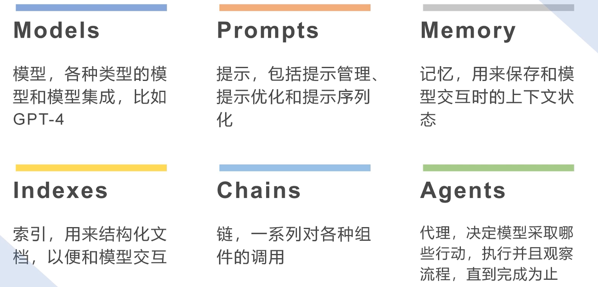

## 1. LangChain 究竟是什么？

你好，我是悦创。

LangChain 到底是什么东西呢？

我给大家举一个不太准确的比喻，实际上你可以将其类比为机器学习领域中 pipeline（管道）工具。

那么 pipeline 是什么呢？——它用于构建机器学习流程，大家应该都有所接触。

我们将数据清洗、超参数优化等各个机器学习环节放入一个 pipeline 中，然后直接从最前面输入数据，接着就能自动产出结果。

在 pipeline 的每个环节，它可以自主进行数据的输入和输出，以及数据相关的处理工作。这就是所谓的 LangChain。

在接下来的导学中，我会提供另一种 LangChain 的理解思路。

首先，要理解 LangChain ，我们必须关注整个大模型发展中，备受瞩目的一个应用：AutoGPT。

AutoGPT 大约是在 2023年4月开源的项目，一经开源就风靡全球。

简而言之：AutoGPT 本身是一个非常智能化的应用，它可以根据你输入的指令：逐步拆解执行步骤，并调用本地工具帮你完成相关任务。

比如：让 AutoGPT 为我们安装某个包或库，它会自动拆解你的需求，并通过谷歌搜索的方式，找到合适的安装方法。

如果，在安装过程中遇到问题，它会围绕这个问题提出 bug 并解决。AutoGPT 会帮你解决每个问题的操作步骤。

这个工具看起来就像具有独立思考能力一样，并且可以不断的提供反馈。根据反馈调整自己的的行为。

与语言模型 GPT ，Auto GPT 可以非常出色的完成一些复杂任务。这是现在人们觉得，非常适合未来 AI 工具的想象。

LangChain 是一个用于开发类似于 Auto GPT 这样的 AI 工具。

它提出了，未来 AI 工具都必须具备的六个要素。

1. Models（模型）：指大语言模型，LanChain 认为未来的 Ai 应用程序都应该由大语言模型驱动；
2. Memory（记忆）：指 AI 应用程序应该具备长期记忆的能力，能够存储和回忆用户的输入和模型返回的信息；
3. Chains（链）：指 AI 应用程序应该具备一定的思维链能力，能够解析用户的目标并根据用户定义的步骤逐个执行；
4. Prompt（提示）：指 Ai 应用程序应该具备内置的提示词管理功能，通过输入的提示词或模版来优化和降低用户与 AI 模型交互的门槛；
5. Agents（代理）：指 AI 应用程序与各种工具进行交互的能力，能够调用计算机中的各种工具和 API 进行交互操作；
6. Index（索引）：是 LangChain 最近加入的一个元素，表示 AI 应用程序与本地文件交互时，需要有一个符号系统对文件进行编号和管理；

这些要素的组合拼凑，类似乐高积木，可以用不同的元素来开发不同的 AI 应用程序，LangChain 将这些要素抽象为面向开发端的功能层面上的抽象，而不是用户体验层面上的抽象。

AutoGPT 是基于这六个元素之一的开发工具，它具备了大语言模型、提示词管理等功能。

但LangChain 本身并不是具体的 AI 应用程序或者 AutoGPT。它用来开发 AutoGPT 的开发工具。

在实际的使用中，LangChain 与任何第三方的库的使用方式的相同，你需要下载 LangChain 并导入不同的模块，然后就可以完成相关功能的开发。

举个例子：如果你想围绕一个简单的对话机器人进行不同语言模型的切换，完全可以实现。LangChain 的 model 模块提供了这个功能。

它可以方便地调用不同的语言模型，你想调用 GPT 模型？——可以。

你只需将相关的 API 传递给 LangChain 即可。

你想调用本地的大语言模型？——也可以。

只需将对应的接口提供给 LangChain 的 model 模块。

它会将你的模型和 AI 应用之间的信息通道进行封装。是你的模型能够很好的嵌入到当前的 AI 应用程序中，

LangChain 是一个完整的工具集，它提供了一整套的开发工具，

## 关于 LangChain 目前是否只是一个“大饼”的问题

其实很多人在看了 LangChain 的官网和开发实力后，都会觉得它可能只是一个虚幻的概念。

因为它提出了抽象的概念却没有太多的实际方案，这样的观点也是可以理解的。

很多都在路上，不能急。LangChain 提出了自己理解和相关的功能。

例如：高效构建基于本地知识库的对话机器人、基于本地数据构建分析和处理流程、自动会议总结和自动邮件系统回复。以及基于外部查询和问答系统等等。

所以，LangChain 是合适的选择，如果我们想围绕大语言模型开发更多的 AI 应用程序，类似于：AutoGPT。

欢迎关注我公众号：AI悦创，有更多更好玩的等你发现！

::: details 公众号：AI悦创【二维码】

:::

::: info AI悦创·编程一对一

AI悦创·推出辅导班啦，包括「Python 语言辅导班、C++ 辅导班、java 辅导班、算法/数据结构辅导班、少儿编程、pygame 游戏开发、Linux、Web」，全部都是一对一教学：一对一辅导 + 一对一答疑 + 布置作业 + 项目实践等。当然，还有线下线上摄影课程、Photoshop、Premiere 一对一教学、QQ、微信在线，随时响应！微信：Jiabcdefh

C++ 信息奥赛题解，长期更新！长期招收一对一中小学信息奥赛集训，莆田、厦门地区有机会线下上门，其他地区线上。微信：Jiabcdefh

方法一：[QQ](http://wpa.qq.com/msgrd?v=3&uin=1432803776&site=qq&menu=yes)

方法二：微信：Jiabcdefh

:::

