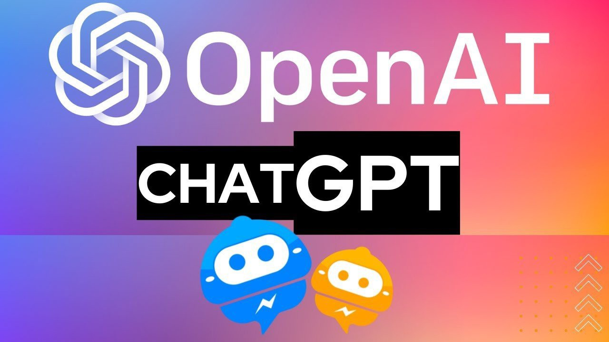

## 1. LangChain 是什么？

李开复：AI 已经进入 2.0 时刻，所有应用都会被重写一遍，这是一个不可错过的革命。

革命就意味着更多机会，可以赚更多的钱。当然，我相信大家不会这么肤浅。

我们肯定是为了让我们的老板开上玛莎拉蒂，开上保时捷而努力。

为了让老板，给自己取个嫂子。开个玩笑。哈哈哈哈

但是我相信这一次 AI 时刻一定是让我们普通人能够跨越阶层最好的机遇，所有一切的应用都要推倒重来。

LangChain 是一个框架，用于帮助开发者使用语言模型来构建应用程序。这个框架提供了一系列工具和组件，让你可以更简单地创建基于大型语言模型和聊天模型的应用程序。LangChain 允许你方便地管理语言模型的交互，将多个组件链接在一起，并集成额外的资源，例如 API 和数据库。

LangChain 也有专门的前端开发 js，LangChain js。

以下是 LangChain 的一些核心概念：

* 组件和链：在 LangChain 中，组件是模块化的构建块，可以组合起来创建强大的应用程序。链是一系列组合在一起以完成特定任务的组件。

* 提示模板和值：提示模板负责创建提示值，这是最终传递给语言模型的内容。提示模板可以将用户输入和其他动态信息转换为适合语言模型的格式。

* 示例选择器：当你想要在提示中动态包含示例时，示例选择器很有用。他们接受用户输入并返回一个示例列表以在提示中使用。

* 输出解析器：输出解析器负责将语言模型响应构建为更有用的格式。这使得在你的应用程序中处理输出数据变得更加容易。

* 索引和检索器：索引是一种组织文档的方式，使语言模型更容易与它们交互。检索器是用于获取相关文档并将它们与语言模型组合的接口。

* 聊天消息历史记录：LangChain 主要通过聊天界面与语言模型进行交互。ChatMessageHistory 类负责记住所有以前的聊天交互数据，然后可以将这些交互数据传递回模型，这有助于维护上下文并提高模型对对话的理解。

* 代理和工具包：代理是在 LangChain 中推动决策制定的实体。他们可以访问一套工具，并可以根据用户输入决定调用哪个工具。工具包是一组工具，当它们一起使用时，可以完成特定的任务。

## 2. 大语言模型的限制

大语言模型，如 GPT-4，尽管已经非常强大，但是仍然存在一些限制。以下是几个主要的限制：

* 知识更新：大型语言模型的知识是基于其训练数据的。这意味着，一旦训练完毕，模型的知识就固定下来了，不能再进行更新。例如，GPT-4 的知识截至日期是 2021 年，关于之后的事件或者发展它是无法知道的。

* 理解深度：虽然这类模型可以生成准确的、上下文相关的文本，但它们并不能理解这些文本的深层含义，只是基于它们在大量文本数据上的训练来模仿人类的语言。「或者说：它不能通过文本去推导出一系列的东西出来，也就是说它只能理解一层或推到一层表面的含义。它没有办法一层推导出来之后，再跟着这一层再继续往下深入的推导」

* 事实准确性：大型语言模型可能会生成一些事实上不准确的信息。因为它们的目标是预测下一个词是什么，而不是确保生成的所有信息都是准确的。「它经常幻想一些不存在的事情回答你，如果在训练的时候，我们的数据我没有筛选好，就会因为数据的偏见，导致大模型出现一些偏见。『这些偏见还可能会让 AI 生成恶意的内容』」

* 偏见和公平性问题：大型语言模型可能会反映出其训练数据中的偏见。例如，如果训练数据中存在性别、种族或宗教的偏见，模型可能也会展现出这种偏见。「让用户感受到被攻击或者被误导、被欺诈」

* 难以解释：大型语言模型的工作原理非常复杂，这使得它们的预测结果往往难以解释。

* 数据隐私问题：虽然大型语言模型是在公共数据集上进行训练的，但是由于这些数据集可能含有用户的个人信息，所以在使用这类模型时需要考虑数据隐私的问题。

* 生成恶意内容的风险：这些模型可以被用来生成深度伪造内容或者恶意信息，从而被用于网络攻击、欺诈或者误导信息的传播。

LangChain 提供了多种模型，包括大型语言模型、聊天模型和文本嵌入模型。这些模型可以根据应用程序的需求进行选择和使用。
总的来说，LangChain 是一个强大的框架，可以帮助开发者更轻松地使用大型语言模型来构建应用程序。通过理解和利用上述的核心概念，开发者可以使用 LangChain 来构建高度适应性、高效且能够处理复杂用例的应用程序。

虽然，当前的 AI 依然有那么多的限制，但是你可以把它看作是一个小孩，通过引导和规范，也可以让小孩实现很多复杂的任务。

在这里，LangChain 框架，就是帮组我们，引导 AI 完成一系列复杂的应用任务。以及通过工具整合来填补和增强我们刚才所说的缺陷。

比如说：

- 知识不够新：那就接入搜索引擎。或者新闻站点获取最新的资讯。
- 理解不够深：我们就编写思维链，一步一步的引导它完成整个思维过程的推导。
- 事实准确性不够：我们就接入知识图谱、知识百科、以及专业的知识库。
- 也可以定义和格式化 AI 生成的内容，还可以自动的评估生成的内容和屏蔽恶意的内容。

所以 LangChain 可以帮助开发人员更轻松的使用大模型，来构建各种应用程序。

## 3. 应用方向案例

1. 餐厅智能点餐系统
2. 智能售后客服
3. 智能 AI 营养师(减肥师)
4. 智能运动私教
5. 智能导购师

欢迎关注我公众号：AI悦创，有更多更好玩的等你发现！

::: details 公众号：AI悦创【二维码】

:::

::: info AI悦创·编程一对一

AI悦创·推出辅导班啦，包括「Python 语言辅导班、C++ 辅导班、java 辅导班、算法/数据结构辅导班、少儿编程、pygame 游戏开发、Linux、Web」，全部都是一对一教学：一对一辅导 + 一对一答疑 + 布置作业 + 项目实践等。当然，还有线下线上摄影课程、Photoshop、Premiere 一对一教学、QQ、微信在线，随时响应！微信：Jiabcdefh

C++ 信息奥赛题解，长期更新！长期招收一对一中小学信息奥赛集训，莆田、厦门地区有机会线下上门，其他地区线上。微信：Jiabcdefh

方法一：[QQ](http://wpa.qq.com/msgrd?v=3&uin=1432803776&site=qq&menu=yes)

方法二：微信：Jiabcdefh

:::

