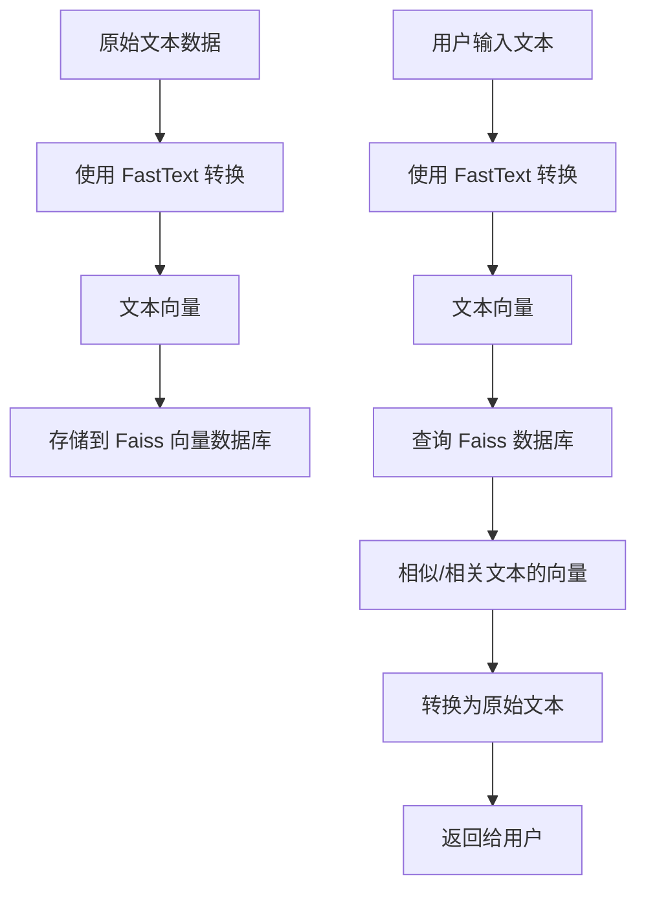
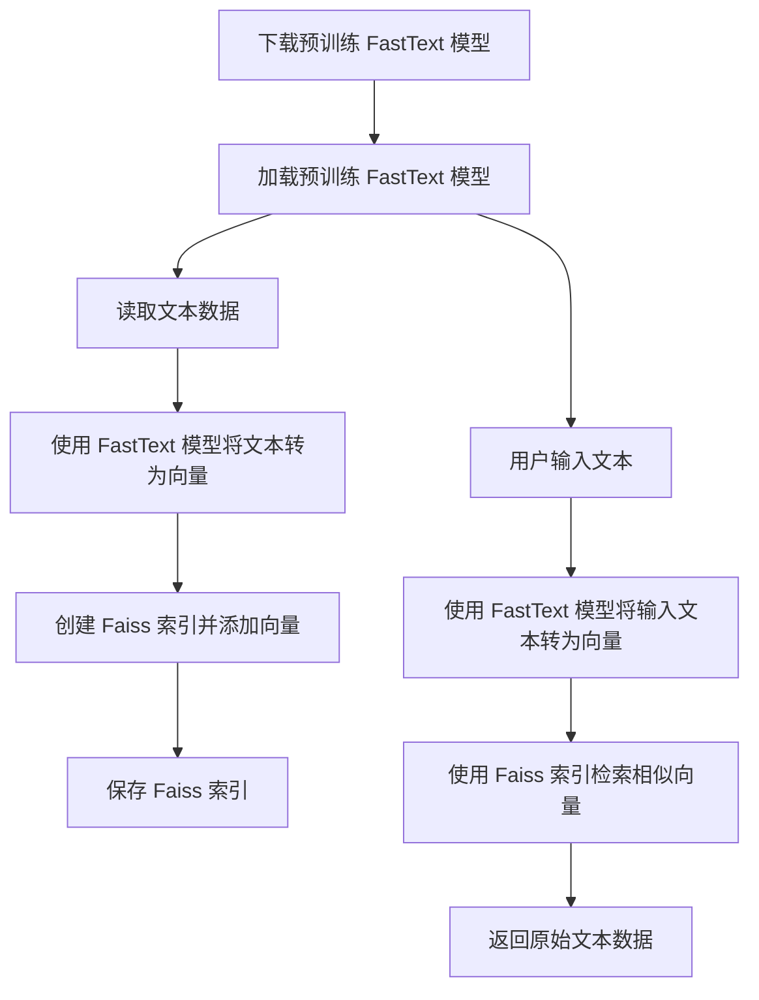
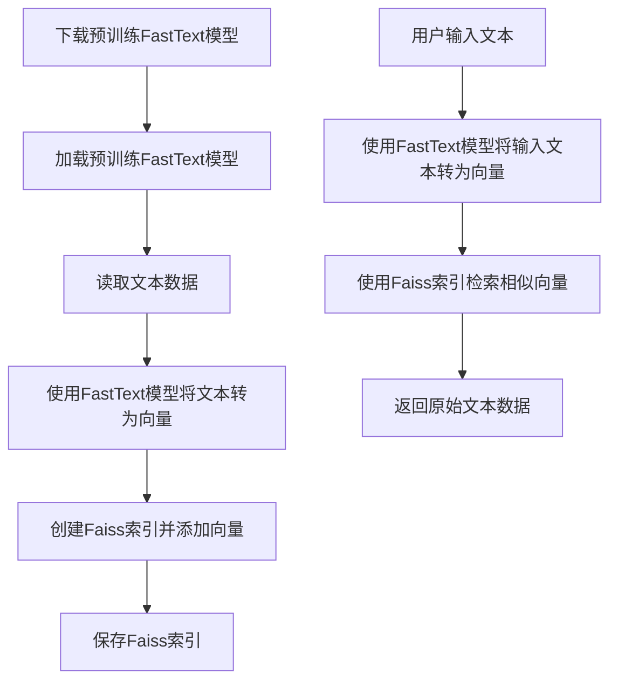

你好，我是悦创。

接下来，我将带你学习如何将我们的文本向量化。这在 NLP 领域至关重要，这理我不带你训练模型，我会带你使用已经训练好的模型，也会带你使用 OpenAI 现成的 API 来实现。

下面是一些常见下载数据、模型的网站：

- [https://www.kaggle.com/](https://www.kaggle.com/)
- [https://huggingface.co/](https://huggingface.co/)

## 1. 环境

在一开始，我们需要配置我们的环境，这个环境至关重要。

我们主要安装 Faiss 和 fasttext 以及 huggingface_hub ，这两个的安装真的有点闹心，所以我在这里有必要来一起解决一下。

### 1.1 fasttext 安装

::: tabs

@tab Windows

### 1. Visual Studio 2022

Windows 安装的话，需要先安装 C++ 构建基础，这个问题直接安装 Visual Studio 2022 就可以解决，安装的时候你可以自行改变安装路径。

直接选择 C++ 的桌面开发这个选项即可解决。


### 2. 使用 Anaconda 进行安装

- [Fasttext :: Anaconda.org](https://anaconda.org/conda-forge/fasttext)
- [GitHub - facebookresearch/fastText: Library for fast text representation and classification.](https://github.com/facebookresearch/fastText)

```bash
conda install -c conda-forge fasttext
conda install -c "conda-forge/label/cf201901" fasttext
conda install -c "conda-forge/label/cf202003" fasttext
```

@tab Mac

### 1. Python 安装

Python 安装需要使用 brew 进行安装：

```bash
brew install python3
```

### 2. 库安装

conda 安装或 pip 安装即可。

```python
pip install fasttext
or
pip install fasttext-wheel
```

安装报错，请查阅：[https://github.com/facebookresearch/fastText/issues/512](https://github.com/facebookresearch/fastText/issues/512)

:::

### 1.2 Faiss 安装

需要，先安装 PyTorch：

- [Start Locally | PyTorch](https://pytorch.org/get-started/locally/)

```bash
conda install -c conda-forge faiss-gpu
conda install -c "conda-forge/label/broken" faiss-gpu
```

```python
pip install faiss-cpu
or
pip install faiss-gpu
```

```python
conda install -c pytorch faiss-cpu
conda install -c "pytorch/label/nightly" faiss-cpu
```


## 2. 初探文本转向量

### 2.1 逻辑

我们想要实现的逻辑是：使用 fasttext 实现把文本数据转换成向量存储到 Fails 向量数据库，接着获取用户输入文本，进行相似、相关文本检索返回，并从向量转换为自然语言。

::: tabs

@tab 版本1




@tab 版本 2



:::

### 2.2 最小实现

#### 2.1 训练模型

首先，您需要训练一个 FastText 模型（如果您没有现成的模型的话）。

> 现成模型肯定有，后面会带你下载和使用，现在专心最小模型的实现。

::: code-tabs

@tab code

```python
import fasttext

# 训练 FastText 模型
model = fasttext.train_unsupervised('data.txt', model='skipgram')
model.save_model('model.bin')
```

@tab 注释

```python
# 引入fasttext库
import fasttext

# 使用 fasttext 进行无监督训练。
# 'data.txt'：表示用来训练模型的数据文件的路径。
# model='skipgram'：表示使用 skipgram 模型进行训练。
# 在词嵌入（word embedding）中，skipgram 是一种常用的方法，其主要目的是预测上下文。
# 而另一种常用的方法是 CBOW（Continuous Bag-Of-Words），其主要目的是使用上下文来预测目标词。
model = fasttext.train_unsupervised('data.txt', model='skipgram')

# 保存训练好的模型到'model.bin'这个文件中。
# 这样，后续可以直接加载这个模型进行各种操作，而不需要再次训练。
model.save_model('model.bin')
```

@tab 注释2

```python
# 引入 fasttext 库
import fasttext

# 使用 fasttext 训练一个无监督的模型。
# 'data.txt' 是训练数据的文件路径。
# 使用 'skipgram' 方法来训练，该方法是一种常见的词向量训练方法，与 'cbow'（另一种常见方法）相对。
# 其中，'skipgram' 预测上下文中的单词，而 'cbow' 根据上下文预测目标单词。
model = fasttext.train_unsupervised('data.txt', model='skipgram')

# 保存训练好的模型到 'model.bin' 文件。
model.save_model('model.bin')
```

@tab data.txt

```
我喜欢吃苹果。
今天天气真好。
学习深度学习真的很有趣。
我想去公园玩。
猫是很可爱的动物。
编程是一门艺术。
FastText是一个很强大的文本处理工具。
Faiss可以高效地进行大规模相似性搜索。
中文是一种美丽的语言。
机器学习改变了世界。
我想吃水果哦什么是向量？FastText是一个很强大的文本处理工具。
```

:::

其中，`data.txt` 是您的文本数据集。

#### 2.2 使用 Faiss 存储文本向量

::: code-tabs

@tab code

```python
import numpy as np
import faiss

# 加载已经训练好的FastText模型
model = fasttext.load_model('model.bin')

# 转换文本为向量
vectors = []
for line in open('data.txt', 'r'):
    vectors.append(model.get_sentence_vector(line.strip()))

# 创建一个Faiss索引
index = faiss.IndexFlatL2(vectors[0].shape[0])
index.add(np.array(vectors))

# 保存索引
faiss.write_index(index, 'vector.index')
```

@tab 注释

```python
# 引入必要的库
import fasttext
import numpy as np  # NumPy 是一个 Python 库，提供了大量数值计算功能
import faiss  # Faiss 是 Facebook AI 提供的一个库，用于高效搜索和聚类大规模数据集

# 加载一个已经训练好的 FastText 模型
model = fasttext.load_model('model.bin')  # 从 'model.bin' 文件加载预训练的 FastText 模型

# 转换文本为向量
vectors = []  # 初始化一个空的列表来存储句子向量
for line in open('data.txt', 'r', encoding="utf-8"):  # 从 'data.txt' 文件中逐行读取文本数据
    # 使用 FastText 模型获取每一行文本的向量表示，并加入到 vectors 列表中
    vectors.append(model.get_sentence_vector(line.strip()))  # line.strip() 去除文本行两端的空白字符

# 创建一个 Faiss 索引
# 为了使用 Faiss，首先需要确定要索引的向量的维度。这里我们使用 vectors[0].shape[0] 来获取第一个向量的维度。
index = faiss.IndexFlatL2(vectors[0].shape[0])  # 创建一个使用 L2 距离的简单扁平索引
index.add(np.array(vectors))  # 将句子向量列表转化为 NumPy 数组并加入到 Faiss 索引中

# 保存创建好的 Faiss 索引到 'vector.index' 文件中，以便后续使用
faiss.write_index(index, 'vector.index')
```

:::

- `get_sentence_vector`: 给定一个字符串，获得一个单独的向量表示。这个函数假设接收到的是一行文本。我们根据空白字符（空格、换行、制表符、垂直制表符）以及控制字符如回车、换页和空字符来分割单词。

#### 2.3 检索相似文本

::: code-tabs

@tab code

```python
# 加载索引
index = faiss.read_index('vector.index')

def search(query_text, top_k=10):
    query_vector = model.get_sentence_vector(query_text)
    D, I = index.search(np.array([query_vector]), top_k)
    return I[0]

# 使用例子
input_text = "输入的文本"
result_ids = search(input_text)
```

@tab 注释

```python
# 加载一个已经存储的 FAISS 索引。
# 'vector.index' 是之前建立并保存的索引文件，它包含了大量的向量，我们想要在其中搜索最相似的向量。
index = faiss.read_index('vector.index')

# 定义搜索函数。
def search(query_text, top_k=10):
    # 使用之前训练的 FastText 模型 (或其他模型) 获取 `query_text` 的向量表示。
    # 这里假定 `model.get_sentence_vector` 是从 FastText 模型获取句子向量的方法。
    query_vector = model.get_sentence_vector(query_text)
    
    # 使用 FAISS 索引搜索与 `query_vector` 最相似的向量。
    # D 是每个最近邻向量与查询向量的距离，I 是最近邻向量的索引。
    D, I = index.search(np.array([query_vector]), top_k)
    
    # 返回最相似向量的索引。注意，I[0] 是因为我们搜索的是一个向量，所以结果在第0位置。
    return I[0]

# 使用例子
# 给定一个文本 `input_text`，使用上述函数找到与其最相似的向量的索引。
input_text = "输入的文本"
result_ids = search(input_text)
```

:::

::: tabs

@tab top_k 作用

`top_k` 参数决定了我们想要从 FAISS 索引中检索出多少个与查询向量最相近的向量。

具体来说：

- 当我们对 FAISS 索引进行搜索时，我们通常想要找到与给定查询向量最接近的 `k` 个向量。这里的 `k` 就是 `top_k`。
- `top_k=10` 意味着当你调用 `search` 函数时，如果不另外指定，它会默认返回与查询文本对应的向量在 FAISS 索引中的前 10 个最相似的向量的索引。
- 如果你想要返回更多或更少的相似向量，你可以在调用 `search` 函数时设置不同的 `top_k` 值。

例如：

- `search(query_text)` 默认会返回 10 个最相似的向量索引，因为 `top_k` 的默认值是 10。
- `search(query_text, top_k=5)` 会返回 5 个最相似的向量索引。
- `search(query_text, top_k=20)` 会返回 20 个最相似的向量索引。

总之，`top_k` 参数决定了你想要从索引中检索多少个最相近的向量。

:::

#### 2.4 向量转回文本

这部分实际上是将检索到的索引 ID 转换为原始的文本。当您建立 Faiss 索引时，您可以建立一个与之相对应的原始文本数组。这样，当您检索到文本的索引 ID 时，只需通过这个数组来获取原始文本即可。

```python {14,26}
import fasttext
import numpy as np
import faiss

# 训练FastText模型
model = fasttext.train_unsupervised('data.txt', model='skipgram')
model.save_model('model.bin')

# 加载模型
model = fasttext.load_model('model.bin')

# 转换文本为向量并建立索引
vectors = []
original_texts = [line.strip() for line in open('data.txt', 'r', encoding="utf-8")]
for line in original_texts:
    vectors.append(model.get_sentence_vector(line.strip()))

index = faiss.IndexFlatL2(vectors[0].shape[0])
index.add(np.array(vectors))
# 保存索引
faiss.write_index(index, 'vector.index')

# 定义检索函数
def search(query_text, top_k=3):
    query_vector = model.get_sentence_vector(query_text)
    _, I = index.search(np.array([query_vector]), top_k)
    return [original_texts[i] for i in I[0]]

# 测试
test_texts = [
    "我想吃水果。",
    "今日阳光明媚。",
    "深度学习是一个有趣的领域。"
]

for t in test_texts:
    results = search(t)
    print(f"对于测试文本：'{t}'，最相似的文本是：'{results}'\n")
```

对于，计算结果，我们可以在上面代码的 24 行，把 `_` 改成变量后输出，你就可以看见最短距离的在 0 号位。

上面我们实现的相似性的检索，和最小 demo 的实现。接下来，我们使用预训练模型来进行测试。

::: tabs

@tab 向量 to 文本

将检索结果转换回原始文本的关键步骤是在这里：

```python
original_texts = [line.strip() for line in open('data.txt', 'r')]
```

这行代码从您的数据集 `data.txt` 中读取所有文本，并将它们存储在 `original_texts` 这个列表中。

当我们进行检索并获取到最相似文本的索引（即检索的结果）时：

```python
return [original_texts[i] for i in I[0]]
```

我们使用上述索引（`I[0]`）来从`original_texts` 中选取相应的文本。

:::

#### 2.5 余弦相似度

上面使用的是欧式距离，接下来我将带你试一试余弦相似度。

欧氏距离是空间各点的绝对距离，跟各个点所在的位置坐标直接相关，余弦距离整的是空间向量的夹角，体现在方向上的差异，不是位置差异。

::: code-tabs

@tab code

```python
import fasttext
import numpy as np
import faiss


# 1. 使用 FastText 转换文本为向量
def train_fasttext_model(data_file):
    model = fasttext.train_unsupervised(data_file, model='skipgram')
    model.save_model('model.bin')


# 2. 使用Faiss存储文本向量，并使用余弦相似度
def build_faiss_index(data_file):
    # 加载已经训练好的FastText模型
    model = fasttext.load_model('model.bin')

    # 转换文本为向量并进行 L2 范数归一化
    vectors = []
    for line in open(data_file, 'r', encoding="utf-8"):
        vector = model.get_sentence_vector(line.strip())
        vector /= np.linalg.norm(vector)  # L2范数归一化
        vectors.append(vector)

    # 创建一个Faiss的内积索引
    index = faiss.IndexFlatIP(len(vectors[0]))
    index.add(np.array(vectors))

    # 保存索引
    faiss.write_index(index, 'cosine_vector.index')


# 3. 检索相似文本
def search(query_text, top_k=3):
    model = fasttext.load_model('model.bin')
    index = faiss.read_index('cosine_vector.index')
    # 存储原本的文本列表
    original_texts = [line.strip() for line in open('data.txt', 'r', encoding="utf-8")]
    query_vector = model.get_sentence_vector(query_text)
    query_vector /= np.linalg.norm(query_vector)  # L2范数归一化
    D, I = index.search(np.array([query_vector]), top_k)
    return [original_texts[i] for i in I[0]]


# 4. 如果需要从向量转回文本，可以根据result_ids和原始data.txt进行对应即可。
if __name__ == '__main__':
    # 可以根据需要注释/取消注释以下部分
    # 如果需要训练 FastText 模型，可以调用 train_fasttext_model('data.txt')
    # train_fasttext_model('data.txt')
    # 调用 build_faiss_index('data.txt') 生成索引
    # build_faiss_index('data.txt')

    # 测试
    test_texts = [
        "我想吃水果。",
        "今日阳光明媚。",
        "深度学习是一个有趣的领域。",
        "今天阳光不错"
    ]

    for t in test_texts:
        results = search(t)
        print(f"对于测试文本：'{t}'，最相似的文本是：'{results[0]}'\n")
```

@tab data.txt

```
我喜欢吃苹果。
今天天气真好。
今天天气真好。 cscs
今天天气真好。村上春树
今天天气真好。洗手池svs
今天天气真好。相似
学习深度学习真的很有趣。
我想去公园玩。
猫是很可爱的动物。
编程是一门艺术。
FastText是一个很强大的文本处理工具。
Faiss可以高效地进行大规模相似性搜索。
中文是一种美丽的语言。
机器学习改变了世界。
我想吃水果 什么是向量？FastText是一个很强大的文本处理工具。
```

@tab 注释

```python
# 导入需要的库
import fasttext   # 用于文本向量化的库
import numpy as np  # numpy 用于数组和向量操作
import faiss  # 用于高效相似度搜索的库

# 1. 使用 FastText 将文本转换为向量
def train_fasttext_model(data_file):
    # 使用 FastText 的无监督学习方法训练 skipgram 模型
    model = fasttext.train_unsupervised(data_file, model='skipgram')
    # 保存训练好的模型为 'model.bin'
    model.save_model('model.bin')

# 2. 使用 Faiss 存储文本向量，并使用余弦相似度进行检索
def build_faiss_index(data_file):
    # 加载已经训练好的 FastText 模型
    model = fasttext.load_model('model.bin')

    # 初始化一个空的向量列表
    vectors = []
    # 逐行读取文本数据文件
    for line in open(data_file, 'r', encoding="utf-8"):
        # 对每一行的文本获取其向量表示
        vector = model.get_sentence_vector(line.strip())
        vector /= np.linalg.norm(vector)  # 对向量进行 L2 范数归一化
        vectors.append(vector)

    # 使用 faiss 创建一个内积索引
    index = faiss.IndexFlatIP(len(vectors[0]))
    index.add(np.array(vectors))  # 向索引中添加向量

    # 保存创建的索引为 'cosine_vector.index'
    faiss.write_index(index, 'cosine_vector.index')

# 3. 检索相似文本
def search(query_text, top_k=3):
    # 加载已经训练好的 FastText 模型和 faiss 索引
    model = fasttext.load_model('model.bin')
    index = faiss.read_index('cosine_vector.index')
    
    # 从 data.txt 中加载原始文本列表
    original_texts = [line.strip() for line in open('data.txt', 'r', encoding="utf-8")]
    
    # 对查询文本获得其向量表示
    query_vector = model.get_sentence_vector(query_text)
    query_vector /= np.linalg.norm(query_vector)  # L2范数归一化

    # 使用 faiss 索引进行搜索，获取最相似的top_k个结果
    D, I = index.search(np.array([query_vector]), top_k)
    
    # 返回相似结果对应的原始文本
    return [original_texts[i] for i in I[0]]

# 4. 主函数
if __name__ == '__main__':
    # 以下是测试部分，可以根据需要注释或取消注释
    # train_fasttext_model('data.txt')   # 训练 FastText 模型
    # build_faiss_index('data.txt')  # 构建 faiss 索引

    # 测试的文本列表
    test_texts = [
        "我想吃水果。",
        "今日阳光明媚。",
        "深度学习是一个有趣的领域。",
        "今天阳光不错"
    ]

    # 对于每个测试文本，进行相似文本的检索，并打印结果
    for t in test_texts:
        results = search(t)
        print(f"对于测试文本：'{t}'，最相似的文本是：'{results[0]}'\n")
```

@tab 杂物

```python
import fasttext
import numpy as np
import faiss

# 1. 使用FastText转换文本为向量
def train_fasttext_model(data_file):
    model = fasttext.train_unsupervised(data_file, model='skipgram')
    model.save_model('model.bin')

# 2. 使用Faiss存储文本向量，并使用余弦相似度
def build_faiss_index(data_file):
    # 加载已经训练好的FastText模型
    model = fasttext.load_model('model.bin')
    
    vectors = []
    texts = []
    for line in open(data_file, 'r'):
        texts.append(line.strip())
        vector = model.get_sentence_vector(line.strip())
        vector /= np.linalg.norm(vector)  # L2范数归一化
        vectors.append(vector)
    
    # 创建一个Faiss的内积索引
    index = faiss.IndexFlatIP(len(vectors[0]))
    index.add(np.array(vectors))
    
    # 保存索引
    faiss.write_index(index, 'cosine_vector.index')
    
    # 保存原始文本列表
    with open('texts.txt', 'w', encoding='utf-8') as f:
        for text in texts:
            f.write(text + '\n')

# 3. 检索相似文本
def search(query_text, top_k=10):
    model = fasttext.load_model('model.bin')
    index = faiss.read_index('cosine_vector.index')
    
    query_vector = model.get_sentence_vector(query_text)
    query_vector /= np.linalg.norm(query_vector)  # L2范数归一化
    _, I = index.search(np.array([query_vector]), top_k)
    
    # 从texts.txt中读取原始文本并返回结果
    texts = [line.strip() for line in open('texts.txt', 'r')]
    results = [texts[i] for i in I[0]]
    
    return results

if __name__ == '__main__':
    # 可以根据需要注释/取消注释以下部分
    # train_fasttext_model('data.txt')
    # build_faiss_index('data.txt')
    
    input_text = "输入的文本"
    similar_texts = search(input_text)
    for text in similar_texts:
        print(text)
```

@tab md

```markdown
我把代码给 chat 解析：

代码整体逻辑是正确的，你实现了以下流程：

1. 使用 FastText 模型将文本转换为向量。
2. 使用 Faiss 创建索引来存储这些文本向量，这个索引使用余弦相似度来查找最相似的文本。
3. 定义了一个搜索函数来查询与输入文本最相似的文本。

但需要注意以下几点来确保更好地实现：

1. **存储原始文本**：在 `build_faiss_index` 中，你已经处理了文本数据并保存到索引中，但实际上Faiss索引并不存储原始文本数据，所以为了之后能够映射回去，确保你有保存原始的文本列表，你的 `search` 函数中已经做了这件事，所以是正确的。

2. **余弦相似度**：你的方法是先对向量做L2归一化，然后使用Faiss的内积索引（IndexFlatIP）进行搜索。这个方法实际上会返回余弦相似度，因为归一化后的向量间的内积就是它们的余弦相似度。所以这点你实现得很好。

3. **数据文件名**：在 `search` 函数中，你硬编码了数据文件名为 'data.txt'，建议将文件名作为参数传递，这样你的函数更具有灵活性。如果你决定更改数据文件名，你只需要更改一次。

4. **错误处理和稳健性**：为了提高代码的稳健性，考虑为文件操作、模型加载等添加错误处理。比如，当文件不存在或者模型加载失败时，你可以捕获异常并给出友好的提示。

5. **性能**：每次调用 `search` 函数时，你都从磁盘加载模型和索引。如果频繁地调用该函数，这可能会影响性能。建议只加载一次或考虑其他方式来优化。

6. **输出结果**：你只输出了最相似的文本，但可能有时你需要知道相似度值或者返回 top_k 的所有结果。

总的来说，你的实现在功能上是正确的。如果要在实际应用中使用，还需考虑上述建议和其他可能的优化。
```

:::

### 3. 使用现成的模型

#### 3.1 预训练模型

使用下面的代码就可以实现现成的预训练模型的下载：

```python
import fasttext.util
fasttext.util.download_model('zh', if_exists='ignore')
ft = fasttext.load_model('cc.zh.300.bin')
```

> 下载看你具体的网速，和你是否有魔法上网。
>
> 链接下载：[https://fasttext.cc/docs/en/crawl-vectors.html](https://fasttext.cc/docs/en/crawl-vectors.html)

实现的代码：

```python
import fasttext
import numpy as np
import faiss

# 加载预训练模型
model = fasttext.load_model('cc.zh.300.bin')

# 转换文本为向量并建立索引
vectors = []
original_texts = [line.strip() for line in open('data.txt', 'r', encoding="utf-8")]
for line in original_texts:
    vectors.append(model.get_sentence_vector(line.strip()))

index = faiss.IndexFlatL2(vectors[0].shape[0])
index.add(np.array(vectors))
faiss.write_index(index, 'cosine_vector.index')

# 定义检索函数
def search(query_text, top_k=1):
    index = faiss.read_index('cosine_vector.index')
    query_vector = model.get_sentence_vector(query_text)
    
    _, I = index.search(np.array([query_vector]), top_k)
    return [original_texts[i] for i in I[0]]

# 测试
test_texts = [
    "我想吃水果。",
    "今日阳光明媚。",
    "深度学习是一个有趣的领域。"
]

for t in test_texts:
    results = search(t)
    print(f"对于测试文本：'{t}'，最相似的文本是：'{results[0]}'\n")
```

测试结果：

```
对于测试文本：'我想吃水果。'，最相似的文本是：'我想吃水果 什么是向量？FastText是一个很强大的文本处理工具。'

对于测试文本：'今日阳光明媚。'，最相似的文本是：'我想吃水果 什么是向量？FastText是一个很强大的文本处理工具。'

对于测试文本：'深度学习是一个有趣的领域。'，最相似的文本是：'我想吃水果 什么是向量？FastText是一个很强大的文本处理工具。'
```

**上面虽然实现了，但是实际的效果并没有那么好，为什么呢？**

FastText 的预训练模型是基于单词的向量，而不是整句的向量。当我们用 `get_sentence_vector` 方法获取一个句子的向量时，FastText 实际上是在计算句子中所有词的向量的平均值。这种方法可能不总是能够捕捉句子的语义，尤其是在某些测试情境下。

为了提高准确性，我们可以考虑以下策略：

1. **使用句向量模型**：比如句子 BERT（Sentence-BERT）或者 Universal Sentence Encoder。这些模型专门为生成句子或段落的向量而设计。

2. **微调预训练模型**：如果您有标记的数据，可以考虑微调预训练的 FastText 模型以更好地适应您的任务。

3. **使用 TF-IDF 加权**：而不是简单地平均词向量，您可以使用 TF-IDF 对词向量进行加权平均，这样重要的词会有更大的权重。

~~但是，就您目前的情况来看，我怀疑可能是在标准化或内积计算上存在一些问题。您可以再次检查是否已经正确进行了向量标准化，以及是否正确使用了`IndexFlatIP` 索引。~~

此外，我们使用的数据集非常小，只有 10 个句子，因此即使在考虑余弦相似度时，所有句子之间的相似度可能都相对较高。这可能是返回不太相关结果的另一个原因。

建议使用更大的数据集进行更为准确的测试。此外，可以尝试其他的句子编码方法或使用其他预训练的句子向量模型，如 Sentence-BERT。

### 3.2 使用现成的句子模型

接下来，我们使用 Sentence-BERT（简称 SBERT），它是一个专门为句子和段落提供表示的 BERT 模型。为了实现这个，我们需要使用 `sentence-transformers` 库。

首先，需要安装此库：

```
pip install sentence-transformers
```

接下来，使用 SBERT 代替 FastText 创建句子向量，并使用余弦相似度进行检索。

```python
from sentence_transformers import SentenceTransformer
import numpy as np
import faiss

# 加载SBERT模型
model = SentenceTransformer('distiluse-base-multilingual-cased')

# 转换文本为向量
vectors = []
original_texts = [line.strip() for line in open('data.txt', 'r')]
for line in original_texts:
    vec = model.encode(line.strip())
    # 向量标准化
    vec /= np.linalg.norm(vec)
    vectors.append(vec)

# 使用内积索引
index = faiss.IndexFlatIP(vectors[0].shape[0])
index.add(np.array(vectors))

# 定义检索函数
def search(query_text, top_k=1):
    query_vector = model.encode(query_text)
    # 向量标准化
    query_vector /= np.linalg.norm(query_vector)
    _, I = index.search(np.array([query_vector]), top_k)
    return [original_texts[i] for i in I[0]]

# 测试
test_texts = [
    "我想吃水果。",
    "今日阳光明媚。",
    "深度学习是一个有趣的领域。"
]

for t in test_texts:
    results = search(t)
    print(f"对于测试文本：'{t}'，最相似的文本是：'{results[0]}'\n")
```

这里，我们使用了"`distiluse-base-multilingual-cased`"模型，它是一个多语言版本的 SBERT 模型，可以处理包括中文在内的多种语言。


## Bug 疑难杂症

解决 443 问题，原因经过排查出现在 conda 的构建和版本上，需要使用如下命令进行修复：
1. 直接启动系统默认命令行
2. 直接使用如下命令：

```python
conda install conda-build
conda update conda
conda update conda-build
```


- [ ] faiss 详细使用
- [ ] 什么是向量？
- [ ] 转换向量的方法
- [ ] 转换的原理
- [ ] skipgram 待探究
- [ ] 欧式距离
- [ ] 余弦相似度
- [ ] [GitHub - mechsihao/FaissSearcher: a common faiss searcher](https://github.com/mechsihao/FaissSearcher)
- [ ] [GitHub - facebookresearch/faiss: A library for efficient similarity search and clustering of dense vectors.](https://github.com/facebookresearch/faiss/tree/main)
- [ ] [fastText](https://fasttext.cc/)
- [ ] [GitHub - facebookresearch/fastText: Library for fast text representation and classification.](https://github.com/facebookresearch/fastText)


::: details 杂物



:::

欢迎关注我公众号：AI悦创，有更多更好玩的等你发现！

::: details 公众号：AI悦创【二维码】


:::

::: info AI悦创·编程一对一

AI悦创·推出辅导班啦，包括「Python 语言辅导班、C++ 辅导班、java 辅导班、算法/数据结构辅导班、少儿编程、pygame 游戏开发、Linux、Web」，全部都是一对一教学：一对一辅导 + 一对一答疑 + 布置作业 + 项目实践等。当然，还有线下线上摄影课程、Photoshop、Premiere 一对一教学、QQ、微信在线，随时响应！微信：Jiabcdefh

C++ 信息奥赛题解，长期更新！长期招收一对一中小学信息奥赛集训，莆田、厦门地区有机会线下上门，其他地区线上。微信：Jiabcdefh

方法一：[QQ](http://wpa.qq.com/msgrd?v=3&uin=1432803776&site=qq&menu=yes)

方法二：微信：Jiabcdefh

:::


