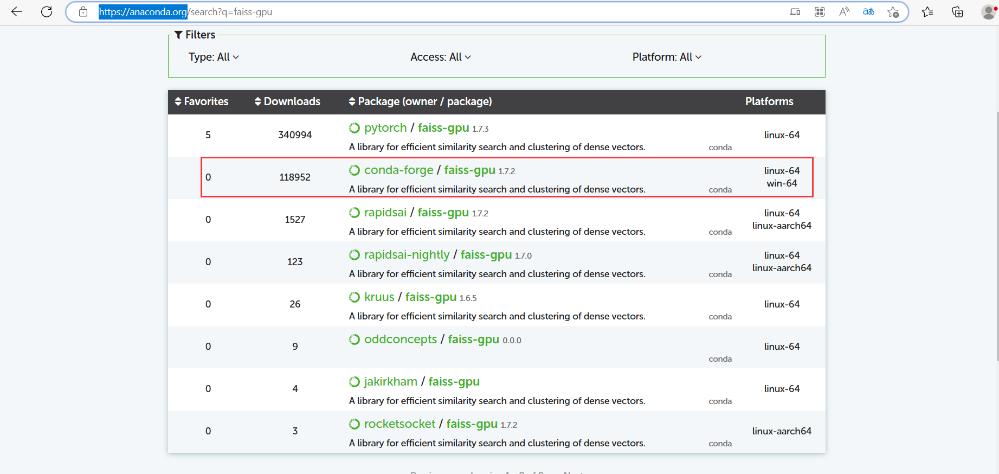
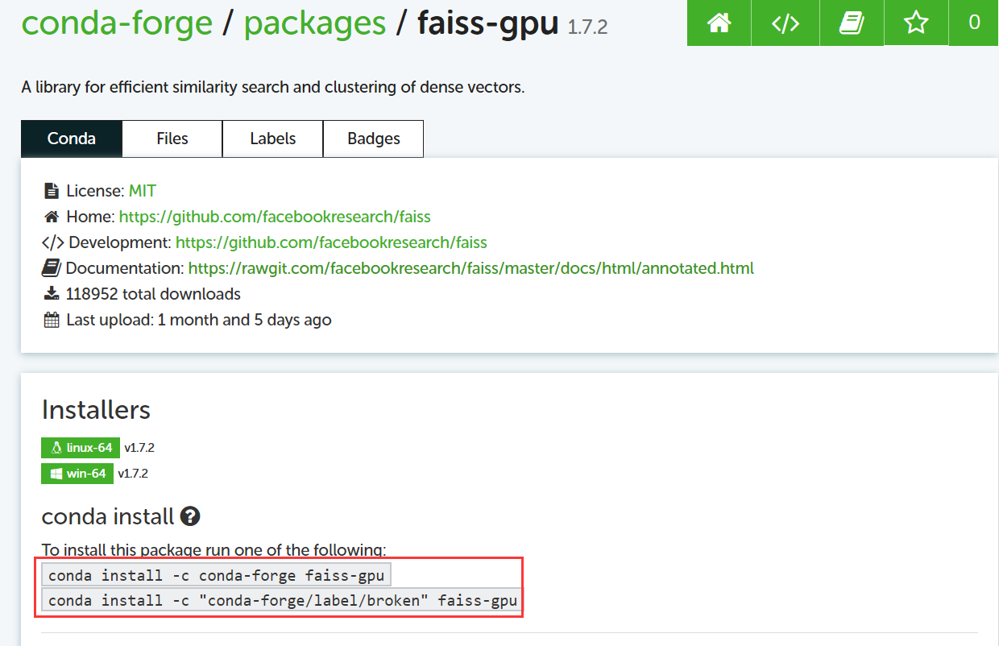
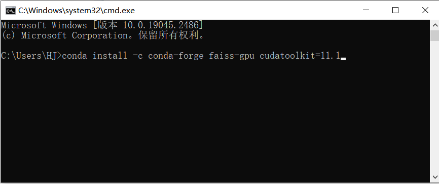

::: warning

该方法安装完 faiss-gpu 之后，不仅会装这个库，还会装很多依赖库。为了防止自己本地一些同名库的版本被修改，建议新建一个虚拟环境来安装。如果本地库版本修改对自己没影响，也可以忽略。

:::

你好，我是悦创。

1. 登录网站：[https://anaconda.org/](https://anaconda.org/) ， 然后搜索 faiss-gpu 会进入如下界面。



2. 因为是要在 Windows 上安装，所以选择第二个，点击进入如下界面：



3. 如上图有两条指令，复制其中任意一条命令，然后打开命令行窗口，将命令粘贴过去。这里没有指定对应的 cuda 的版本（默认会装最新的版本），如果需要指定版本的话如下所示:（假设是 11.1 版本）

> 最好是安装和自己电脑 cuda 对应的版本，以防后续出现其他的问题。

```bash
conda install -c conda-forge faiss-gpu cudatoolkit=11.1
```



4. 输入完命令之后需要等待一段时间，然后弹窗会弹出一个 y/N 的命令，输入 y 然后回车等待就可以了。

欢迎关注我公众号：AI悦创，有更多更好玩的等你发现！

::: details 公众号：AI悦创【二维码】


:::

::: info AI悦创·编程一对一

AI悦创·推出辅导班啦，包括「Python 语言辅导班、C++ 辅导班、java 辅导班、算法/数据结构辅导班、少儿编程、pygame 游戏开发、Linux、Web」，全部都是一对一教学：一对一辅导 + 一对一答疑 + 布置作业 + 项目实践等。当然，还有线下线上摄影课程、Photoshop、Premiere 一对一教学、QQ、微信在线，随时响应！微信：Jiabcdefh

C++ 信息奥赛题解，长期更新！长期招收一对一中小学信息奥赛集训，莆田、厦门地区有机会线下上门，其他地区线上。微信：Jiabcdefh

方法一：[QQ](http://wpa.qq.com/msgrd?v=3&uin=1432803776&site=qq&menu=yes)

方法二：微信：Jiabcdefh

:::


