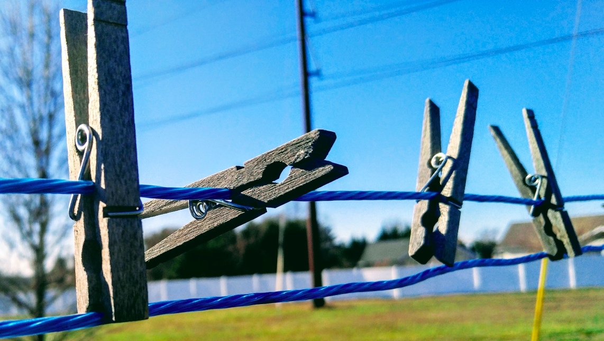

你好，我是胡光。在接下来的两个多月里，我将陪伴在你的每一天的清晨或是夜晚，在人潮拥挤的上班地铁上，在你家里的书桌前，再或者是在你公司楼下的咖啡厅里，每天 10 分钟，让好学的你，有所收获，就是我的任务。

## 那些年，我学过的编程语言

面对编程这个话题，或许你已是一位编程老手，对编程熟悉无比，现在是想查缺补漏；亦或许你是一个纯新手，对编程一无所知，学习完全是从 0 开始。不管哪种情况，在我们讨论编程学习的时候，怎么都绕不开一个话题，那就是语言选择。

鉴于以往的工作经历，我了解或者熟悉的编程语言有十几种之多，包括：

-   最能反映系统本质的 C 语言
-   叫人难以捉摸的 C++
-   天生就格式优美的 Python
-   上古级的 Pascal
-   神奇的函数式编程语言 JavaScript
-   微软系的王牌语言 C#
-   被誉为世界上最好语言的 PHP
-   使用人数最多的 Java
-   能够方便操作系统的 Shell 脚本语言
-   还有我自己开发的一门娱乐级编程语言 Hython

此外，还有一些仅仅是使用过，能看懂的语言，就不列出来了。

欢迎关注我公众号：AI悦创，有更多更好玩的等你发现！

::: details 公众号：AI悦创【二维码】

:::

::: info AI悦创·编程一对一

AI悦创·推出辅导班啦，包括「Python 语言辅导班、C++ 辅导班、java 辅导班、算法/数据结构辅导班、少儿编程、pygame 游戏开发，Linux，Web」，全部都是一对一教学：一对一辅导 + 一对一答疑 + 布置作业 + 项目实践等。当然，还有线下线上摄影课程、Photoshop、Premiere 一对一教学、QQ、微信在线，随时响应！微信：Jiabcdefh

C++ 信息奥赛题解，长期更新！长期招收一对一中小学信息奥赛集训，莆田、厦门地区有机会线下上门，其他地区线上。微信：Jiabcdefh

方法一：[QQ](http://wpa.qq.com/msgrd?v=3&uin=1432803776&site=qq&menu=yes)

方法二：微信：Jiabcdefh

:::

