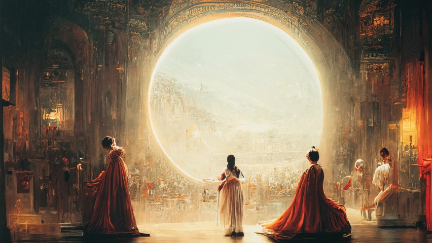

你好，我是悦创。

最近这半年，AI 绘画到底有多火热，相信不用我再多说。打开小红书、b 站，或是朋友圈和微信群，你肯定看到过很多人晒出了自己用 AI画的图。

我在屏幕上放了一幅画，名叫《太空歌剧院》。是不是看起来非常有意境？2022年9月，这幅画夺得了美国某个艺术比赛的冠军。

你肯定猜到了，这幅画的作者并不是人，而是 AI。但你可能不知道，创作这幅作品的人完全不会画画。他只是靠着 AI 绘图软件和 Photoshop，就赢过了一众专业画手。

这件事在当时引起了轩然大波，很多人开始激烈地争论，“**AI 创作的作品，到底能不能被称为艺术**”，“**专业设计师或者绘画师，究竟会不会被 AI 取代**”。

在我看来，这些话题当然也很重要。但更值得我们关注的事情是：**人类的创意成本，已经达到了前所未有的最低点**。未来，每个人都有机会用绘画表达自我，每个人都有可能成为设计师。

如果你没有绘画基础，你完全可以借助 AI 绘图工具，尽情表达自己的想象力。比如，为自己和宠物创作赛博分身，为孩子制作独家绘本，设计专属的徽章、T 恤，你甚至还可以画出理想的家的样子，做出一些室内设计图。你不再需要经过 10000 小时的刻意练习，只需要学会 AI 工具。

如果你是专业人士，有绘画基础，同样可以借助 AI 绘图工具，提高自己的生产力。比如，老板要你做一张海报，但是需求很模糊，“大气”就行。他也不是故意为难你，只是在看到参考图之前，老板也不确定自己究竟要什么。原来，你可能得闷头苦干三天三夜，而现在，你只需要输入一些关键词，几分钟之内，AI 就能给你生成多张参考图。如果觉得不行，就换几个近义词，让 AI 再出一批图。**这样一来，达成共识的效率变高了，你说，这是不是能提高你的生产力？**

在当下这个时间点，**AI 绘图已经是一只走进了房间的大象，容不得我们视而不见**。我相信，在未来，它还会成为更强大的武器，全方位影响我们的生产、生活方式。

我衷心地希望，现在正在看这门课程的你，能成为最早一批了解，甚至掌握这个未来工具的人。

## 1. 那么，这门课会怎么讲呢？

首先，你不必担心，这门课不要求你有绘画基础，更不需要你了解美术史、设计史。因为对于 AI 绘图来说，目前最主流的交互方式就是自然语言，你只要懂得如何输入文字，就可以加入课程。

其次，我为你挑选了最适合新手入门的工具，Midjourney。这也是我们课程中，所有案例所采用的工具。我在文稿末尾，附上了 Midjourney 的注册教程，你可以点击查看。

另外我想多说一句，我在课程中，使用了 Discord 软件版，因为更方便做案例演示。但是你在实际操作中，未必要下载电脑端的软件，也可以下载移动端，或者可以都不用下载，直接使用网页端。

当然，有很多了解过 Midjourney 的同学可能会担心，这个软件是由国外团队开发的，指令必须得用英文输入。那是不是英文不太好的同学，就不能学习这个课程了？

这个你就更不用担心了，因为我的英文也没有特别好。我比较推荐你使用谷歌翻译，或者 Deepl 这个翻译网站，你只需要把想到的关键词交给软件翻译就没问题了。

第三，也是最重要的一点，我不会简单地扔给你几个好用的「咒语」，而是会把咒语背后的底层思考，一并交付给你。

其实这也是我做这门课最大的动力。我发现很多人以为 AI 绘图就是得抄咒语，这是个天大的误解。

**咒语并不稀缺，我相信你也看到过不少分享。但正如前面所说，掌握了咒语，并不能算是学会了 AI 绘图。**

::: info 解疑

因为 Discord 和 Midjourney 需要特殊方法访问，我将会为你提供对应的方法，你可以添加我的微信：Jiabcdefh「注意：备注来意、有偿提供解决方案」

:::

就像你现在想学习写代码，但学习的方法是直接复制别人写好的代码，最多只是微调一点儿参数。就算最终代码运行的结果很好，那能说你会写代码了吗？肯定不能对不对。

学习 AI 绘画也是一样的。想要把它变成你的工具，你肯定不能只照搬我的指令关键词，而是得从零开始，搞清楚输入指令的底层逻辑，搞清楚每一个指令背后的含义，搞清楚效果不好的时候怎么调试……

正因如此，我在这门课里，会更多地分享我自己的绘图框架，包括怎么确定绘图任务、怎样确定主体和风格，怎样进行迭代优化……

同时，为了更方便你的学习，我们采取了视频授课的方式。

每个案例，我都会从头开始，带你完整地走过绘图的全过程。你不仅能看到我的咒语指令，更是能亲眼看到 AI 画的图，是怎样一步一步，靠近你的预期。

总而言之，我的目的，**是帮你找到一条路径，画出你想要的——注意，是你想要的，属于你的精彩作品。**

整门课，我会带来 1 个基本公式、40 个绘图案例，以及上百个好用的指令。

学习完整个课程，你会拥有自己专属的设计助理。目光所及的各个场景，从头像到朋友圈封面，从手机壳到水杯，从书架到沙发，从海报到绘本，都能够借助 AI 工具，把自己天马行空的创意落地。

说到这里，请允许我简单介绍自己：我是做 IT 的，也就是你们所谓的码农🧑‍💻、程序员。自由职业，自己做自己的产品，也是属于自己的产品经理🧑‍💼。

这反而正是我最想说的一点：既然 AI 绘图，会颠覆过往的生产逻辑。那么作为一个没有历史包袱的新创作者，我更能从工具或者产品的角度，为你提供理解和洞察。

这就好比，你想学习怎样做出好的短视频内容，那么相比于有资深内容经验的电视节目专家，你更应该请教已经在做短视频的博主，因为他们更懂新的生产工具，更能挖掘出新工具背后的价值。

那么，我过往的经验，能为 AI 绘图提供哪些帮助呢？

首先，作为产品经理，我更擅长需求的分析和落地，而这正是入门 AI 绘图工具的关键。

你肯定知道，AI 绘图目前还不能完全替代人类。而其中最无法替代的部分，就是**对需求的分析和拆解**。

就像我前面说过的一样，什么叫大气的海报，AI 是无法精确理解的，它只能为我们提供相似的参考。但是最终，怎样才算大气，是背景颜色深沉，还是海报字体要大，这些需求都得人类先拆解清楚，再把它们转化成具体的指令告诉 AI。

而拆解需求，落地需求，这就是我擅长的了。我一直在做编程私教，每周要思考🤔️学员需求，从“海量”的用户「私教学员」反馈中，分析出真正重要的需求，再把它们落地成具体的产品功能。这些经验，能帮助我更好地利用 AI 工具，完成绘图任务。

其次，除了需求分析之外，我另一个重要的技能，就是擅长迭代总结。而这一点，恰恰决定了你是否能熟练掌握 AI 绘图工具。

你可能听说过，AI 绘图的模型，是一个搭建在神经网络上的“黑盒”。这个黑盒的内部结构，别说我们作为用户，就连搭建模型的科学家和工程师们也都不清楚。

这也就意味着，AI 绘图工具并不存在一份永久有效的说明书，只要你严格遵照上面的指令，就能分毫不差地做出想象中的内容。

所以，在 AI 绘图的过程中，迭代检验会变得非常重要。有朋友拿着网上抄来的指令，试了一两次发现效果不好就放弃了，这很可惜。因为 AI 绘图最大的特点，就在于你可以不断进行迭代和复盘。一个关键词不好用，就多换几种表达试试，说不定哪次就被你试出了一张超出预期的绝妙好图。

网上有很多人，把使用 AI 绘图很厉害的人称为魔法师，说他们用的是“咒语”，其实就是这个道理。想要找到好的咒语，没有别的办法，只有靠无数次的迭代总结。而这一点，正是我这个“产品经理”的熟练技能。

要知道，产品上线只是万里长征的第一步。产品经理真正重要的工作，就是不断地从用户的试用反馈中复盘总结，找到哪些是对的，哪些是错的，让产品在每个版本的迭代中，逐渐趋于完美。

所以，结合以上这些方面，我写了这系列文章。因为我知道，我的这些经历，一定可以帮助大家更好地理解并使用 AI 绘图工具。

在发刊词的最后，我想给你讲一个故事，这个故事来自 flomo 的联合创始人少楠。

他过去是学设计的，亲自体验过很多设计软件的更新迭代。他意识到，每次软件的更新迭代，其实对普通人而言是巨大的进步，过去一个设计师要到有创意的阶段，需要大量苦闷、艰难和无趣的基本功训练，而新入行的设计师，则可以快速习得工具使用，并且把创意落地。我们不再需要常说的 10000 小时的刻意练习了，对于老的工匠来说也许并不认同，但不矛盾，老的工匠会成为艺术家，就像手工打造的家具和批量生产的家具各有市场一样。

这个理念很打动我。我期待 AI 绘图可以让我们省去 10000 小时在绘画基本功上的刻意练习，但可以把 10000 小时放在创意和想法上做刻意练习。这是特别酷的一件事儿。

怎么样，准备好实现自己的创意了吗？

欢迎关注我公众号：AI悦创，有更多更好玩的等你发现！

::: details 公众号：AI悦创【二维码】

:::

::: info AI悦创·编程一对一

AI悦创·推出辅导班啦，包括「Python 语言辅导班、C++ 辅导班、java 辅导班、算法/数据结构辅导班、少儿编程、pygame 游戏开发」，全部都是一对一教学：一对一辅导 + 一对一答疑 + 布置作业 + 项目实践等。当然，还有线下线上摄影课程、Photoshop、Premiere 一对一教学、QQ、微信在线，随时响应！微信：Jiabcdefh

C++ 信息奥赛题解，长期更新！长期招收一对一中小学信息奥赛集训，莆田、厦门地区有机会线下上门，其他地区线上。微信：Jiabcdefh

方法一：[QQ](http://wpa.qq.com/msgrd?v=3&uin=1432803776&site=qq&menu=yes)

方法二：微信：Jiabcdefh

:::

