你好，我是悦创。

上一讲你学会了怎么创作赛博分身，这一讲我们看另一个有意思的场景：怎么给自己的宠物创造 Q 版形象。有人说，我没有宠物啊？没事，我们只是拿宠物举例子，其实你可以用 AI 创作任何动物的动漫形象。

## 1. 确认主体

第一步确认任务。显然，又是一个确定性很强的任务，所以需要垫图，不用多说了。第二步，确认主体，我选用的是朋友家的猫，朵朵老师，一只非常有性格的猫。

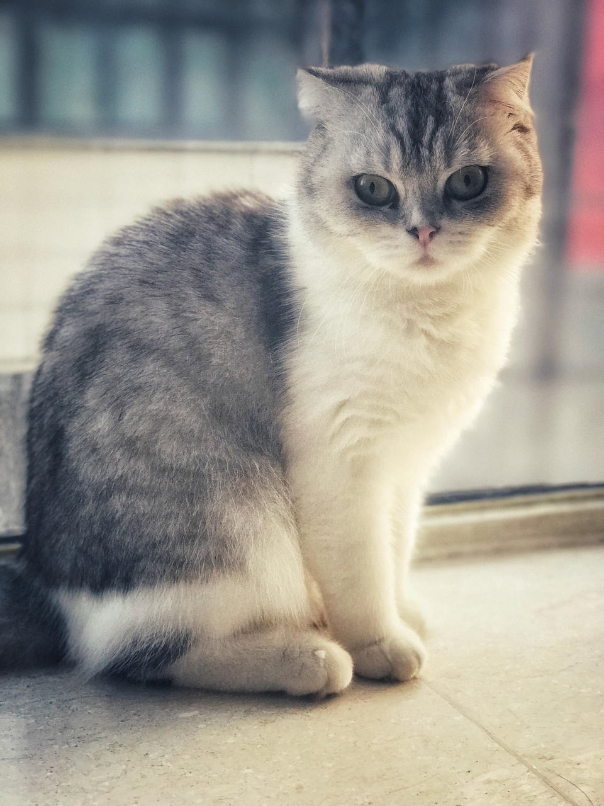

我们先来试试最基础的主体描述。复习一下上一讲讲过的方法，上传朱蒂的图片，然后复制链接，在关键词指令后面粘贴链接，垫图就完成了。然后我们加上“一只猫”，等待 AI 输出：

```
https://s.mj.run/EueiROi_CmU  a cat
*链接位置，可以替换成自己想用的照片链接
```

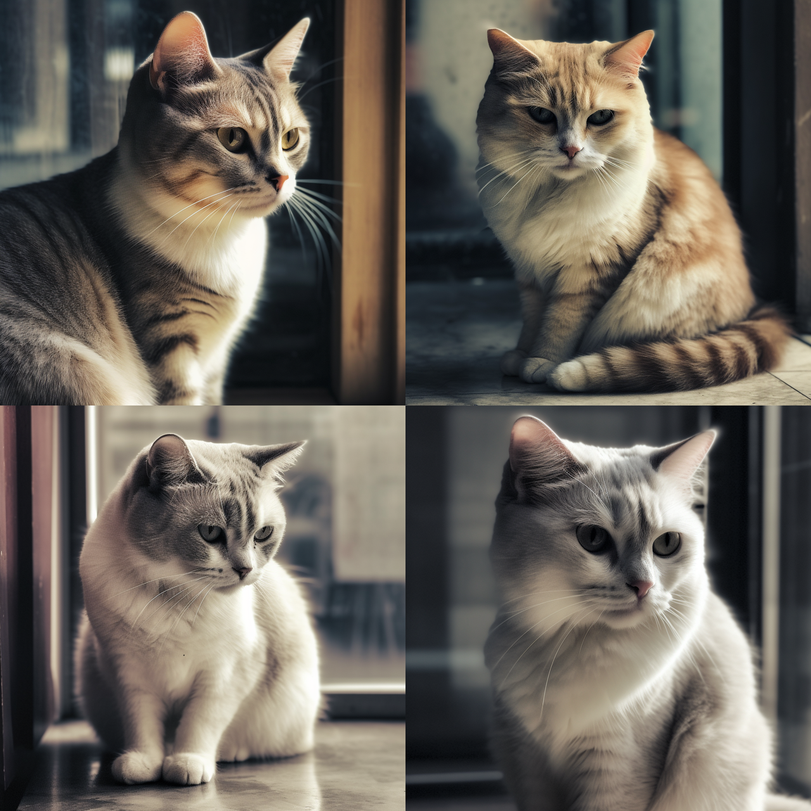

好，可以看到，生成了几只长得跟朵朵差不多的猫。如果加上对猫品种的描述，会不会和朵朵更像呢？我们试一试。我把朵朵的品种再描述得详细一点，也就是在主体描述这里写上英短，看看 AI 会生成怎样的结果。

```
https://s.mj.run/EueiROi_CmU  a British Shorthair Cat
*链接位置，可以替换成自己想用的照片链接
```

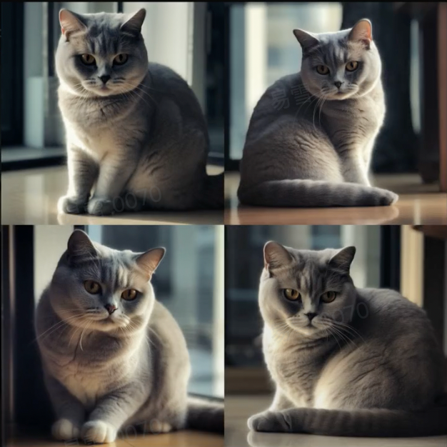

好，我们看，结果好像还没有上面那几张像朵朵。这是为什么呢？

明明描述得更清晰了呀。

<span style="color:orange">**其实对于宠物来说，如果我们对主体的定义太精确，AI 就会去数据库里调用大量参考，结果你宠物垫图原本的参考权重就变低了，导致生成结果反而有可能跟原来的样子差别很大。**</span>所以我建议，描述宠物，只写到“一只猫”、“一只狗”，就够了。

## 2. 确认风格

好。接下来就可以考虑风格化了。我们先试试上一讲用过的皮克斯风格。另外我给你推荐一个指令，叫 Chibi。这个指令的意思就是 Q 版，很适合用来做 Q 版的形象，和皮克斯风格搭配使用，效果更佳。好，垫图，输入，然后等待 AI 生成：

```
https://s.mj.run/EueiROi_CmU  a cat, Chibi, pixar style, 3D rendering
*链接位置，可以替换成自己想用的照片链接
```

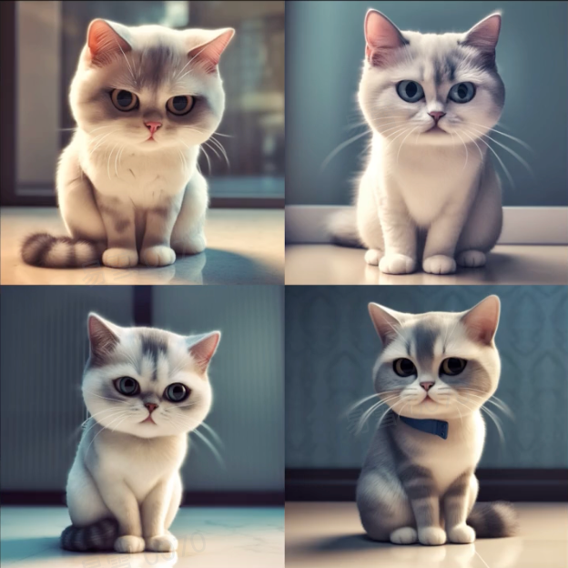

是不是很可爱，很有 Q 版的效果？

那在这个基础上，如果我还想让细节更丰富一点，怎么办呢？比如说，可以给朵朵老师穿上宇航服。那就加上这样一段细节描述：“一只猫穿着宇航服在太空船里”。

```markdown
https://s.mj.run/EueiROi_CmU  a cat wearing an astronaut suit and sitting in a spaceship, Chibi, pixar style, 3D rendering
*链接位置，可以替换成自己想用的照片链接
```

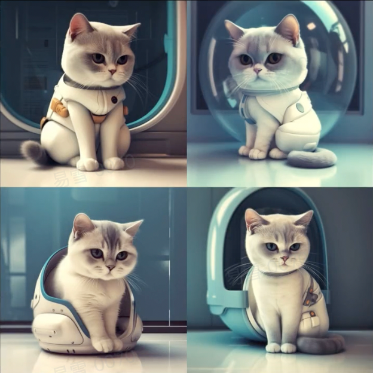

你看，朱蒂马上就变成宇航小猫了，还坐在航空舱里

我们换一个风格，这次不用宽泛的二次元风格了，我们模仿吉卜力工作室，也就是宫崎骏的动画风格，来画一只街上的朱蒂。垫图，然后加上：“一只街上的猫”、“Chibi”、“吉卜力动画风格” 。

```markdown
https://s.mj.run/EueiROi_CmU a cat in street, Chibi , Studio Ghibli style
*链接位置，可以替换成自己想用的照片链接
```

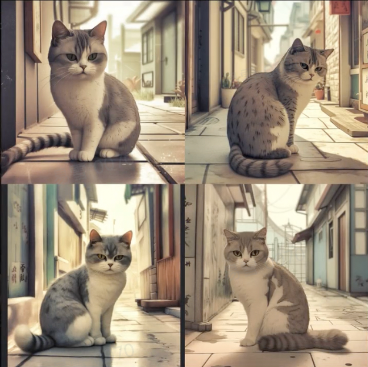

我们来看，是不是有《千与千寻》那个味儿了。

如果这里，觉得朱蒂老师的形象太写实，不像宫崎骏画的猫。没关系，我们来调整一下 iw 参数，也就是前两讲讲过的参考垫图的比重。同样还是这一串关键词指令，我在后面再加一个 iw0.5。来看看AI的表现

```markdown
https://s.mj.run/EueiROi_CmU  a cat in street, Chibi , Studio Ghibli style --iw 0.5
*链接位置，可以替换成自己想用的照片链接
```

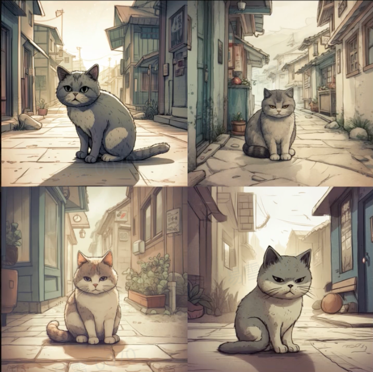

嗯，朱蒂老师大变样了，真的很像宫崎骏动漫里的一只小猫，是不是？我个人更喜欢右上角的这一版。

## 3. 润色和修正

好，那有人说了，我平时拍照不会只拍宠物自己，我想生成我跟宠物的合影，可不可以？当然可以，这时候的重点，就是润色和修正。比如说我们先来垫一张图，小姑娘和猫猫的合影。然后也是加上风格化处理：先描述一个可爱的小姑娘正抱着一只猫 ，然后是皮克斯风格，3D 渲染。来看看 AI 的处理

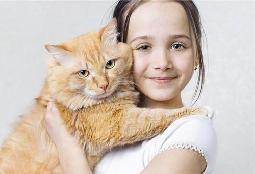

```markdown
https://s.mj.run/hHv1mCWK63w  a cute little girl is holding a cat , pixar style, 3D rendering
*链接位置，可以替换成自己想用的照片链接
```

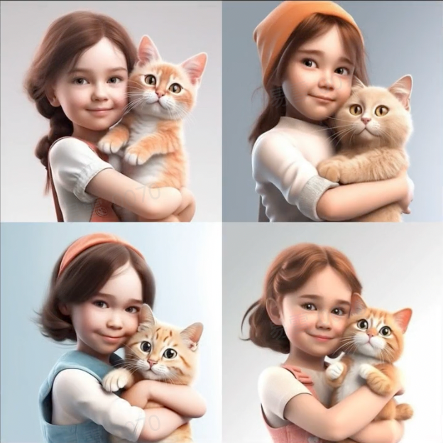

出来了，你会发现一个问题，就是一旦把 iw 调低，风格化突出，人就不太像自己了。所以我们可以适当调高iw值，比如说，我们试一试把 iw 调到 2。来看看效果。

```markdown
https://s.mj.run/hHv1mCWK63w  a cute little girl is holding a cat , pixar style, 3D rendering --iw 2
*链接位置，可以替换成自己想用的照片链接
```

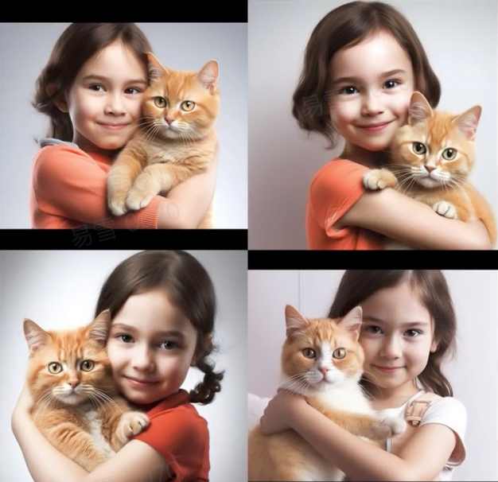

好，出来了。是不是可以看到这个人脸和猫猫都比上一张图要更接近原图，风格化的部分就弱化了。

## 4. 练习画其他动物

好。到这儿，我们已经走完了整体的四步流程，从确认任务、确认主体、风格化改造再到润色和修正。接下来，我们试一试其他动物，练习一下。刚才的方法不仅适用于画宠物，还可以画比如说城市的吉祥物。所以咱们就拿大熊猫举例子吧。

最近有个网红大熊猫，叫花花，咱们就用它。先试试垫图，然后只加主体：“一只大熊猫”。

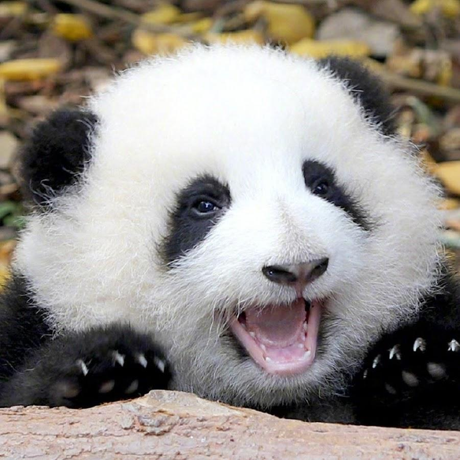

```markdown
https://s.mj.run/6u-3IGM9RFU  a panda
*链接位置，可以替换成自己想用的照片链接
```

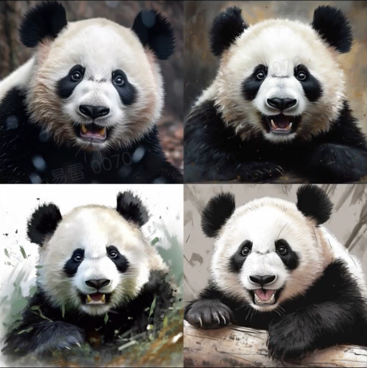

好，主体的识别效果没什么问题，但花花的耳朵好像有点奇怪，真实的耳朵要更小、更可爱一些。那我们可以先手动调整一下细节，加上：“一只熊猫，耳朵很小”，看 AI 效果怎么样。

```python
https://s.mj.run/6u-3IGM9RFU  a panda , very small ears
*链接位置，可以替换成自己想用的照片链接
```

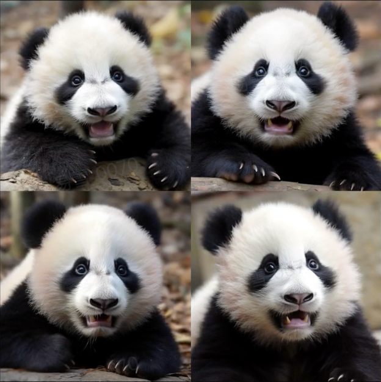

果然，这下就和花花非常像了。

确认完主体，接下来我们给花花加风格。同样，我们来先垫图，然后给花花穿上宇航员的衣服，再加上 Chibi，皮克斯风格，3D渲染。来看看 AI 效果如何。

```python
https://s.mj.run/6u-3IGM9RFU  a panda , very small ears, wearing an astronaut suit and sitting in a spaceship, Chibi, pixar style, 3D rendering
*链接位置，可以替换成自己想用的照片链接
```

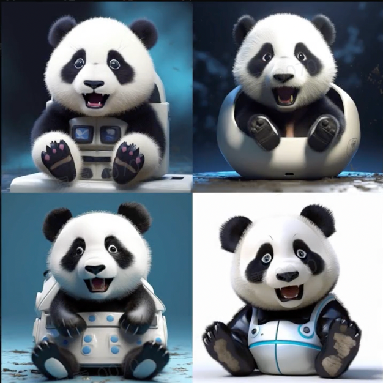

很可爱对不对。好，还可以让花花在皮克斯风格的基础上，再加点赛博朋克风，看看会是什么样。

```python
https://s.mj.run/6u-3IGM9RFU  a panda , very small ears, cyberpunk style, Chibi, pixar style, 3D rendering
*链接位置，可以替换成自己想用的照片链接
```

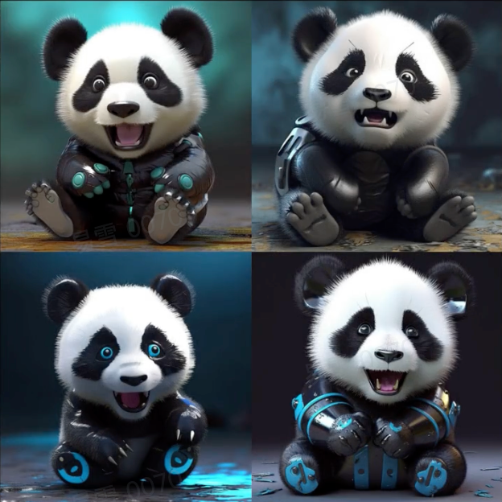

可以看到，花花的四肢都变成机械风了，很炫酷。好，如果你还想进行润色和修正，可以再调整参数，非常简单，我就不演示了。


## 5. 打造人设

那这一讲是不是就到这儿结束了呢？还没有。接下来，我教你两个绝招。

不知道你有没有发现，我们在动漫里看到的动物都有人设，比如《黑猫警长》、《疯狂动物城》、《龙猫》这些作品里的角色。如果能给自己的萌宠，或者一个城市的吉祥物加上人设，那才是更高级更有趣的设计。

怎么做到呢？有一个方法，就是在完成常规四步之后，再加一步：让它们做一些平时做不到的事。

比如，我可以让朱蒂老师骑机车，给它打造个机车手的人设。来试试。同样也是先垫图，在“一只猫”后面加上在骑摩托车，然后 Q 版形象不能少，还是 Chibi，最后还得让 AI 发挥的成分更多一点，iw 调成 0.5。好，来看看 AI 的结果。

```python
https://s.mj.run/EueiROi_CmU  a cat ,Motorcycle Riding, Chibi --iw 0.5
*链接位置，可以替换成自己想用的照片链接
```

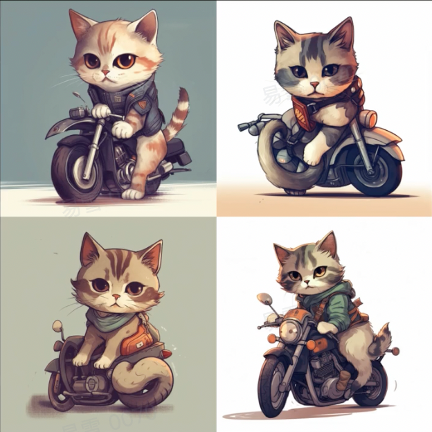

你看，一个会骑机车的朱蒂就出现了，是不是一下子就有了性格、有了爱好。

再比如说，我们还可以打造反面的人设。毁灭世界，这个朱蒂老师做不到。来，我们在垫图后面加上：一只巨大的猫在摧毁城市，iw 还是0.5，看看 AI 的结果。

```python
https://s.mj.run/EueiROi_CmU  a huge cat is destroying city , --iw 0.5
*链接位置，可以替换成自己想用的照片链接
```

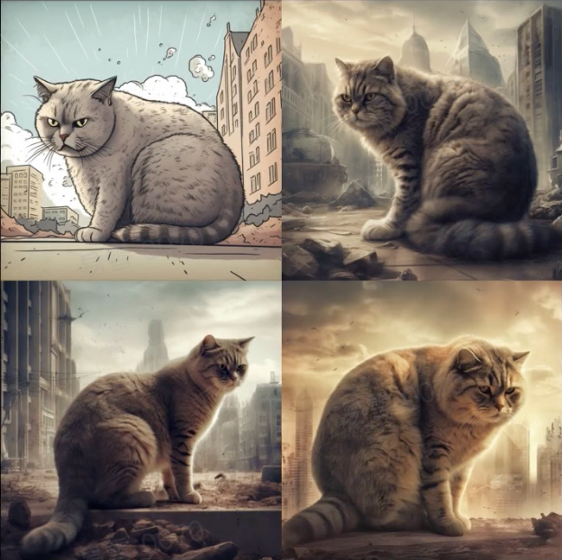

一只可怕的巨猫出现了。所以你可以记住，想要让你的宠物形象更拟人，就可以让它做一些平时做不了的事情。

好，这是第一个绝招。第二个绝招，你还可以让它穿戴一些平时穿戴不了的着装，效果也不错，还能突出人设。

我们试一试，这次我们让宠物的形象有点“手办”风，也就是更像玩具。有个关键的指令是“soft pastel color”，也就是“柔和的色彩”。然后，重点来了，我们可以让它戴上眼镜和耳机，另外我们降低一点 iw 值。我就不展示过程了，这个是最后试出来的比较不错的指令句子。

```bash
https://s.mj.run/EueiROi_CmU  Super cute cat ip, reading book, front view, full body, chibi, soft pastel color, headphones, glasses, raking lightm, clean background, 3D, ultra detailed, c4d --iw 0.5
*链接位置，可以替换成自己想用的照片链接
```

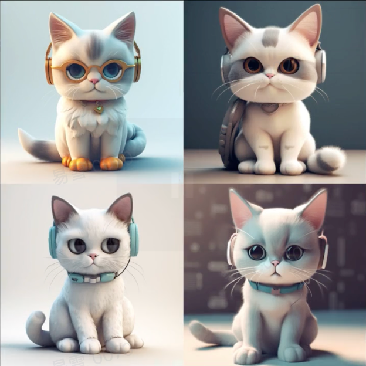

看到这个效果，就感觉这只猫一下子就很有人设了。

上一讲和这一讲，我们都在说形象。下一讲，我们往前一步，看看如何用AI生成你的手机壁纸。下一讲再见。

## 常用指令清单：

### 主体：

A cat/dog 一只猫/狗

protrait 肖像

Cute 可爱

Chibi Q 版

Fluffy 毛茸茸

soft pastel color 柔和的粉色

Bright colors 明亮的颜色

big/bright eyes 大的/明亮的眼睛

Full body view 全身

### 3D 风格化：

3d rendering 3d渲染

C4D 3D建模渲染工具

blender 3D建模渲染工具

### 卡通风格化：

Anime/Comic 动画/漫画

Pixar/Disney style 皮克斯/迪士尼风格（可以尝试其它知名的厂牌）

Blind Box Toy 盲盒

Pop Mart 泡泡玛特（可以尝试其它的知名玩具品牌）

### 摄影风格：

Pet photograph 宠物摄影照片

elke vogelsang 知名猫狗摄影师（可以尝试其他知名的摄影师）

Natural lighting 自然光

Studio lighting 工作室打光

### 动作提示：

driving a car 驾驶汽车

Motorcycle Riding 骑摩托车

snowboarding 滑雪

Diving 潜水

Surfing 冲浪


欢迎关注我公众号：AI悦创，有更多更好玩的等你发现！

::: details 公众号：AI悦创【二维码】


:::

::: info AI悦创·编程一对一

AI悦创·推出辅导班啦，包括「Python 语言辅导班、C++ 辅导班、java 辅导班、算法/数据结构辅导班、少儿编程、pygame 游戏开发」，全部都是一对一教学：一对一辅导 + 一对一答疑 + 布置作业 + 项目实践等。当然，还有线下线上摄影课程、Photoshop、Premiere 一对一教学、QQ、微信在线，随时响应！微信：Jiabcdefh

C++ 信息奥赛题解，长期更新！长期招收一对一中小学信息奥赛集训，莆田、厦门地区有机会线下上门，其他地区线上。微信：Jiabcdefh

方法一：[QQ](http://wpa.qq.com/msgrd?v=3&uin=1432803776&site=qq&menu=yes)

方法二：微信：Jiabcdefh

:::


