你好，我是悦创。

上一讲我们学会了怎么给宠物创作 Q 版形象，这一讲我们更进一步，学习怎么设计专属的电脑和手机壁纸。

为什么说更进一步呢？因为不论是头像还是宠物，主体都是确定的，更像“改画”、“P 图”。但是画壁纸，主体和风格的不确定性就更高了，更有“创作”的感觉了，当然，难度也更高了。

好，接下来，我们就进入正式的学习。

## 1. 确认任务

第一步还是确认任务。你得知道，要做的是手机壁纸还是电脑壁纸。这两者唯一的区别是尺寸大小问题。手机壁纸的尺寸是 `6:19`，电脑壁纸的尺寸一般是 `16:10` 或者 `4:3` 。这个区别问题非常好解决，只要在指令词后面直接输入`--ar X:X` 就可以。你可以先记住，稍后我会演示。

## 2. 确认主体

更需要确认的是主体。据我的观察，壁纸主要有三类典型的主体：**第一类是人像或者可爱的宠物；第二类是风景；第三类是抽象几何画。**

第一类好办，就是前两讲我们说到的内容应用在壁纸上，只要处理一下输出尺寸就可以。这一讲，我会主要讲后两类：风景图和抽象几何图。既然是这两类，你肯定也能判断，垫图不再是一个重要选项了，我们可以依靠指令词直接生成相关的图片。

好。我们就先来试试一些简单的操作，顺便，我把“ar”这个参数的使用也展示给你。

我们先来尝试生成一张风景类壁纸，先来个火山背景。我直接输入：一座正在喷发的火山。这个时候就可以直接点击发送了吗？不行，别忘了，还要加上壁纸尺寸的要求。我们先来生成一个电脑壁纸，我用 `16:10` 这个尺寸，那就在后面加上：`--ar 16:10`。好，我们等待看一下结果。

```bash
A volcano that is erupting --ar 16:10
```

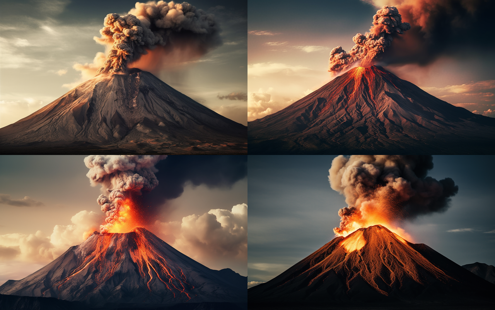

可以看到，AI 完美地按照我们的描述生成了图片。

再来试一个，比如我想要一张海洋中间有个被植物覆盖的小岛，那么就直接输入：被植物覆盖的小岛, 海洋中。这里提醒一下，**尽量不要用长句，能拆就拆**。同样也是加上：`--ar 16:10`。我们看看。

```bash
An island covered with vegetation , in the ocean --ar 16:10
```


好，没什么问题，非常准确。

再来试试能不能模仿 Windows 的经典壁纸，来生成一张图呢我来输入，同样是拆成词组：巨大的草地，清澈的蓝色天空，白云。我们等待看看。

```bash
Large grassland, clear blue sky, white clouds --ar 16:10
```


好，是不是有那感觉了？

但是好像又有哪不对。是不是山坡看上去太平了？来，我们加一句描述山坡起伏的就可以了，好，我们输出看看。

```bash
Large grassland , undulating hillside, clear blue sky, white clouds --ar 16:10
```


嗯，更像原来 windows 的桌面了。

这是电脑壁纸，手机版会是什么样？来处理一张抽象的几何图吧。我输入：各种颜色的几何形状，然后把尺寸改成 `9:16`。看看效果怎么样。

```bash
Geometric shapes in various colors --ar 9:16
```


好，看，尺寸果然按照手机壁纸出来了对不对？

## 3. 确认风格

### 3.1 简单化处理

好。我们刚刚做的几张，充其量也就是达到了应用商店里免费壁纸的效果，肯定是不好看的。怎么办呢？我们要风格化。接下来我们看四种非常实用的“风格化”处理方式。

第一个方式叫“**简单化处理**”。什么意思呢？我先给你演示一个例子。还是先来生成一张确定主体的风景图。就拿我特别喜欢的竹子做例子吧。我输入最简单的：一些竹子 ，然后输入手机尺寸：`--ar 9:16`。我们看看。

```bash
A few bamboos --ar 9:16
```

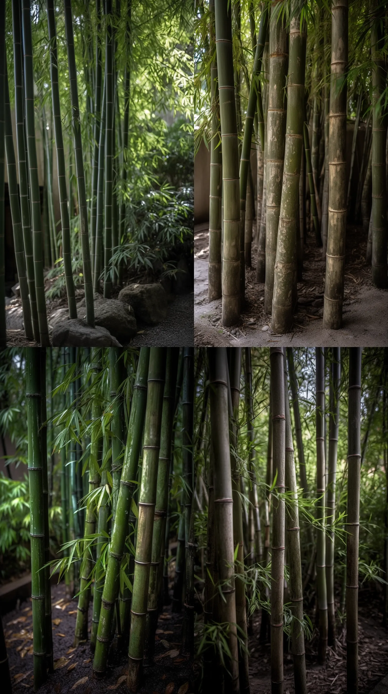

好。你发现问题了吗？太杂乱了对不对，或者说太像竹子了，没有意境。怎么办？这个时候就需要“简单化处理”。你可以加入两个常用的指令：第一个，“简单”；第二个指令，“壁纸”，用来告诉 AI，我们处理的是壁纸，输入：一些竹子，简单，壁纸。看看效果。

```bash
A few bamboos, simple ,wallpaper --ar 9:16
```


看，是不是画面变简单，同时更像壁纸了。

**其实在创作的时候，写实会让画面特别朴素，显得杂乱。“简单化处理”的目的，就是让主体更鲜明，同时又不损失质感。**

我们再试一个。刚才我们尝试过画火山，我们看看加上“简单化处理”后是什么样子。我输入：壁纸，在喷发的火山， `--ar 16:10`。来看看效果。

```bash
wallpaper, A volcano that is erupting --ar 16:10
```

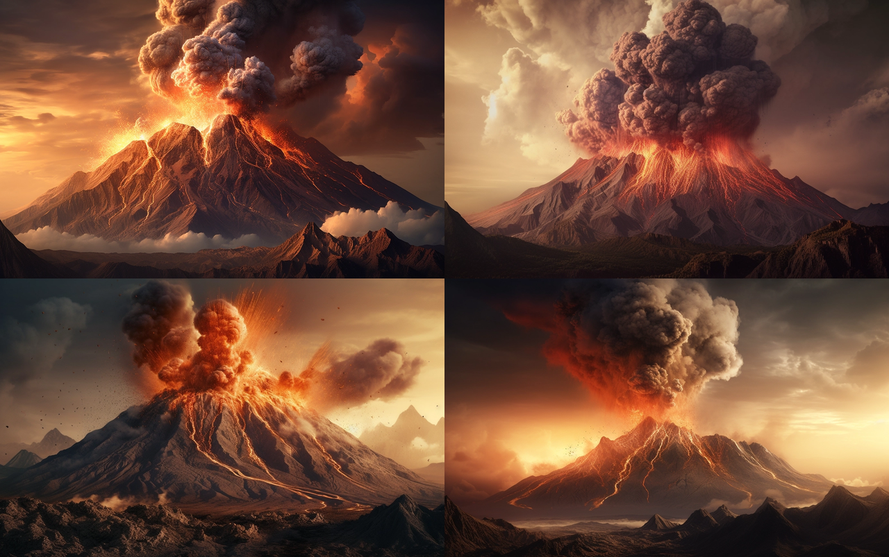

看，干净了许多。

除了“简单”这个指令，还有一个指令也能达到“简单化处理”的目的，叫“极简艺术”。我们来试一试。这一次我们拿一个人文景观来举例：中国风的古塔。我输入：

```bash
Ancient Chinese Pagoda, minimalist art --ar 9:16
```

来看看效果：

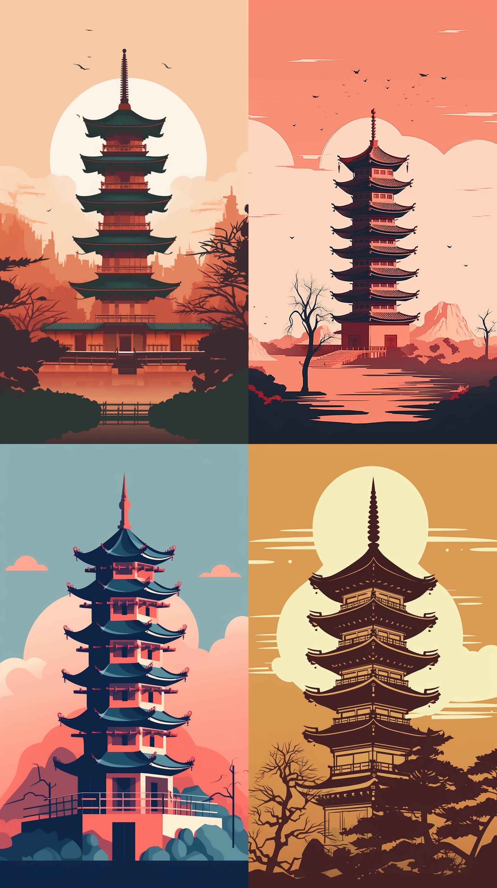

看，非常有意境，而且画面干干净净。

### 3.2 抽象处理

好，这是第一种风格化处理方式。有人说，我不喜欢特别简洁的画面，我就喜欢复杂、炫酷的画面。但是一复杂，画面就乱，怎么办？**我要教给你的第二种方式叫“抽象处理方式”，用来满足你的这个需求。它还有一个好处，就是能让 AI 能够天马行空地发挥。**

首先，抽象处理的第一个方法是直接把主体定义为一个相对抽象的词，比如我们选【时间】，然后我加上我们之前用到的艺术风格：极简艺术。好，生成一个电脑壁纸尺寸试一试，输入：时间，极简艺术。我们看看效果。

```bash
time, minimalist art --ar 16:10
```

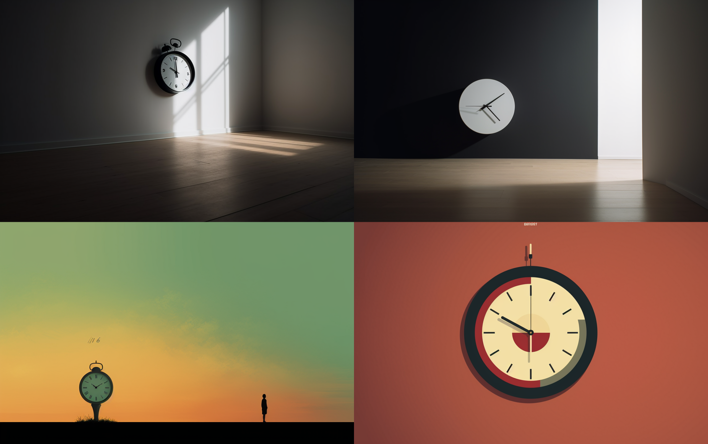

色调和线条都很有质感，我们再来看看手机壁纸尺寸的怎么样。我把 ar 改成 9:16。

```bash
time, minimalist art --ar 9:16
```

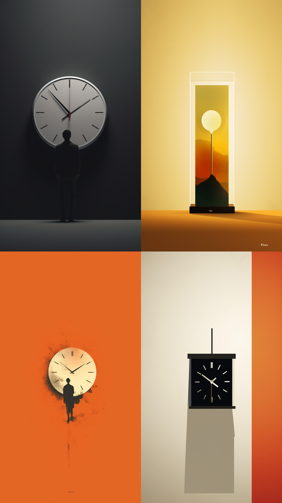

好，可以看到，虽然 AI 还是把时间处理成了具象的钟表，或者沙漏，但是抽象的感觉已经出来了。

再试一个。比如主体是“华丽”，同样用极简风格处理一下。输入：华丽，极简艺术 --ar 16:10。好，等着看看。

```bash
Gorgeous, minimalist art --ar 16:10
```

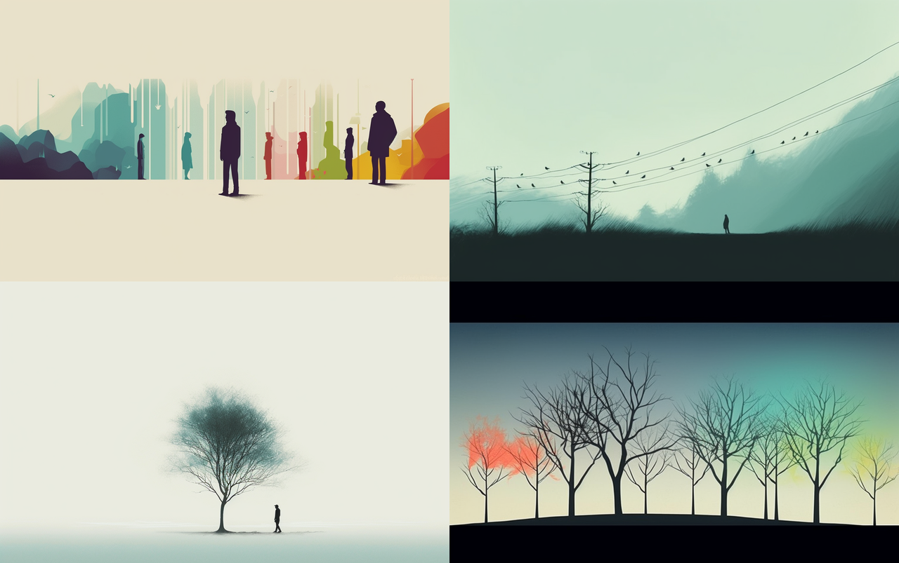

生成没有问题，我们再看看 9:16 的。

```bash
Gorgeous, minimalist art --ar 9:16
```


你看，是不是还挺有感觉的，虽然我不太清楚，为什么 AI 会认为这些图像，反映了“华丽”。

好。有人会说了，这些壁纸还是有具象的主体。能不能把主体都干掉，“从头到尾”的抽象？可以。我给你介绍抽象处理的第二个方法，用指令——“抽象艺术”。 **抽象艺术本来指的就是20世纪兴起的一种绘画风格，它的画面与自然景物基本没有什么相近之处。所以加了这个指令后，AI创作出的壁纸，抽象度就拉满了。** 你可以把它，和“抽象词做主体”的方法放在一起，共同使用。

我们试一试。比如我自己很喜欢克莱因蓝，看看它的抽象画风格是什么样的。我们来写：克莱因蓝，抽象画。

```bash
Klein Blue, abstract painting --ar 9:16
```

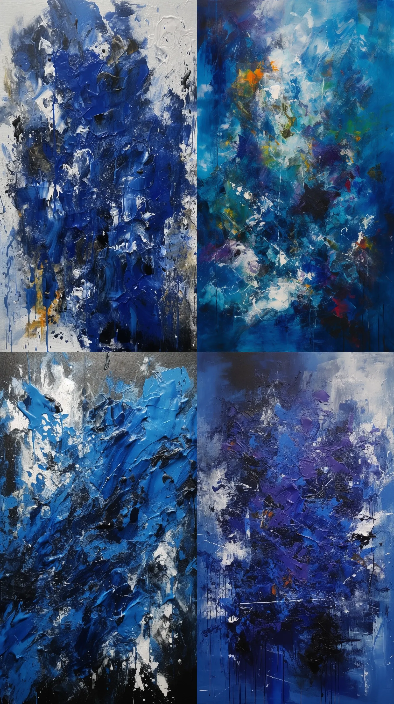

你看，有了一种抽象、凌乱的美感，对吧。我们还可以再让它更有冲击力，比如我们调整一些细节，加个喷溅的感觉，增加指令：墨水，喷溅。

```bash
Klein Blue, ink , splash, abstract painting --ar 9:16
```

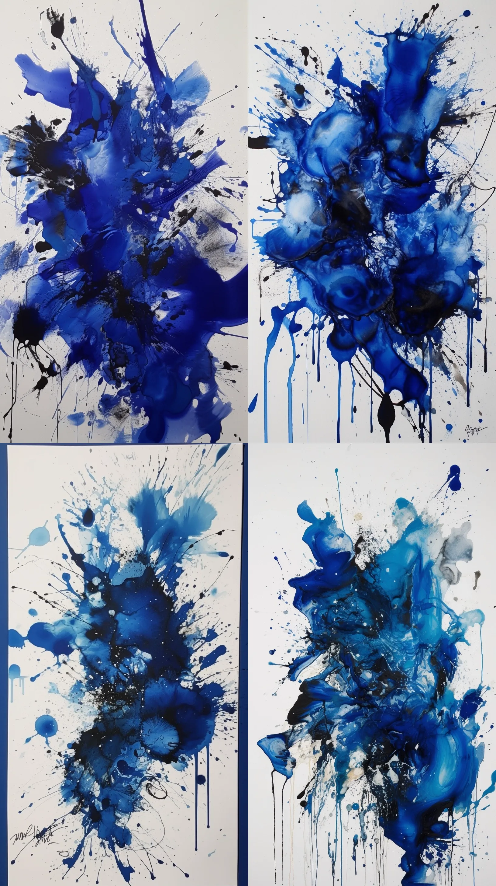

你看，很有冲击力，也很抽象。

### 3.3 反差处理

好，我们学会了设计壁纸的第二个思路，抽象处理。**第三个处理思路叫“反差处理”**。什么意思？就是把平时我们不会联想到一起的事物给联想到一起。比如说，我们刚才画过竹子。一般来说，中国的画家喜欢画竹子。你见过莫奈画竹子吗？这就是反差。

我们上手试一下，输入：竹林，然后在后面加上莫奈的画，输出一个手机壁纸尺寸的，看一看。

```bash
Bamboo Forest ,painting by Monet --ar 9:16
```

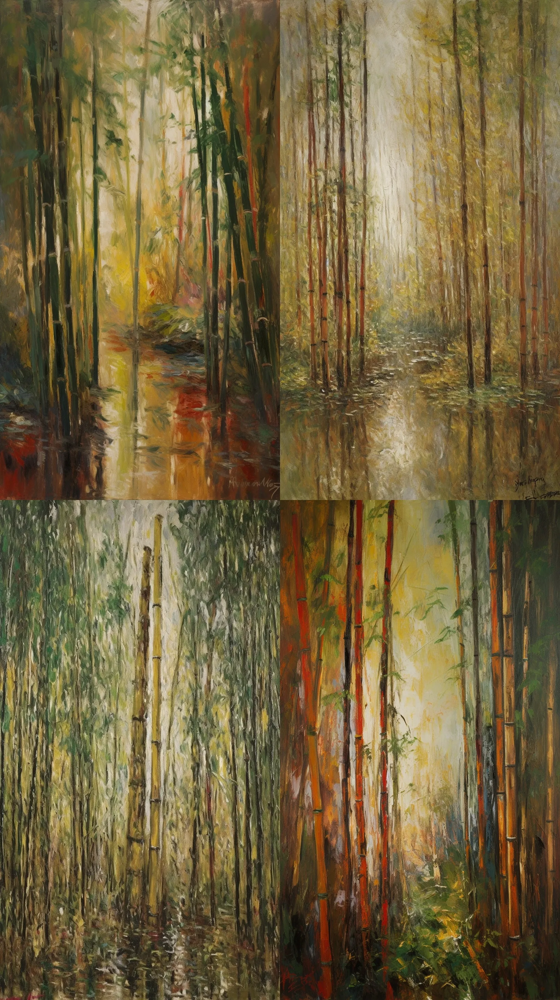

你看这个效果是不是跟我们平时见过的竹林画就非常不一样了。

再试一试。我又想到了一个，中国古镇，跟毕加索的绘画风格好像很难联系到一起。处理起来会是什么样呢？来尝试一下，输入：中国古镇。然后让毕加索来处理一下，加上：毕加索的画。我们来输出一个电脑壁纸版的：`--ar 16:10`。看一看。

```bash
Chinese old town, painting by Picasso --ar 16:10
```


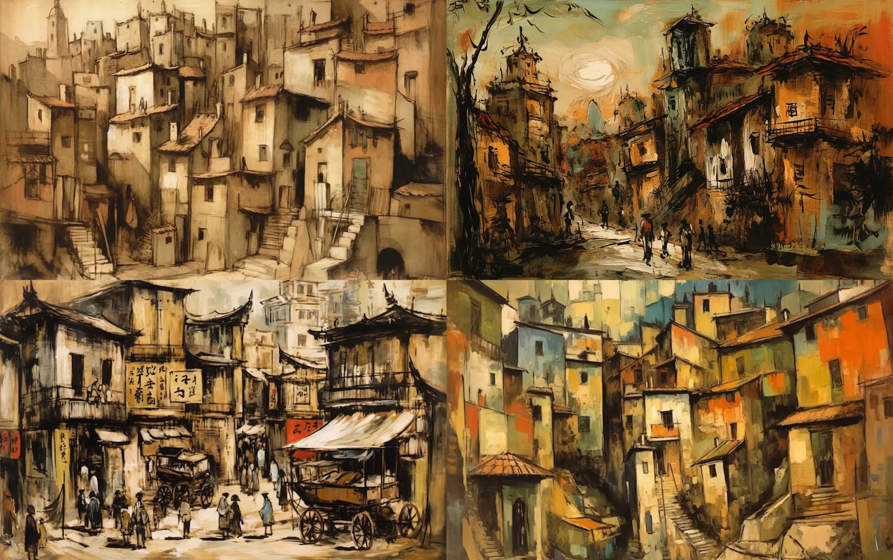

看看，是不是有一种奇特的美感。

再试一个。这次用我很喜欢的哈利波特系列吧。我想用生活在20世纪的达利，画一个他从没见过的霍格沃茨学校。我来输入：霍格沃茨，达利的画。

```bash
Hogwarts, painting by Salvador Dali --ar 16:10
```

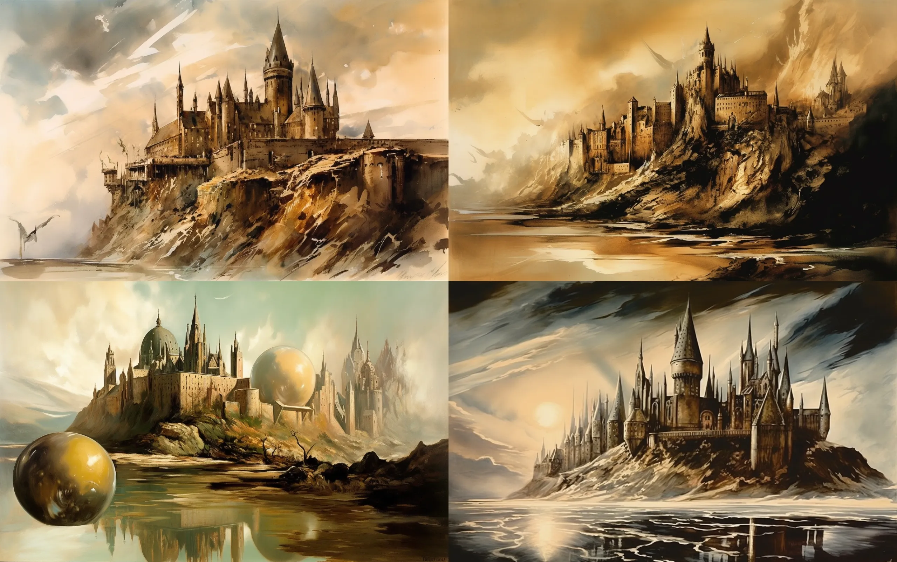

让梵高老师画一个离他几千公里远的上海，看看会是什么样，我在指令词后面加上：上海，梵高的油画。

```bash
Shanghai city, oil painting by Van Gogh --ar 16:10
```

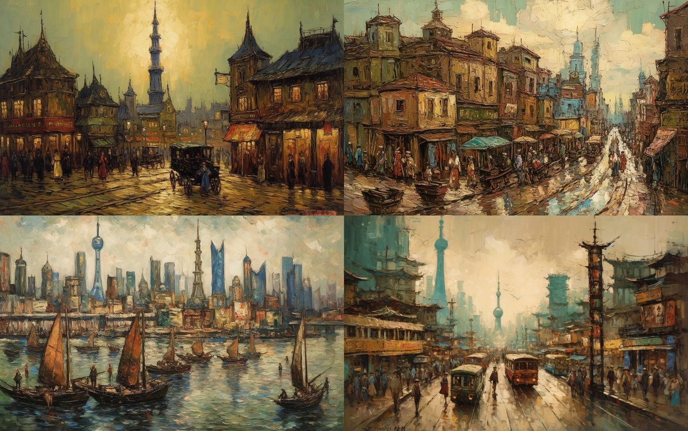

你看，很像欧洲城市，但仔细看的话，甚至能看到外滩那几个标志性建筑。

有一个小技巧我想分享给你。你想画的东西，拿不准的时候，可以先试试。比如我还想画一个我读书的城市——哈尔滨，AI 认识哈尔滨吗？我们试一试。直接输入“哈尔滨”这个词，防止我们叠了很多描述指令以后，无法去检验到底它没有生效。

```bash
harbin city
```

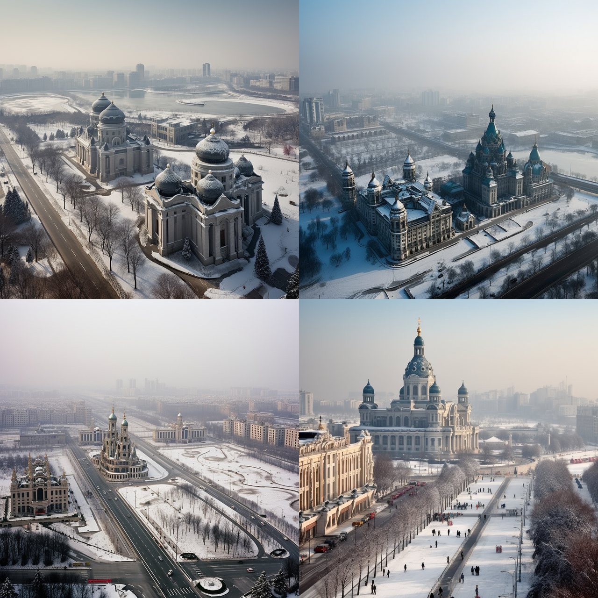

很明显，AI 知道。这个时候我们就可以放心创作了，比如让梵高来画哈尔滨。我在指令词后面输入：哈尔滨，梵高的油画 。

```bash
Harbin city, oil painting by Van Gogh --ar 16:10
```

我们看看效果：

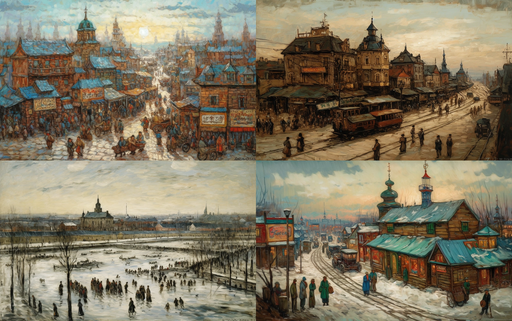

还挺好看的。

那如果AI识别不了你说的主体呢？比如说它不认识哈尔滨，怎么办？别忘了，我们讲过垫图。来试试。

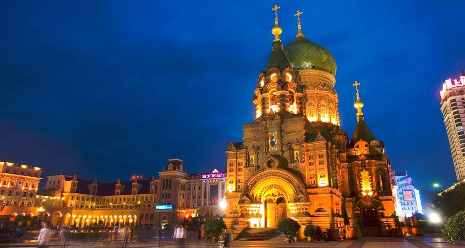

就拿这张图，我们垫上，再让梵高画一画：

```bash
https://s.mj.run/3X1pdajD2aI  Harbin city, oil painting by Van Gogh --ar 16:10
```

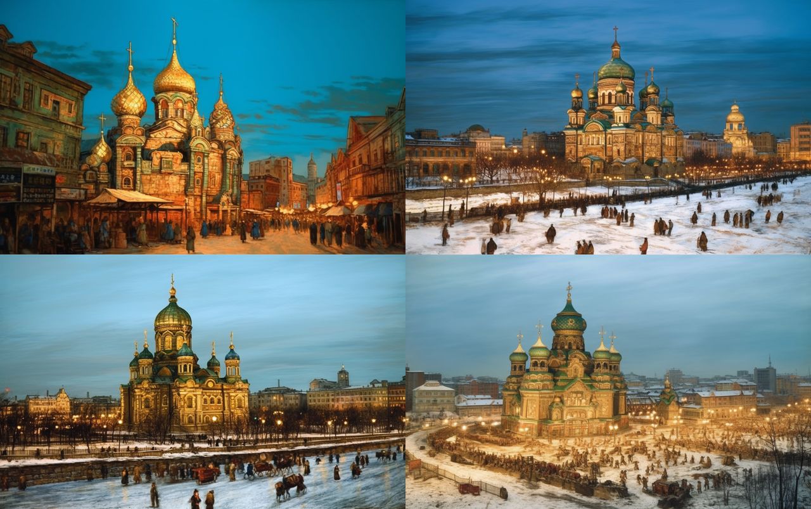

可以看到，这个效果已经在接近垫图了，相似度很高，但是这个有点太像照片了，我们再降低 iw 指数，把 iw 改成 0.5。看看效果。

```bash
https://s.mj.run/3X1pdajD2aI  Harbin city, oil painting by Van Gogh --ar 16:10 --iw 0.5
```

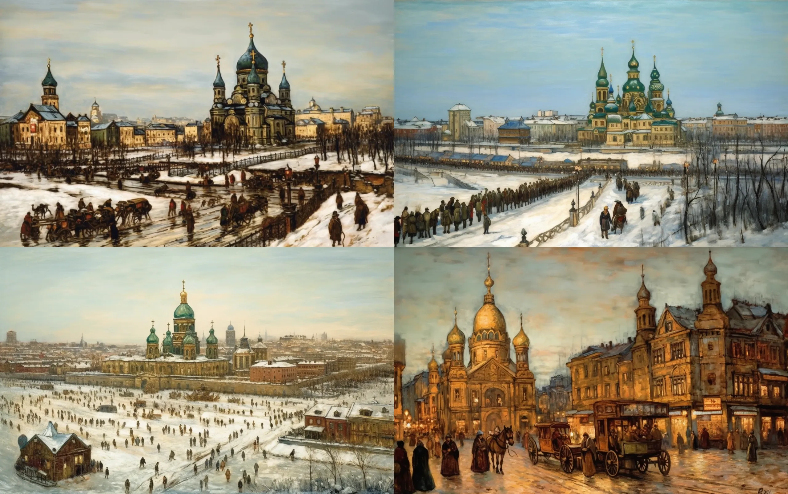

这个效果就好多了。

## 4. 善用搜索引擎

到这儿，三种主要的壁纸风格处理手法我们就学会了。但你可能也感受到了，前面用的艺术家，或者风格名字，都是咱们耳熟能详的，梵高啊，达利啊，莫奈啊。如果我想生成点前卫的、我不太了解的风格，该怎么办？

我学习和练习AI绘图的这段时间里，最大的洞察就是：**搜索引擎才是最重要的指令词库**。擅长使用搜索引擎，远比用一个固定的指令词库好得多。所以这里我敲黑板，就是**善用搜索引擎**。

举个例子。我们想要让风景更好看一些，可以搜一下现在有哪些知名的风景摄影师。比如，我找到了两位：德国的 Kilian Schönberger 和澳大利亚的 Peter Lik。

咱们还是先试试看，这二位AI是不是认识。方法刚才讲了，输入：`by XXX`，先来试试第一个。

```bash
by Kilian Schönberger
```

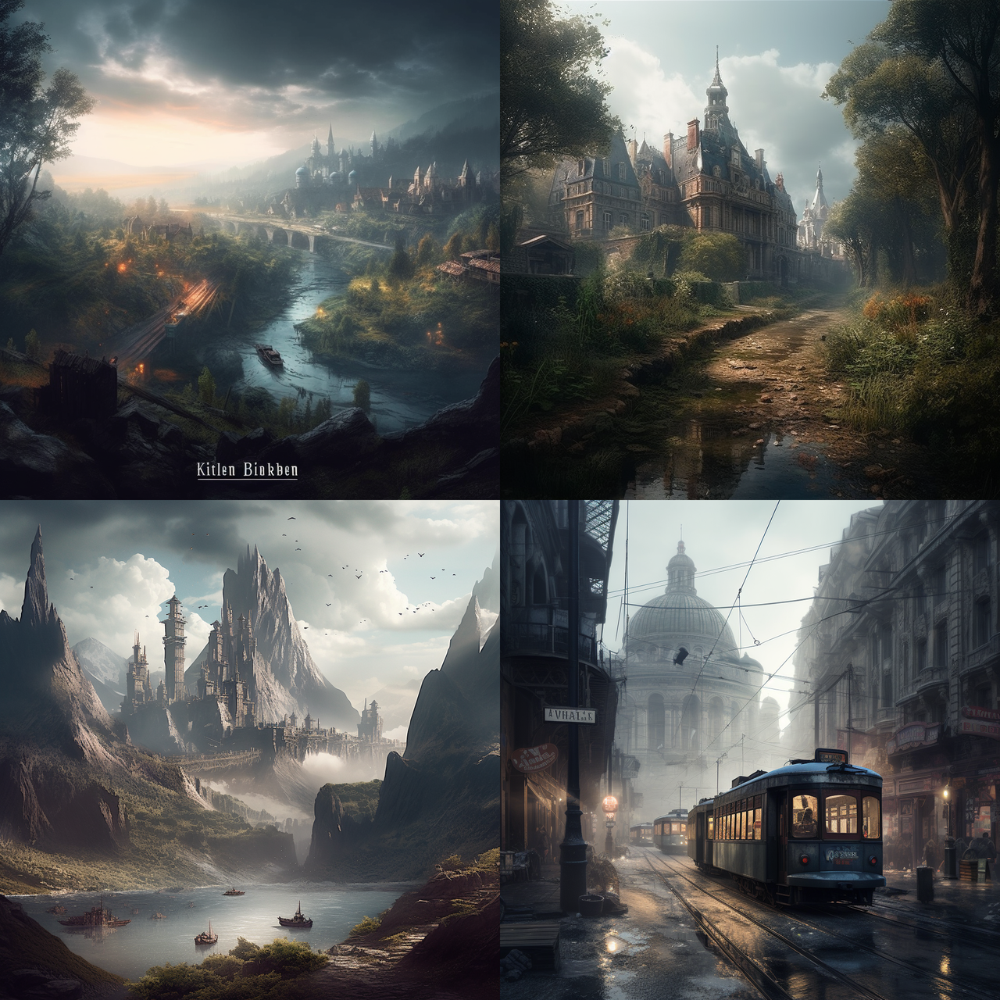

看，AI认识。我们也试试第二个。

```bash
by Peter Lik
```

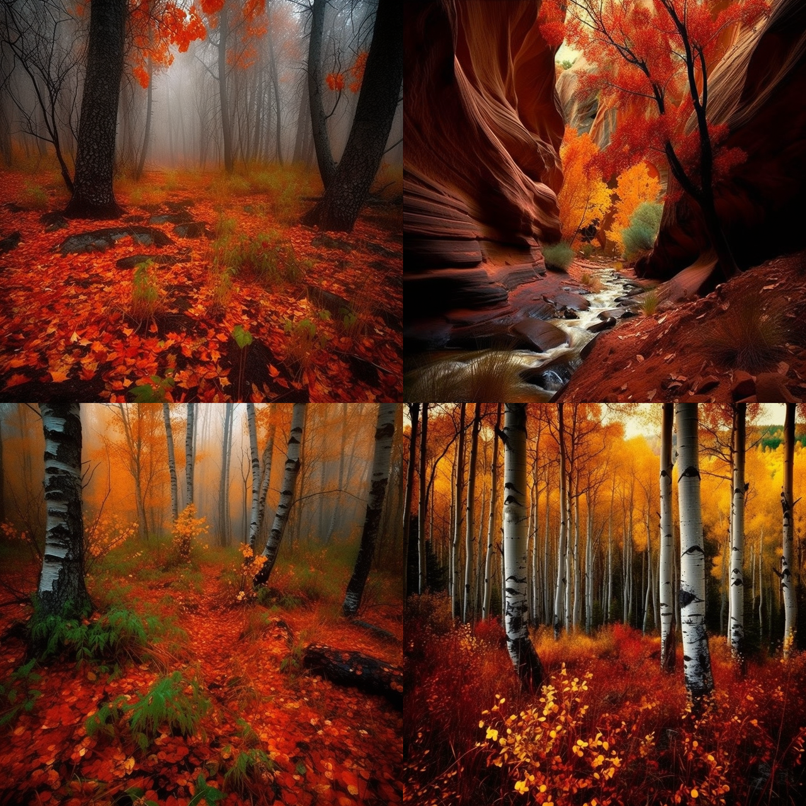

可以看出来，生成的图片和我 AI 都认识。

这个时候我们就可以给 AI 指令，让它按这两位前卫摄影师的风格输出了。我们来看看火山这张图，我在指令词后面加上这位摄影师。

```bash
wallpaper, A volcano that is erupting,by Kilian Schönberger --ar 16:10
```

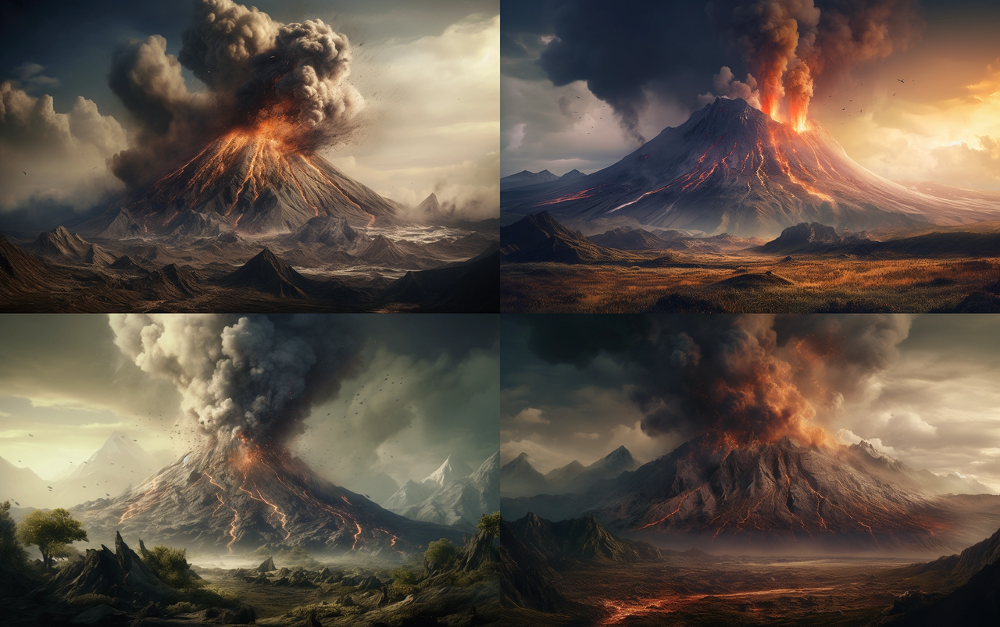

好，再来试试另一位艺术家的风格。

```bash
wallpaper, A volcano that is erupting,by Peter Lik --ar 16:10
```

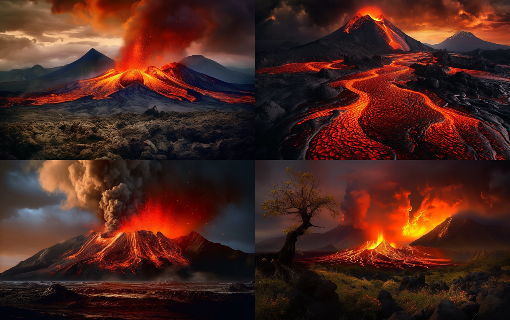

这个火山喷发的效果又非常叫人惊叹，真的很酷炫了。

好。再来看看微软的经典桌面图，能让这二位给我处理成什么样。先看看第一个摄影师的风格：

```bash
wallpaper , Large grassland , undulating hillside, clear blue sky, white clouds , by Kilian Schönberger --ar 16:10
```

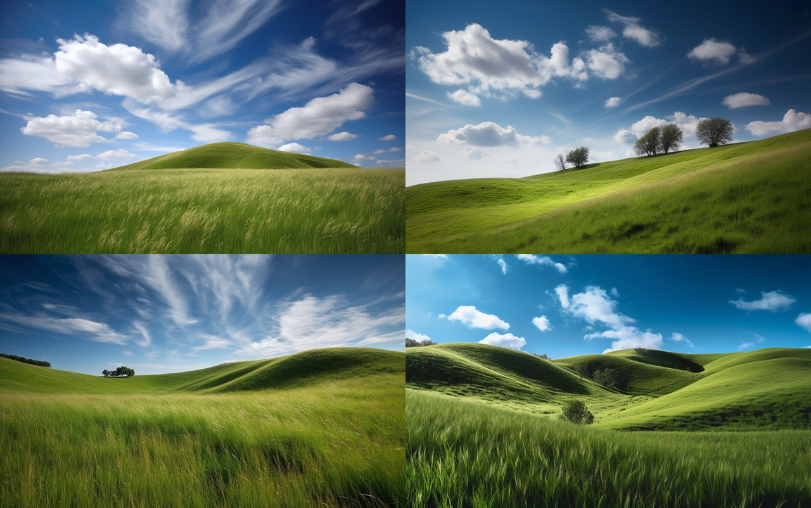

再来看看第二位摄影师的风格。

```bash
Large grassland , undulating hillside, clear blue sky, white clouds , by Peter Lik --ar 16:10
```

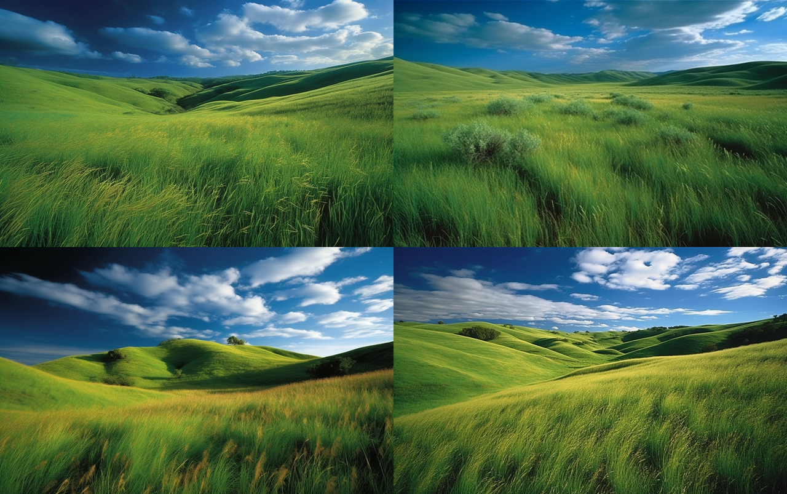

你看，是不是感觉又不太一样了？明暗处理更到位了，比微软原来的图更有特色了。

不同的艺术家，有不同的拍摄风格和特色，多尝试，你就会有很多新发现。比如说刚才我们用过的“抽象的蓝”的例子，加上不同前卫艺术家的风格会怎样？还是利用搜索引擎，你去搜，国际知名的现代艺术家都有谁。随便搜。我搜到两个人，一个叫 Wassily Kandinsky，另一个叫 Barnett Newman。虽然这两个人我都不熟悉，但是不妨碍我试一试啊。来先有请康定斯基，这位老师。

```bash
Blue, chaos, by Wassily Kandinsky --ar 9:16
```

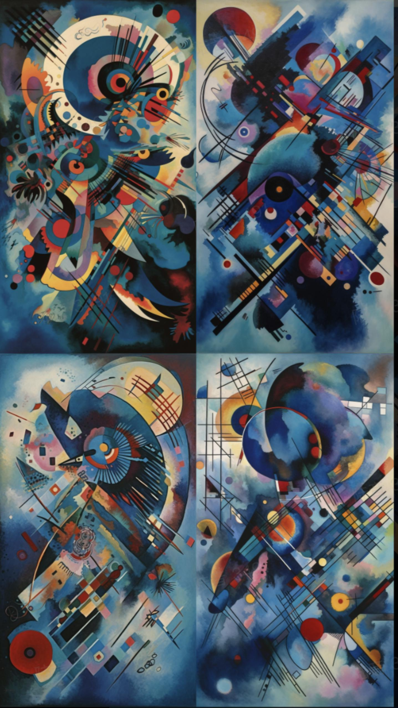

果然很“现代”。再试试下一位纽曼老师。我输入指令词：

```bash
Blue, chaos, Barnett Newman --ar 9:16
```

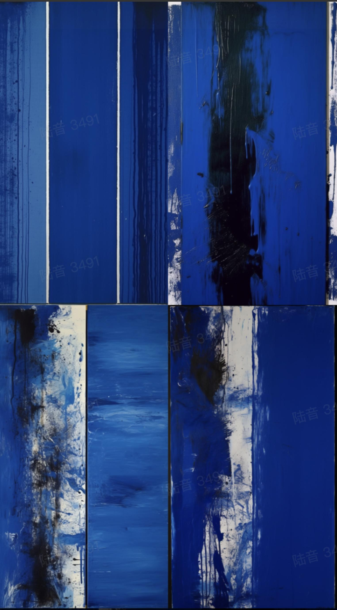

你看，效果一下子就不一样了。

用好搜索引擎，就能产生无数的排列组合了。那除了搜索引擎，我会再给你提供三个网站，贴在文稿里。你能找到非常多的艺术家风格，看到喜欢的可以直接拿去尝试，很可能会有意想不到的化学反应。

> [https://lib.kalos.art/](https://lib.kalos.art/)
>
> [https://docs.google.com/spreadsheets/d/1cm6239gw1XvvDMRtazV6txa9pnejpKkM5z24wRhhFz0/htmlview](https://docs.google.com/spreadsheets/d/1cm6239gw1XvvDMRtazV6txa9pnejpKkM5z24wRhhFz0/htmlview)
>
> [https://www.midlibrary.io/categories](https://www.midlibrary.io/categories)

好，到这里，我们就讲完了这一节课的主要内容。总结一下：

最后，我特别提示一下。目前AI绘图的版权问题还处在灰色地带，所以不建议把在世的知名设计师、摄影师、艺术家的风格的绘画作为商用。做你自己的壁纸，是没问题的。

从下一讲开始，我们就进入课程的第二大模块：兼职美工。在这一模块里，我们会学习几种更专业的绘图处理。先从设计品牌logo开始，相信你会收获更多干货，我们下一讲再见。

## 5. 常用指令清单

### 5.1 风景元素主体

Volcano 火山

Forest 森林

Grassland 草原

Mountain 山脉

Lake 湖泊

Desert 沙漠

Waterfall 瀑布

（也可以尝试更多样的主体）

### 5.2 抽象元素主体

Lines 线条

Geometric Shapes 几何形状

Gradient color 渐变色

Waves 波纹

Fragments 碎片

Mosaic 马赛克

Light and shadow effects 光影效果

### 5.3 壁纸风格

Wallpaper 壁纸

Minimalist art 极简艺术

Simple 简单

Ink 水墨

Abstract painting 抽象画

Photograph 摄影作品

Oil painting 油画

### 5.4 画家风格

Van Gogh 梵高

Salvador Dali 达利

Monet 莫奈

Qi Baishi 齐白石

Leonardo da Vinci 达芬奇

Edvard Munch 爱德华·蒙克

Paul Gauguin 高更

Picasso 毕加索

（也可以尝试更多画家）

### 5.5 摄影师风格

Robert Capa 匈牙利战地摄影师

Henri Cartier-Bresson 亨利·卡蒂埃-布列松 街头摄影大师

Burt Glinn 美国新闻摄影师

Zena Holloway 知名水下风格摄影师

（也可以尝试更多摄影师）


欢迎关注我公众号：AI悦创，有更多更好玩的等你发现！

::: details 公众号：AI悦创【二维码】


:::

::: info AI悦创·编程一对一

AI悦创·推出辅导班啦，包括「Python 语言辅导班、C++ 辅导班、java 辅导班、算法/数据结构辅导班、少儿编程、pygame 游戏开发」，全部都是一对一教学：一对一辅导 + 一对一答疑 + 布置作业 + 项目实践等。当然，还有线下线上摄影课程、Photoshop、Premiere 一对一教学、QQ、微信在线，随时响应！微信：Jiabcdefh

C++ 信息奥赛题解，长期更新！长期招收一对一中小学信息奥赛集训，莆田、厦门地区有机会线下上门，其他地区线上。微信：Jiabcdefh

方法一：[QQ](http://wpa.qq.com/msgrd?v=3&uin=1432803776&site=qq&menu=yes)

方法二：微信：Jiabcdefh

:::


