::: warning

尽情的 copy 吧，一直都会免费下去。

平台：Midjourney

在 Midjourney 上使用该提示词，可以得到和例图相似的图片，出图质量稳定。可以调整图片的尺寸比例和主体信息，得到更多惊艳效果！

**如果你愿意花时间，把本文提示词翻译成中文，欢迎👏加我微信：Jiabcdefh。一起完成这个页面，也可以合作搭建专门的提示词广场。**

每个图片的标题，如果你有好的名称，记得跟我说。

:::

## ChangeLog

- 2023-06-09 20:26:20：初始化文章
- 2023-06-09 21:12:31：更新文章布局

---

## Step 1

### 1. 猫🐱

::: code-tabs

@tab 指令

```
blue sky,White clouds, White clouds in the shape of a Chubby cartoon cat,The rabbit and the cloud merge together,it looks very dreamy and beautiful. close-up close shot ,Photography, 16K --ar 9:16
```

@tab zh

```
蓝天，白云，形状像胖乎乎的卡通猫的白云，兔子和云彩融为一体，看起来非常梦幻美丽。特写镜头，摄影，16K --宽高比 9:16
```

:::


### 2. 狮子🦁️

::: code-tabs

@tab 指令

```
paper quilling style! vector painting,China-Chic tiger head, in the middle,looking at the audience, symmetrical, flat illustrationvery detailed,reasonable design,advanced colormatching,gradient color,Chinese color. oriental elements, clear lines, scattered, details --niji 5
```

@tab zh

```
纸卷艺术风格！矢量绘画，中国风虎头，位于中间，注视着观众，对称，平面插图，非常详细，合理设计，高级色彩配合，渐变色，中国色。东方元素，清晰线条，分散，细节--niji 5。
```

:::

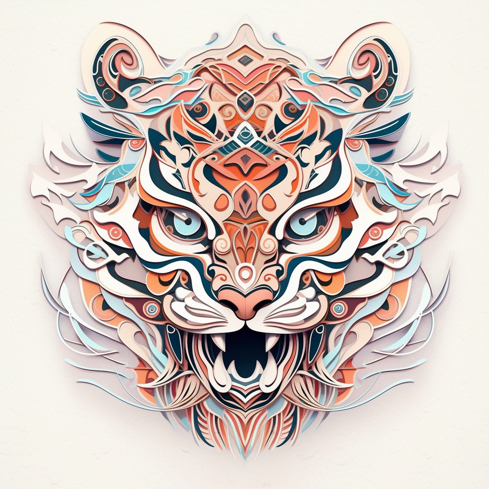

### 3. 狸猫

::: code-tabs

@tab 指令

```
Cute, plush, fox, IP design, style reference, Bubble Mart, macaron colors, chibi character design, plush toy design, happy, sleepy, laughing, pitiful expressions, cartoon, 2D, thick outlines, side view, right view, left view, back view, colorful, white background --q 2 --v 5
```

@tab zh

```
可爱，毛绒，狐狸，知识产权设计，样式参考，泡泡玛特，马卡龙色彩，Q版角色设计，毛绒玩具设计，快乐，睡眠，笑，可怜的表情，卡通，二维，粗线条，侧视图，右视图，左视图，背视图，色彩丰富，白色背景。
```

:::

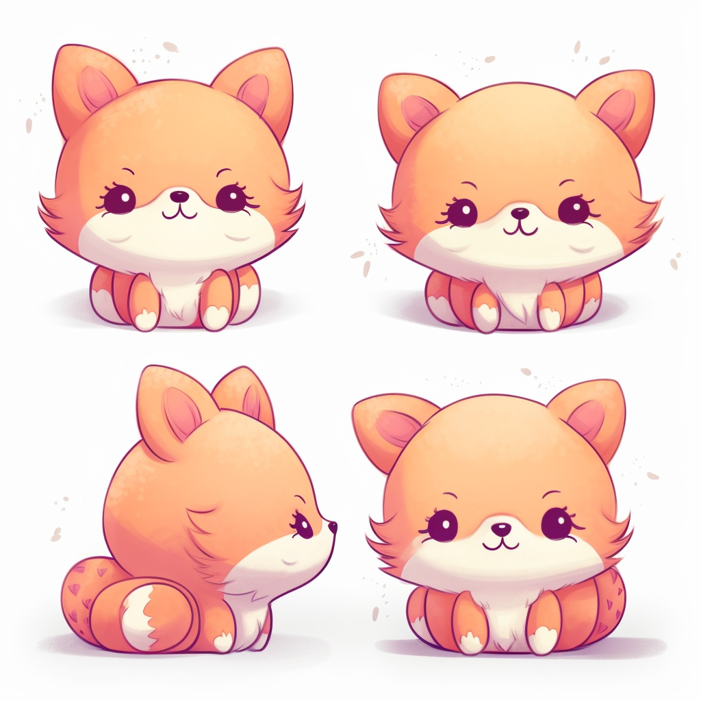

### 4. 古装女/金代汉服👩

::: code-tabs

@tab 指令

```
used face, looking at the camera, wearing yellow apricot blossom branches and a light yellow Jin dynasty Hanfu. The video is in high definition, with high picture quality, --ar 3:4 --v 5
```

@tab zh

```
使用面部，看着摄像头，戴着黄色的杏花枝和淡黄色的金朝汉服。视频是高清的，画质高，--ar 3:4 --v 5 翻译成中文是：使用面部，注视摄像头，佩戴黄色杏花枝条以及淡黄色的金代汉服。视频采用高清画质，--ar 3:4 --v 5
```

:::

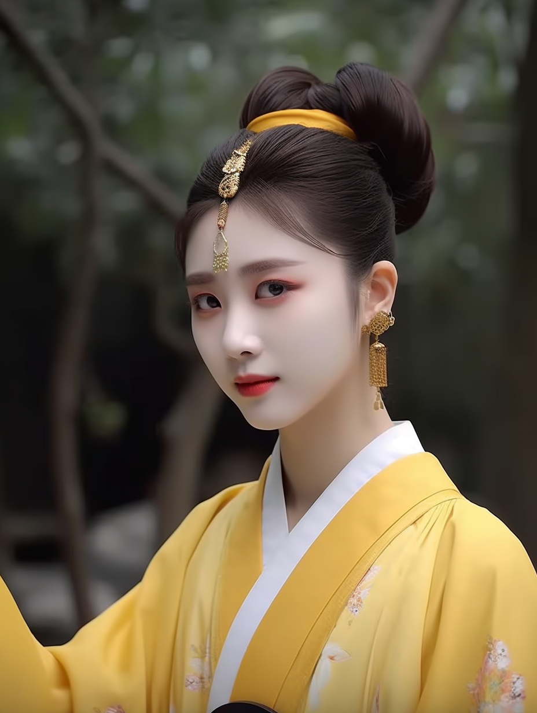


### 5. 龙🐲

::: code-tabs

@tab 指令

```
cute chinese dragon,metallic texture,gold white silver,diamond luster. fluorescent,iridescent,crystal,Glitter,extremeiridescent reflection, C4D ,octanerendering,Blender, 8KHD --ar 2:3 --niji 5 --s 180 --style expressive
```

@tab zh

```
可爱的中国龙，金属质地，金白银，钻石光泽。荧光，彩虹色，水晶，闪光，极端彩虹反射，C4D，Octane渲染，Blender，8K高清 --宽高比 2:3 --彩虹 5 --尺寸 180 --风格 表现力强
```

:::

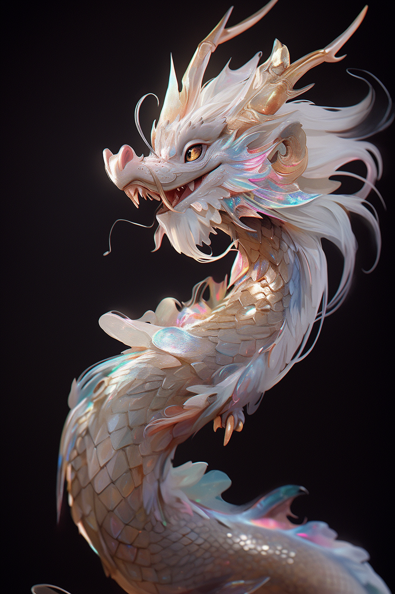

### 6. 手办

::: code-tabs

@tab 指令

```
super cute girl, fluorescent translucent holographic jacket, blind box, pop mart design, full body,diamond luster, metallic texture, exaggerated expressions and movements, bright light, clay material, precision mech parts, close-up intensity, 3d, ultra-detailed, C4D, octane rendering, Blender, 8K, HD --niji 5 --style expressive --niji 5
```

@tab zh

```
超级可爱的女孩，荧光透明全息夹克，盲盒，泡泡玛特设计，全身，钻石光泽，金属质感，夸张的表情和动作，明亮的光线，粘土材料，精密机械部件，特写强度，3D，超细节，C4D，Octane渲染，Blender，8K，高清 --Niji 5 --风格表现力 --Niji 5
```

:::

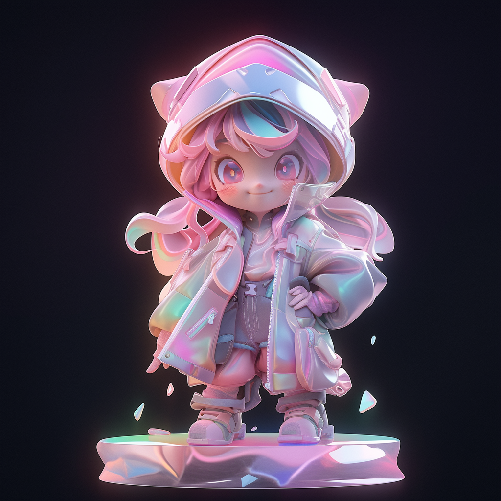


### 7. boy

::: code-tabs

@tab 指令

```
Create a children's poster featuring Pixar - style characters in blue - purple tones, a dark cyberpunk setting, vibrant blue neon, futuristic architecture and advanced technology while maintaining a mysterious and avant - garde vibe. Long shot, super details, --ar 2:3
```

@tab zh

```
创建一个儿童海报，特色是皮克斯风格的角色，以蓝紫色调为主。背景是黑暗的赛博朋克设定，充满活力的蓝色霓虹灯，未来主义的建筑，以及先进的科技，同时保持神秘和前卫的氛围。远景，超级详细，画面比例2:3。
```

:::

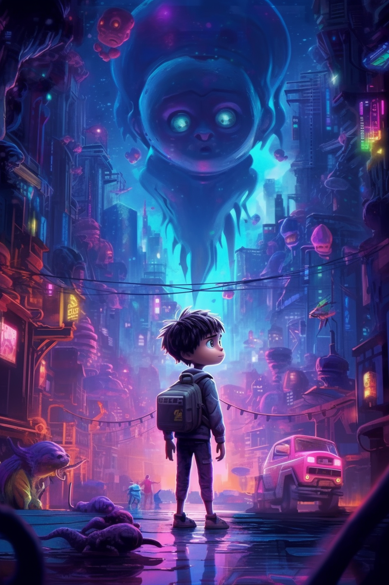

### 8. 漫画/女孩/表情包

::: code-tabs

@tab 指令

```
the various expressions of little girl ,emoji pack,multiple poses and expressions, [happy, sad, angry, expectant,laughing,disappointed ,Surprised, pitiful, aggrieved, despised, embarrassed, unhappy] chalk thick line cartoon style,white background --niji 5 --s 180 --style cute
```

@tab zh

```
小女孩的各种表情，表情符号包，多种姿态和表情，[开心，伤心，生气，期待，笑，失望，惊讶，可怜，委屈，蔑视，尴尬，不高兴] 粉笔粗线条卡通风格，白色背景 --niji 5 --s 180 --风格可爱
```

:::

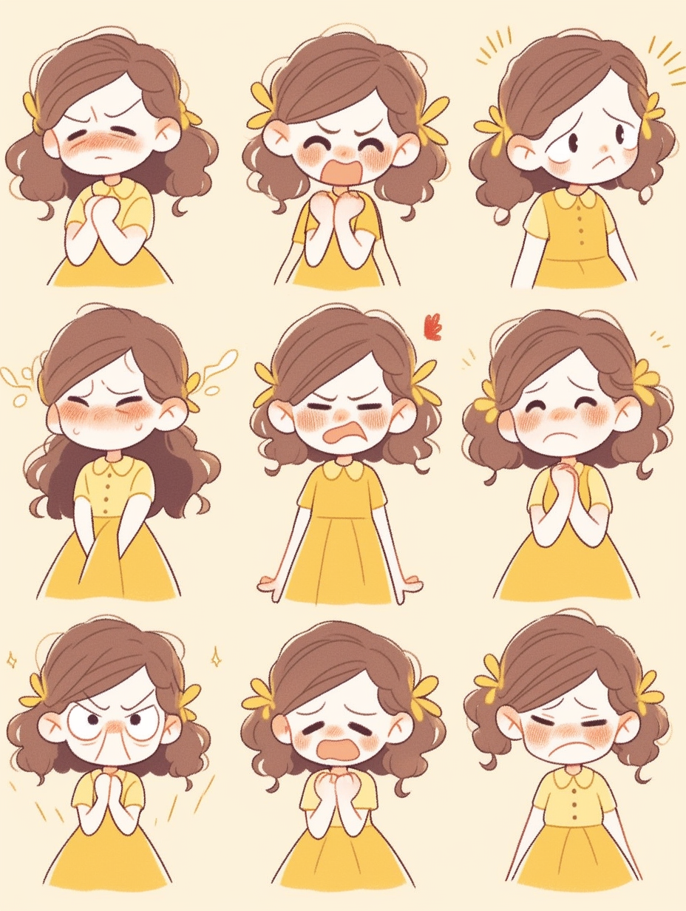

### 9. 中国插画/浮雕

::: code-tabs

@tab 指令

```
chinese illustration on white background, above super wide angle, dreamy, 8K, romantic, trending on Artstation, 3d relief, --s 500 --ar 3:4 --q 0.5 --v 5
```

@tab zh

```
在白色背景上的中国插画，超宽角度，梦幻，8K分辨率，浪漫，Artstation上的热门，3D浮雕，--s 500 --ar 3:4 --q 0.5 --v 5
```

:::

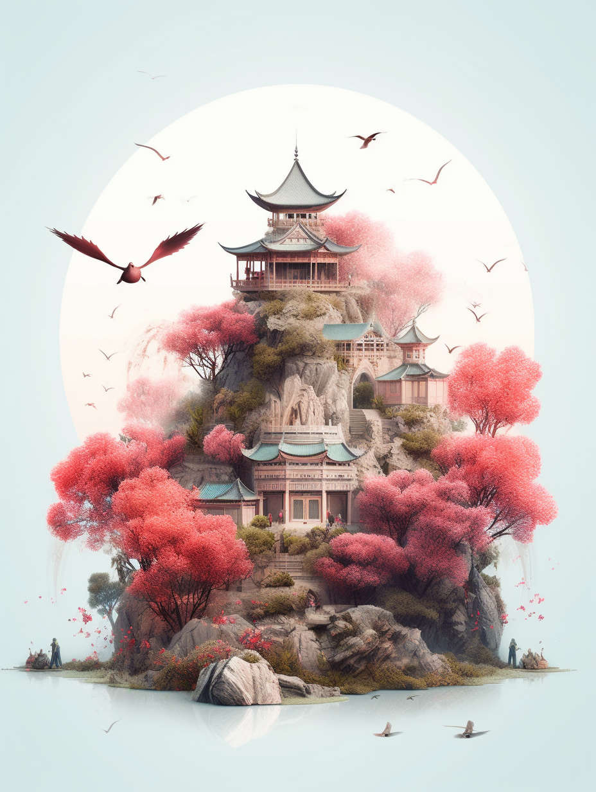

### 10. 美丽中国女孩

::: code-tabs

@tab 指令

```
Wallpaper with a beautiful chinese girl wearing a dress and jewelry, in the style of shilin huang, photo - realistic techniques, i can't believe how beautiful this is, dark amber and white, exquisite clothing detail, realistic hyper - detail, luminescence --ar 9:16 --q 2 --s 750 --v 5
```

@tab zh

```
带有一位穿着华丽服饰和饰品的美丽中国女孩的壁纸，风格仿佛石林煌，采用照片级真实技术，我无法相信这有多美，深琥珀色和白色，细致入微的服饰细节，超级真实的超详细度，荧光效果 -- 宽高比 9:16 --质量 2 --大小 750 --可见度 5
```

:::

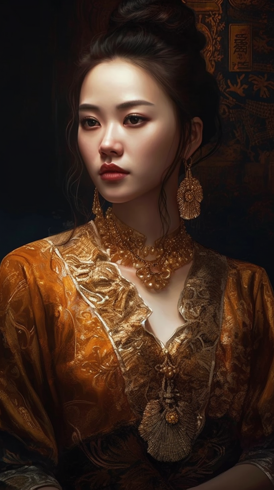

### 11. 香水

::: code-tabs

@tab 指令

```
Product shots, a bottle of designer perfume sitting on a piece of wood, clean desert, beautiful weather, bright photos, epic lighting, official product shots,fujifilm Xf f/1.8, 70MM, iso200 absolutely outstanding images. --ar 3:4 --s 750 --q 2 --v 5
```

@tab zh

```
产品照片，一瓶设计师香水坐落在一块木头上，清洁的沙漠，美丽的天气，明亮的照片，史诗般的光线，官方产品照片，富士Xf f/1.8，70MM，iso200 绝对出色的图像。--ar 3:4 --s 750 --q 2 --v 5
```

:::


### 12. 日本女学生

::: code-tabs

@tab 指令

```
japanese female student wearing white dress shirt and blue polo, in the style of graphic novel-inspired, nostalgic charm, poolcore, studyplace, charles schulz, light bronze and dark blue, 32k uhd --ar 3:4 --v 5
```

@tab zh

```
穿着白色连衣裙和蓝色Polo衫的日本女学生，采用了由图形小说启发的怀旧魅力，泳池风格，学习空间，Charles Schulz（查尔斯·舒尔茨）的风格，淡铜色和深蓝色，32k超高清--屏幕比例3:4 --视觉质量5
```

:::

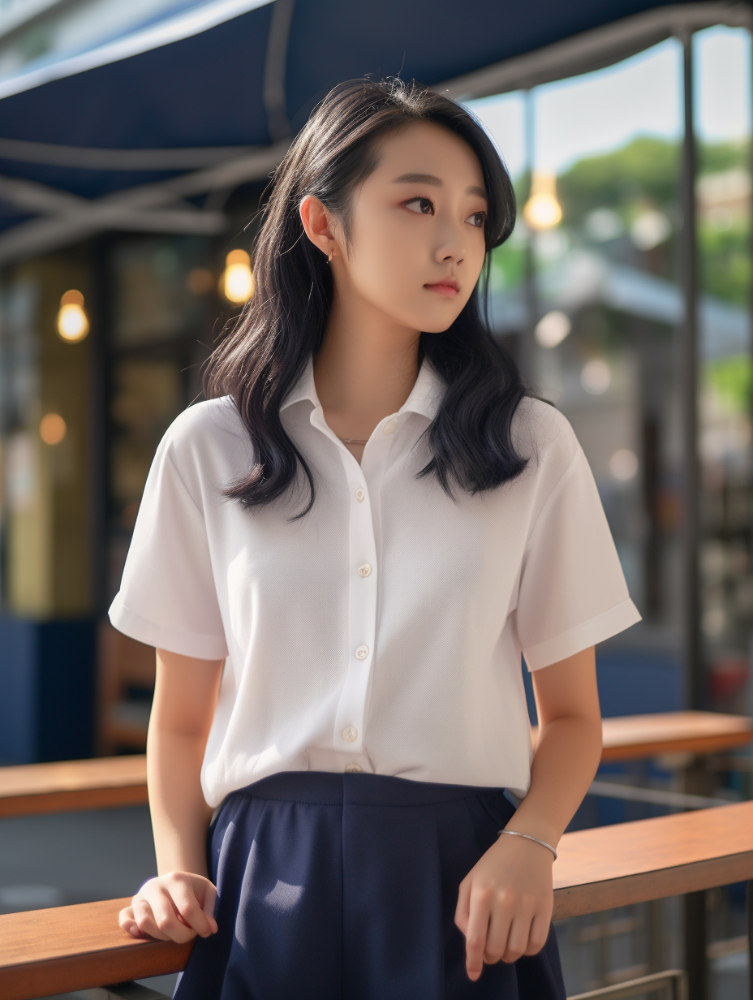

### 13. 小猫咪

::: code-tabs

@tab 指令

```
A cute, cute little pink cat with a big pink fluffy tail, holding a white and red flower lying on a cloud in the sky, big eyes, peach blossom, stream, coquel, fairy, fluffy, shiny fur, petals, fairy tale, Unreal Engine 5 and Xin Xin value rendering, 8k, HD HD,  --ar 3:2 --v 5 --s 250
```

@tab zh

```
一个可爱的，小巧的粉红色猫咪，拥有一条巨大的粉红色蓬松尾巴，手中握着一朵白色和红色的花，躺在天空中的云朵上，大眼睛，桃花，溪流，鸡冠花，仙女，蓬松，光亮的毛皮，花瓣，童话，虚幻引擎5和欣欣值渲染，8k，高清高清，--ar 3:2 --v 5 --s 250
```

:::

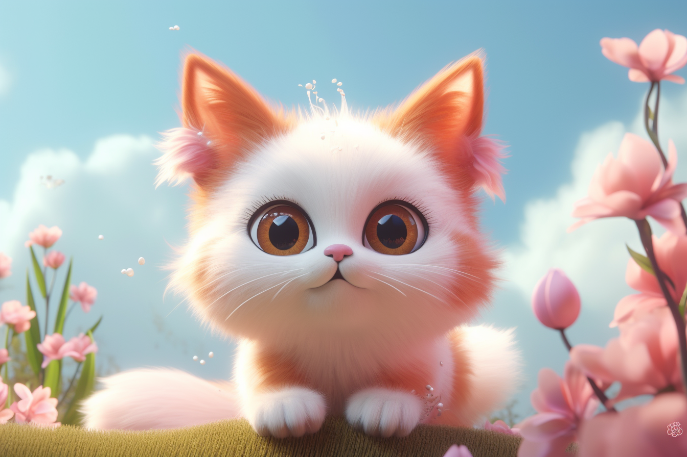

### 14. 绿色糖浆的蛋糕

::: code-tabs

@tab 指令

```
a slice of cake covered in flowers and green sugar syrup, in the style of hyperrealistic illustrations, mist, the stars art group (xing xing), high detailed, green, pastoral charm, flowing lines --ar 2:3 --s 250 --v 5
```

@tab zh

```
在超现实主义插图风格下，一片覆盖着鲜花和绿色糖浆的蛋糕，薄雾环绕，由星星艺术团队（星星）制作，高度细致，带有乡村的魅力，线条流畅 --宽高比 2:3 --尺寸 250 --版本 5
```

:::


### 15. 可爱盔甲土耳其梵猫

::: code-tabs

@tab 指令

```
Cute armored Turkish Van cat, in the style of Baten Kaitos, beautiful 3ds max render, volumetric lighting, global illumination, raytracing, detailed hyperrealism, manga --ar 2:3 --q 2 --s 250 --v 5
```

@tab zh

```
在《Baten Kaitos》风格下的可爱盔甲土耳其梵猫，美丽的3ds max渲染，体积光照，全局照明，光线追踪，详细的超现实主义，漫画 --ar 2:3 --q 2 --s 250 --v 5
```

:::

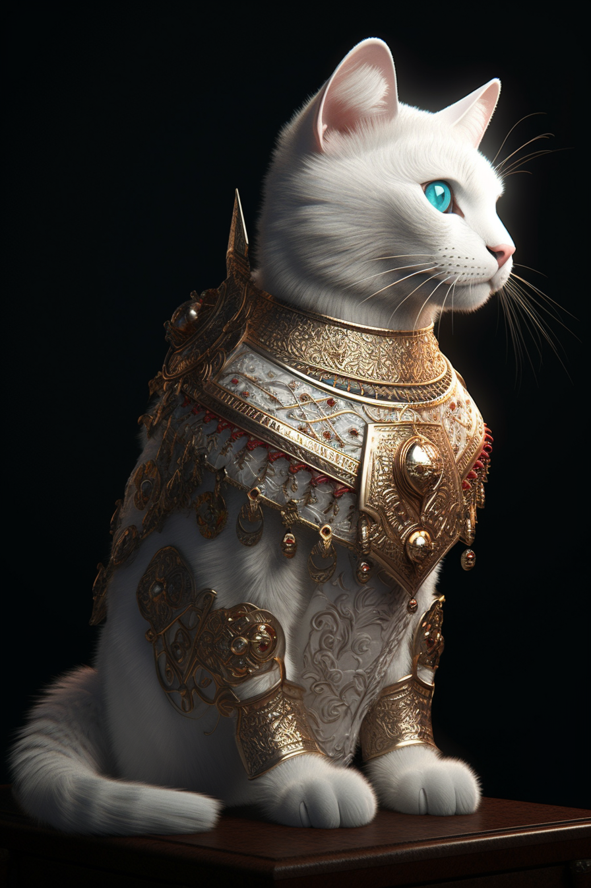

### 16. 母亲节

::: code-tabs

@tab 指令

```
Mother's Day, mother holding daughter,happy,surrounded by lots of Flowers and green leaves, Center the composition, The background is blue sky and white clouds,Acrylic painting, flat illustrations,fairy tale style,stock illustration style,edge lighting, depth of field，transparent colors, soft colors, high - definition image,studio lighting, ultra - high image quality, 8k --ar 3:4 --niji 5
```

@tab zh

```
母亲节，母亲抱着女儿，快乐，被大量的花朵和绿叶包围，构图以此为中心，背景是蓝天和白云，丙烯画，扁平插图，童话风格，库存插图风格，边缘照明，景深，透明色彩，柔和的色彩，高清图片，工作室照明，超高图片质量，8k --宽高比 3:4 --耐吉 5
```

:::


### 17. 超可爱的女孩

::: code-tabs

@tab 指令

```
super cute girl, fluorescent translucent holographic jacket, blind box, pop mart design, full body,diamond luster, metallic texture, exaggerated expressions and movements, bright light, clay material, precision mech parts, close-up intensity, 3d, ultra-detailed, C4D, octane rendering, Blender, 8K, HD --niji 5 --style expressive --niji 5
```

@tab zh

```
超可爱的女孩，荧光半透明全息夹克，盲盒，pop mart设计，全身，钻石光泽，金属质感，夸张的表情和动作，明亮的光线，粘土材料，精密机械部件，特写强度，3D，超详细，C4D，辛辣渲染，Blender，8K，HD --niji 5 --风格表现 --niji 5
```

:::

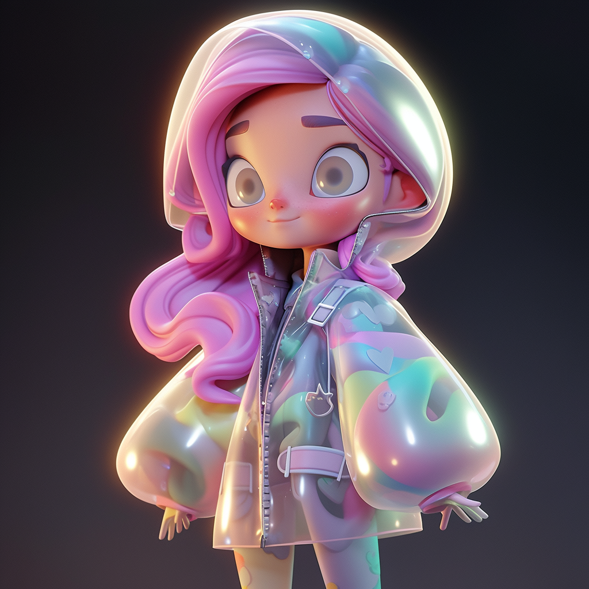

### 18. 中国龙

::: code-tabs

@tab 指令

```
Huge fearful Chinese dragon,on a snowy mountain,noble landscape, artistic landscape,Front view, center.boy in clouds wearing white robe, Stand in front of the dragonheaven.hell, secret, beautiful，magnificent,brilliant, strong size contrast epic. super detail, concept game design,illustration POV view,extreme low angle view.superbatmospheric feel, aperture 50mm lens.film,Wu Guanzhong, Zhang Kechun. --ar 3:4 --niji 5
```

@tab zh

```
巨大且令人畏惧的中国龙，位于雪覆的山脉上，壮丽的风景，艺术的景观，正面视角，居中位置。穿着白色长袍的少年在云层中，站在龙的前方。天堂，地狱，秘密，美丽，宏伟，灿烂，明显的大小对比，史诗般的场景。超级细节，游戏概念设计，插图视角，极低角度视图。极具氛围感，使用50mm镜头拍摄。电影，吴冠中，张可春。 --画面比例3:4 --颜色级数5
```

:::

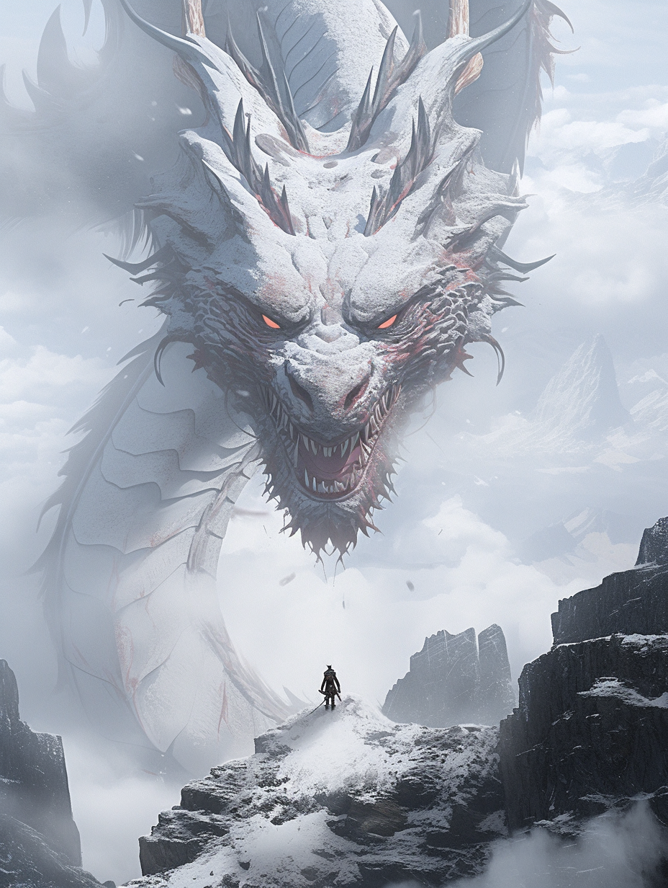


### 19. 微小可爱的西瓜实验室

::: code-tabs

@tab 指令

```
Tiny cute watermelon laboratory, Summer, A group of children to eat watermelon, 3d blender render, soft smooth lighting, 100mm lens, 4k UHD,isometric, tilt-shift, Super Detail, 3D, Depth of Field, Pixar Trend, super realistic, light tracking, complex details, Art background, Super detail, solid color background, fine texture, OC renderer, Ultra HD, fine texture, front body, 3D rendering, 8K --ar 3:4 --s 250
```

@tab zh

```
微小可爱的西瓜实验室，夏天，一群儿童吃西瓜，3d Blender渲染，柔和平滑的光线，100mm镜头，4K UHD，等角，移轴，超细节，3D，景深，皮克斯趋势，超真实，光线追踪，复杂的细节，艺术背景，超细节，纯色背景，精细纹理，OC渲染器，超高清，精细纹理，前体，3D渲染，8K，宽高比3:4，采样率250
```

:::

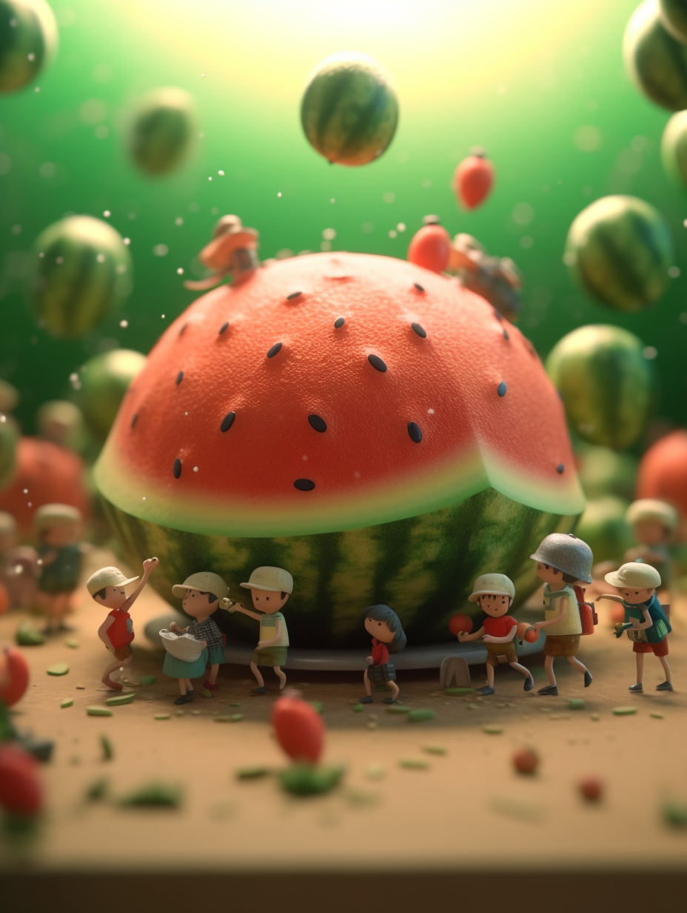


### 20. 新年巧克力的包装设计

::: code-tabs

@tab 指令

```
The packaging design of New Year chocolate , China red bakground with gold as the main color and blue ocean as the auxiliary, features a historical reproduction style, dreamlike illustrations, actioncomics, precise surrealism, product shooting, mid panoramic view, deep carving, rich details, andcomplex and ever-changing backgrounds --ar 4:3 --v 5
```

@tab zh

```
新年巧克力的包装设计，主色为中国红和金色，辅色为蓝色海洋，特点是历史复原风格、梦幻插画、动态漫画、精确的超现实主义、产品拍摄、中景视角、深度雕刻、丰富的细节，以及复杂而多变的背景 -- 宽高比4:3 -- 视频清晰度 5。
```

:::

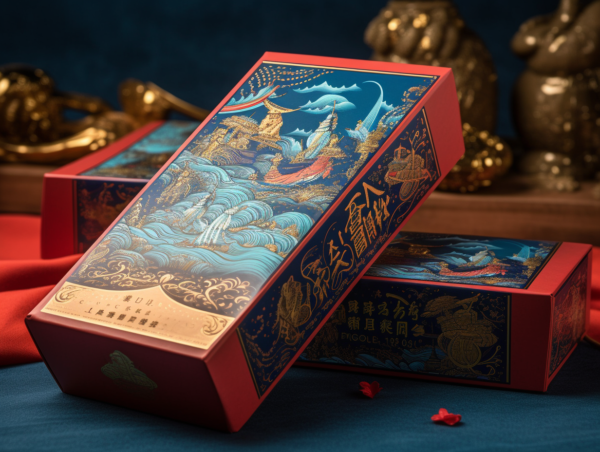


### 21. 知名化妆品兰蔻的产品海报

::: code-tabs

@tab 指令

```
Well - known cosmetics Lancôme product poster, minimalism, indoor, 8k, c4d --ar 2:3 --q 2 --s 750 --v 5
```

@tab zh

```
知名化妆品兰蔻的产品海报，极简主义，室内，8K，C4D --ar 2:3 --q 2 --s 750 --v 5
```

:::

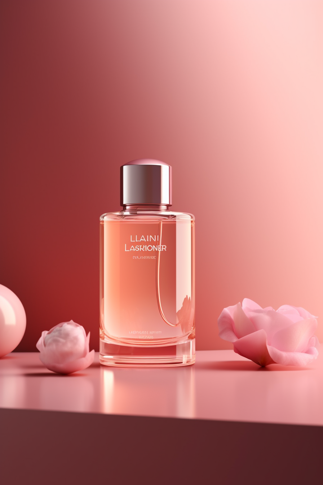


### 22. 一位美人鱼

::: code-tabs

@tab 指令

```
An underwater scene with a mermaid, surrounded by colorful sea creatures and plants. The water has a dreamy,delicate face,oil painting,by Kawacy,Masterpiece,Sparkling bubbles, pastel colors,union, surreal, painting, rich details,gorgeous light and shadow,8k,best quality,Correct perspective, correct hand structure, perfect human body structure --niji 5 --style expressive --q 2 --v 5
```

@tab zh

```
一个水下场景，一位美人鱼被五彩斑斓的海洋生物和植物环绕。水面带有梦幻般的细腻面孔，这是Kawacy的油画，一部杰作。璀璨的泡沫，粉彩色调，联合，超现实，绘画，丰富的细节，华丽的光影，8K，最佳质量，正确的透视，正确的手部结构，完美的人体结构 --niji 5 --风格表现 --q 2 --v 5
```

:::

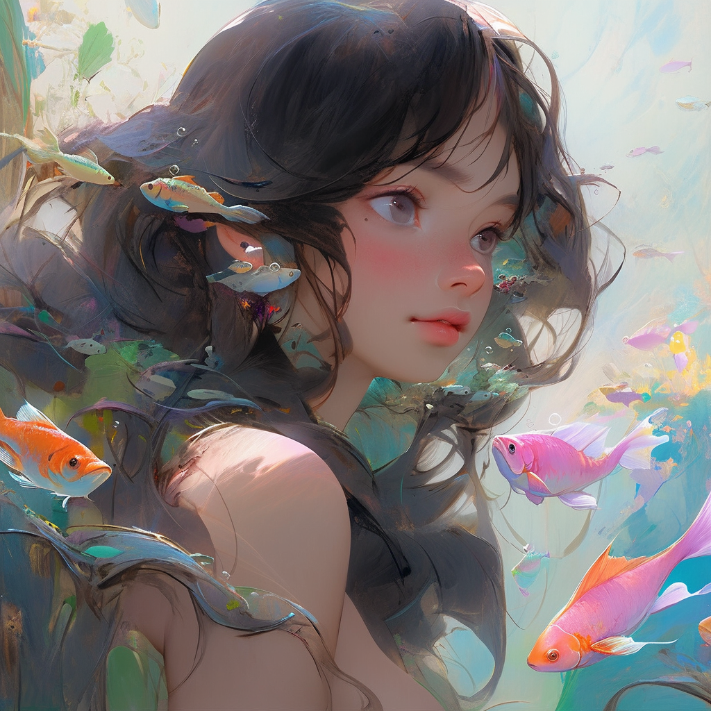


### 23. 摄影棚照明

::: code-tabs

@tab 指令

```
icon design, blue and white, frosted glass, transparent technology sense, isometric, centered composition，white background, studio lighting, 3D, C4D, blender, OC render --q 2 --s 750 --v 5
```

@tab zh

```
图标设计，蓝白色调，磨砂玻璃，透明科技感，等距离，中心构图，白色背景，摄影棚照明，3D，C4D，Blender，OC渲染 --q 2 --s 750 --v 5
```

:::


### 24. 狐狸/男孩

::: code-tabs

@tab 指令

```
Huge fearful White fox, fluffy,on a snowy mountain,noble landscape, artistic landscape,Front view,center,boy in clouds wearing white robe, Stand in front of the fox,strong size contrast.concept game design,illustration POV view,extreme low angle view,heaven,hell, secret, beautiful,magnificent,brilliant, epic. super detail.superbatmospheric feel, aperture 50mm lens.film,Wu Guanzhong, Zhang Kechun. --ar 3:4 --niji 5
```

@tab zh

```
巨大而恐怖的白色狐狸，毛茸茸的，站在雪山之上，高贵的景观，艺术的风景，正面视角，中心位置，云中的男孩穿着白色长袍，站在狐狸前方，强烈的大小对比。概念游戏设计，插图的视点视角，极低的角度视图，天堂，地狱，秘密，美丽，壮丽，辉煌，史诗般的。超级详细，超级大气感，50mm镜头光圈。电影，吴冠中，张克纯。 --宽高比 3:4 --级别 5
```

:::


### 25. 汉堡🍔

::: code-tabs

@tab 指令

```
Commercial photography, Splatted Cheese, hamburger, white lighting, 8k octane rendering, high resolution photography, insanely detailed, fine details, on Solid wood table, Red background, 8k, commercial photography, stock photo, professional color grading, --ar 9:16 --s 250 --v 5
```

@tab zh

```
商业摄影，溅出的奶酪，汉堡，白光，8k八核渲染，高分辨率摄影，极度详细，细节清晰，在实木桌上，红色背景，8k，商业摄影，库存照片，专业色彩分级，--ar 9:16 --s 250 --v 5
```

:::


### 26. 孔雀

::: code-tabs

@tab 指令

```
Exquisite Chinese art sculpture, cranes, clouds, flowers, full of golden layers, jade, gold, Cyan, traditional Chinese art, artstation, intricate details, high quality, cinematic, 3D rendering, OCtane, Unreal Engine, 8K, --ar 1:2 --s 750 --v 5
```

@tab zh

```
精美的中国艺术雕塑，包含了鹤、云、花等元素，金色层次丰富，玉石、金石、青色等传统中国艺术元素十分突出。在Artstation上展示，细节精致，高质量，具有电影感的3D渲染，采用Octane和Unreal Engine技术制作，8K分辨率，比例为1:2，渲染设置为750的样本数量和5的速度值。
```

:::

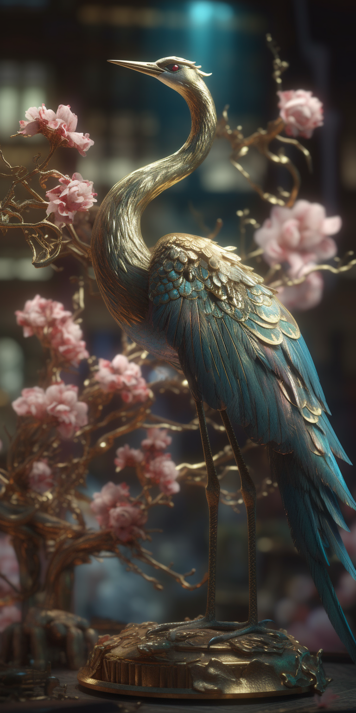


### 27. 树莓壁纸

::: code-tabs

@tab 指令

```
very pretty raspberry wallpaper hd,in the style of beijing east village,dark crimson and red，dark magenta and light beige，luminous quality,high resolution, hyper-realistic,li shuxing，focus stacking --ar 3:4 --q 5 --s 250 --v 5.1
```

@tab zh

```
非常漂亮的高清树莓壁纸，以北京东村风格，深赤色和红色，深洋红和浅米色，有发光的质量，高分辨率，超现实主义，李树星，焦点堆叠 --ar 3:4 --q 5 --s 250 --v 5.1
```

:::

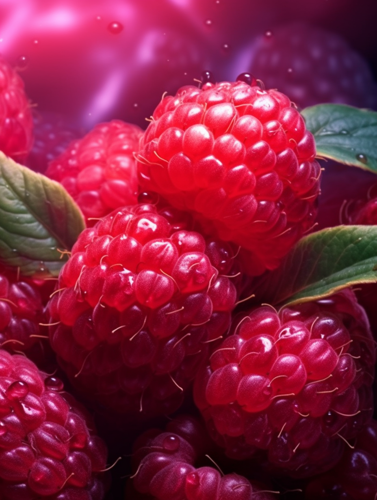


### 28. 可爱的迪士尼卡通公主

::: code-tabs

@tab 指令

```
A cute cartoon Disney princess in Hanfu, full body,Delicate features, clear facial expressions,beautiful eyes,gorgeous light and shadow, Dindar effect, halo, gorgeous scene, exquisite clothes,livelydancing moves, white background, 3D, C4D,Blender, pop mart --ar 3:4 --niji 5 --s 180 --style expressive
```

@tab zh

```
一个可爱的迪士尼卡通公主，身着汉服，全身像，精致的面部特征，清晰的面部表情，美丽的眼睛，华丽的光影效果，Dindar效果，光晕，华丽的场景，精致的衣服，活泼的舞蹈动作，白色背景，3D，C4D，Blender，pop mart --ar 3:4 --niji 5 --s 180 --风格富有表现力
```

:::

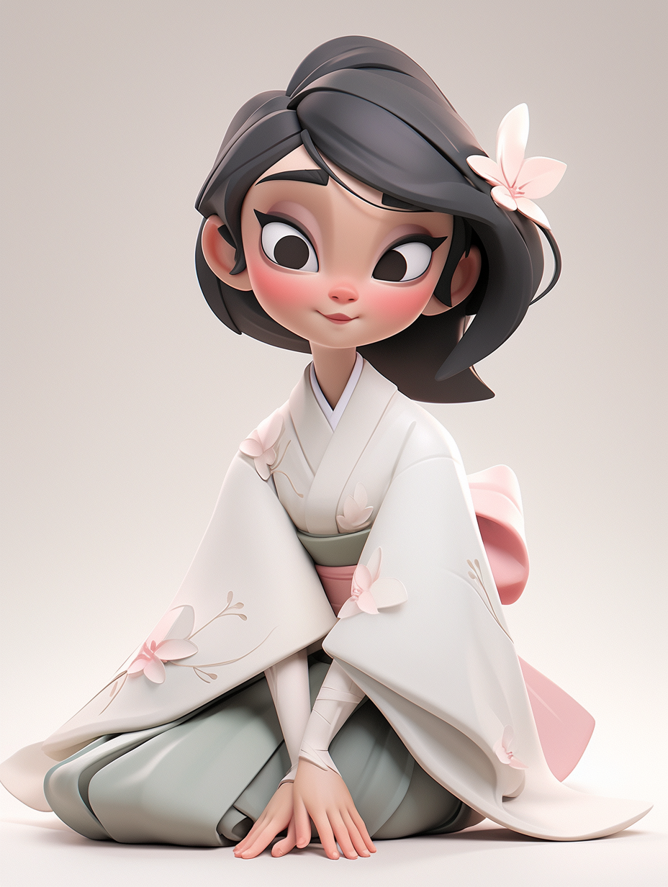


### 29. 芍药花盛开壁纸

::: code-tabs

@tab 指令

```
Flower peonies blooming wallpaper, in the style of vray tracing, fanciful, dreamlike imagery, dreamlike naturaleza, dmitry spiros, uhd image, water drops, realistic yet ethereal --ar 2:3 --q 2 --s 750 --v 5
```

@tab zh

```
以 Vray 追踪风格的芍药花盛开壁纸，奇幻、梦幻的图像，梦幻自然，Dmitry Spiros，超高清图片，水滴，现实却又超凡脱俗 --纵横比 2:3 --质量 2 --大小 750 --版本 5
```

:::

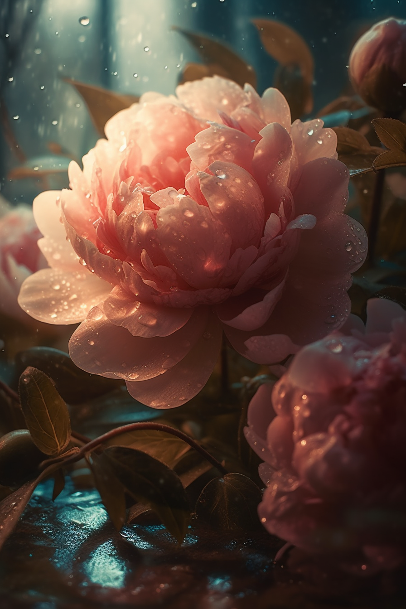


### 30. 魔法圈

::: code-tabs

@tab 指令

```
Below there is a magic circle on an address platform, and there is a large square portal in the sky above, 8K, Interstellar mine, space backgrounds planets, planets and stars, in the style of max rive, dark cyan and red, 32k uhd, psychedelic landscapes, ary scheffer, loish, symbolist themes --ar 16:9 --v 5.1
```

@tab zh

```
以下是一个魔法圈在地址平台上，上空有一个大的正方形门户，8K，星际矿石，宇宙背景星球，行星与恒星，以 Max Rive 的风格，深青与红色，32k超高清，迷幻景观，Ary Scheffer，Loish，象征主题 --ar 16:9 --v 5.1
```

:::

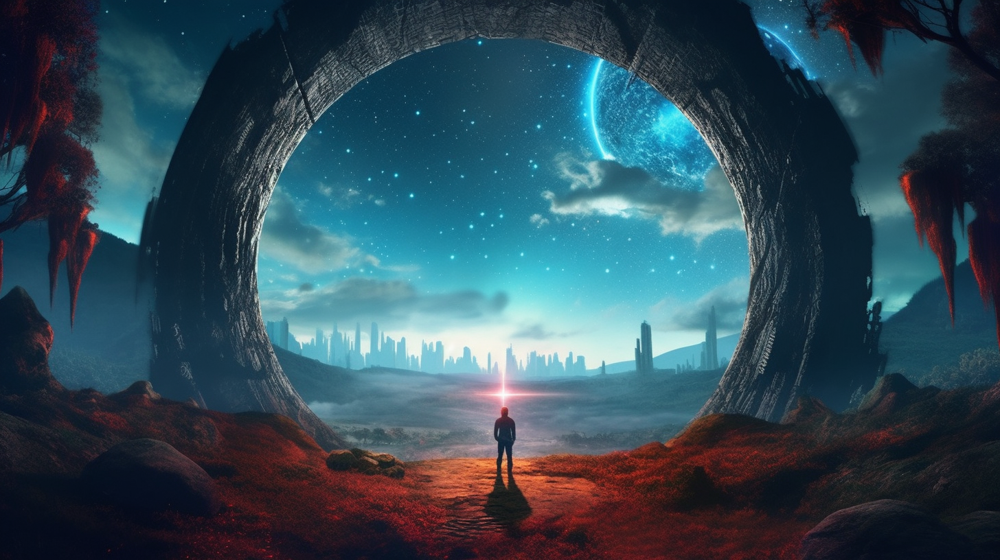


## Step 2

### 1. 商店场景

::: code-tabs

@tab 指令

```
isometric,Shop Scenarios,tree,road,vehicle,POPMART blind box,Large scene,3D art, C4D, octane rendering, 3D render, ray traction, clay materials, Rich visuals,Pixar trend,depth of field,super details,animated lighting,depth of field,pastel color,mockup,Architectural background, fine luster, Soft focus, oc, blender, IP, best quality, 8k— iw60– chaos 100 --s 250 --v 5
```

@tab zh

```
等距，商店场景，树，路，车辆，POPMART 盲盒，大型场景，3D艺术，C4D，八辉渲染，3D渲染，光线追踪，黏土材料，丰富的视觉效果，皮克斯风格，景深，超级细节，动态照明，景深，粉彩色，模型，建筑背景，细腻的光泽，软焦点，OC，blender，IP，最高质量，8K - iw60 - 混沌100 - s 250 - v 5
```

:::

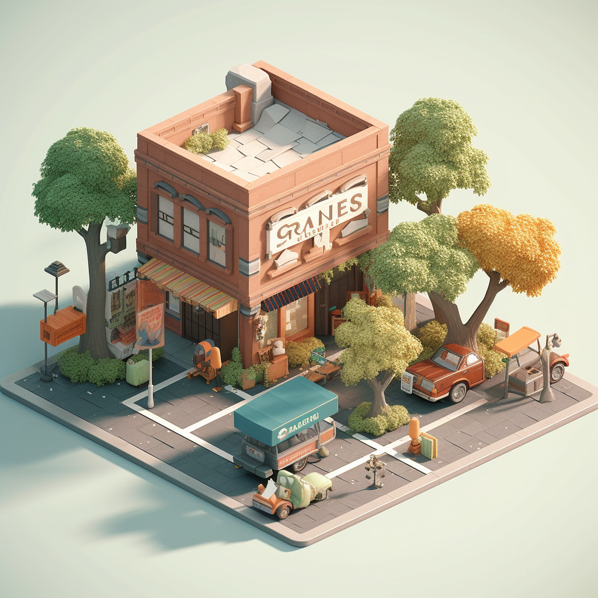


### 2. 柯基狗

::: code-tabs

@tab 指令

```
A cute corgi dog wearing a future space suit,,the background is the universe, tide play blind box, Pixar, pastel color, Busts, Natural light, realistic lighting and shading, the best picture quality and ultra-detail,Whole-body perspective, 3D, C4D, Octane render, Ray Tracing, 8K --ar 3:4 --q 2 --niji 5
```

@tab zh

```
一只可爱的柯基狗穿着未来的太空服，背景是宇宙，潮玩盲盒，皮克斯，粉彩色，半身像，自然光线，真实的光影效果，最佳的画质和超级细节，全身视角，3D，C4D，Octane渲染，光线追踪，8K分辨率 --宽高比 3:4 --质量等级 2 --niji 5
```

:::


### 3. 单朱瑾

::: code-tabs

@tab 指令

```
A single rose,solid, profile, sleek glass thicknesstransparent, pink and white and blue holographicsmooth color background, cinematic lightingrendering,4K --v 5.1
```

@tab zh

```
单朱瑾，坚实，轮廓分明，流线型玻璃厚度透明，粉色和白色以及蓝色全息图，光滑色彩背景，电影式照明，渲染，4K--v 5.1
```

:::


### 4. 超级可爱的女孩

::: code-tabs

@tab 指令

```
super cute girl, fluorescent translucent holographic jacket, blind box, pop mart design, full body,diamond luster, metallic texture, exaggerated expressions and movements, bright light, clay material, precision mech parts, close-up intensity, 3d, ultra-detailed, C4D, octane rendering, Blender, 8K, HD --niji 5 --style expressive --niji 5
```

@tab zh

```
超级可爱的女孩，荧光透明全息夹克，盲盒，泡泡玛特设计，全身，钻石光泽，金属质地，夸张的表情和动作，明亮的光线，粘土材料，精密机械部件，特写镜头的强度，3D，超详细，C4D，Octane渲染，Blender，8K，高清 --niji 5 --风格表现 --niji 5
```

:::

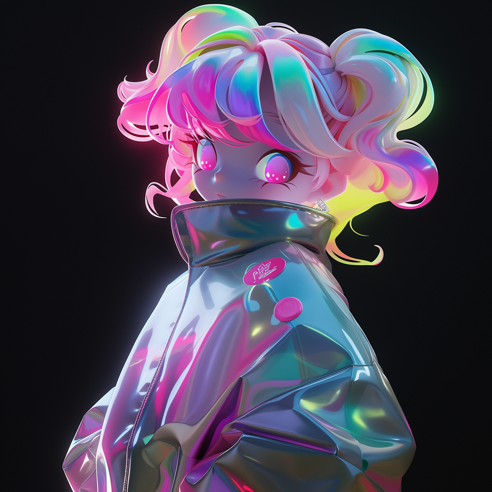


### 5. 一位母亲和一个6岁的女孩拥抱

::: code-tabs

@tab 指令

```
Multi-dimensionalpaper-cut,3d relief，A mother and a 6 year old girl hugging, looking into the camera,surrounded by lots of Flowers and green leaves, Center the composition, Chinese traditional color matching,zbrush ,hd，3D art --ar 3:4 --niji 5
```

@tab zh

```
多维度剪纸，3D浮雕，一位母亲和一个6岁的女孩拥抱，面向相机，周围环绕着许多鲜花和绿叶，以此为中心构图，采用中国传统配色，使用zbrush，高清，3D艺术 --纵横比 3:4 --niji 5
```

:::

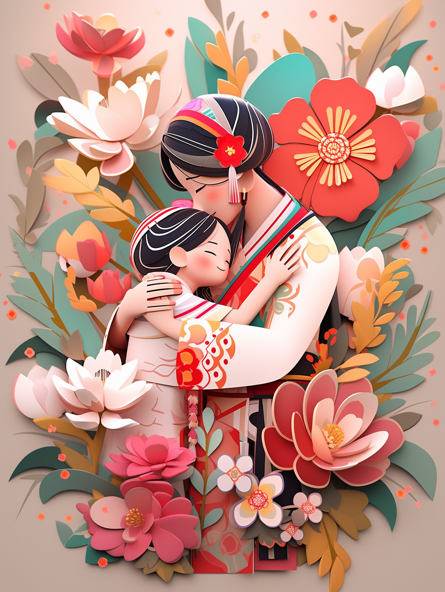


### 6. 礼物盒

::: code-tabs

@tab 指令

```
A gift box with little wings,3d icon,cartoon,clay material,isometric,3D rendering,smooth and shiny!Cute, girly style,Pastel colors,spot light,white background,Best Detail, HD, high resolution，Trending on Nintendo --niji 5
```

@tab zh

```
带有小翅膀的礼物盒，3D图标，卡通风格，粘土材质，等轴立体，3D渲染，光滑且闪亮！可爱，女孩子风格，粉嫩色系，聚光灯效果，白色背景，最佳细节，高清，高分辨率。在任天堂热门 -- niji 5。
```

:::


### 7. 胖乎乎的小熊的白云

::: code-tabs

@tab 指令

```
blue sky,White clouds, White clouds in the shape of a Chubby bear,blend together,it looks very dreamy and beautiful. close-up close shot ,Photography, 16K --ar 3:4
```

@tab zh

```
蓝天，白云，形状像胖乎乎的小熊的白云，融为一体，看起来非常梦幻和美丽。特写近景，摄影，16K -- 宽高比 3:4。
```

:::


### 8. 玩视频游戏

::: code-tabs

@tab 指令

```
Camera, extremely good quality. A woman is playing a videogame on the couch having a good time. --ar 2:2 --v 5
```

@tab zh

```
"相机，极其高质量。一位女士正在沙发上玩视频游戏，享受着愉快的时光。 --ar 2:2 --v 5"
```

:::


### 9. 中国戏曲服装

::: code-tabs

@tab 指令

```
a woman in a chinese Opera costume holding a fan, Beijing Opera,complex headdress,delicate flowersdelicate headdress,delicate facialfeatures, delicate eyes, extraordinary beauty,gorgeous light and shadow, drama, delicate clothesgorgeous costumes, delicate ornaments by SijaHongvector art.Vector illustration, linear illustration, pixiv contest winner, fantasy art, details and vivid colors --niji 5
```

@tab zh

```
一位女子穿着中国戏曲服装，手持扇子，身着京剧服饰。她戴着复杂的头饰，上面装饰着精致的花朵。她的头饰和面部特征都非常精致，眼睛流露出非凡的美丽。她所处的环境中，光影效果绚丽，烘托出戏剧性的气氛。她的衣物和华丽的服饰上，装饰有精致的饰品。这是SijaHongvector艺术的作品，是一幅矢量插画，线条插图，是pixiv比赛的获胜作品，展现了幻想艺术，细节丰富，色彩鲜活 -- niji 5。
```

:::

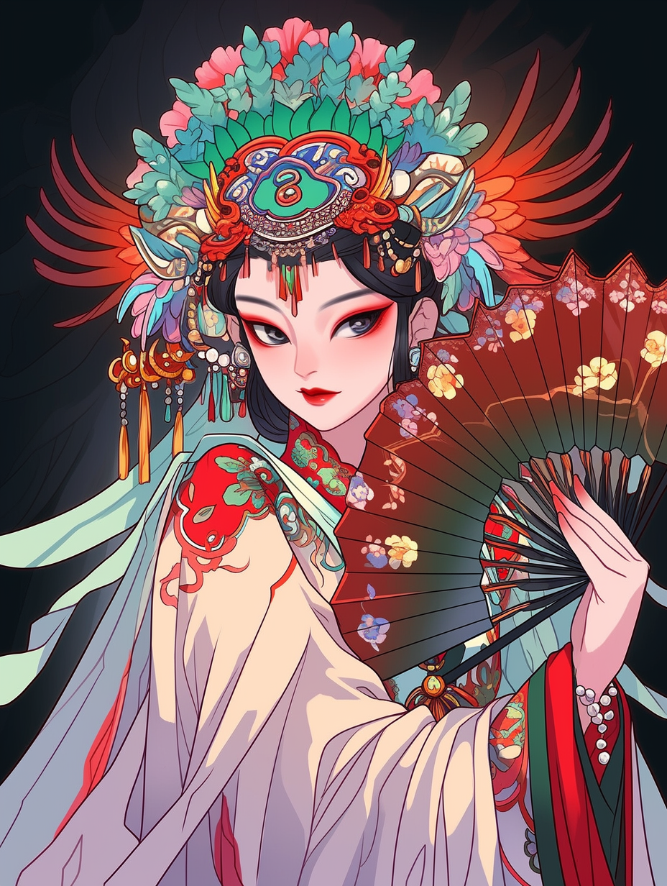

### 10. 动画电影海报

::: code-tabs

@tab 指令

```
an animated movie poster with colorful animals and trees, in the style of miki asai, sparkling water reflections, intricate, delicate flower and garden paintings, light purple and orange, fish-eye lens, makoto shinkai, digital illustration --ar 9:16
```

@tab zh

```
一个以彩色动物和树木为主题的动画电影海报，采用浅紫和橙色调，设计风格仿照浅井美纪。它包含闪烁的水面反射效果，复杂精致的花卉和园景绘画，还使用了鱼眼镜头效果。此图像以新海诚的风格进行了数字描绘--画面比例为9:16。
```

:::

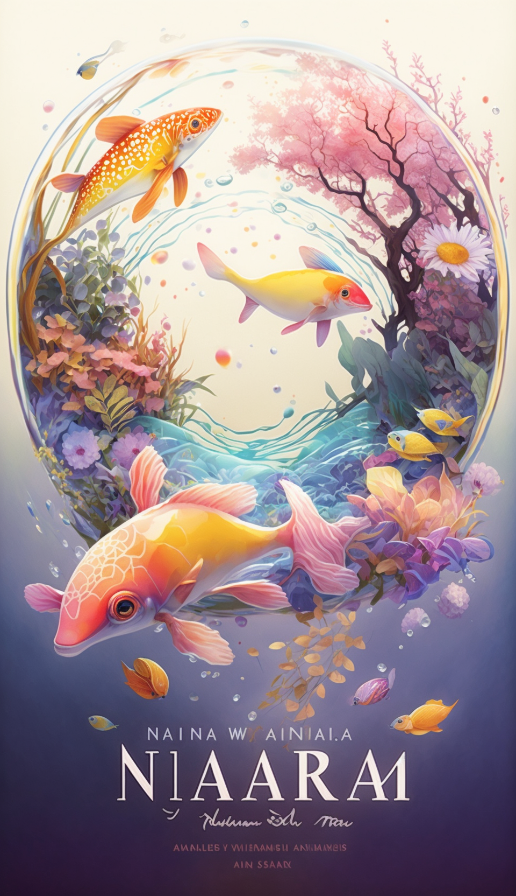

### 11. 烹饪盘子放在桌子上

::: code-tabs

@tab 指令

```
a cooking dish on a table, in the style of light white and light orange, konica big mini, warmcore, he jiaying, precise and lifelike, precisionist lines, soft and dreamy atmosphere --ar 3:4 --q 2 --v 5
```

@tab zh

```
一个烹饪盘子放在桌子上，风格是淡白色和淡橙色，柯尼卡大迷你，温暖的核心，何家英，精确且逼真，精致的线条，柔和而梦幻的气氛 --ar 3:4 --q 2 --v 5
```

:::

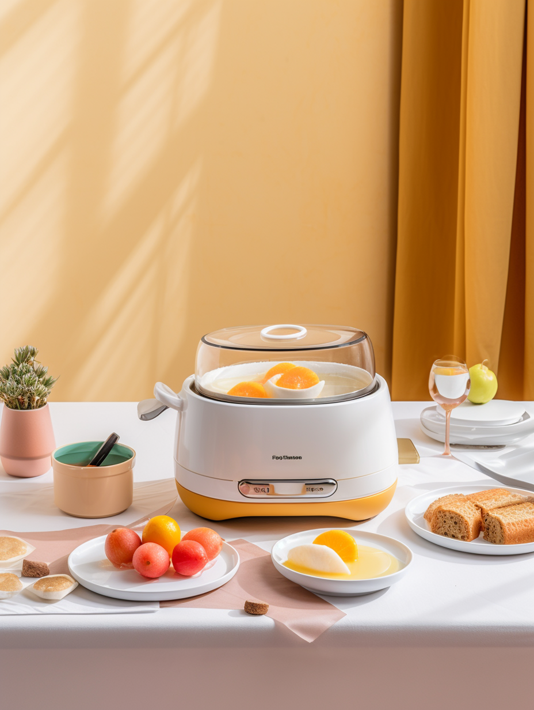


### 12. 32岁的女孩

::: code-tabs

@tab 指令

```
An 32 year old girl, student, white low cut long dress, looks a bit like Anglebaby, smiling face, black hair, standing, in college, spring season, roadside full of romantic light pink cherry blossoms, surreal portrait photography, pale skin, natural light, Nikon Nikkor Z, 85mm f1.8 S ,8K --ar 9:16 --q 2 --v 5
```

@tab zh

```
一位32岁的女孩，学生，穿着白色低领长裙，有点像Angelababy，笑脸，黑发，站立，处在大学，春季，路边满是浪漫的淡粉色樱花，超现实肖像摄影，皮肤苍白，自然光线，Nikon Nikkor Z，85mm f1.8 S，8K分辨率 --宽高比 9:16 --质量 2 --速度 5
```

:::

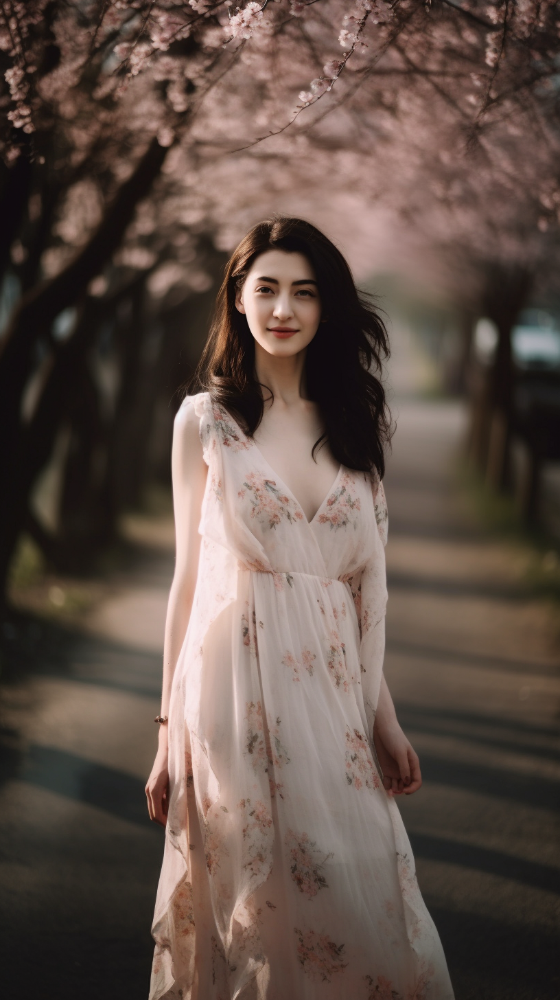


### 13. 母亲节

::: code-tabs

@tab 指令

```
Mother's Day, mother holding daughter, high - definition image, surrounded by flowers, background sky, clouds, festival, sunny, studio lighting, flat illustrations, ultra - high image quality, 8k, Japanese anime style --ar 2:3
```

@tab zh

```
母亲节，母亲抱着女儿，高清图像，周围环绕着花朵，背景是天空和云彩，节日，阳光明媚，摄影棚灯光，平面插图，超高图像质量，8K，日本动漫风格 --宽高比 2:3
```

:::

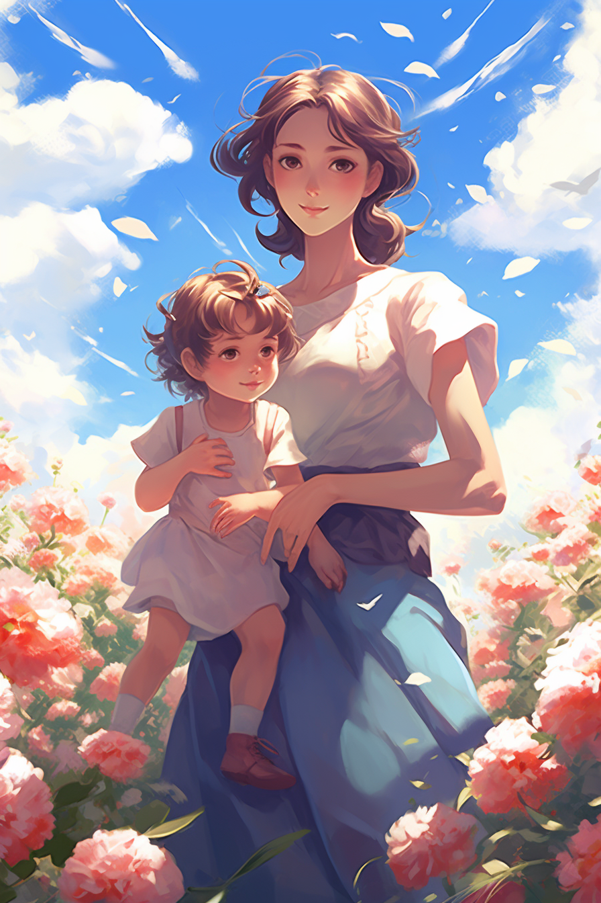

### 14. 一个超级可爱的中国小女孩和有趣的蔬菜相互凝视

::: code-tabs

@tab 指令

```
A super cute Chinese girl and funny vegetables staring at each other, Close-up shots of a lot of normal-sized cute anthropomorphic vegetables on the glass partition in the fridge, vegetables with funny face, 3D rendering, Disney trend --ar 3:4 --style expressive --s 250 --niji 5
```

@tab zh

```
一个超级可爱的中国小女孩和有趣的蔬菜相互凝视，冰箱玻璃隔板上一大堆正常大小的可爱的拟人化蔬菜的特写镜头，蔬菜带着滑稽的脸，3D渲染，迪士尼风潮 --ar 3:4 --style 富有表现力 --s 250 --niji 5
```

:::

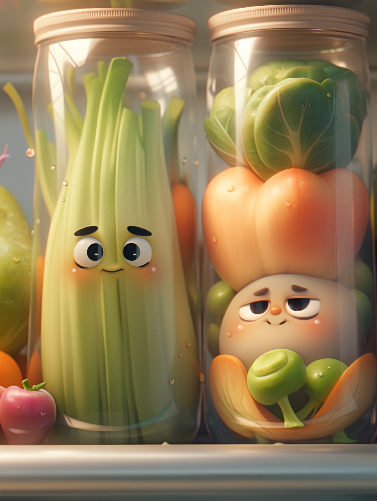

### 15. 一箱可爱舒适的浴室

::: code-tabs

@tab 指令

```
A box of cute comfortable Bathroom, Cute, 2.5D, Isometric style, Light blue and white, Light yellow and light purple, Blender, Octane render, C4D, Natural light, Perfect Details, Ultra HD, Light clean background --ar 3:4 --style expressive --s 400 --niji 5
```

@tab zh

```
一箱可爱舒适的浴室，可爱，2.5D，等轴测画风，浅蓝色和白色，浅黄色和浅紫色，Blender，Octane渲染，C4D，自然光线，完美细节，超高清，淡雅清爽的背景 --ar 3:4 --风格表现力 --s 400 --niji 5
```

:::

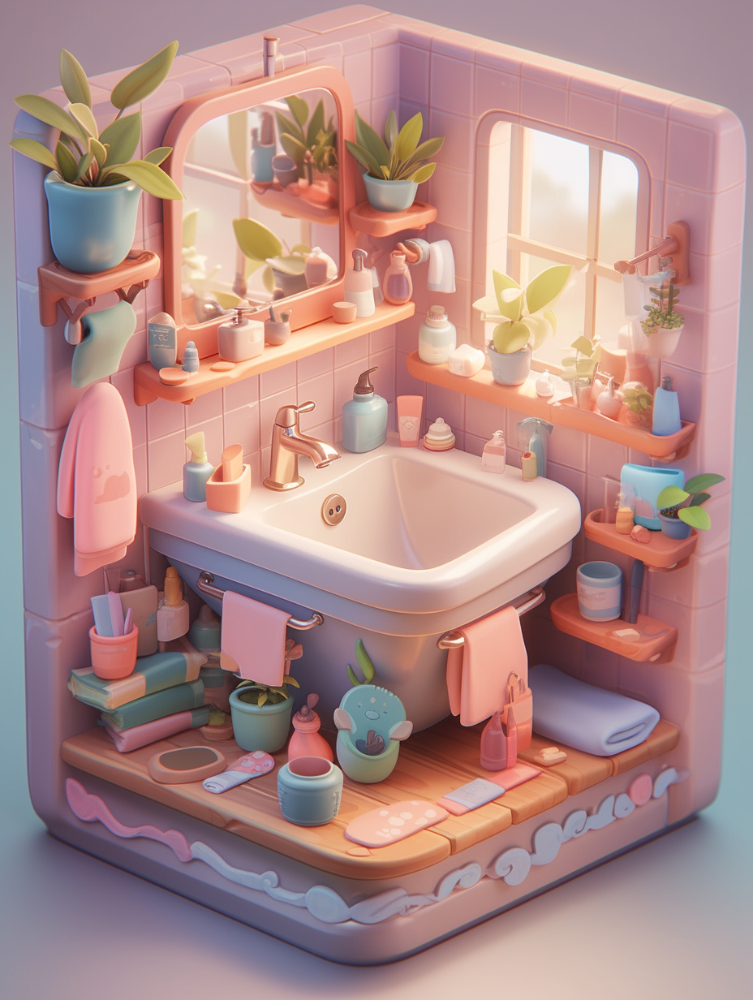

### 16. 月亮上的水手服装艺术女孩

::: code-tabs

@tab 指令

```
Sailor moon art girl on the moon,full-body, in the style of cyberpunk futurism, light violet and gold, lilia alvarado, shang dynasty, andrzej sykut, bold, vibrant colors, close up, vray --niji 5 --ar 3:2 --v 5 --s 250
```

@tab zh

```
月亮上的水手服装艺术女孩，全身形象，赛博朋克未来主义风格，淡紫色和金色，莉莉亚·阿尔瓦拉多，商朝，安杰伊·希库特，大胆，鲜艳的颜色，特写，Vray --niji 5 --ar 3:2 --v 5 --s 250
```

:::

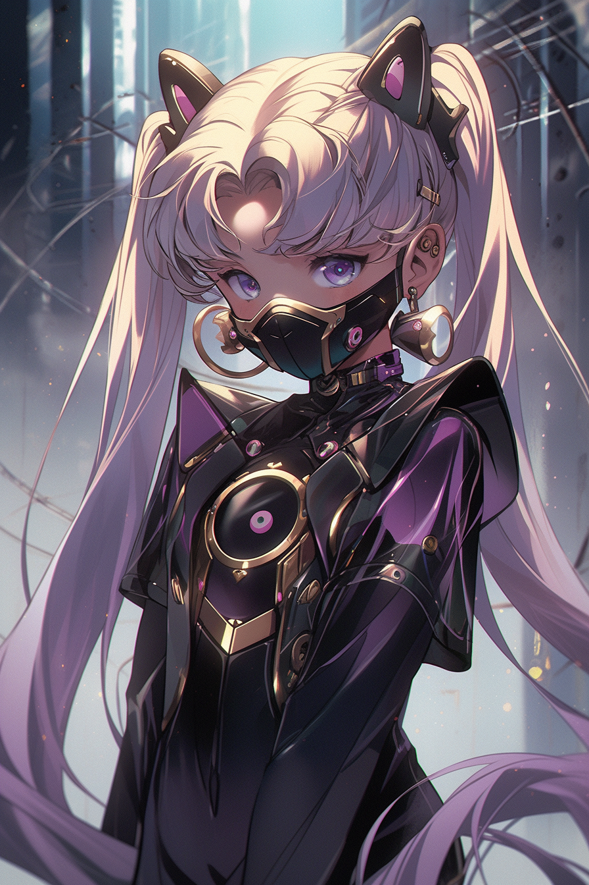

### 17. 美丽的全身中国婴儿女孩

::: code-tabs

@tab 指令

```
fullbody of gorgeous chinese baby girl,porcelain skin,open mouth,natural volumetric, depth of field,Award-winning core photorealistic, dreamy,high definition, detailed intricate,Unreal Engine, 8k, super detail --ar 3:4 --style expressive --s 250 --niji 5
```

@tab zh

```
美丽的全身中国婴儿女孩，瓷肤色，张嘴，自然立体感，深度景深，获奖核心真实感，梦幻，高清，详细复杂，虚幻引擎，8K，超级细节 --ar 3:4 --风格表现 --s 250 --niji 5
```

:::

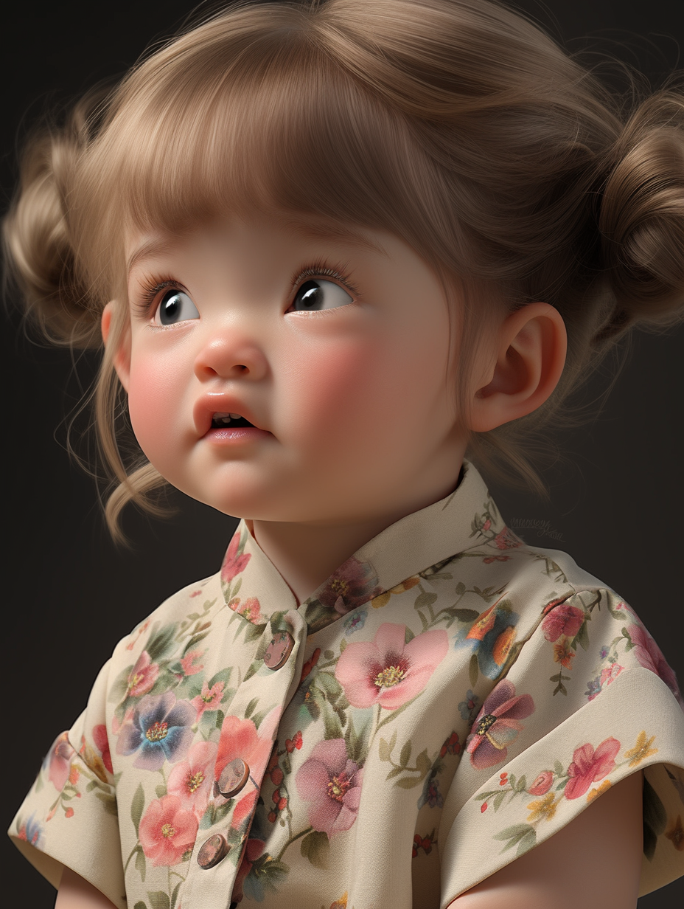

### 18. 气质出众的东方水手女孩

::: code-tabs

@tab 指令

```
<https://s.mj.run/TlIUVWhyzB8> Lovely Oriental Sailor Girl, fair skin, to forehead bangs, painted rainbow hair, small braids, big eyes, charming eyes, smiling face, small V face, delicate and complete features, pink lips, thick acrylic painting, CG, thick
```

@tab zh

```
<https://s.mj.run/TlIUVWhyzB8> 气质出众的东方水手女孩，皮肤白皙，前额短刘海，彩虹色的头发，小辫子，大眼睛，迷人的眼神，微笑的面庞，小V型脸，五官精致完整，粉嫩的嘴唇，浓厚的丙烯画风，CG，浓重。
```

:::

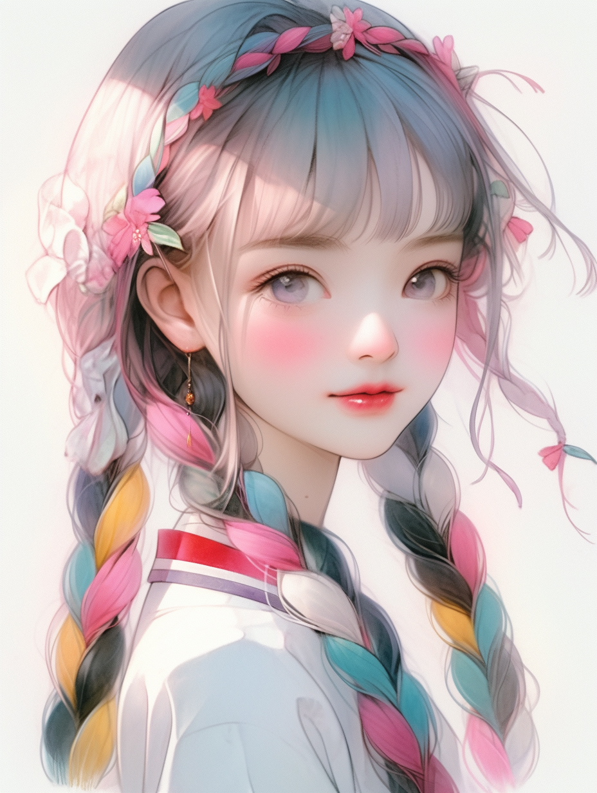

### 19. 中国的爱情诗词

::: code-tabs

@tab 指令

```
Chinese love poetry, Children's novels and poetry books, in the style of Rhads, delicate flora depictions, cartoonish illustrations, tropical symbolism --ar 3:4 --niji 5
```

@tab zh

```
中国的爱情诗词，儿童小说与诗歌书籍，采用Rhads风格，细腻的植物描绘，卡通式的插图，热带象征--宽高比3:4 --霓虹色5
```

:::

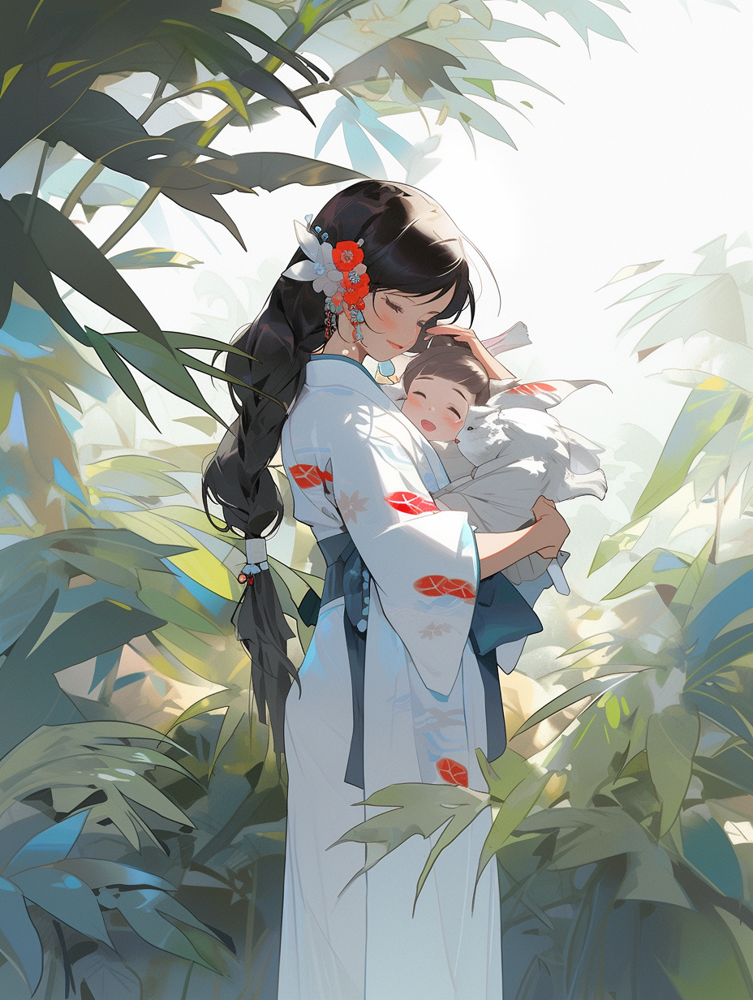


### 20. 单朝的玫瑰

::: code-tabs

@tab 指令

```
A single rose,solid, profile, sleek glass thicknesstransparent, pink and white and blue holographic,smooth color background, cinematic lightingrendering,4K --v 5.1
```

@tab zh

```
单朝的玫瑰，实心，侧面，光滑的玻璃厚度透明，粉色、白色和蓝色的全息图，平滑的颜色背景，电影照明渲染，4K--版本5.1
```

:::

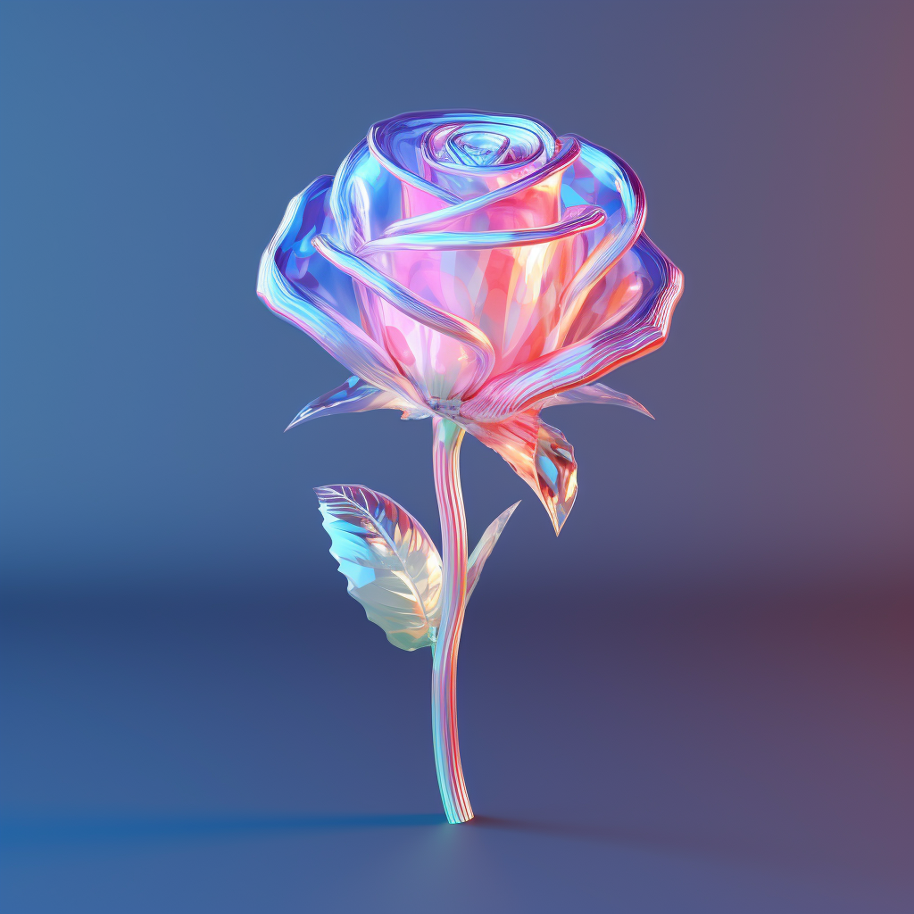


### 21. 蛇

::: code-tabs

@tab 指令

```
Snake with dragon horns, no legs, black scales with red and gold patterning, colorful, beautiful eyes, beauty, dynamic full body pose, Cinematic Lighting, Volumetric Lighting, photography, F/ 2. 8, photo - realistic, maximum detail, ultra - realistic, centered, Rembrandt lighting --ar 2:3 --q 2 --s 750 --v 5
```

@tab zh

```
带有龙角的蛇，无腿，黑色鳞片带红色和金色图案，色彩丰富，美丽的眼睛，美，动态全身姿态，电影灯光，体积灯光，摄影，F/ 2.8，照片真实，最大细节，超真实，居中，伦勃朗照明 --ar 2:3 --q 2 --s 750 --v 5
```

:::

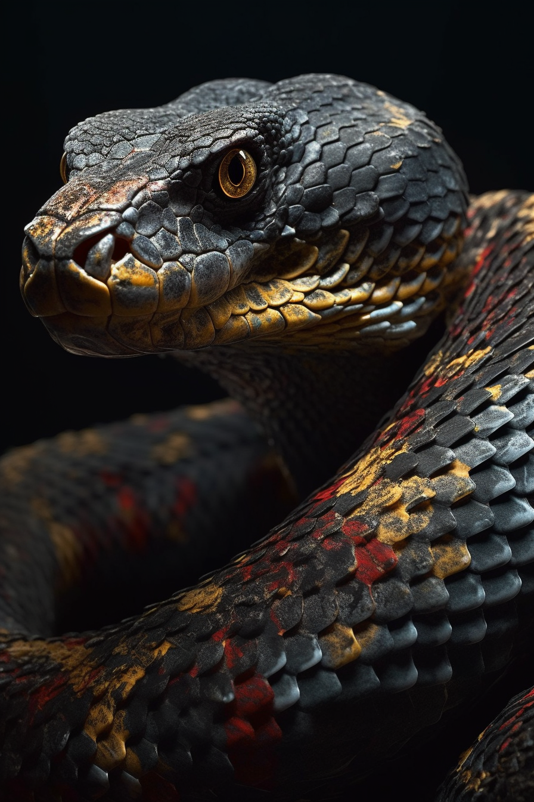

### 22. 生成三个视图

::: code-tabs

@tab 指令

```
three-view drawing, enerate three views, namely the front view, left view, back view, full body, no boundary line, cute little girl wrapped in transparent plastic, chibi, full body!!! fluorescent translucent sports fashion trend clothing, wearing Nike sho
```

@tab zh

```
三视图，生成三个视图，即前视图，左视图，后视图，全身，无边界线，用透明塑料包裹的可爱小女孩，Q版，全身！！！荧光半透明的运动时尚潮流服装，穿着耐克鞋。
```

:::

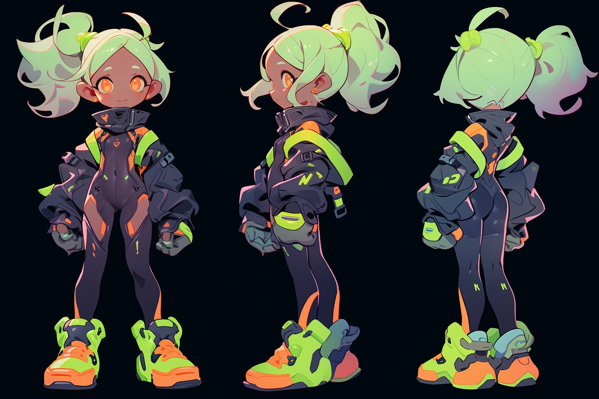

### 23. 多维度剪纸艺术

::: code-tabs

@tab 指令

```
Multi-dimensionalpaper-cut,3d relief，A mother and a 6 year old girl hugging, looking into the camera,surrounded by lots of Flowers and green leaves, Center the composition, Chinese traditional color matching,zbrush ,hd，3D art --ar 3:4 --niji 5
```

@tab zh

```
多维度剪纸艺术，3D浮雕，一个母亲和一个6岁的女孩相拥而坐，看着摄像机，周围环绕着大量的花朵和绿叶，构图以他们为中心，采用中国传统的色彩搭配，使用ZBrush制作，高清，3D艺术 --画面比例 3:4 --使用Niji 5号渲染。
```

:::

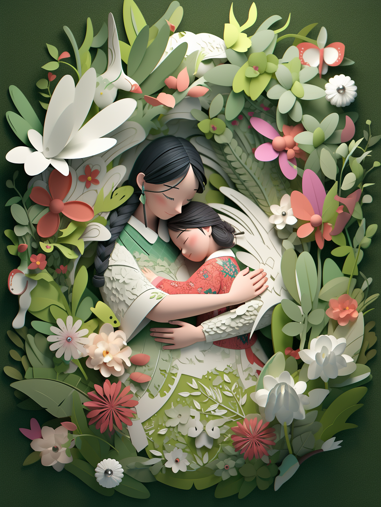

### 24. 穿红色汉服

::: code-tabs

@tab 指令

```
Cute buy wear with red Hanfu, dynamic pose, Festive atmosphere, quintessence of Chinese style illustration,IP in pixar,clay material --v 5
```

@tab zh

```
可爱的购买，穿红色汉服，动态姿势，节庆气氛，中国风格插图的精髓，皮克斯的IP，粘土材质--v 5
```

:::

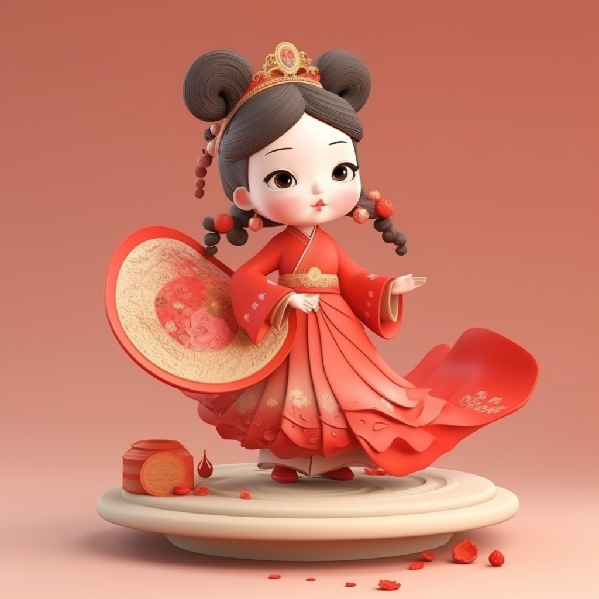

### 25. 一个可爱的模特在空中漂浮，被一条中国冰龙环绕着

::: code-tabs

@tab 指令

```
Victorian style, analog, multiverse, fractal, a lovely model floating in space with a Chinese ice dragon surrounding her. She, star world, milky,ether scene, translucent, shimmering, ethereal, pastel colors, holographic, stylized prismatic super 8K, sharp photography, cinematic, volumetric lighting, intricate detail conceptual art, realistic, HR16, --ar 9:16 --q 2 --v 5
```

@tab zh

```
维多利亚风格，模拟，多元宇宙，分形，一个可爱的模特在空中漂浮，被一条中国冰龙环绕着。她，星球世界，银河，以太场景，半透明，闪烁，空灵，粉彩色，全息，风格化的棱镜超8K，锐利的摄影，电影感，体积光照明，复杂的细节概念艺术，真实，HR16， --ar 9:16 --q 2 --v 5
```

:::

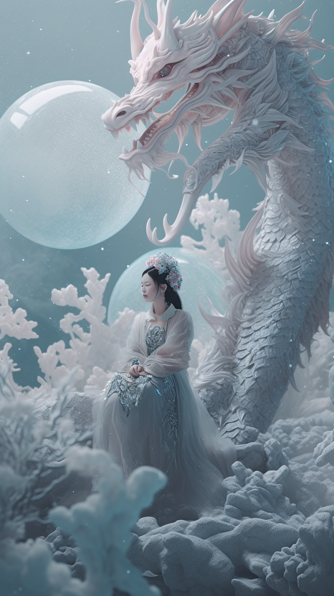

### 26. 色彩丰富的虎与花卉细节以及丰富的立体派元素

::: code-tabs

@tab 指令

```
colorful tiger with floral details and colorful cubist elements on a dark background, in the style of paper sculptures, light orange and light maroon, dark violet and light orange, unique and one-of-a-kind pieces, wildlife photography, recycled material murals, eye-catching composition --ar 8:9 --v 5
```

@tab zh

```
色彩丰富的虎与花卉细节以及丰富的立体派元素，呈现在深色背景上，采用纸雕风格，颜色为浅橙和浅褐，深紫和浅橙，独一无二的艺术作品，野生动物摄影，再循环材料壁画，引人注目的构图 - 宽高比 8:9 - 版本 5。
```

:::

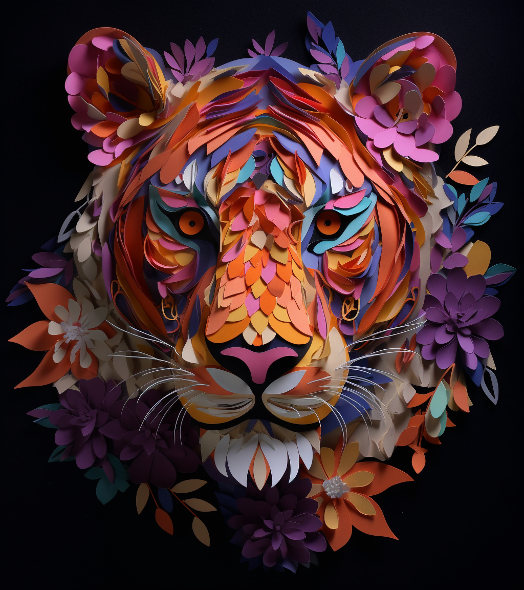

### 27. 一个非常可爱的小白猫

::: code-tabs

@tab 指令

```
A cute cute little white cat with a big fluffy tail, fluffy, chubby, happy, holding a pink rose lying on the clouds of heaven, big eyes, peach blossoms, streams, enchanting, fluffy, petals, fairy tale, Edge Light, Depth of Field, Unreal Engine 5 and octane render --ar 5:3
```

@tab zh

```
一个非常可爱的小白猫，拥有一只大而蓬松的尾巴，它看起来既蓬松又圆润，满脸的幸福感，它抱着一朵粉色的玫瑰躺在天堂的云朵上，它有一双大大的眼睛，就像桃花一样，有溪流，迷人，蓬松，花瓣，像是从童话故事里走出来的一样。在光边和深度场景中，通过使用虚幻引擎5和辛烷渲染技术，这只猫儿看起来就像是在真实世界中一样。 --画面比例 5:3
```

:::


### 28. 一只手，握着五彩斑斓的花束

::: code-tabs

@tab 指令

```
One hand, holding a colorful bouquet, oil painting, acrylic painting,clean white background, pastel colors,super detail,16k,best qualitygraphic illustration --niji 5
```

@tab zh

```
一只手，握着五彩斑斓的花束，油画，丙烯画，纯净的白色背景，柔和的色彩，超高细节，16K，最高质量的图形插图——niji 5
```

:::

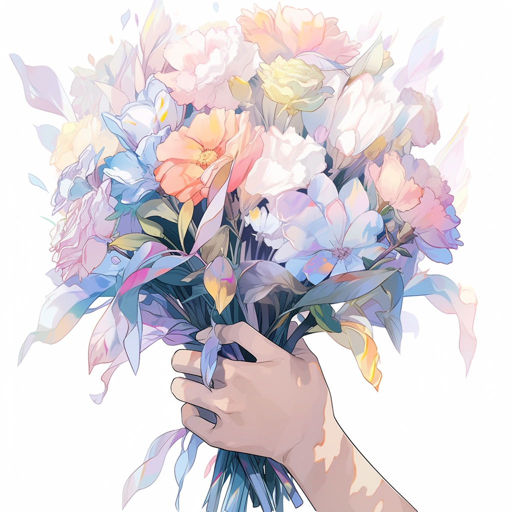

### 29. 多维度纸艺刻纸工艺

::: code-tabs

@tab 指令

```
Multi-dlimensional paper kirigami craft, paper illustration, Chinese traditional painting, jade, landscape, auspicious clouds, Chinese style, Watercolor painting, warm color, light background, best quality, exquisite details, 3d rendering, Octane render, pastel, Soft light
```

@tab zh

```
多维度纸艺刻纸工艺，纸质插画，中国传统绘画，玉，山水，吉祥云，中国风格，水彩画，暖色，淡背景，最优质，精美细节，3D渲染，Octane渲染，柔和的色彩，软光。
```

:::


### 30. 古老，道符，神话中的野兽

::: code-tabs

@tab 指令

```
ancient, dao talisman, mythical beasts, runic script, cultivator, mountain range, dense forest, courtyard, meditation, closed eyes, unpredictable power --ar 16:9 --v 5.1
```

@tab zh

```
古老，道符，神话中的野兽，符文文字，修行者，山脉，密集的森林，庭院，冥想，闭眼，不可预测的力量 --ar 16:9 --v 5.1

请注意，“ar 16:9”和“v 5.1”是具有特定含义的术语。在电视和视频制作中，"ar 16:9" 表示16:9 的纵横比，是指宽度和高度的比例。"v 5.1" 在音频中通常指的是5.1声道立体声，其中包括五个全频道和一个低频效果声道。如果这两个术语需要用中文表达，在很多情况下，我们会保留原文，因为这是通用的专业术语。
```

:::

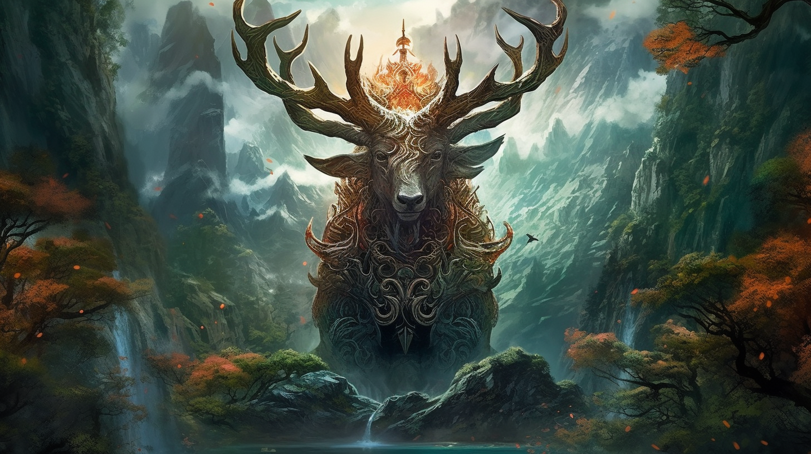

## Step 3

### 1. 背景的星光灿烂闪耀，一朵粉色的莲花正在盛开

::: code-tabs

@tab 指令

```
The background starlight is shining brightly, a pink lotus is in full bloom, crystal clear and picky, the heart of the flower is like a firefly shining, the petals are transparent, extremely beautiful --ar 1:2
```

@tab zh

```
背景的星光灿烂闪耀，一朵粉色的莲花正在盛开，晶莹剔透，挑剔之极，花心如萤火虫般照耀，花瓣透明，美丽之极 --ar 1:2
```

:::

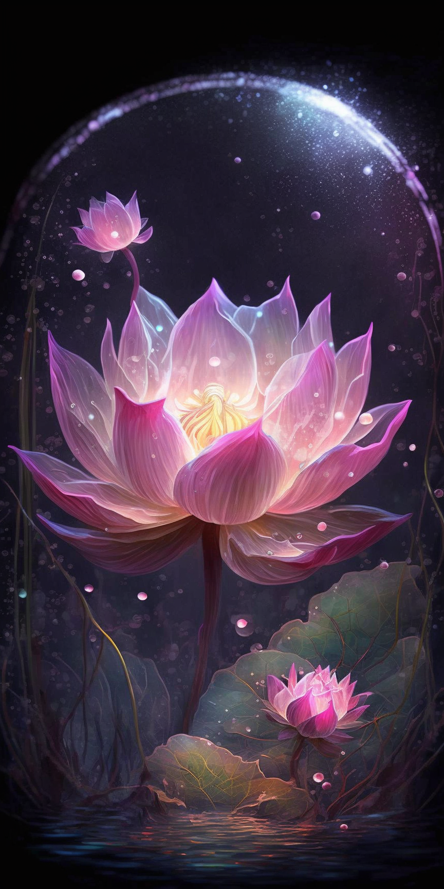

### 2. 星际技术支持

::: code-tabs

@tab 指令

```
interplanetary Tech Support | by Subterfugitive ::0 A woman wearing bright glowing illuminated hypermaximal cyberpunk goggles is riding a floating hoverbike surrounded by a murmuration of celestial objects, colorful holographic lenses with illuminated HUD::5 Constructivist propaganda poster, bright blue and coral and cream color motif, servos, sprockets, machinery, rockets, factories, flight, dirigibles, enlightenment ::4 urban cybertech epicenter background, industrial ::4 reclining view of head, view from above photorealism, subsurface scattering ::5 --s 250
```

@tab zh

```
星际技术支持 | 由Subterfugitive创建 ::0 一名女性戴着明亮的发光的超极限赛博朋克眼镜，她正在骑着一个悬浮的摩托车，周围环绕着一群天体，色彩斑斓的全息透镜以及带有照明HUD的显示屏::5 建筑主义宣传海报，明亮的蓝色、珊瑚色和奶油色调，伺服机构，齿轮，机械，火箭，工厂，飞行，飞艇，启蒙 ::4 都市赛博技术中心的背景，工业化 ::4 从上方视角看向躺着的头部，超真实主义，次表面散射 ::5 --s 250
```

:::

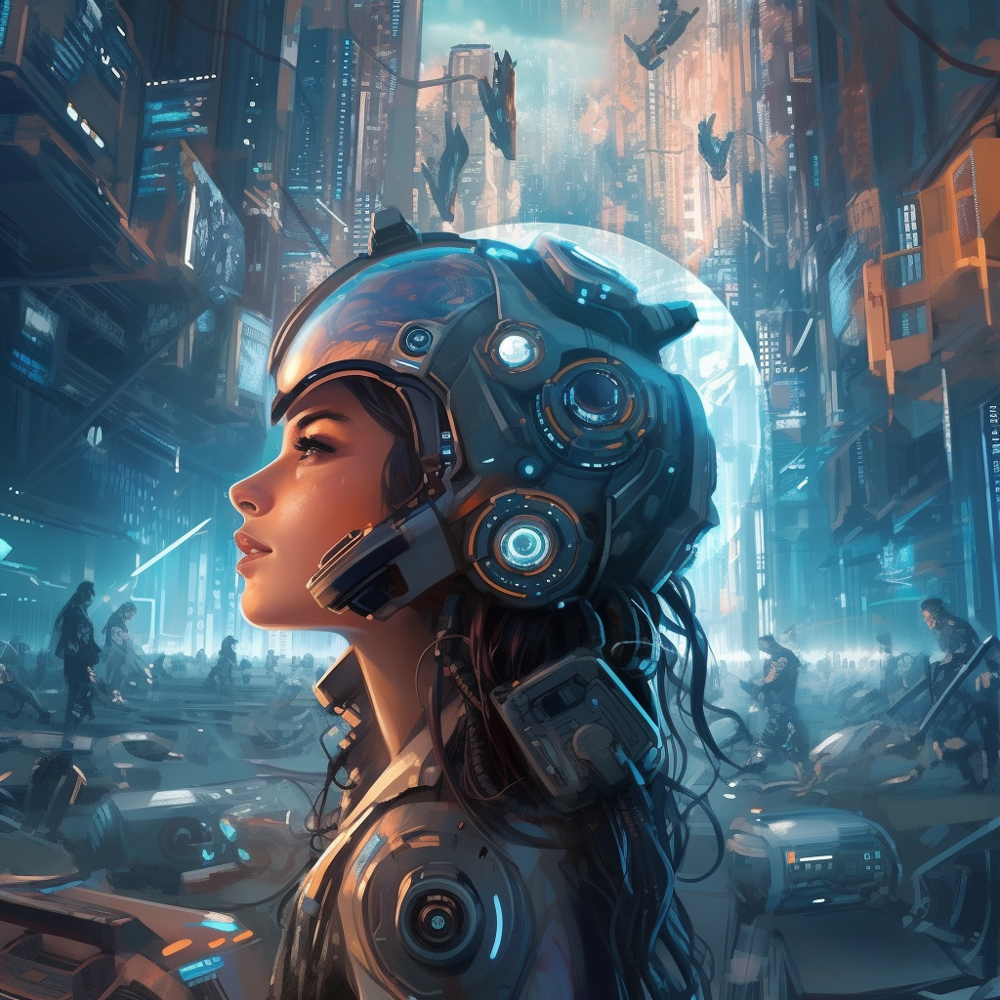

### 3. 超级可爱的女孩，手持荷叶

::: code-tabs

@tab 指令

```
Super cute girl, holding a lotus leaf, light rain, pond, super cute girl IP by pop mart, pastel color, mockup, blind box toy, fine luster, clean background, 3D render, oc render, best quality, 4k, ultra detoiled
```

@tab zh

```
超级可爱的女孩，手持荷叶，细雨，池塘，Pop Mart 的超级可爱女孩 IP，粉彩色，模型，盲盒玩具，细腻光泽，干净的背景，3D 渲染，原创渲染，最高质量，4K，超详细。
```

:::


### 4. 超可爱的女孩 IP 设计

::: code-tabs

@tab 指令

```
a super cute girl IP design,by pop mart,pink-yellow-white clothes,big eyes,small mouth,open the hands,whole body,clean background,high quality,best discribe,8k,C4D,blender --niji 5
```

@tab zh

```
超可爱的女孩IP设计，由pop mart制作，穿着粉黄白色的衣服，大眼睛，小嘴巴，双手张开，全身呈现，背景简洁，高质量，最佳描述，8K，C4D，blender - -niji 5。
```

:::

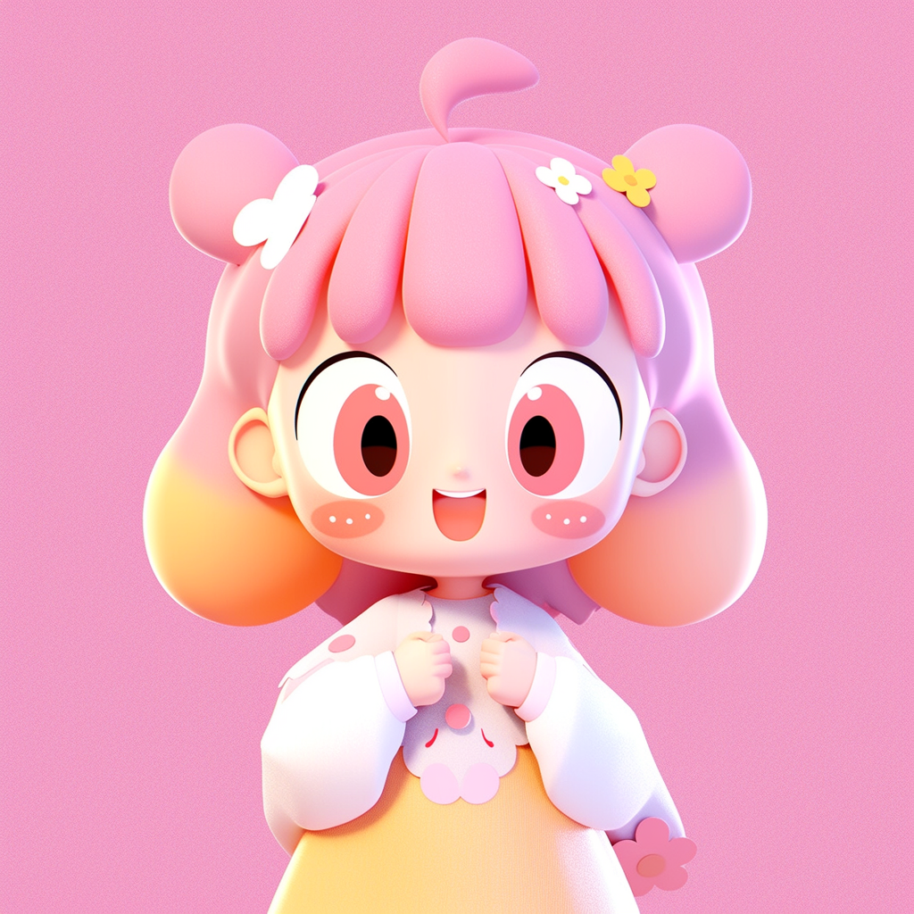

### 5. Popmart 盲盒、3D艺术

::: code-tabs

@tab 指令

```
popmart blind box,3d art,c4d,octane render, ray tracing,clay material,OC, Blender, best Ouality,8k,pastel color,cinematic edge lighting, soft lightin ganime,fineluster. A little girl is running on the grassland, beautiful eyes,Colorful eyes,Stylish colors,Running towards the camera, skirt fluttering, butterflies flying, there are a lot of flowers in the foreground. waist up portrait,super detail,gradient background, depth of field. --ar 3:4 --niji 5
```

@tab zh

```
Popmart 盲盒、3D艺术、C4D、Octane渲染器、光线追踪、粘土材质、OC、Blender、最佳质量、8k、粉彩色、电影式边缘照明、柔和的动漫照明、精细光泽。一个小女孩正在草原上奔跑，美丽的眼睛，色彩丰富的眼睛，时尚的颜色，向着镜头奔跑，裙子飘扬，蝴蝶飞翔，前景中有许多花朵。腰部以上的肖像，超级细节，渐变背景，景深。--ar 3:4 --niji 5
```

:::

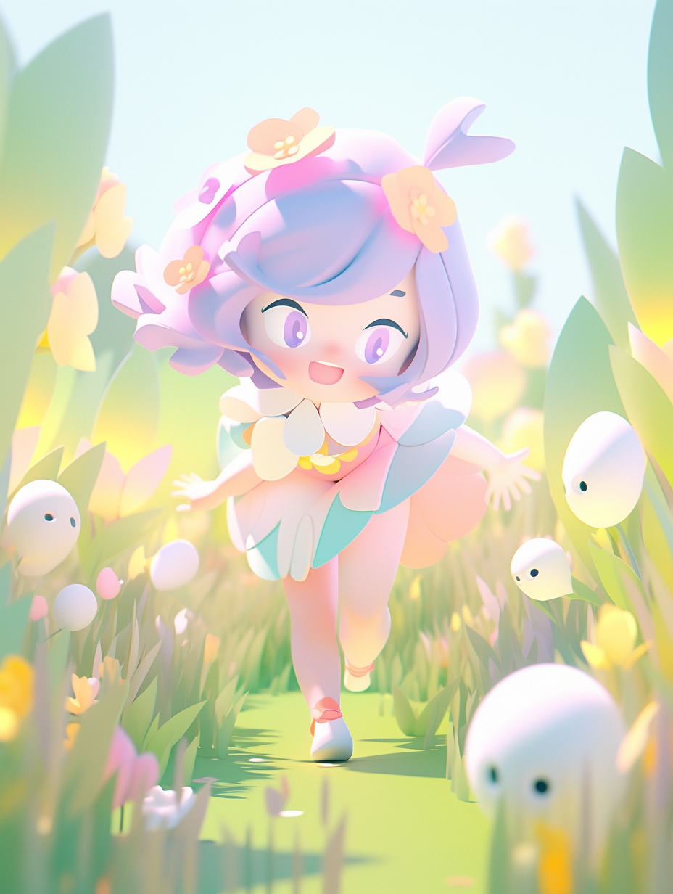


### 6. 这是一位可爱的东方美女

::: code-tabs

@tab 指令

```
<https://s.mj.run/r6O700yXaxc> Lovely Oriental beauty girl, white skin, to forehead bangs, painted rainbow colored hair, small twist braids, big eyes, charming eyes, smiling face, small V face, delicate complete features, pink lips, thick acrylic painting
```

@tab zh

```
<https://s.mj.run/r6O700yXaxc> 这是一位可爱的东方美女，肌肤白皙，前额有刘海，头发上绘着彩虹色，还有小辫子，大眼睛，魅力四溢的眼神，笑容满面，小V脸，五官精致完整，粉嫩的嘴唇，厚重的丙烯画作。
```

:::

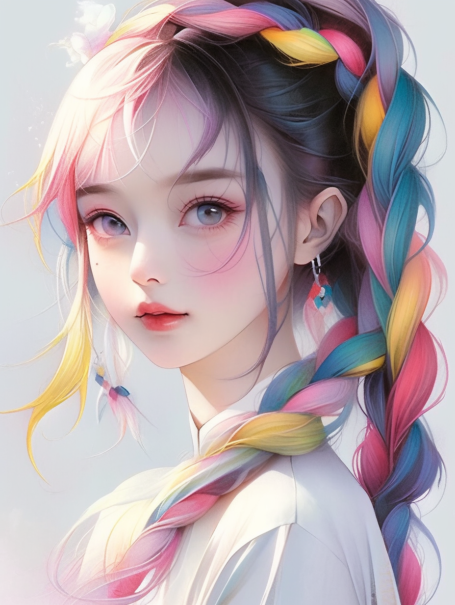

### 7. 可爱的小粉猫

::: code-tabs

@tab 指令

```
A cute, cute little pink cat with a big pink fluffy tail, holding a white and red flower lying on a cloud in the sky, big eyes, peach blossom, stream, coquel, fairy, fluffy, shiny fur, petals, fairy tale, Unreal Engine 5 and Xin Xin value rendering, 8k, HD,  --ar 3:2 --v 5 --s 250
```

@tab zh

```
一只可爱、可爱的小粉猫，拥有一只粉色的蓬松大尾巴，在天空中躺在一朵云上，有着大眼睛，桃花，小溪，可可，仙女，蓬松，闪亮的毛发，花瓣，童话故事，虚幻引擎5和辛辛值渲染，8k，高清，--ar 3:2 --v 5 --s 250。
```

:::

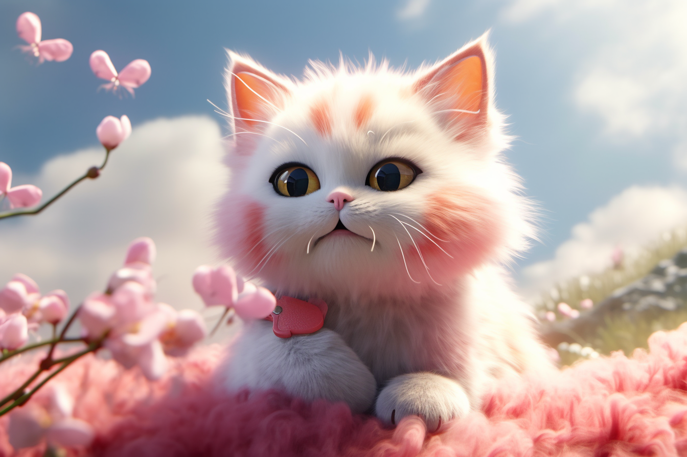

### 8. 龙女人物图

::: code-tabs

@tab 指令

```
Chinese painting "Dragon Girl Figure", using Unreal Engine 5 style, light emerald and white, 32k uhd, aesthetics, exquisite costumes, feminine body, close-up, realistic, photo, photography, side backlight, super real, OC renderer --ar 3:5 --q 2 --v 5
```

@tab zh

```
中国画《龙女人物图》，采用虚幻引擎5风格，浅翠绿和白色，32k超高清，美学，精致的服饰，女性化身体，特写镜头，逼真，照片，摄影，侧背光，超真实，OC渲染器 --ar 3:5 --q 2 --v 5
```

:::

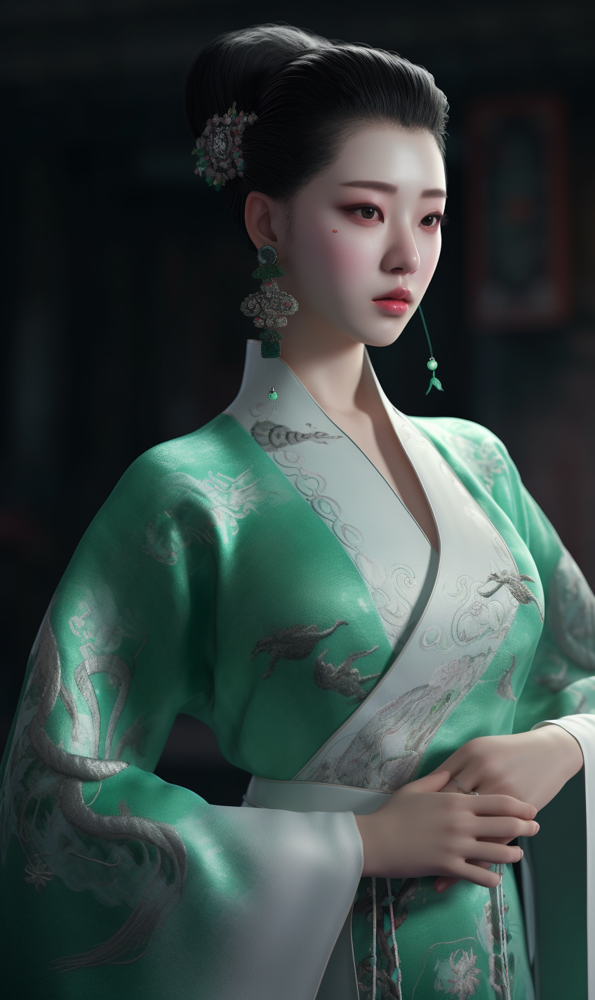

### 9. 戴眼镜的猫头鹰

::: code-tabs

@tab 指令

```
An owl with glasses sitting at a table, knowledge symbol, on white background, a character portrait, trending on behance, vector icon, archie comic style, colorful! character design, line vector art, icon for an ai app, innocent look, rich vivid colors, icon, minimal
```

@tab zh

```
一个戴眼镜的猫头鹰坐在桌子旁，知识的象征，白色背景，角色肖像，在Behance上流行，矢量图标，阿奇漫画风格，色彩丰富！角色设计，线条矢量艺术，用于AI应用的图标，天真的表情，鲜艳的色彩，图标，简约。
```

:::


### 10. 整齐排列的公路自行车摆放

::: code-tabs

@tab 指令

```
knolling of road cycling, studio lighting, complete parts, HD, REALISTIC, --ar 3:2 --q 2 --s 750 --v 5
```

@tab zh

```
整齐排列的公路自行车摆放，工作室照明，完整零件，高清，逼真，--ar 3:2 --q 2 --s 750 --v 5
```

:::

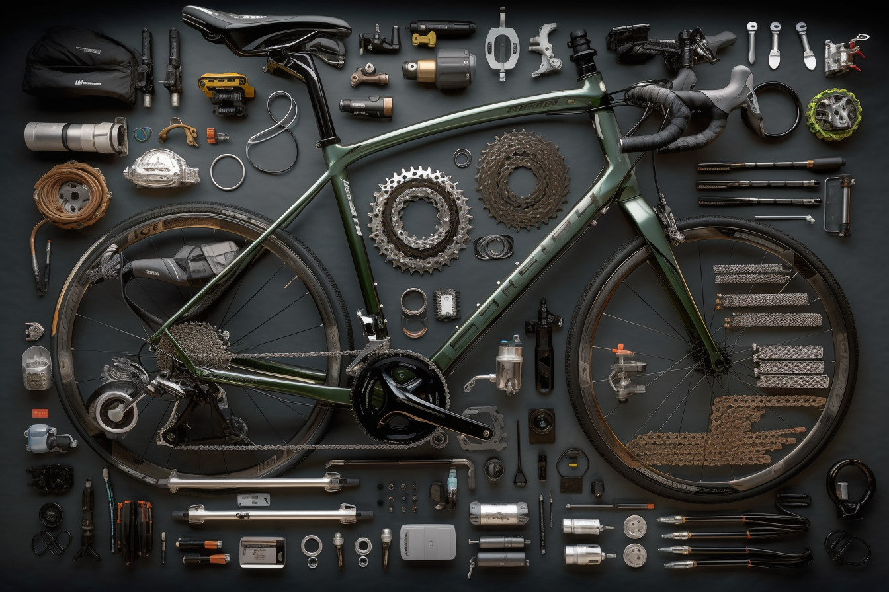


### 11. 西西里岛的可爱多彩

::: code-tabs

@tab 指令

```
Draw a set of playful and colorful, watercolor - style illustrations of lemons and kitchen objects from Sicily. --s 250
```

@tab zh

```
绘制一组来自西西里岛的可爱多彩、水彩风格的柠檬和厨房物品的插图。
```

:::

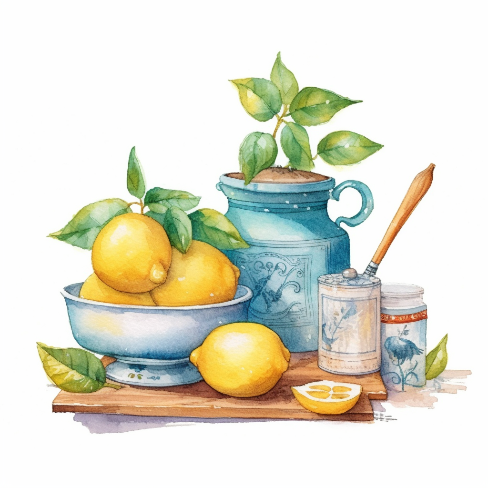


::: code-tabs

@tab 指令

@tab zh

:::

::: code-tabs

@tab 指令

@tab zh

:::

::: code-tabs

@tab 指令

@tab zh

:::

::: code-tabs

@tab 指令

@tab zh

:::

::: code-tabs

@tab 指令

@tab zh

:::

::: code-tabs

@tab 指令

@tab zh

:::

::: code-tabs

@tab 指令

@tab zh

:::

::: code-tabs

@tab 指令

@tab zh

:::

::: code-tabs

@tab 指令

@tab zh

:::

::: code-tabs

@tab 指令

@tab zh

:::

::: code-tabs

@tab 指令

@tab zh

:::

::: code-tabs

@tab 指令

@tab zh

:::

::: code-tabs

@tab 指令

@tab zh

:::

::: code-tabs

@tab 指令

@tab zh

:::

::: code-tabs

@tab 指令

@tab zh

:::

::: code-tabs

@tab 指令

@tab zh

:::

::: code-tabs

@tab 指令

@tab zh

:::

::: code-tabs

@tab 指令

@tab zh

:::

::: code-tabs

@tab 指令

@tab zh

:::

::: code-tabs

@tab 指令

@tab zh

:::

::: code-tabs

@tab 指令

@tab zh

:::

::: code-tabs

@tab 指令

@tab zh

:::

::: code-tabs

@tab 指令

@tab zh

:::

::: code-tabs

@tab 指令

@tab zh

:::

::: code-tabs

@tab 指令

@tab zh

:::


欢迎关注我公众号：AI悦创，有更多更好玩的等你发现！

::: details 公众号：AI悦创【二维码】


:::

::: info AI悦创·编程一对一

AI悦创·推出辅导班啦，包括「Python 语言辅导班、C++ 辅导班、java 辅导班、算法/数据结构辅导班、少儿编程、pygame 游戏开发」，全部都是一对一教学：一对一辅导 + 一对一答疑 + 布置作业 + 项目实践等。当然，还有线下线上摄影课程、Photoshop、Premiere 一对一教学、QQ、微信在线，随时响应！微信：Jiabcdefh

C++ 信息奥赛题解，长期更新！长期招收一对一中小学信息奥赛集训，莆田、厦门地区有机会线下上门，其他地区线上。微信：Jiabcdefh

方法一：[QQ](http://wpa.qq.com/msgrd?v=3&uin=1432803776&site=qq&menu=yes)

方法二：微信：Jiabcdefh

:::


::: details

- 案例1：[https://aibang.run/](https://aibang.run/)
- 案例2: [https://www.topschat.com/](https://www.topschat.com/)
- 案例3: [https://www.5118.com/](https://www.5118.com/)
- [https://chatgpt.yundongfang.com/](https://chatgpt.yundongfang.com/)
- [https://chat-shared1.zhile.io/shared.html](https://chat-shared1.zhile.io/shared.html)

:::
