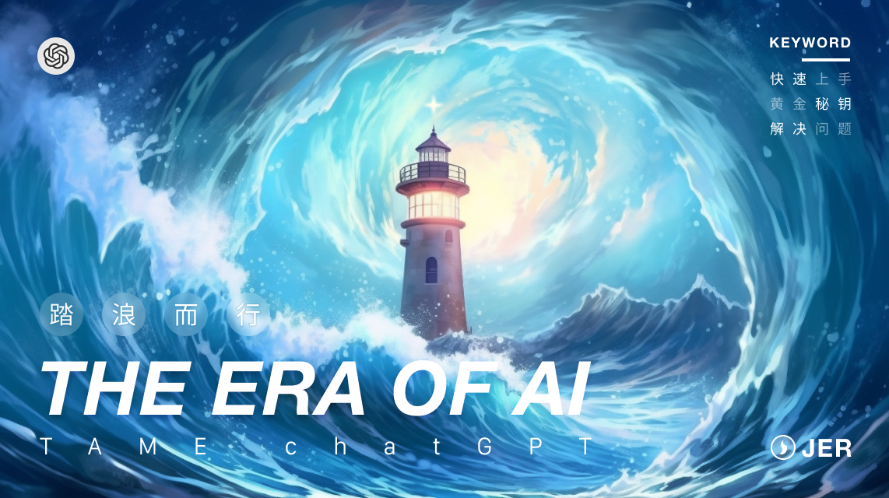
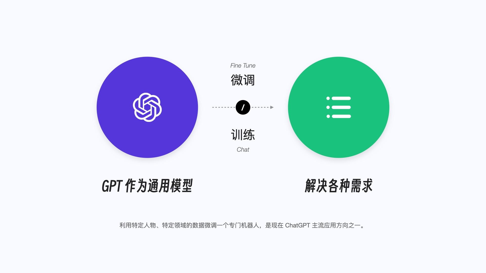
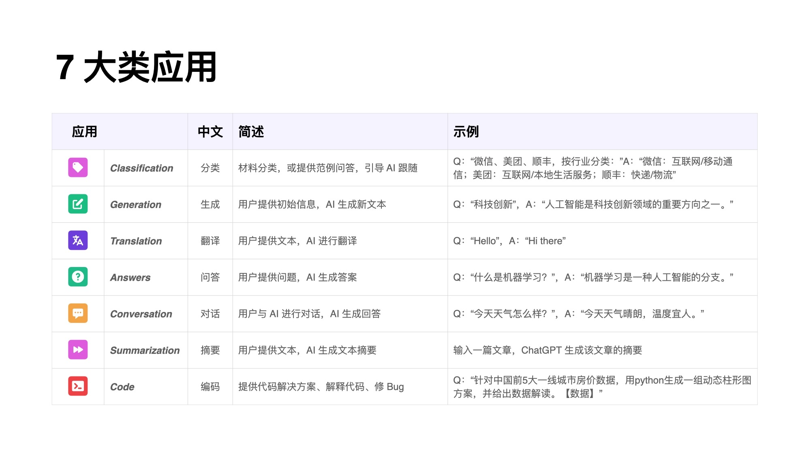
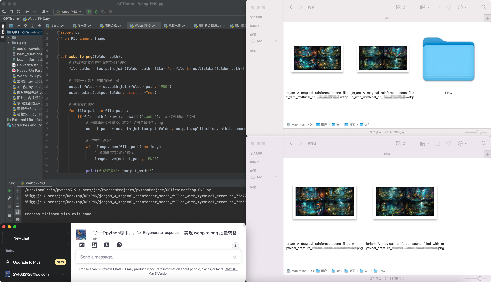
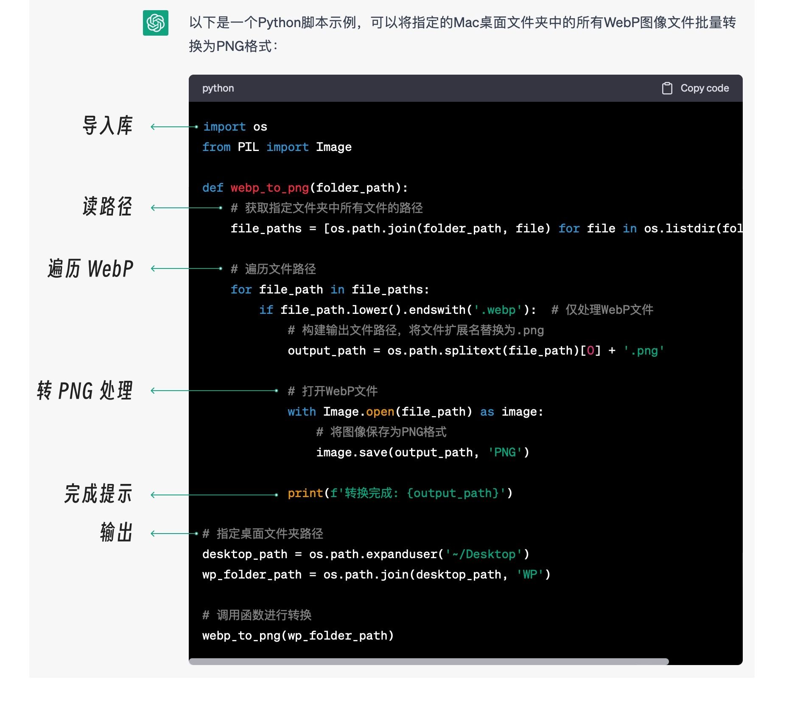
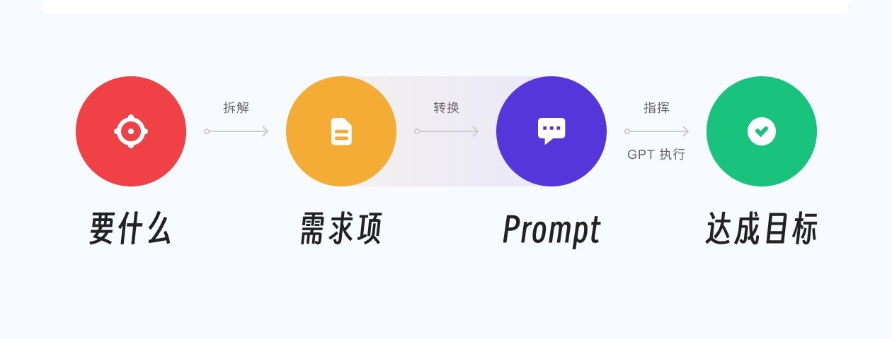
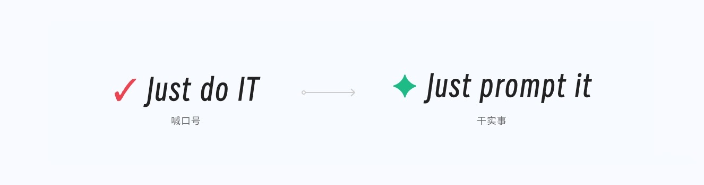

你好，我是悦创。一个好奇的斜杠设计师。

最近几年正好碰上互联网拐点，产品增长乏力，“努力”的边际收益随之锐减。身边还在一线互联网的朋友几乎都被迫化身卷王，在旧的赛道里心力交瘁。那我们想问了：**让新技术助力提效，这题有没有解？**

我们还在为此苦苦思索的时候，世界一直在酝酿着新的剧变，并悄悄告知了答案。

以前的“人工智能”都是被设计来解决某个垂直领域的课题的。比如阿尔法围棋（AlphaGo），针对性极强，拓展却举步维艰。你让它下完棋顺便扫个地？它想掀桌都成问题。

GPT 作为通用智能模型带来了新的可能。商业应用方面，目前的主流方向之一是利用企业掌握的特定数据来微调一个专用模型。比如通过大量的法律数据，专门微调一个 AI 律师来解决法律问题。而对于个人，通过对话（Chat）和少量数据的训练，其实也能实现让 GPT 解决五花八门的需求。

大多数人都是通过简单的问题来入手，慢慢感受到：**原来除了解惑，ChatGPT 还能解决需求！**



## 1. 当我们和 GPT 交流的时候，会遇到哪些问题？

因为对 GPT 的能力认知还不清晰，大多数人还保持着**搜索时代的惯性——提交简单的问题，寻找答案。** 甚至更多时候这个“问题”还只是关键词，无法上升到“需求”的高度。这个现象隐藏的逻辑是：预设了 AI 没有超越人类的知识，只能把“记住”的数据掏出来。

其实，你把 ChatGPT 当作一位专业的智能助理来协助，上手感受会更加顺滑。即使面对的问题非常复杂，只要正确拆解给 GPT，就能良好执行。TA 既可以是全能的提效助手，也可以轻松切换为特别垂直的课题解决专家。

### 1.1 问题 1：它都可以帮我干什么？

2023 年 3 月 开始，各大厂纷纷跑步入场探索类 ChatGPT 的智能解决方案，优化工作流，降本增效。举个例子：

> 飞书公布了类似微软 Office Copilot 的智能助手 “My AI”，可为用户做会议纪要、自动创建待办事项、一键整理销售报告、对齐 OKR 等等，通过自然语言交互就能实现。

那我们又可以用来干什么呢？作为个人提效的工具。

比如说现在许多人副业是自媒体博主，平时有制作视频的需求，**现在让 GPT 一分钟内做一条卡点视频**，顺带输出图文并貌的推文，甚至包含数据解读和动态可视化图表……等等，说好是个文本生成模型呢？还能这么骚？

不要急，后面我会带你一步步实现 GPT 和工作流完美结合。<span style="color: orange">**踏浪而行的前提，是不断尝试、不断验证。**</span>

如果你还无法快速转变搜索时代简单提问的思维，这里我可以给你提供几个常见的 ChatGPT 可介入场景：

- 加班浑身酸痛，给我定制一个可行的提效方案和锻炼计划。
- 接管日常所有零碎的文件整理。
- 写脚本、修 bug、自动测试。
- 产品官网的特性文档缺人力撰写，ChatGPT 你上。
- 明早就要给老板汇报，帮我设计一个 PPT（预算是不可能有的）。

相信我，这些问题 GPT 通通能打，你需要做的更多是提升精度和可用性的问题，这完全可以通过本课程解决。

这里我列出了基于任务分类的 7 大类应用，底层都是内容生成（Generated Content），文本任务和编码是其中 2 大基本盘。更多详细的实例体验可见官方范例[传送门](https://platform.openai.com/examples)。



### 1.2 问题 2：这些需求如何快速实现？

传闻道，AI 除了无法代坐牢，啥都能做。实际上呢，<span style="color: orange">**我就是想让 ChatGPT 代上班而已！**</span> 这样都遇到不少问题，总结一下：

- <span style="color: orange">**提问**</span>：怎么才能向 AI 提出高质量、少冗余的需求？
- <span style="color: orange">**设计**</span>：如何独立设计 prompt，指挥 GPT 干活？
- <span style="color: orange">**蜕变**</span>：GPT 的答案总是及格以上，交付未满，迭代秘诀是什么？
- <span style="color: orange">**核心**</span>：智能时代的“原话师”需要掌握哪些核心魔法？
- <span style="color: orange">**重塑**</span>：如何使用 GPT 重塑工作流，高效“代上班”？
- <span style="color: orange">**套路**</span>：一份需求多次使用，事半功倍的套路是什么？

这些问题的产生，都是因为在实际应用的过程中，想要获得超越预期的结果，我们还需要掌握一些方法来精细驾驭 GPT，这些技巧被定义为提示词工程（Prompt Engineering）。更精确地说，**好提示决定了需求解决的质量。**

比如，想快速实现一个批量转格式的需求，以前的路径：

1. 找工具 ▸ 安装，了解使用 ▸ 对比评测 ▸ 留下最好的解决方案 ▸ 持续这个筛选过程。
2. 开发一个特定产品，耗费的人力和研发周期可想而之，最后通过推出市场来回收成本，赚取收益，接着就是无尽地迭代。

而现在，我不假思索地打开了 GPT，甩下 1 句话需求。

```
写一个 python 脚本，指定 Mac 桌面文件夹 WP，实现 webp to png 批量转格式。
```

> 定义给 AI 的“1 句话需求”——明确、清晰，并且简洁的 prompt。
>
> 模版结构：<span style="color: orange">**主题**</span>：做什么；<span style="color: orange">**细节**</span>：背景和要求；<span style="color: orange">**目标**</span>：达到什么目的。

::: center

一稿过，神仙助理。

:::



请注意，我并没有学习过 python。让我现在告诉你怎么配置、怎么写，我肯定办不到。但是，能够解决问题不就好了？这就是我**使用 GPT 的核心思路：从结果反推。真正实现了产品经理的“治理”名言：“这个需求很简单，怎么实现我不管。”**

有人会说，我都读不懂它提供的代码，怎么玩？看下 ChatGPT 感人的容错策略——使用清晰的注释，识字就能“懂”。




**这就是从搜索时代到解决需求的新范式：从结果反推，根据掌握的综合知识来拆解问题，指挥 AI 解决问题。**



当然，想要驯服这位跨时代的智能助理，将 TA 打造成自己的万能首席，深度地介入日常的各种场景，让需求实现变得简单，还有更多的思维和方法需要我们去掌握、运用。

结合 AI 狂飙进化的特征，这门课旨在让你刷新认知，更快地进入提效节奏，分享我从大量综合体验和试错中提炼的系统方法，好复用，可延展。更重要的是，用“玩”的心态一起愉快探索新的浪潮之巅。应对焦虑，我们选择舞蹈，而不是奔跑。

课程共有三个模块。

## 2. 课程模块

### 2.1 ✦ 第一章：基础速通

欢迎来到新世界。相信有不少同学和 GPT 的交流还停留在询问关键词的阶段。这个模块会让你对 GPT 有一个快速的初步了解，提供一些由简入繁的实例指引。

同时，我也会带你了解 GPT 的局限性，从而在当前的能力边界内“求最优解”。甚至转换思维来拓宽边界，把 GPT 当做一个超级中枢，真正实现迷人的“万物无联”，把 AI 孤岛用成小宇宙。

最后，通过 Markdown 和实用符号的加持，让你的“智能答案”图文并貌，交付质量秒速提升。

### 2.2 ✦ 第二章：黄金秘钥

这个模块会重点深入讲解玩转 GPT 的独家秘诀，和你一起拓展、掌握“人 - 智”交互的新思路。学完这个模块，你一定能快速驯服 GPT，成为一名懂设计、有套路、有心法的 GPT Master。这些方法是可以快速应用到其他 AI 工具，比如 Claude、Bard。

最后，你也能通过轻量的输入法神技，让 GPT 领衔主演的私人智囊团随时随地由你支配，即使在寸土寸金的手机单行对话框，也能解决复杂需求。

### 2.3 ✦ 第三章：综合实战

这里主要会带你运用掌握的系统知识来进行实战检验，帮助大家融会贯通，举一反三，对具体的挑战能正确地转化为专业的 prompt 设计，指挥 GPT 输出可交付的工作成果。比如密码管理、自学助手、材料整理、数据清洗、数据分析、智能画师等等，这些高频需求的应用都会在这个板块给你参考答案。在工作上、生活上、学习上都有令人惊艳的收益。

特别说明，在课程中，当名称没有特指“ChatGPT”时，会用“GPT”来代表 ChatGPT、GPT-4、GPT with Browsing 等一系列 GPT 模型，你可以灵活地根据自己的课题，选择合适的子模型。

## 3. 踏浪而行

OpenAI 引领的第 4 次工业革命仿佛在一夜间浩浩汤汤地拉开史诗巨幕。AI 产品的爆发和令人咋舌的迭代，给人惊喜，也给惊吓。“AI 让人失业、xx 不存在了、AI 毁灭人类……”各种 AI 降临派说法甚嚣尘上。

更多的 AI 还在井喷、在疯狂互卷，而 ChatGPT 无疑是其中最闪亮的星辰，这门课，专为心中的星辰定制，与你分享。关于 AI 的一切，目前只是开端。身处混沌，我们也知道“<span style="color:orange">**恐惧源于未知**</span>”，ChatGPT 这层未知的面纱如今也揭开了，清晰的认识，能够为正确前进指引方向，这也是题图以巨浪中的灯塔为意象来设计的原因。

我们应该以什么样的心态和方式来应对变化？相信学完这门课，我们一定能携手 GPT 踏浪而行，淡定自若地面对新机遇、新挑战。

我将会在课程中分享与 GPT 疯狂过招期间的奇思妙想，拓宽你的思维，找到使用 GPT 解决需求的秘诀。慢慢地，你会发现，<span style="color:orange">**玩 GPT，思维远比技术重要。**</span>我还想分享一个新的实用思路：当 “GPT 能不能……”这样的念头冒出，你可以大胆畅想“<span style="color:orange">**假如交给 GPT 来做，会怎样**</span>”。立即行动，期待你尝试之后和我分享惊喜。



<span style="color:orange">**AI 巨浪奔涌不息，谁都无处可逃，与其等待未知的激荡，不如一起抓住机遇，勇敢踏上新的征程。乱局中，再开新局。**</span>

最后我也想听听你的声音，你最近都问过 GPT 什么问题？用它解决过什么需求吗？效果怎么样呢？关于这门课，你有什么样的期待？

期待在评论区看到你的思考或感受分享，也欢迎你将这节课分享给感兴趣的朋友们，我们正式课程中再会。

## 4. 小黑板

1. 通过微调模型或训练来解决问题，是当前 GPT 的主流应用方向之一。
2. 除了解惑，ChatGPT 还能解决需求。
3. ChatGPT 的基本盘是解决文本任务和编码。
4. 不妨将 GPT 视为智能答疑助理来协作，磨合更顺滑。
5. 好提示决定了需求解决的质量。
6. 从结果反推，实现这个需求很简单，怎么实现我不管。
7. 解题新思路：“假如交给 GPT 来做，会怎样？”


欢迎关注我公众号：AI悦创，有更多更好玩的等你发现！

::: details 公众号：AI悦创【二维码】


:::

::: info AI悦创·编程一对一

AI悦创·推出辅导班啦，包括「Python 语言辅导班、C++ 辅导班、java 辅导班、算法/数据结构辅导班、少儿编程、pygame 游戏开发」，全部都是一对一教学：一对一辅导 + 一对一答疑 + 布置作业 + 项目实践等。当然，还有线下线上摄影课程、Photoshop、Premiere 一对一教学、QQ、微信在线，随时响应！微信：Jiabcdefh

C++ 信息奥赛题解，长期更新！长期招收一对一中小学信息奥赛集训，莆田、厦门地区有机会线下上门，其他地区线上。微信：Jiabcdefh

方法一：[QQ](http://wpa.qq.com/msgrd?v=3&uin=1432803776&site=qq&menu=yes)

方法二：微信：Jiabcdefh

:::


