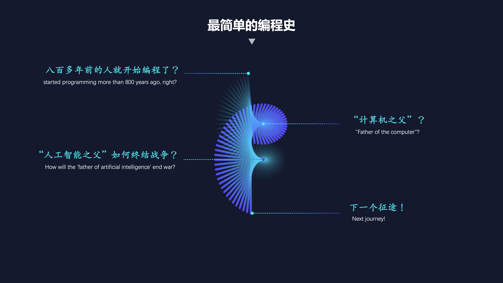
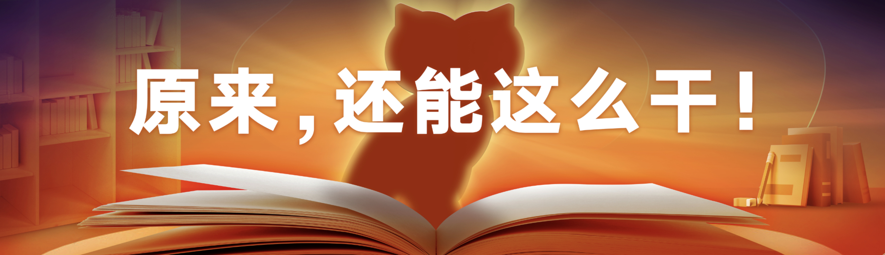
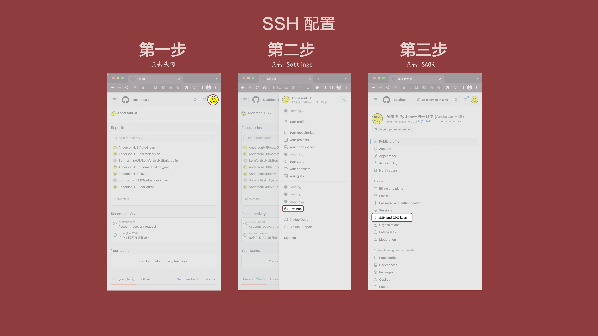
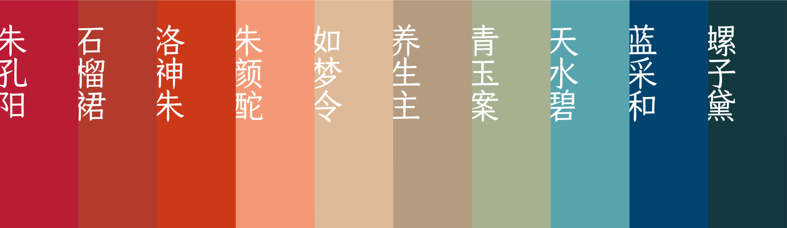

你好，我是悦创。

如果你有接触过 PPT，应该知道 PPT 能做很多事情，也是工作场景中经常需要用到的。

我也在大学期间，外包别人的 PPT 制作和设计。

我把我以前做的和我看过的部分来分享一下。

::: tabs

@tab 1

@tab 2

@tab 3

@tab 4

@tab 5

@tab 6

@tab 7

:::

所以好多人管我们这群人叫“**做PPT的**”。但我多说一句，我还是坚持认为，我是在为好内容造“**场**”的人。

2023 年，“人工智能”成了高频词，很多人觉得世界被 AI “突袭”了。好多人来跟我说，完了，你这工种要被替代了。

其实，我一点儿也不慌。我很喜欢关注新技术，我从 2019 年开始，就在用 AI 处理图像。当然了，两三年前的 AI 工具，和今天的 AI 工具比起来，还是很基础的。

不过在我看来，即便先进工具能做的事儿还很有限，也得先跟上再说。不是有句话说吗，工欲善其事，必先利其器。**工具，就得不断把玩，在把玩的过程中修炼自己，等工具完全成熟了的时候，你才能真的驾驭它，而不是被它替代。**

有这几年积累，AI 来了，我就不是很慌，也没觉得意外。但在 2023 年的这个时间点，我觉得我得上线一个结合当下的课程，所以这个课程上线得恰逢其时。我负责任地告诉你，现在 AI 工具很强大了，开始能够真的帮上我们的忙了。

~~我们一般做事情的节奏都是从 0 到 1 的节奏。为什么这么说呢？~~

比如说，它能让你做 PPT，不再从 0 开始。咱们想想，很多人上来就要找 PPT 模板，其实是害怕面对那个完全空白的演示文稿。但现在的很多 AI 工具，可以给你一个友好的对话界面，你告诉它你所有的需求，它就会在最终，给你输出一个 PPT。

我们常说从 0 到 1 很难。AI 工具会让你从 1 开始，发挥你的创造性，做那些之前你没有时间和精力去做的事儿。

::: tip 手札 2023-09-02 19:41:40

很多事情的进度是 0 到 1，再从 1 到 100。

如同，华为 Meta 60 的发布，整机全“国产”配件，就代表着 0 到 1，接下来就是慢慢到 100。

:::

再进阶一步，它还能让从 1 到 N，变得没有那么难。比如你肯定看过上面的 PPT，有些是一个巨大的人脸，配上金句。很多人觉得好看，但是不会做。要拿出这个人像得抠图，我不会 PS 怎么抠啊。要放在那么大的屏幕上，图片得非常高清才好看，但是我找不到那么清晰的图片啊。

但现在有了 AI 工具，也让这种有“**设计感**”的事情，变得简单了。抠图、放大分辨率，把人像和背景组合在一起，不需要 PS 你也能做到。

不过，我也有个提醒。如果你关注这一波 AI 来袭，可能看到过一些非常炫酷的视频，好像人什么也不用干了，全交给 AI 工具就可以了。我要负责任地告诉你，AI 还没到这么厉害的程度，而且我推测，未来它要替代人也很难。我的课程第一讲就会告诉你，目前一键生成 PPT 最便捷的方式，以及它到底能怎么用。

目前也还没有一个成型的工具，把所有的能力都集合在一起。想要做好一个 PPT，你不只得了解 PPT、Keynote 这些软件，还要整合更多的 AI 工具。

我的这门课，也是这样设计的。

第一讲，我会和你一起做个极限挑战，在 10 分钟内，怎么让 AI 做出一个像模像样的 PPT，这就是从 0 到 1；

第二、三、四讲，我会跟你说一说，如果你还有时间精力，想要再做些什么，AI 还能怎么帮助你。

比如，你拿到的文稿是一堆文字的罗列，怎么在你的 PPT 里突出重点？

老板说这个风格得高级点儿，怎么在你的 PPT 里体现出来？

想要让你的 PPT 再上一个台阶，有点设计感，怎么办？

第五、六讲，我会给你两类最常用的 PPT，培训型和演讲型，告诉你在这种更具体的 PPT 制作中，AI 工具能怎么让你如虎添翼。

我的这门专栏「视频」虽然只有 6 讲，但涉及了 18 种 AI 工具。每一个工具，都是我进行了大量尝试之后，觉得值得推荐给你的好工具。

当然了，接下来 AI 肯定会迎来大发展，这样的工具会层出不穷。可能这门课上线不久后，我提到的这些工具就会过时，会出现更强大的 AI 工具，把目前这些工具具备的各种能力，都集中在一起。

所以，在这 6 篇文章之外，我更想做的，是和你一起探索新的 AI 工具。如果未来我发现更好用的工具，也会回到这门课里跟你分享。

**在这些简单枯燥的事儿上，赶紧让 AI 工具替代我们，让我们省出时间精力，在那些 AI 替代不了我们的地方，做更有意义的事。**

**因为我相信，替代人的不是AI，而是会使用AI的人。**

欢迎关注我公众号：AI悦创，有更多更好玩的等你发现！

::: details 公众号：AI悦创【二维码】

:::

::: info AI悦创·编程一对一

AI悦创·推出辅导班啦，包括「Python 语言辅导班、C++ 辅导班、java 辅导班、算法/数据结构辅导班、少儿编程、pygame 游戏开发」，全部都是一对一教学：一对一辅导 + 一对一答疑 + 布置作业 + 项目实践等。当然，还有线下线上摄影课程、Photoshop、Premiere 一对一教学、QQ、微信在线，随时响应！微信：Jiabcdefh

C++ 信息奥赛题解，长期更新！长期招收一对一中小学信息奥赛集训，莆田、厦门地区有机会线下上门，其他地区线上。微信：Jiabcdefh

方法一：[QQ](http://wpa.qq.com/msgrd?v=3&uin=1432803776&site=qq&menu=yes)

方法二：微信：Jiabcdefh

:::

