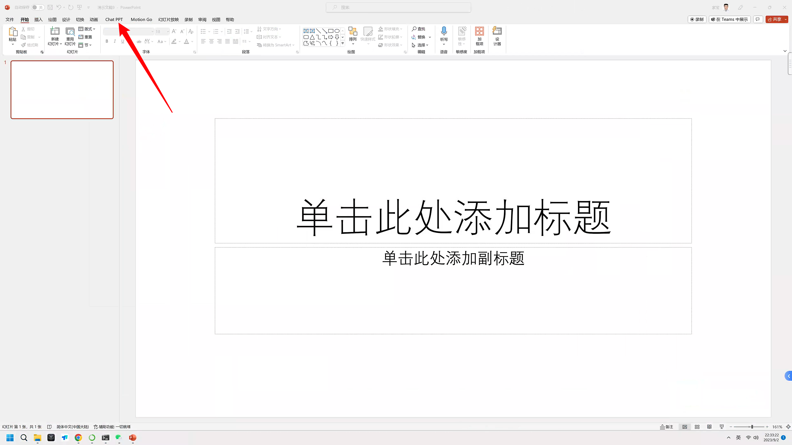
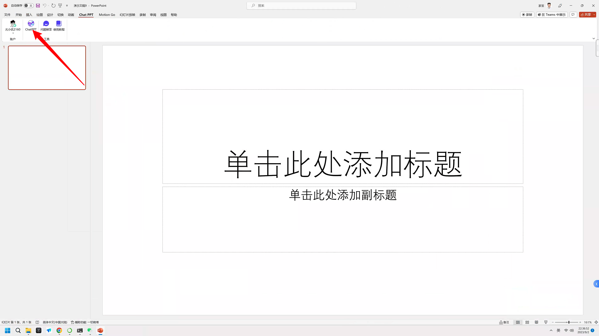
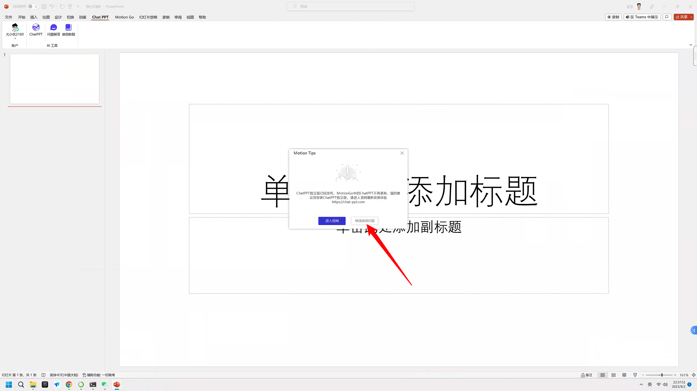
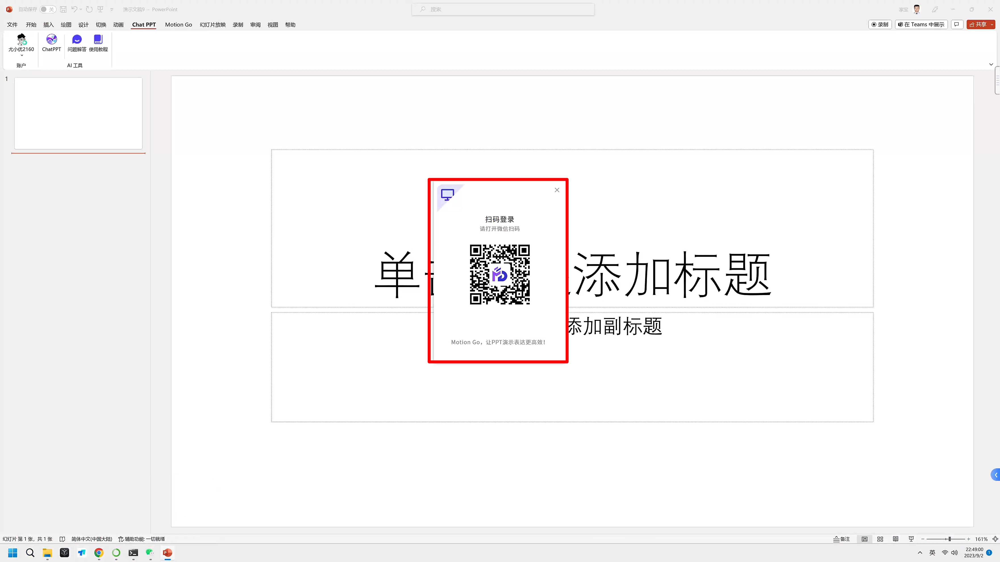
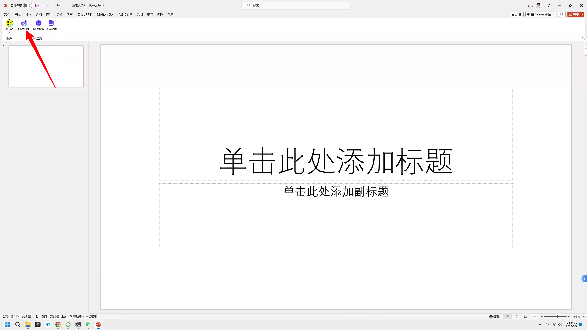
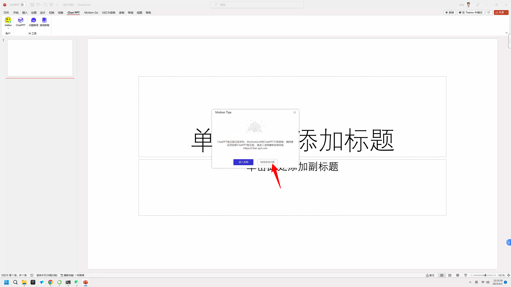

## 1. 前言

你好，我是悦创。

我在做这个专栏的过程里，尝试了几十种 AI 工具。我猜你和我一样，最想了解的那个问题，就是 AI 到底能不能提高我做 PPT 的效率，我能不能不再因为做 PPT 而加班了？

专栏的第一讲，咱们一起做一个极限挑战，看看 10 分钟，能不能让 AI 做一个还不错的 PPT。

绝大部分人做 PPT，打开了 Power Point 这个软件之后，第一步都是去找模板，我估计你也一样。如果你打开的是 Mac 系统的 Keynote，它甚至第一步就会让你选一个模板。模板会规定你在哪里写文字，在哪里配图，配色、排版都给你弄好了。

我是从来不用模板的，我觉得模板限制了我。但我问过身边的朋友，为什么这么喜欢模板。他们给我的回答是，因为快啊，在模板上修修改改，效率更高。我感觉对他们来说，这和写稿子差不多，修改一篇稿子，比对着空白的文档开始敲第一个字，简单多了。做 PPT 也是一样，已经有一个底图，有一些配色了，你就觉得比面对着空白的演示文稿要简单多了。

但是现在有了 AI 工具，我要说的是，你要是为了效率高，别先去找 PPT 模板了。这次不是因为我觉得模板限制了我，而是因为你不用模板，反而可能做得更快。

你可能已经打开了 Power Point，想和我一起操作。我提个醒，学了这门课里说到的 AI 工具之后，你再做 PPT 的时候，并不需要打开一个空白的 Power Point 了，这些 AI 工具会直接给你导出做好的 PPT。

我们刚刚说，咱的极限挑战是 10 分钟做一个 PPT。你别说 10 分钟，现在已经有的一些 AI 工具，两分钟就能出一个 PPT 了。

## 2. 初体验

注册链接：[https://chat-ppt.com/invitelinke?share_code=04427734](https://chat-ppt.com/invitelinke?share_code=04427734)

下面👇可以快捷复制：

```text
https://chat-ppt.com/invitelinke?share_code=04427734
```

官方介绍其实很不错，我把视频扒下来：

<VidStack src="https://image.yoojober.com/www/chatppt/pc.mp4" />

比如这个 AI 软件，叫 ChatPPT。现在 Mac 系统暂时还不能用，只能 Windows 系统用。

::: tabs

@tab 1. 点击 ChatPPT



@tab 2. 点击 ChatPPT



@tab 3. 继续使用旧版



@tab 4. 扫码登录



@tab 5. 再次点击 ChatPPT



@tab 6. 继续使用旧版



@tab 7. 输入

给我做一份主题是人工智能未来发展方向的PPT


:::

打开软件之后，这里就有一个对话框，你可以直接给它输入指令。比如我们在这输入：给我做一份主题是人工智能未来发展方向的PPT。发送。


人工智能未来发展方向的PPT


欢迎关注我公众号：AI悦创，有更多更好玩的等你发现！

::: details 公众号：AI悦创【二维码】


:::

::: info AI悦创·编程一对一

AI悦创·推出辅导班啦，包括「Python 语言辅导班、C++ 辅导班、java 辅导班、算法/数据结构辅导班、少儿编程、pygame 游戏开发」，全部都是一对一教学：一对一辅导 + 一对一答疑 + 布置作业 + 项目实践等。当然，还有线下线上摄影课程、Photoshop、Premiere 一对一教学、QQ、微信在线，随时响应！微信：Jiabcdefh

C++ 信息奥赛题解，长期更新！长期招收一对一中小学信息奥赛集训，莆田、厦门地区有机会线下上门，其他地区线上。微信：Jiabcdefh

方法一：[QQ](http://wpa.qq.com/msgrd?v=3&uin=1432803776&site=qq&menu=yes)

方法二：微信：Jiabcdefh

:::


