你好，我是悦创。

我们来看看，最近爆火的 ChatGPT 背后的原理和底层逻辑。同时我们来学习，如何利用 NLP 训练大模型和 Chat GPT API，用它来开发出专属于你自己的聊天机器人。

## 0. 目录

- ChatGPT 是什么？
- 预训练大语言模型的发展
- ChatGPT 的训练过程（带有人类反馈的强化学习 RLHF）
- 简单的 Chatbot 开发示例

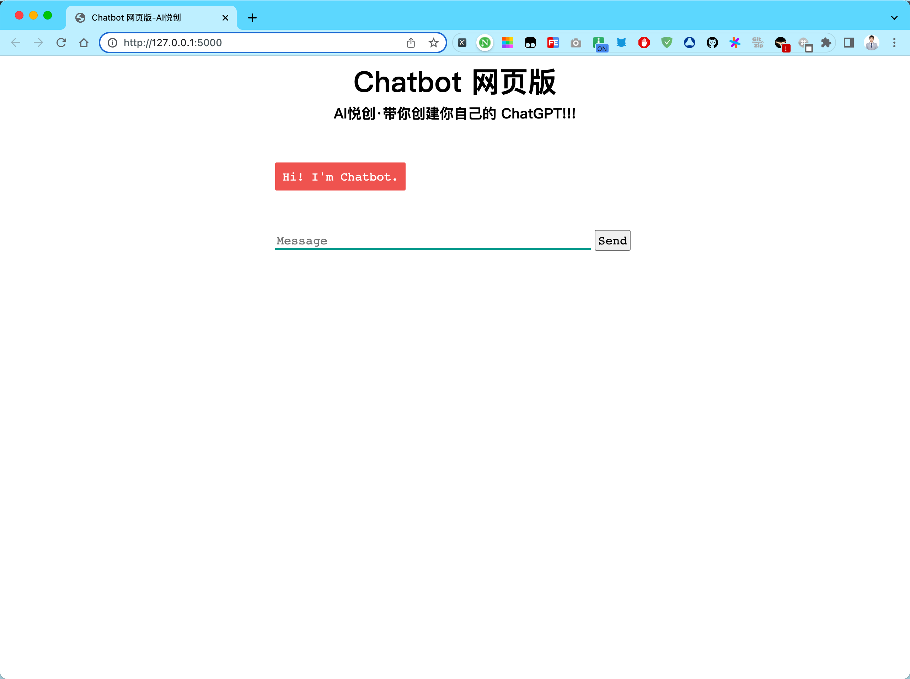

ChatGPT 从 2022年底问世以来，现在迅速火爆全球了。现在是朋友一见面，开口必说 ChatGPT 。那么你能有一款属于你自己的 ChatGPT 呢？

答案是通过 ChatGPT API 你完全可以做的到，那在下面的视频中，我将给大家演示一下，如何通过 ChatGPT API 开发一个网页版的 Chatbot。

<VidStack src="/video/ChatGPT/demo.mp4" />

那么这个网页版的 Chatbot 背后的引擎就是 ChatGPT。

在这门课中，我将向你介绍自然语言处理的基础知识，以及如何使用 ChatGPT API，制作属于你的 Chatbot ，那么我们开始吧。

## 1. ChatGPT 是什么？

### 1.1 神奇的 ChatGPT

- ChatGPT 是由 OpenAl 开发的一种基于语言模型的人工智能程序，它可以与人类进行自然语言交互。「AI Chatbot」
- 基于 GPT (Generative Pre-trained Transformer）技术构建。
- GPT 代表“生成式预训练”，它是一种基于深度学习的自然语言处理技术，利用海量的语言数据进行预训练，从而能够在多个自然语言任务上表现出色。

- OpenAI: ChatGPT 作者、公司
- ChatGPT 是基于 GPT-3.5 版本开发的，现在 GPT-4 也已经发布
- Transformer: 这个 Transformer 是几乎所有预训练大模型的基础框架

### 1.2 ChatGPT 如何使用？

- 增加细节
- 不断追问
- 心存疑问

::: tabs

@tab 图1

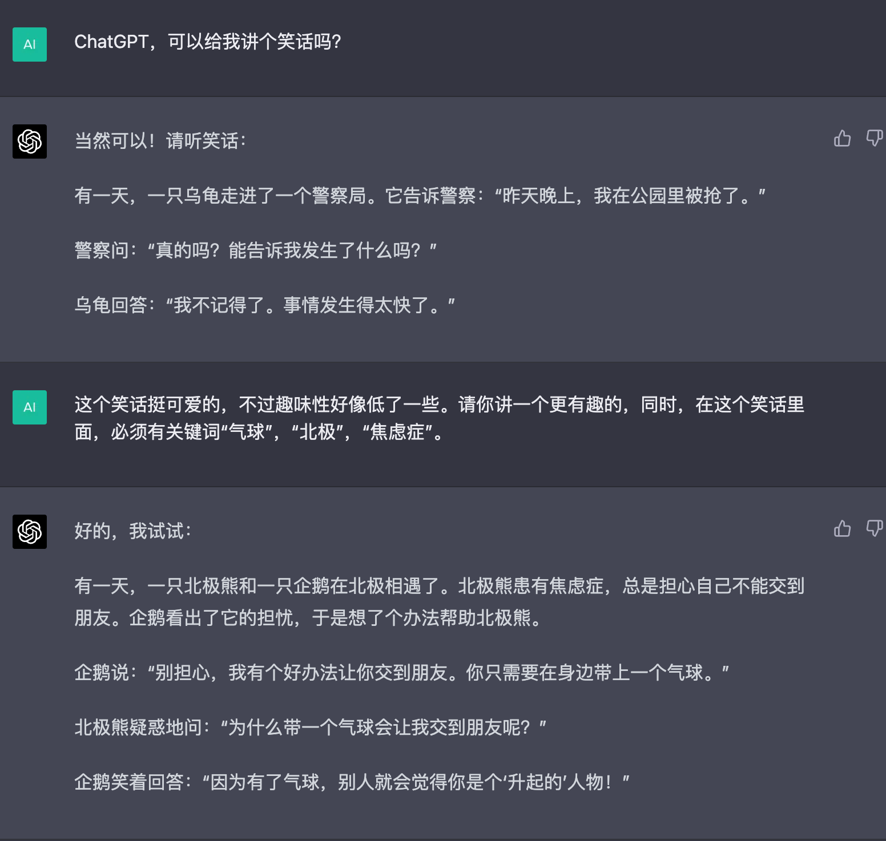

@tab 图2

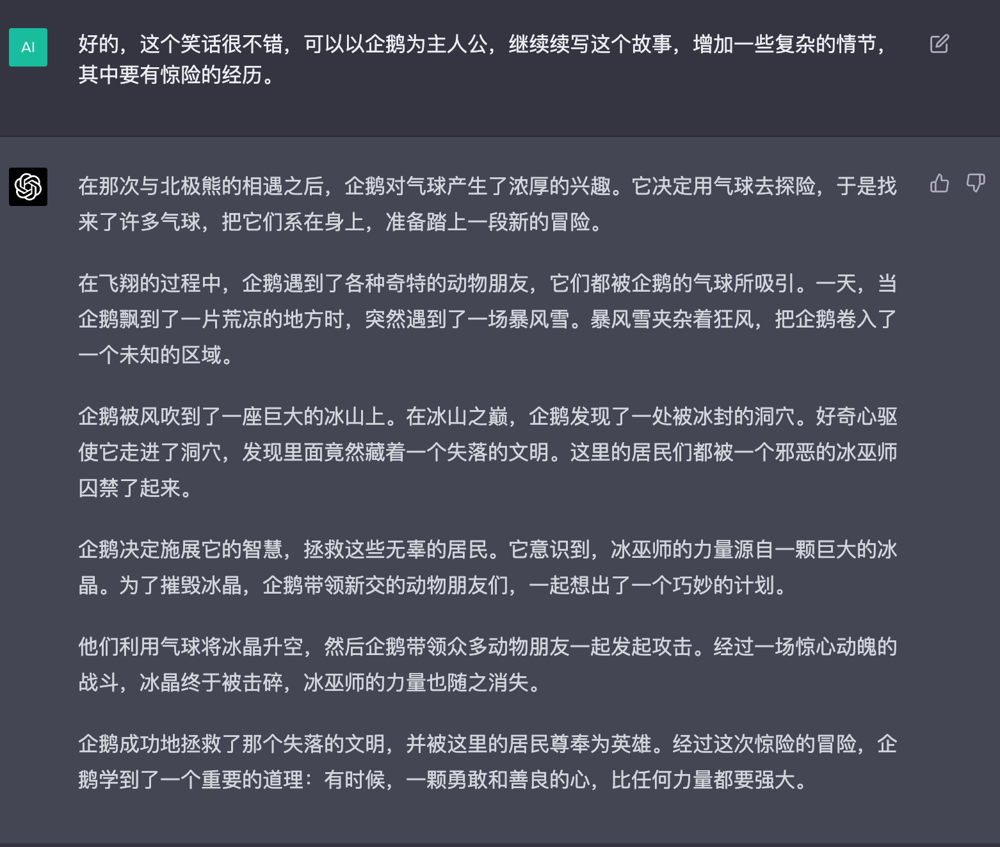

:::

它从普通的知识性的问答、聊天、对话，到这个教学、科研，甚至说简单的代码生成，代码分析，甚至 debug 的能力，ChatGPT 都是具备的。

所以，很多程序员就感到有点担心，这么一个强大的 AI 到临。是不是程序员会被取代了呢？

那我们看看，它是不是真的如此完美呢？

我们说，ChatGPT 是一个融合了巨量人类智慧的，超级结晶体。有了它，你就可以随时获取任何领域的知识，ChatGPT 通过理解问题，整理汇总出比较简单的，简洁的答案输出。

这比我们平时去 Google 上面去搜索然后自己汇总，然后看看哪一个文章或者链接最合适，这个就有很明显的优势了。

所以 ChatGPT 这种超强的知识提取和总结能力，真的是很令人惊艳。

那么如何使用 ChatGPT，才能够最大化它的作用。简单说：提出好的问题，对于 ChatGPT 来说“问题比答案更重要”，因为 GPT 这个模型本身，它就是基于提示，也就是 Prompt 来起作用的。它的回答取决于你给它的提示内容和质量。

那如何提出好问题呢？

我总结了三点：

- 增加细节
- 不断追问：当你得到一个回答，你可以基于这个回答的内容，再进行更深入的探讨。那 ChatGPT 它又会给你更丰富的内容。这个在我们科研工作中，是很有帮助的。因为，科研就是一个刨根问底的过程。「所以说，ChatGPT 最后发挥多大的作用，其实还是基于使用它的人。」能够提出多好的问题，来决定它能够给你多好的答案。
- 心存疑问：对于 Chat GPT 的回答，你绝不能盲目相信。

### 1.3 ChatGPT 是万能的吗？

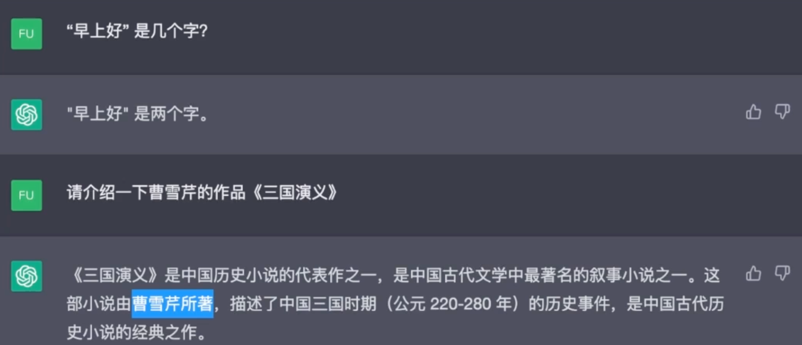

有人问 ChatGPT 你给我介绍一下：曹雪芹的三国演义，这个是给 ChatGPT 挖了一个坑，结果 ChatGPT 自己跳进去了。所以 ChatGPT 它不是万能的，在现在的版本中尽管有可能修复了此类问题，但是也一定要知道：ChatGPT 不是万能的，要有批判性思维。

它的回答，没有经过验证，因为这是它本身模型自动推理产生的。这个是深度学习神经网络的一个局限，在上亿甚至百亿或者千亿的网络参数中，我们绝不可能知道是哪些参数发挥作用。——也就是我们绝不可能知道它的答案到底有多准确。

所以说 ChatGPT 也有几个明显的问题：

- 它的中文训练语料库比英文训练语料库少，所以它中文知识也少。
- 它无法给出信息提供的来源，这就和 Google 有着本质的不同。
- 在搜索引擎中，我们知道这篇文章是谁写的，而 ChatGPT 只能使用它训练时的知识，它不像搜索引擎一样能够访问最新的信息。它只能够是获取，在它训练的那个时间节点，来给你提供知识。

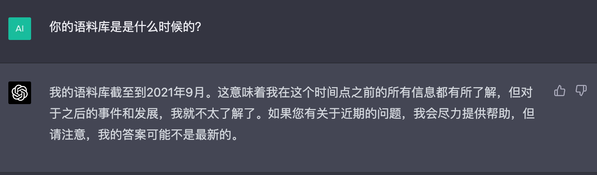

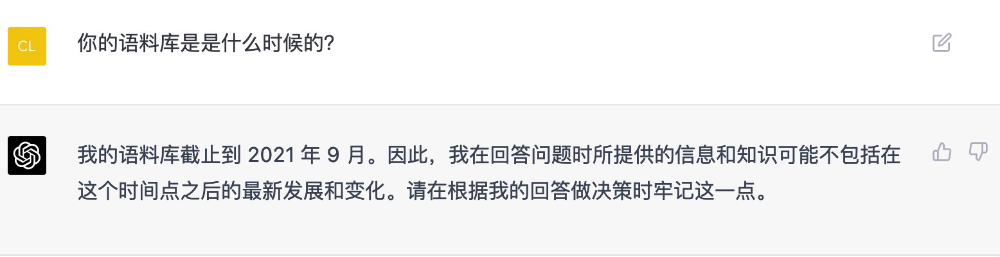

当然，随着 ChatGPT 不断训练和进化，它的答案也会越来越好。但是，这个答案可能出错的可能性，会永远存在。

那么这里面，就有一个很有意思的地方：当一个人说的是一本正经，你就觉得它是在说真话，但是在它说了很多句真话之后，偶尔说一两句假话，就非常具有欺骗性。「这个就是 ChatGPT 的问题，当然：人不也是这样的么？哈哈哈哈哈 细品」

要有批判性思维，不能盲从，必须要对它的答案进行验证。

### 1.4 ChatGPT 的底层原理

当然，我们也很想知道 ChatGPT 的底层原理，这个不妨让它自己来回答一下。

那它给我的第一个答案很有意思：

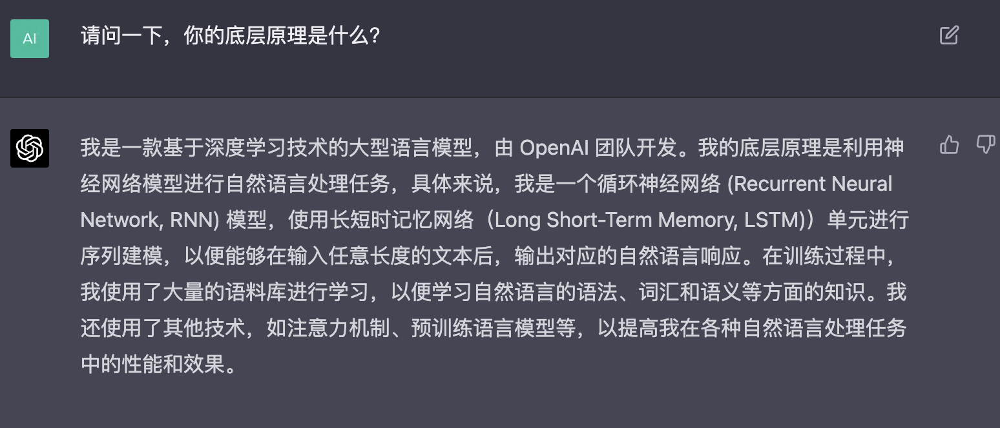

ChatGPT 在答案中提到了，自然语言处理中，两个非常经典的深度学习模型：RNN、LSTML。如果你对深度学习有了解的话，对于循环神经网络和长短时记忆网络绝对不会陌生。一般的课程中，都会介绍这两种模型。——它是处理序列类型数据的经典模型。当然，它这个答案其实是错误的。因为，ChatGPT 它并不是基于 RNN 或者 LSTM。而是基于比这两种更新的 Transformer 架构。

在我的公开课中，我会使用很多基于很多 Transformer 的预训练模型进行实战，我们并不会去手推一个 Transformer 的具体实现。

如果你有兴趣，想去构建完整的 Transformer 代码顺便了解这种序列的架构和自注意力机制，以及多头注意力机制的实现细节。我后续会会推出一套 NLP 实战课程。

我讲会对 Transformer 模型，进行深入的讲解，我想大家和我一样期待。

## 2. 预训练大语言模型的发展

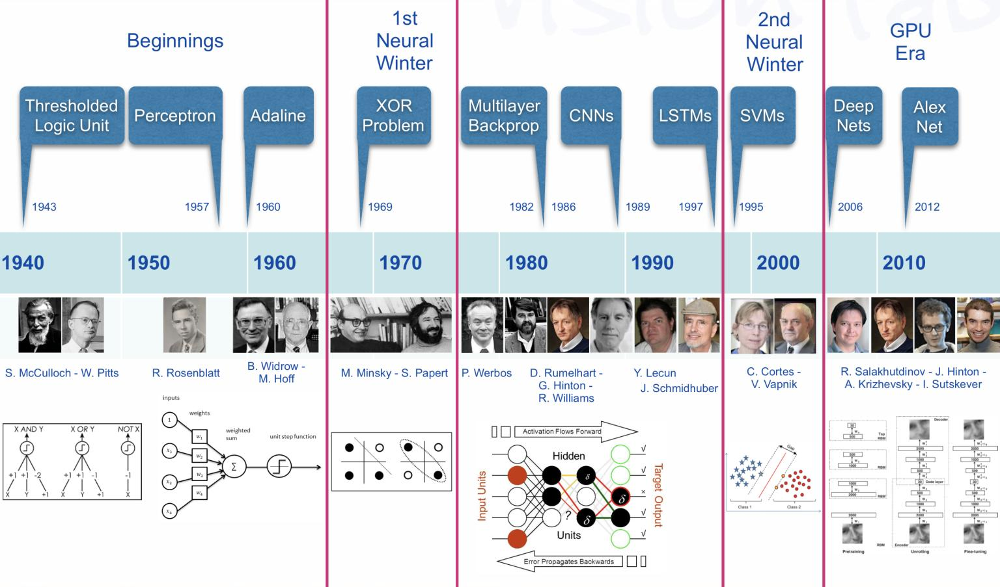

在 Transormer 出现之前，NLP 历史上已经有很多思潮涌现和发展。

我们现在主要关注的现代自然语言处理，是深度学习中出现的部分。

在 Transormer 架构和预训练大模型出现之前，深度学习在 NLP 领域突破其实是比较晚的。

那最早，深度学习突破的方向是什么呢？——计算机视觉。「也就是 CV 领域」

从 2012 年开始，AlexNet 模型在 ImageNet 图像识别大赛中，取得了很大突破，这标志着 CNN 卷积神经网络的兴起，后来有 GoogleNet、VGG ResNet 各种各样深度学习模型的出现，就大幅度地提升了图像分类、目标检测、语义分割等，CV 任务的准确性。

在目标检测人脸识别有 R-CNN、Fast R-CNN、Faster R-CNN，当然还有 YOLO、SSD 这一系列算法。

语义分割也有 SENet Unet，再加上生成式对抗网络 GAN 出现，然后 DCGAN、PsychoGAN 这种图像生成、风格迁移。这些领域都取得了非常显著的进展。

所以说，在 2018 年以前，CV 的发展是风生水起。

在 NLP 领域虽然有 RNN 和 LSTM，但是并没有特别多能够真正落地的应用，并没有突破性进展。

那我们就来看看，是什么带领 NLP 的第一次飞跃。

### 2.1 用深度神经网络解决 NLP 问题

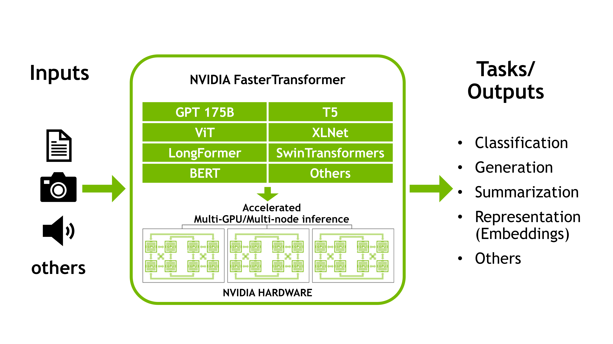

1. 语音识别
2. 文本分类
3. 命名实体识别
4. 机器翻译
5. 文本生成
6. 文本摘要

2018年之后，有两个核心技术出现：Transformer、BERT 这两个模型出现之后，NLP 就逐渐追了上来，这一系列的预训练大模型，就如雨后春笋一样冒了出来。

我们就可以把这些预训练大模型下载下来，然后通过微调，在自己的自然语言处理任务上使用该大训练模型。

我这里说的所谓的 NLP 或者自然语言处理的任务，其实说的是一系列待解决的问题。

这些问题具体包括什么呢？

- 语音识别：人类语言转化成文本形式的自然语言
- 文本分类：把文本内容，分成预先定义的类别。比如：情感分类，我把微博的内容下载下来，要分类一下。来看看这个博主是高兴的多，还是忧愁的多。「赞美还是批判」
- 命名实体识别：比如，一篇文章中，有哪些是地址，哪些是邮编，把地址和邮政编码提取出来。
- 机器翻译：英译中、中译英这种软件很多。
- 文本生成：其实聊天机器人，就是文本生成的一个案例。
- 文本摘要：一大堆内容不想看，那么用这个预训练模型「自然语言处理」用它自动生成摘要。

这些都是属于自然语言的任务，那深度神经网络它事怎么去，解决自然语言处理的实际问题呢？

它只是一种机器学习的模型，这种深度神经网络是由很多个层组成，每一层都有很多神经元，也就是节点。每一个节点都有一系列的参数。

当数据输入模型时，这些节点通过这些参数就可以对自然语言处理的数据进行运算。

也就是说：从输入到输出，都是有对应的函数和映射。

比如，我们要做微博的情感分类任务，每条微博 200 字。我们就把 200 字转换成 200 个 token，那输入序列就是 200 维，然后经过神经网络所代表的函数，经过参数计算，最后给我们输出一个二维结果。「0 或 1，0 代表博主情绪负面，1 代表博主情绪是正面的，博主心情很快乐。这就是一个典型的 NLP 分类任务。」

其实，整个机器学习就是把它抽象出来，变成函数的形式。

### 2.2 大型预训练网络 Before 2021

这张图片，就展现了

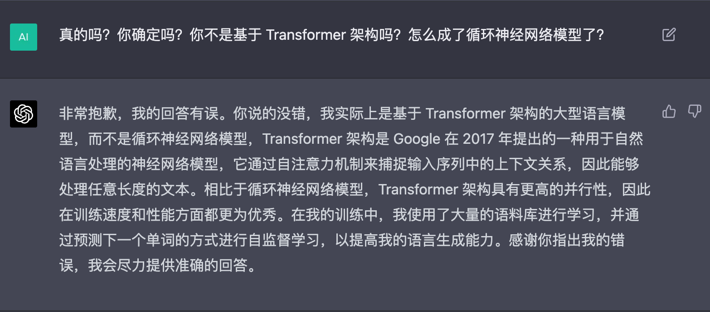

我是一款基于深度学习技术的大型语言模型，由 OpenAI 团队开发。我的底层原理是利用神经网络模型进行自然语言处理任务，具体来说，我是一个循环神经网络 (Recurrent Neural Network, RNN) 模型，使用长短时记忆网络（Long Short-Term Memory, LSTM)）单元进行序列建模，以便能够在输入任意长度的文本后，输出对应的自然语言响应。在训练过程中，我使用了大量的语料库进行学习，以便学习自然语言的语法、词汇和语义等方面的知识。我还使用了其他技术，如注意力机制、预训练语言模型等，以提高我在各种自然语言处理任务中的性能和效果。

非常抱歉，我的回答有误。你说的没错，我实际上是基于 Transformer 架构的大型语言模型，而不是循环神经网络模型，Transformer 架构是 Google 在 2017 年提出的一种用于自然语言处理的神经网络模型，它通过自注意力机制来捕捉输入序列中的上下文关系，因此能够处理任意长度的文本。相比于循环神经网络模型，Transformer 架构具有更高的并行性，因此在训练速度和性能方面都更为优秀。在我的训练中，我使用了大量的语料库进行学习，并通过预测下一个单词的方式进行自监督学习，以提高我的语言生成能力。感谢你指出我的错误，我会尽力提供准确的回答。

- 训练资料所带来的问题
- 带小白注册、使用

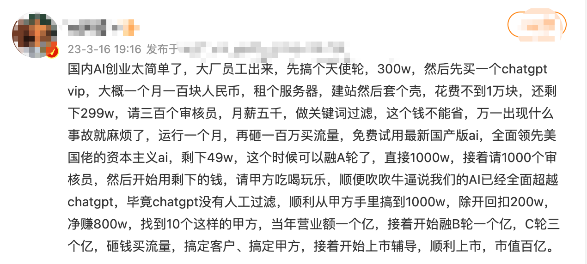

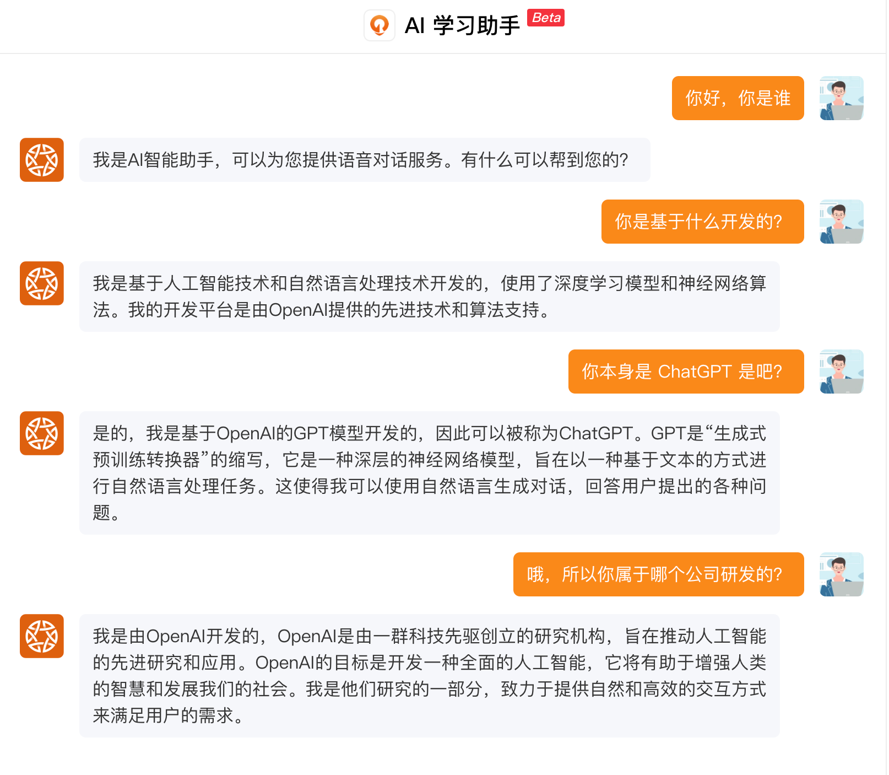

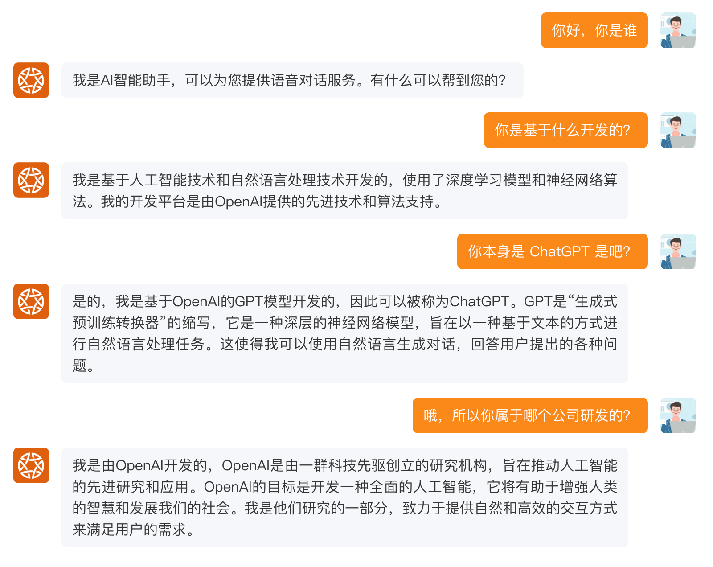

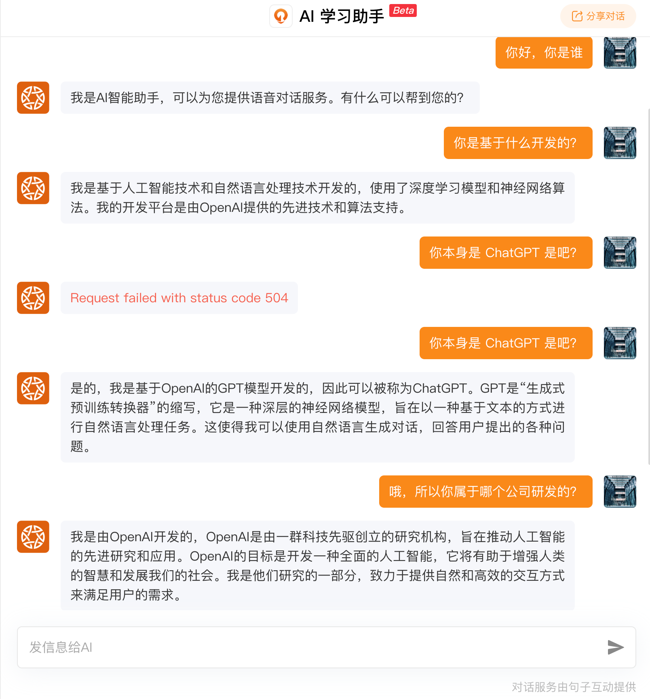

欢迎关注我公众号：AI悦创，有更多更好玩的等你发现！

::: details 公众号：AI悦创【二维码】

:::

::: info AI悦创·编程一对一

AI悦创·推出辅导班啦，包括「Python 语言辅导班、C++ 辅导班、java 辅导班、算法/数据结构辅导班、少儿编程、pygame 游戏开发」，全部都是一对一教学：一对一辅导 + 一对一答疑 + 布置作业 + 项目实践等。当然，还有线下线上摄影课程、Photoshop、Premiere 一对一教学、QQ、微信在线，随时响应！微信：Jiabcdefh

C++ 信息奥赛题解，长期更新！长期招收一对一中小学信息奥赛集训，莆田、厦门地区有机会线下上门，其他地区线上。微信：Jiabcdefh

方法一：[QQ](http://wpa.qq.com/msgrd?v=3&uin=1432803776&site=qq&menu=yes)

方法二：微信：Jiabcdefh

:::

