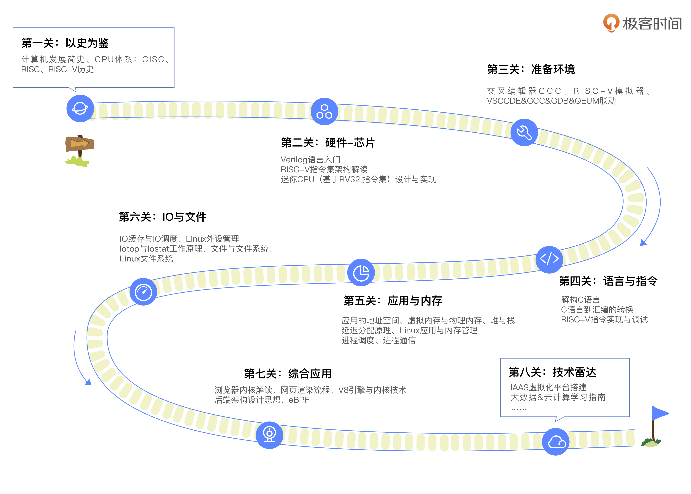

<VidStack src="/mp3/计算机基础实战课/开篇词｜练好基本功，优秀工程师成长第一步.mp3" title="开篇词｜练好基本功，优秀工程师成长第一步" />

你好，我是彭东，网名 LMOS。很高兴在极客时间和你相遇，一起开启计算机基础的修炼之旅。

先来介绍一下我自己。我是 Intel 傲腾项目开发者之一，曾经为 Intel 做过内核层面的开发工作，也对 Linux、BSD、SunOS 等开源操作系统，还有 Windows 的 NT 内核很熟悉。

这十几年来，我一直专注于操作系统内核研发。先后开发了 LMOS（基于 x86_64 的多进程支持 SMP 的操作系统）和 LMOSEM（基于 ARM32，支持软实时的嵌入式操作系统），还写过《深度探索嵌入式操作系统》一书。去年 5 月份，我在极客时间上更新了《操作系统实战 45 讲》这个专栏，和你分享了我多年来开发操作系统的方法和经验。

通过课程的互动交流，我发现很多同学因为基础知识并不扎实，所以学操作系统的时候非常吃力。而计算机的基础知识，不但对于深入理解操作系统有帮助，对我们工程师的技术提升也是一门长期收益的必修课。

## 打牢计算机基础有什么用？

就拿我的亲身经历来说，我既做过前端、后端的工作，也做过内核的开发。出现 Bug 和故障的时候，我总能快速理清排查思路，选用合适的工具、技术来分析问题，高效 Debug；一个项目摆在我面前，迅速分析出项目的痛点、难点，整理出实现功能需要哪些技术框架也是驾轻就熟。

很多同事跟朋友对这样的能力心向往之，好奇我有什么“秘诀”。其实，能来回穿梭于底层与高层之间，不至于手忙脚乱，我最大的依仗就是深厚的计算机基础。

无论你是计算机初学者，还是已经工作了几年的老同学，对于“打牢基础很重要”、“基础不牢、地动山摇”这样的话，估计耳朵都要听得磨出茧子了。但到底计算机基础威力有多大呢？

举个例子，就像你编写你人生的第一个程序——Hello World。这个程序非常简单，同时也非常复杂，简单到你只要明白调用函数“`printf(“Hello World\n”);`”，就能在屏幕上打印出 Hello World 的字符；难的是这个程序的背后细节，尽管这个程序不过数行代码，却需要芯片、编程语言、进程、内存、IO 等多种基础设施的配合，才能完成看似简单的功能。

当然在写 Hello World 程序这个起步阶段，我们只要知道 printf 函数如何使用就行了，这是因为这程序简单到只是输出 Hello World 就结束了，不会给系统或者其它软件带来副作用。

但若是我们要开发大规模应用系统，如电商服务系统，问题就会变得复杂。比如：

1. 这个服务应用要用什么语言来编写？
2. 是采用单体进程，还是用多个进程来协同工作？
3. 如何管理长期使用的内存空间？如何避免系统 IO 抖动？
4. 如何处理网络带来的各种问题，比如通信拥堵、拒绝请求，甚至掉线？

这些问题，显然不是我们知道这些方面的几个接口函数就能解决的。发现没有？你可以用很短的时间跑起来一个 Hello World，但想保障一个电商系统运转如常，感觉难度上是天壤之别。工程复杂度带来的差异，让我们不得不继续钻研，试着“理解”计算机。

我再说一个 MySQL 的例子：在往生产数据库中导入部分数据时，会造成客户端的访问超时。你可能怀疑这是 MySQL 自身问题，也可能怀疑是服务器系统的问题。其实两者都不是，此时即使你对 MySQL 的各种操作都了然于胸，还是对解决这类问题一头雾水。

如果你没能掌握文件系统、Cache、IO 等基础的话，就很难想到用 iotop、iostat 等工具去查看 IO 操作，也就无从发现 MySQL 在导入数据时还会产生大量的日志，而这些日志也需要存盘引发大量 IO 操作，导致 IO 带宽爆满，造成访问超时。更不用说想到可以用 MySQL 的 `innodb_flush_log_at_trx_commit` 来控制 MySQL 的 log 行为了。

再比方说，如果你不知道操作系统与 CPU、RAM 等硬件的交互原理，就很难理解 JVM 为啥要抽象出堆、虚拟机栈和本地方法栈、程序计数器、方法区之类的概念来屏蔽硬件差异，更别说理解 JVM、JUC 中的内存管理、多线程安全的核心设计思想了。你看，写不出高并发、安全可靠程序的瓶颈，深究起来欠缺的竟然是底层基础知识。

除了复杂的软件工程问题，日新月异的前沿技术也离不开计算机基础的软硬件知识。

系统设计领域，只有研究过对 CPU 提供的 SIMD 指令集，才会联想到可以像 ClickHouse 一样基于向量化执行来提升计算速度；在云原生方面，只有熟知文件系统的系统调用和运作原理，才能设计出一款优质的分布式文件系统，或者设计出基于 UnionFS 的 Docker 镜像机制，让容器真正发挥优势；AI 领域同样如此，只有透彻理解了语言与指令、内存与应用，才有可能通过基础的软硬件技术配合优化存储层次，最终调优加速 AI 框架……

总之，想要成为优秀工程师，就需要你深入芯片、内存、语言、应用、IO 与文件等这些基础组件学习研究，甚至还要钻研语言指令的运转，搞懂芯片尤其是 CPU 的机制原理。这些基础，不仅仅是对计算机本身很重要，对从事计算机的任何细分行业的每个人都很重要。

## 计算机基础要怎么学？

也许你跟我一样，不是计算机专业科班出身，所以起步时更加步履维艰。通常被后面这几类问题困扰：不确定学什么，不知道怎么学，硬记了概念不明白技术原理，更别说学以致用了。

这些问题让我们面对内容繁多的计算机知识时，不知如何下手，于是开始自我怀疑，总想打退堂鼓。从只会用 C 写个 Hello World，到可以用 C 语言自研操作系统内核，我同样经历了漫长的修炼之旅。我也遇到过各种各样的问题，通过不断地学习和实践，才解决了诸多疑难杂症。

我希望把自己积累的大量计算机学习基础方法经验，通过这门课分享给你，帮你把计算机从底层到应用的关键知识点串联起来。除了学习原理概念、理顺知识点，动手实践的环节也不可或缺，配套的执行和调试代码，我之后都会放在 [Gitee](https://gitee.com/lmos/Geek-time-computer-foundation) 上方便你随堂练习。

这个专栏我是这样安排的：

### 历史

一个东西，从何而来，何至于此，这就是历史。学计算机基础，我们需要先学习它的历史，学习计算机是怎么一步步发展到今天这个样子的，再根据今天的状况推导出未来的发展方向。

我并不会长篇累牍地给你讲什么编年史，而是重点带你了解可编程架构是怎么创造出来的、CPU 从何而来、CISC 和 RISC 又各有什么优缺点。知道了这些，你就能理解为什么现在国家要提倡发展芯片产业，RISC-V 为何会大行其道。

### 芯片

万丈高楼从地起，欲盖高楼先打地基。芯片是万世之基，这是所有软件基础的开始，执行软件程序的指令，运算并处理各种数据都离不开它。

因此，了解芯片的工作机制对写出优秀的应用软件非常重要。为了简单起见，我选择了最火热的 RISCV 芯片。这个模块里，我们将一起设计一个迷你 RISCV 处理器。哪怕未来你不从事芯片设计工作，了解芯片的工作机制，也对写出优秀的应用软件非常重要。

### 环境

学习讲究“眼到，手到，心到”，很多知识如果想牢牢掌握，就离不开动手实践。

而搭建好编译环境和执行环境就是实践的前提，方便后面的学习里我们去调试程序，验证理论。环境篇我们最终会跑出 RISC-V 平台的 Hello World 程序，作为这一关的阶段性成果。

### 语言

一个合格的程序员必须要掌握多种编程语言，这是开发应用软件的基础，所以我选择了最常用的 C 语言，以它为例让你理解高级语言是如何转换成低级的 RISCV 汇编语言的。

我不光会带你学习 C 语言各种类型的形成、语句与函数的关系，还会给你搭建一座理解 C 和汇编对应关系的桥梁。汇编语言方面，我会以 RISC-V 为例，介绍其算术指令、跳转指令、原子指令和访存指令，并带你学会调试这些指令，加深你对指令的理解。

### 应用

具备了编程语言的知识基础，我们就可以开发应用了。应用往往与内存分不开，我们一起来了解应用的舞台——内存地址空间，接着会引入物理内存、虚拟内存。理解了内存，理解进程也会手到擒来。

虚拟内存跟物理内存如何映射和转换？应用堆和栈内存有什么不同？应用内存是如何动态分配的？为什么操作系统中能并行运行多个不同或者相同的应用？多个应用之间如何通信？这些重难点问题，我们一个都不会漏掉。

### IO

跟软件应用直接关联的，除了芯片和内存之外，就是 IO 即输入输出系统了。无论是交互式应用、还是数据密集型应用，都不得不接收各种数据的输入，然后执行相应计算和处理之后产生输出。

有的应用性能不佳，实时性不强，更有甚者丢失数据，面对这些令人头疼的问题，不懂 IO 就无法处理。我们想要开发高性能的应用程序，就不得不学习 IO 相关的基础知识了。因此，我们会重点学习 IO 的操作方式、IO 调度、IO 缓存 Cache，以及 Linux 操作系统是如何管理 IO 设备的。我还会引入 iotop 和 iostate 工具，带你掌握怎么用它们来攻克应用的 IO 性能瓶颈。

### 文件

很少有应用不需要储存读写文件的，特别是各种网络应用和数据库应用，一个合格的开发者必须对文件了如指掌。

想要提升应用读写数据性能，做好数据加密（特别是优化网络数据库应用），深入了解文件和文件系统都是相当关键的。理清文件的基础知识点之后，我们还会研究一个 Linux 文件系统实例的内部细节，检验之前所学。

### 综合应用

经历了前面这些关卡，在综合应用篇里，我会带你了解如何从底层角度审视前端技术跟后端架构。优秀工程师通常具备超强的知识迁移能力，能够透过各种多变的技术表象，快速抓住技术的本质。这将是你未来拓展学习更多应用层技术，顺利解决日常业务里前后端性能问题的良好开端。

### 技术雷达

最后，我还设置了技术雷达的加餐内容，和你聊聊云计算、大数据跟智能制造。这些热门领域其实都是对基础技术的综合应用，有助于你开阔视野，给工作选择增加更多可能性。

这个加餐，我安排在正文结束之后的一个月和你见面（每周更新一节课，共五节课），这一个月是留给你吸收消化前面所学内容的时间。

总之，在你学习更多应用层技术以前，通过这门课补充前置知识很有必要。这既是所有有志于成为高手的工程师绕不开的必修内容，同样也是我多年职业生涯里，通过技术修炼沉淀而来的“学习笔记”。

在我看来，**一个人的自我学习能力和态度决定着技术成就，不然只会陷入 CRUD Boy 或者 API Caller 的圈子里，终日忙忙碌碌却依旧原地踏步。IT 人就是要时刻保持学习，如果要给这个保持学习的习惯加个期限，那就是“终身”。**

可以自己立个 Flag，哪怕只是在留言区打卡你的学习天数、今日的问题或者收获，我相信都是会有效果的。3 个月后，我们再来一起验收。

## 精选留言

竹杖芒鞋轻胜马 谁怕 一蓑烟雨任平生

作者回复: 他强由他强,清风拂山岗；他横由他横,明月照大江.

---

说句实在话，不开发底层，对职业发展意义不大。

作者回复: 我也说句实话 如果 只是一个 api caller 30岁后 大概率出局 和年轻人比这个 没有任何竞争力 

::: details 公众号：AI悦创【二维码】

:::

::: info AI悦创·编程一对一

AI悦创·推出辅导班啦，包括「Python 语言辅导班、C++ 辅导班、java 辅导班、算法/数据结构辅导班、少儿编程、pygame 游戏开发、Linux、Web」，全部都是一对一教学：一对一辅导 + 一对一答疑 + 布置作业 + 项目实践等。当然，还有线下线上摄影课程、Photoshop、Premiere 一对一教学、QQ、微信在线，随时响应！微信：Jiabcdefh

C++ 信息奥赛题解，长期更新！长期招收一对一中小学信息奥赛集训，莆田、厦门地区有机会线下上门，其他地区线上。微信：Jiabcdefh

方法一：[QQ](http://wpa.qq.com/msgrd?v=3&uin=1432803776&site=qq&menu=yes)

方法二：微信：Jiabcdefh

:::

