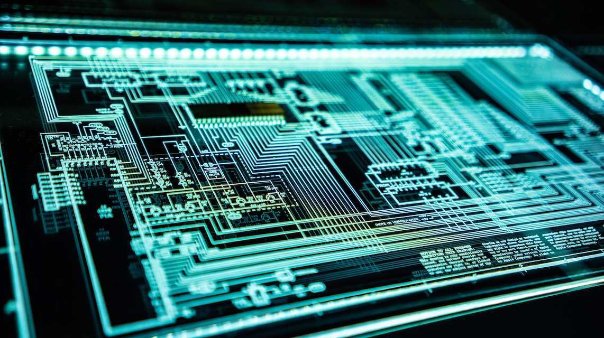

<VidStack src="/mp3/计算机基础实战课/03｜硬件语言筑基（一）：从硬件语言开启手写CPU之旅.mp3" title="硬件语言筑基（一）：从硬件语言开启手写CPU之旅" />

你好，我是 LMOS。

我们都知道，自己国家的芯片行业被美国“吊打”这件事了吧？尤其是像高端 CPU 这样的芯片。看到相关的报道，真有一种恨铁不成钢的感觉。你是否也有过想亲自动手设计一个 CPU 的冲动呢？

万丈高楼从地起，欲盖高楼先打地基，芯片是万世之基，这是所有软件基础的开始，这个模块我会带你一起设计一个迷你 RISC-V 处理器（为了简单起见，我选择了最火热的 RISCV 芯片）。哪怕未来你不从事芯片设计工作，了解芯片的工作机制，也对写出优秀的应用软件非常重要。

这个处理器大致是什么样子呢？我们将使用 Verilog 硬件描述语言，基于 RV32I 指令集，设计一个 32 位五级流水线的处理器核。该处理器核包括指令提取单元、指令译码单元、整型执行单元、访问存储器和写回结果等单元模块，支持运行大多数 RV32I 的基础指令。最后，我们还会编写一些简单汇编代码，放在设计出来的处理器上运行。

我会通过两节课的篇幅，带你快速入门 Verilog，为后续设计迷你 CPU 做好准备。这节课我们先来学习硬件描述语言基础，芯片内部的数字电路设计正是由硬件语言完成的。

## 一个芯片的内部电路是怎么样的？

作为开发，你日常最常用的编程语言是什么？也许是 C 语言、Java、Go、PHP……这些高级编译语言吧。而硬件设计领域里，也有专门的硬件描述语言。为什么会出现专门的硬件描述语言呢？这还要先从芯片的内部结构说起。

::: details 公众号：AI悦创【二维码】

:::

::: info AI悦创·编程一对一

AI悦创·推出辅导班啦，包括「Python 语言辅导班、C++ 辅导班、java 辅导班、算法/数据结构辅导班、少儿编程、pygame 游戏开发、Linux、Web」，全部都是一对一教学：一对一辅导 + 一对一答疑 + 布置作业 + 项目实践等。当然，还有线下线上摄影课程、Photoshop、Premiere 一对一教学、QQ、微信在线，随时响应！微信：Jiabcdefh

C++ 信息奥赛题解，长期更新！长期招收一对一中小学信息奥赛集训，莆田、厦门地区有机会线下上门，其他地区线上。微信：Jiabcdefh

方法一：[QQ](http://wpa.qq.com/msgrd?v=3&uin=1432803776&site=qq&menu=yes)

方法二：微信：Jiabcdefh

:::

